RPA由控制器、编辑器及运行器组成，八爪鱼RPA则将三者集成于一体，因此八爪鱼RPA客户端每次仅能运行一个应用。为解决用户需同时运行多个应用的需求，我们开发了机器人功能(运行器)，用户可将机器人安装在不同的设备上，扩展运行器数量。

目前已上线机器人(运行器)购买功能（跳转咨询），可用于满足用户同时处理多任务的需求。

> 下载、安装并使用机器人

## 1.下载

--->点击👇下载链接

八爪鱼 RPA 下载中心

--->选择机器人,下载机器人安装包

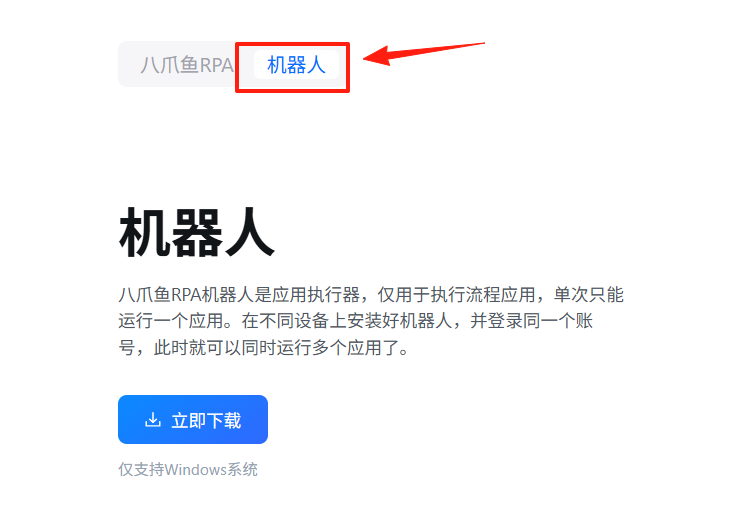

## 2.安装

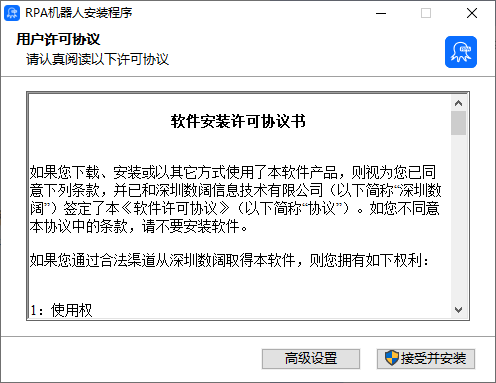

### 接受并安装

①安装到默认路径下：C:\Users\...\AppData\Local\OctopusRPA.Bot

②默认安装自动化插件：Google浏览器自动化和Edge浏览器自动化

### 高级设置

①可调整安装路径

②可确认是否安装自动化插件

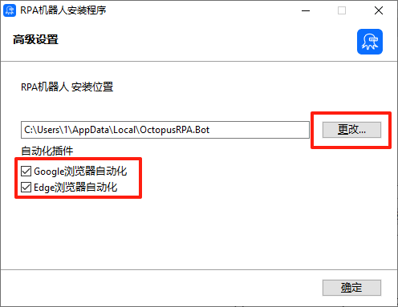

## 3.使用

### 3.1 登录并连接八爪鱼RPA机器人控制台

--->登录方式包含”短信登录“、”密码登录“、”微信登录“，可根据实际情况选择

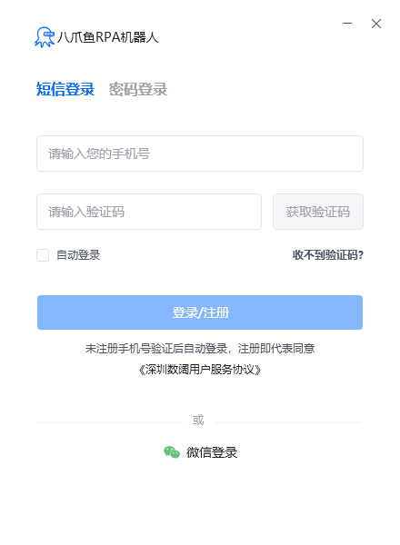

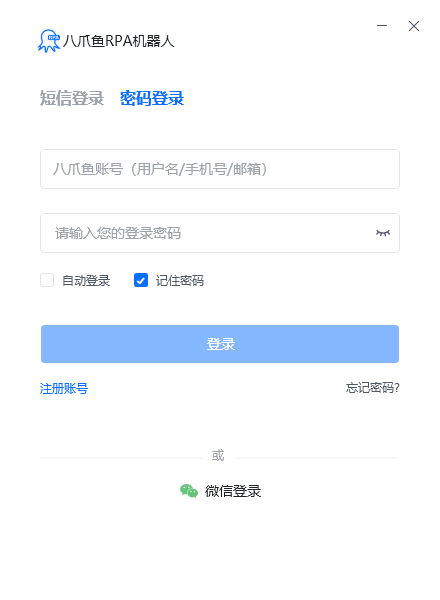

--->选择有”机器人使用权限“的版本，可以是个人版，也可以是任意企业空间。

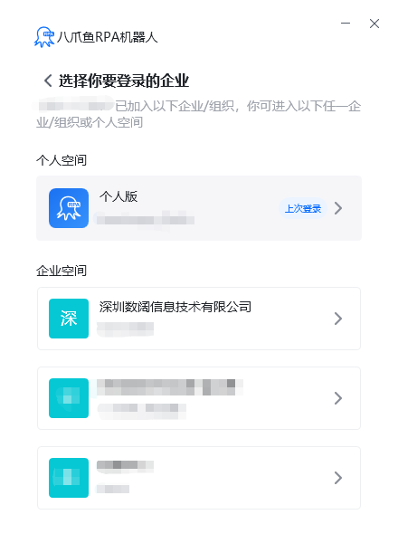

--->登录即连接，登录成功后可在”八爪鱼 RPA 客户端“的机器人模块查看我的机器人

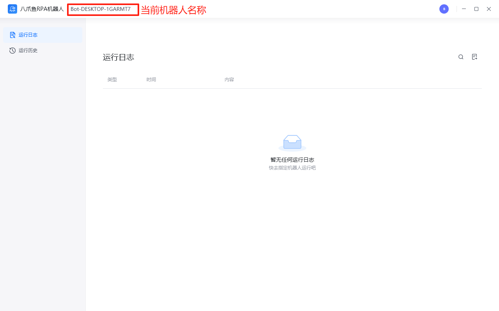

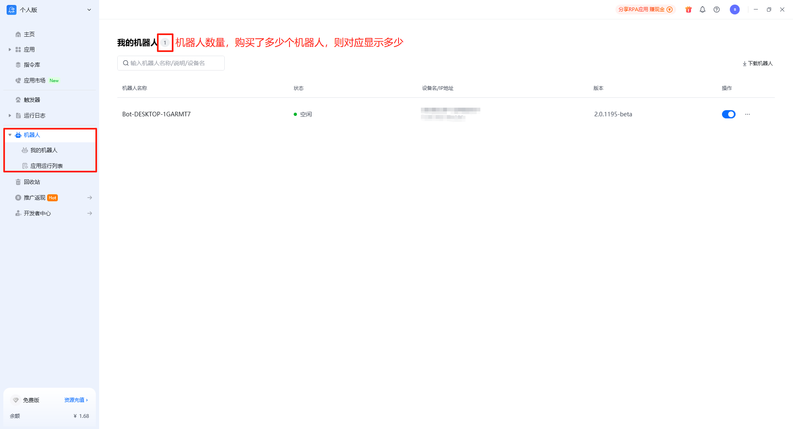

### 3.2 使用机器人运行应用

--->选择需运行的应用，点击“更多”按钮，点击“机器人运行应用”

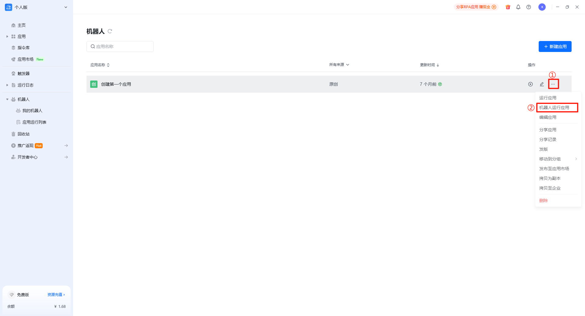

--->选择机器人，选项为随机/指定任意空闲的机器人。

选择版本，选项为当前最新版本/当前最新内容。当前最新版本：即使用最后一次发版时的应用配置。当前最新内容：即使用当前编辑保存后的应用配置，也就是保存后还没发版的应用配置。（建议使用当前最新内容，以便实时保持最新的）

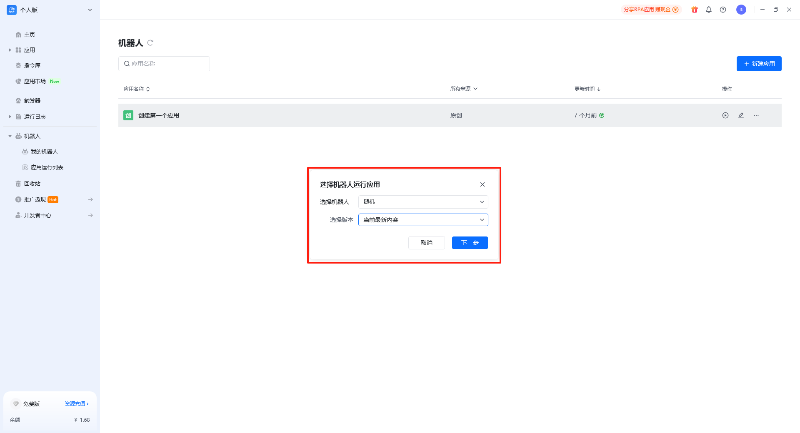

--->填写输入参数，给输入参数赋值。可勾选”记住内容“，后续无需重复填写参数。参数填写完毕后可点击”运行应用“

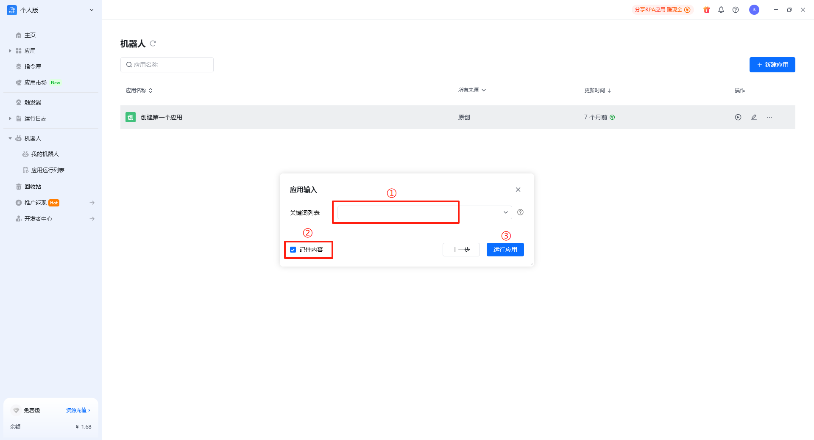

### 3.3 查看机器人上应用的运行状态

指定机器人运行应用后，可前往机器人模块下的”应用运行列表“，查看应用运行的状态

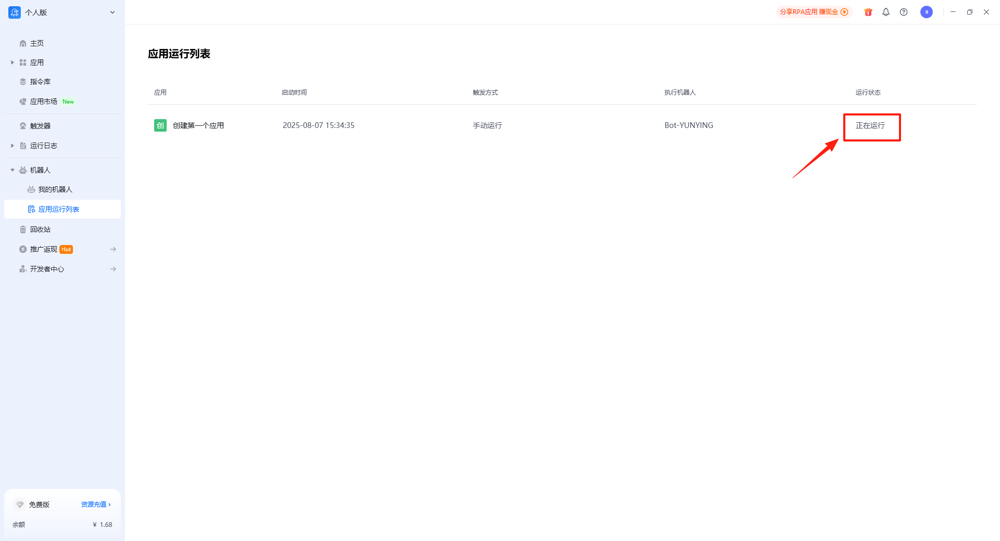

### 3.4 机器人暂停、停止按钮

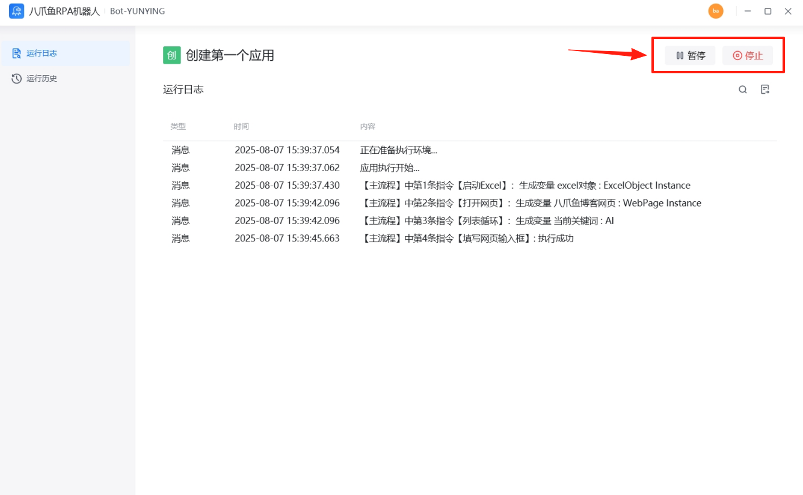

### 3.5 机器人运行日志查看

（1）“运行历史”中可看到历史任务的全量日志；“运行日志”中仅记录当此运行记录，重新运行后则消失，类似八爪鱼RPA客户端编辑界面的调试日志

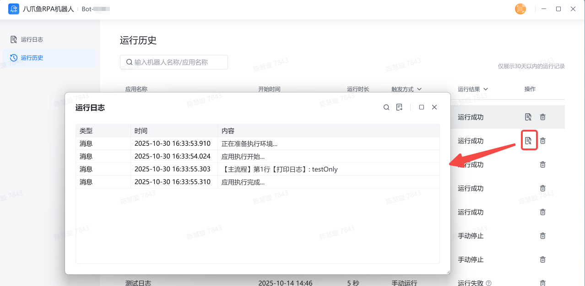

注：低于v2.2.1061-beta的版本只能查看当次完整的运行日志。运行历史中暂未记录历史运行的完整记录，运行失败的情况下只记录了简短的失败原因。

（2）在文件资源管理器中也可查看RPA机器人历史任务全量日志，路径是%appdata%/octopusrpa.bot/logs 。打开文件资源管理器，输入路径后按下回车键，以running开头的日志就是机器人历史任务日志

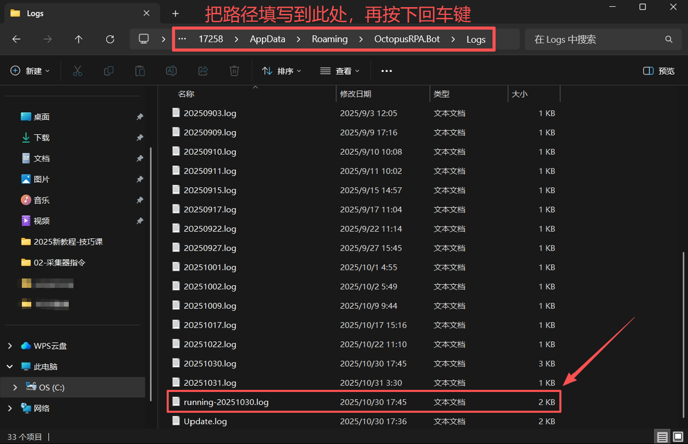

<Info>
  使用过程中遇到问题？前往 [八爪鱼RPA 开发者社区问答板块](https://rpa.bazhuayu.com/community/questions) 提问，获取官方与社区帮助。
</Info>
