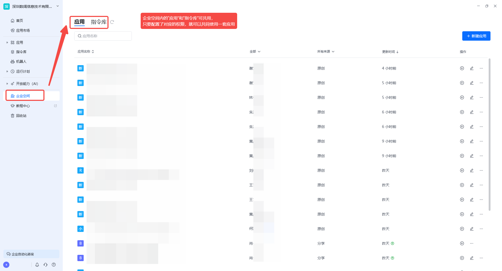

## 企业协同

- 协作者管理（企业所有者和企业管理员拥有企业内所有应用的管理权限）
  - 查看协作者权限：可使用和可编辑的用户可以查看协作者，不能进行编辑
  - 添加协作者：应用所有者和拥有可管理权限的用户可以添加应用协作者，支持模糊搜索和通讯录选择
  - 移除协作者：应用所有者和拥有可管理权限的用户可以移除应用协作者
  - 修改协作者权限：应用所有者和拥有可管理权限的用户可以修改其他协作者权限，可使用、可编辑、可管理
  - 转移所有权：应用所有者可以转移应用所有权给其他用户，转移后自己会变为可管理

- 申请应用权限
  - 企业成员可以向应用所有者申请可编辑/可使用权限

- 权限审批
  - 当有用户申请权限时，消息去会有消息提醒，点击后可以同意和拒绝权限申请，拒绝后申请者会收到消息

## 企业空间

切换到企业身份后，左侧导航会出现「企业空间」入口。企业空间是面向企业团队的自动化应用管理系统，团队成员可在空间内共享应用、协同编辑、追溯历史版本，并在统一的控制台中管理、监控和调度所有自动化流程。

### 显示范围

- 企业成员：可以查看企业所有应用名称、所有者。
- 外部协作者：仅可以查看自己参与协作的应用。

### 权限范围

- 企业所有者和企业管理员默认有所有应用的管理权限。
- 企业成员只能查看应用列表，如需要权限需要点击申请。

<Info>
  使用过程中遇到问题？前往 [八爪鱼RPA 开发者社区问答板块](https://rpa.bazhuayu.com/community/questions) 提问，获取官方与社区帮助。
</Info>
