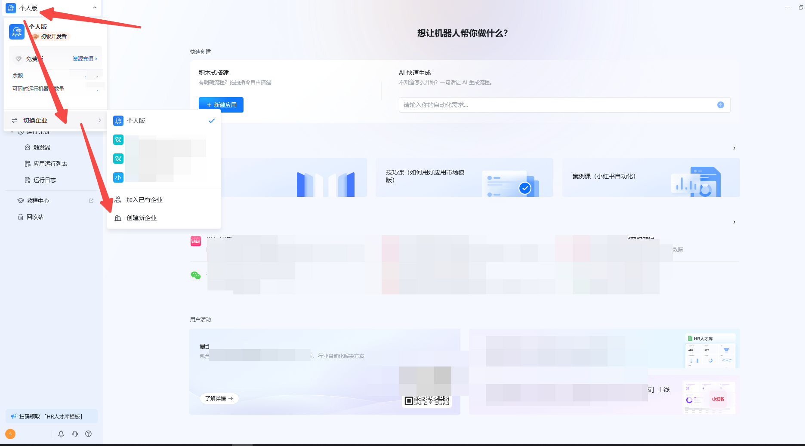
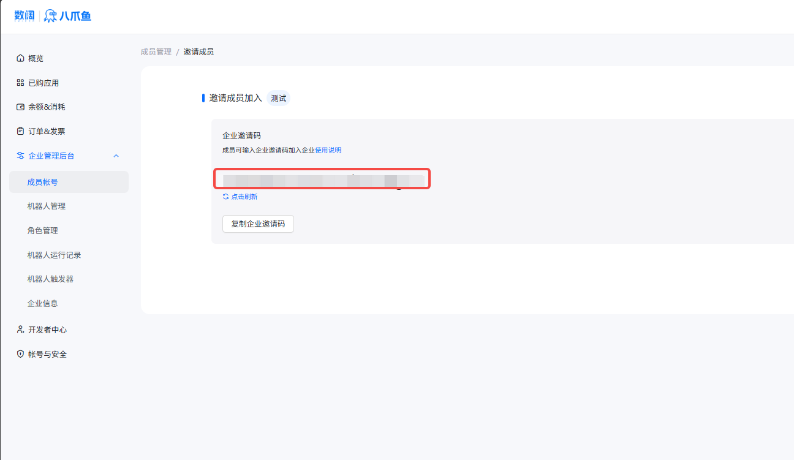

## 一、功能简介

八爪鱼RPA为企业管理员提供了丰富全面的成员邀请和管理工具。在创建新企业或组织后，您可以邀请成员加入企业，还可以设置应用权限，管理协助者，转移所有权，分享应用到企业空间等。

如果您还不是企业管理员，请点击这里，了解如何加入企业。

## 二、创建新企业

1、八爪鱼RPA客户端后，在左上角点击头像，进行【创建新企业】。

2、在弹窗中填写真实信息。

3、在弹窗中填写个人信息，即管理员信息。可用于后期的企业管理，账号找回等操作。

4、点击【立即创建】后即可创建属于自己的企业，然后在左上角点击头像可以【切换企业】。

## 三、邀请成员加入企业

请点击下方标题或链接获取详细的操作指引

使用企业邀请码加入企业：https://rpa.bazhuayu.com/helpcenter/docs/coWzYk

## 四、企业管理后台

请点击下方标题或链接进入详细的管理页面

https://rpa.bazhuayu.com/management/enterprise/member

成员管理详细介绍，参考下方跳转链接

成员管理：https://rpa.bazhuayu.com/helpcenter/docs/YjaXw5

<Info>
  使用过程中遇到问题？前往 [八爪鱼RPA 开发者社区问答板块](https://rpa.bazhuayu.com/community/questions) 提问，获取官方与社区帮助。
</Info>
