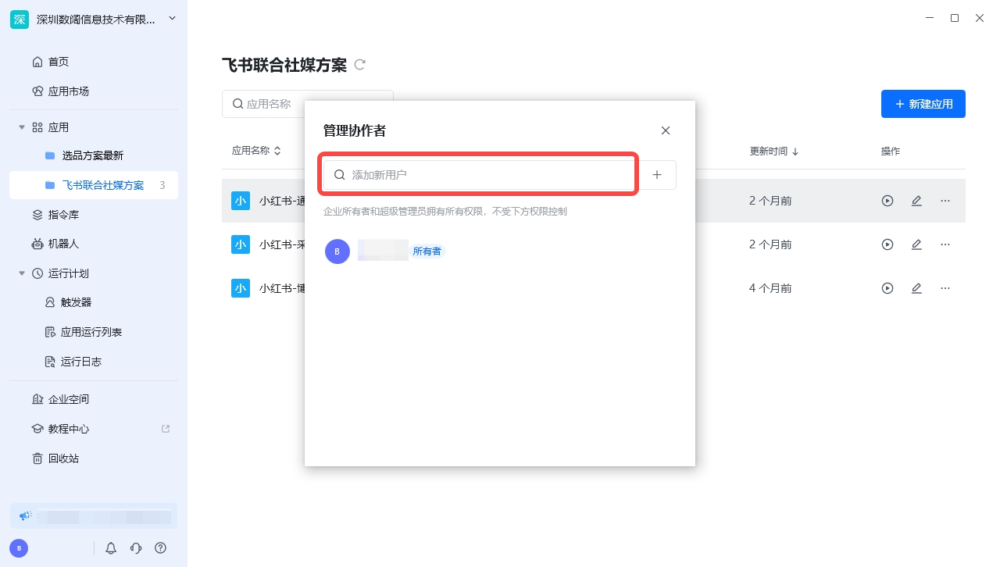

> 企业拥有者和管理员可以在企业管理后台生成邀请码，并通过该邀请码邀请其他人加入自己的企业

## 一、操作流程

<table style={{borderCollapse:'collapse'}}>
  <thead>
    <tr>
      <th style={{verticalAlign:'middle', padding:'8px'}}>步骤描述</th>
      <th style={{verticalAlign:'middle', padding:'8px'}}>附图</th>
    </tr>
  </thead>
  <tbody>
    <tr>
      <td style={{verticalAlign:'middle', padding:'8px'}}>1. 使用管理员账号登录八爪鱼RPA后，在左上角点击版本信息，点击“切换企业”，然后在下拉框中点击选择要进入的企业或组织</td>
      <td style={{verticalAlign:'middle', padding:'8px'}}>
        
      </td>
    </tr>
    <tr>
      <td style={{verticalAlign:'middle', padding:'8px'}}>2. 进入企业或组织后，首先点击个人头像，再点击【企业管理后台】，进入八爪鱼 RPA 企业管理后台页面</td>
      <td style={{verticalAlign:'middle', padding:'8px'}}>
        
      </td>
    </tr>
    <tr>
      <td style={{verticalAlign:'middle', padding:'8px'}}>3. 在【成员账号】分类下点击【邀请成员加入】</td>
      <td style={{verticalAlign:'middle', padding:'8px'}}>
        
      </td>
    </tr>
  </tbody>
</table>

## 二、企业内部人员加入企业

<table style={{borderCollapse:'collapse'}}>
  <thead>
    <tr>
      <th style={{verticalAlign:'middle', padding:'8px'}}>身份</th>
      <th style={{verticalAlign:'middle', padding:'8px'}}>目的和操作</th>
      <th style={{verticalAlign:'middle', padding:'8px'}}>附图</th>
    </tr>
  </thead>
  <tbody>
    <tr>
      <td style={{verticalAlign:'middle', padding:'8px'}}>邀请者</td>
      <td style={{verticalAlign:'middle', padding:'8px'}}>目的：邀请公司或团队内部人员加入企业 操作：请复制【企业邀请码】给成员</td>
      <td style={{verticalAlign:'middle', padding:'8px'}}>
        
      </td>
    </tr>
    <tr>
      <td style={{verticalAlign:'middle', padding:'8px'}}>被邀请者</td>
      <td style={{verticalAlign:'middle', padding:'8px'}}>目的：加入指定公司或团队内部 操作： ①在八爪鱼 RPA 客户端左上角点击版本信息 ②在下拉框中点击【切换企业】，再点击【加入已有企业】 ③选择【以企业成员身份加入】输入邀请码后点击【下一步】，填写姓名和电话后即可加入该企业 ④成功加入企业后，可以八爪鱼 RPA 客户端的左上角点击版本信息，切换进入企业空间</td>
      <td style={{verticalAlign:'middle', padding:'8px'}}>
        
        
        
      </td>
    </tr>
  </tbody>
</table>

## 三、企业外部人员加入企业

<table style={{borderCollapse:'collapse'}}>
  <thead>
    <tr>
      <th style={{verticalAlign:'middle', padding:'8px'}}>身份</th>
      <th style={{verticalAlign:'middle', padding:'8px'}}>目的和操作</th>
      <th style={{verticalAlign:'middle', padding:'8px'}}>附图</th>
    </tr>
  </thead>
  <tbody>
    <tr>
      <td style={{verticalAlign:'middle', padding:'8px'}}>邀请者</td>
      <td style={{verticalAlign:'middle', padding:'8px'}}>目的：企业外部人员需要接收企业内部的应用或发应用到企业内部 操作：请复制【外部协作码】给成员</td>
      <td style={{verticalAlign:'middle', padding:'8px'}}>
        
      </td>
    </tr>
    <tr>
      <td style={{verticalAlign:'middle', padding:'8px'}}>被邀请者</td>
      <td style={{verticalAlign:'middle', padding:'8px'}}>目的：加入指定公司或团队内部 操作： ①在八爪鱼 RPA 客户端左上角点击版本信息 ②在下拉框中点击【切换企业】，再点击【加入已有企业】 ③选择【以外部协作者身份加入】输入邀请码后点击【下一步】，填写姓名和电话后即可加入该企业 ④成功加入企业后，可以八爪鱼 RPA 客户端的左上角点击版本信息，切换进入企业空间</td>
      <td style={{verticalAlign:'middle', padding:'8px'}}>
        
        
        
      </td>
    </tr>
  </tbody>
</table>

## 四、企业成员与外部协作者的区别

1、外部协作者不占用企业成员席位

2、外部协作者看不到企业空间中自己未参与协作的应用

3、外部协作者不可以查看企业联系人，只能通过精准名称去匹配搜索。如在应用【管理协助者】--->【添加新用户】时:

①企业成员可以浏览全部联系人，然后进行点选；

②外部协作者只能输入名称进行搜索。

<Info>
  使用过程中遇到问题？前往 [八爪鱼RPA 开发者社区问答板块](https://rpa.bazhuayu.com/community/questions) 提问，获取官方与社区帮助。
</Info>
