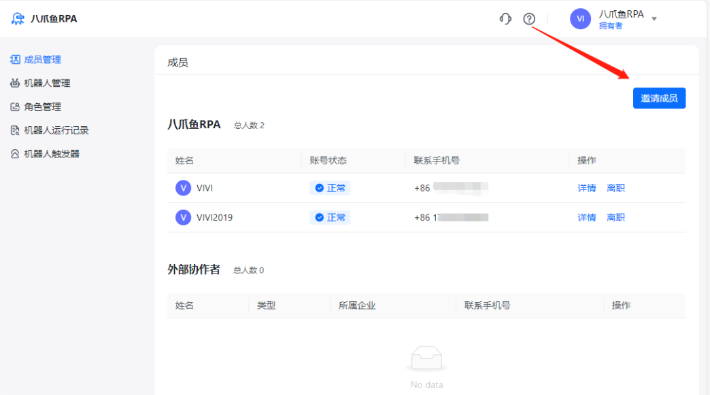
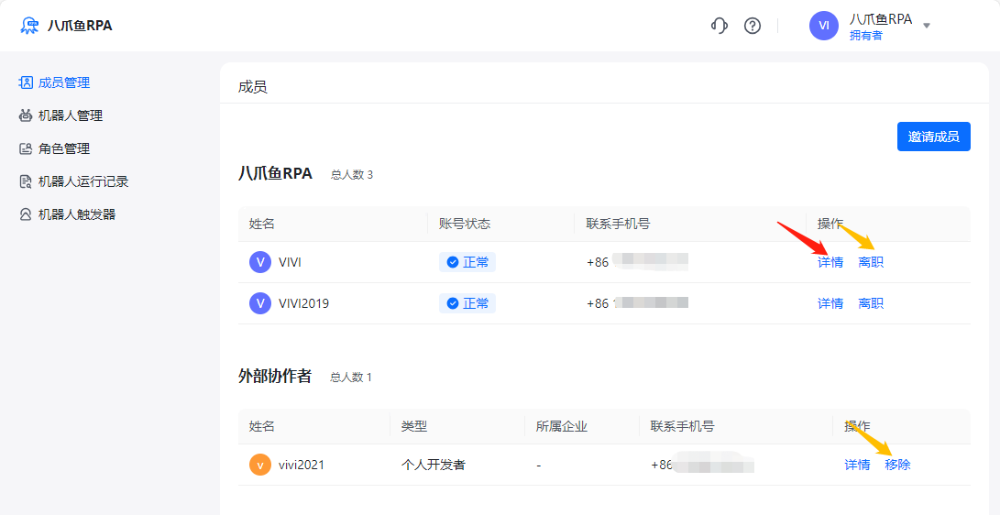
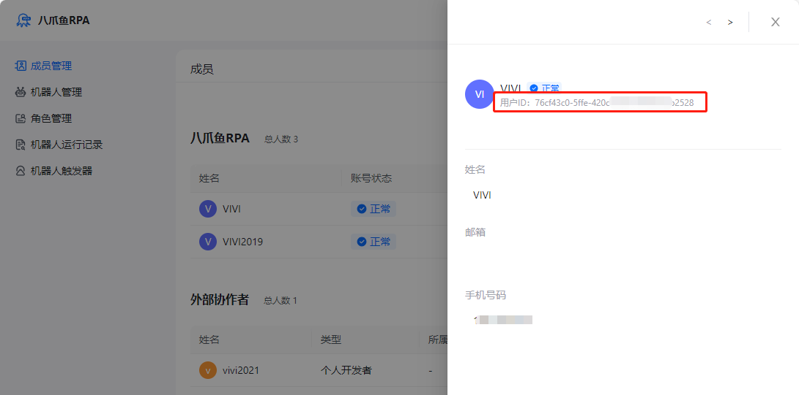
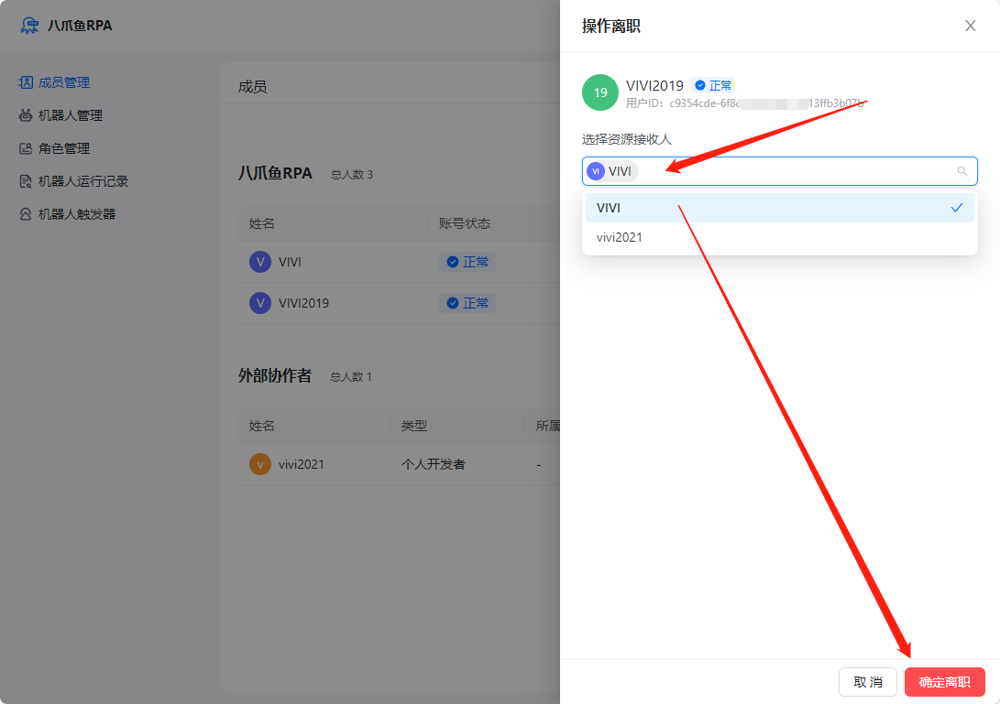
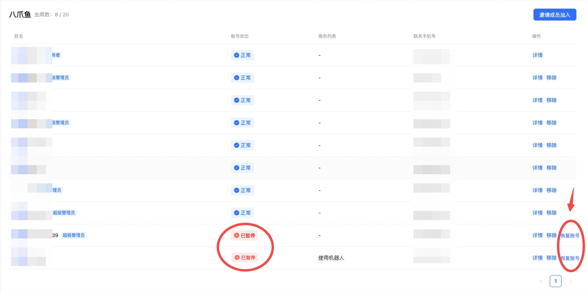

## 一、功能简介

企业拥有者和管理员可以在企业管理平台对当前企业内的全部成员进行管理。

## 二、邀请成员

点击邀请成员按钮

进入【企业邀请码】和【外部协作码】的界面，您可以通过这两种码邀请不同的人加入您的企业。详细的邀请步骤请查看：使用企业邀请码加入企业

## 三、删除成员

点击【详情】可以查看该成员的用户ID、邮箱、手机号等信息。

点击【离职】或【移除】可将成员或协作者从企业内删除。在操作离职时应该先为该成员指定一个资源接收人。即需要一个人来接收该离职成员创建的应用（仅限企业内应用，其个人版的应用不会被转接）。

## 四、企业版到期与超额成员

如果企业版到期，会限制成员进入企业空间。续费后，可恢复超额成员的使用权限。

<Info>
  使用过程中遇到问题？前往 [八爪鱼RPA 开发者社区问答板块](https://rpa.bazhuayu.com/community/questions) 提问，获取官方与社区帮助。
</Info>
