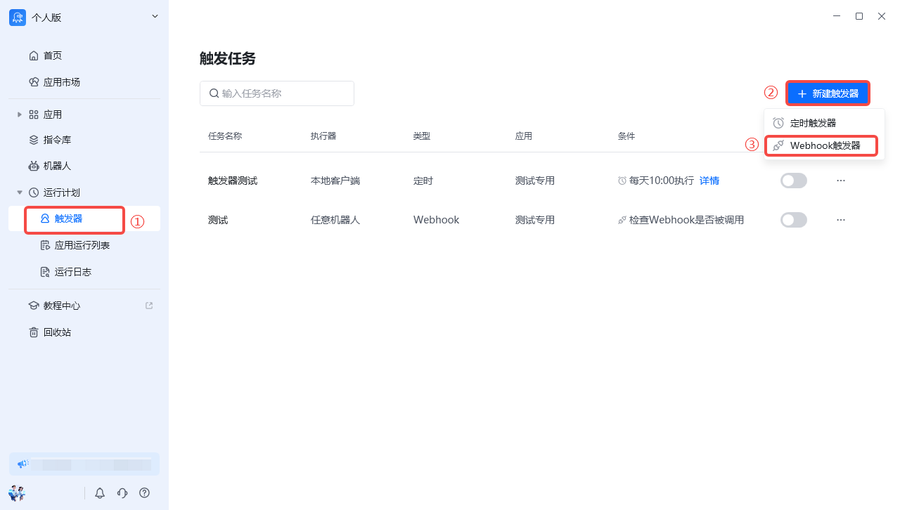
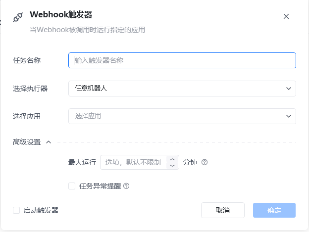
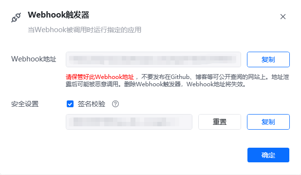
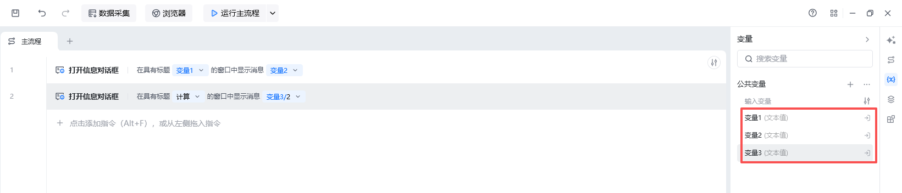
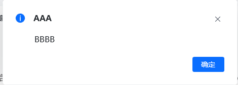
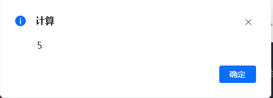
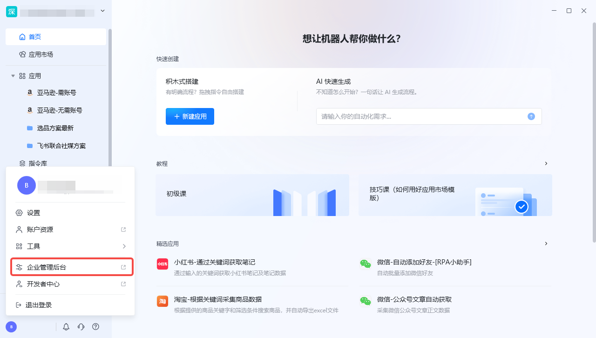
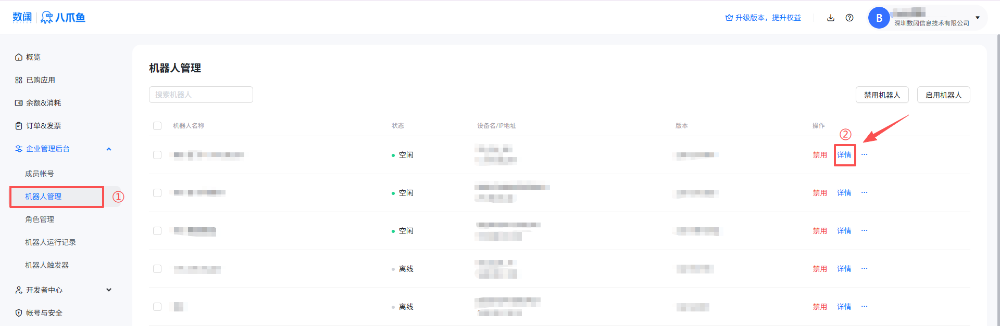
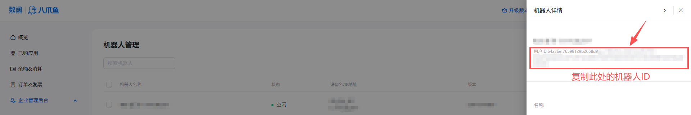

## 一、功能介绍

### 1.1 什么是 Webhook

Webhook 是一种 web 回调或者 http 的 push API，是向APP或者其他应用提供实时信息的一种方式。是一种基于 HTTP 的回调函数，可在 2 个应用编程接口（API）之间实现轻量级的事件驱动通信。

可以简单理解成，当某个应用发生特定事件时，会向另一个应用发送HTTP请求。

### 1.2 八爪鱼 RPA 的 Webhook 有什么功能

八爪鱼RPA可以针对每个 RPA 应用生成不同的 Webhook 接口，您可以在自己的业务系统里通过代码调用这个 Webhook 接口，从而触发对应的 RPA 应用，让其在指定的机器人上运行；同时支持在代码中修改 RPA应用 中的输入参数。

目前该接口的请求频率是：每秒最多5次，每分钟最多20次。

简单说就是：可以启动 RPA 应用，修改应用中的参数。

### 1.3 简单案例

想象一下，你经营着一家电商小店。每当有顾客下单，你都希望自动完成一系列操作，比如打印订单、准备发货通知等。八爪鱼RPA能帮你实现这个自动化流程。

①首先为名为”订单处理“的 RPA 应用创建一个Webhook接口；

②当有新订单生成时，你的店铺系统会发送一个包含订单号和收货地址等信息的HTTP请求到这个Webhook接口；

③八爪鱼 RPA 接收到请求后，会立即启动对应的 RPA 应用，使用这些订单信息自动完成后续的处理工作，比如更新库存、生成发货标签等。

这样，你就无需手动干预，订单处理流程就能高效、自动地进行。

### 1.4 如何创建 Webhook

| 操作步骤 | 附图 |
| --- | --- |
| 在使用Webhook之前，我们首先需要通过【触发器】栏目下的 "Webhook 触发器"来创建 Webhook |  |
| 填写触发器名称---><br/>指定运行的机器人---><br/>选择要运行的应用---><br/>点击"确定" |  |
| 创建成功后我们就能看到 Webhook 的信息。<br/>到这里Webhook触发器就传建好了，我们可以把 Webhook 地址和签名复制下来，放到调用触发器的代码里面。<br/>同时需要勾选上启动触发器，这样 Webhook 才能生效。 |  |

## 二、如何调用Webhook

Webhook 接口接收的 Json 格式的数据，Json格式为

```
{
    "sign": "timestamp + "\n" + 签名校验",  //注释：时间戳与签名进行算法加密，即将timestamp + "\n" + 密钥 当做签名字符串；先使用 HmacSHA256 算法计算签名，再进行 Base64 编码。
    "params": {
        "应用参数1": "被触发任务任务的自定义参数",
        "应用参数2": "被触发任务任务的自定义参数"
    },
    "SpecifiedBot":"机器人Id",
    "timestamp": "当前时间的时间戳"
}
```

| sign | 签名校验，可以为空，当 Webhook 触发器的安全设置没有勾选使用”签名校验“时，该 sign 的值为空 |
| --- | --- |
| params | 需要传递给应用的输入变量，同样为Json，其中 Key 是应用某个输入变量的名称，Value是需要传递的变量值 |
| SpecifiedBot | 指定 RPA 应用到特定的机器人上运行 |
| timestamp | 当前时间的时间戳（秒） |

以下面这个应用为例：



## 三、如何传递传递参数

我们通过 Webhook 启动这个应用，同时需要把变量1、变量2、变量3的值通过 Webhook 传递过来，此时请求的 Json 数据为

```
{
    "sign": "时间戳与签名进行算法加密，即将timestamp + "\n" + 密钥当做签名字符串，使用 HmacSHA256 算法计算签名，再进行 Base64 编码",
    "params": {
        "变量1": "AAA",
        "变量2": "BBBB",
        "变量3": 10,
    },
    "timestamp": "当前时间的时间戳"
}
```

```

```

应用的运行结果是出现两个消息确认框。其中第一个确认框的标题和内容分别是：“AAA”和“BBBB”，第二个是：“计算”和“5”





## 四、如何获取机器人ID

| 操作步骤 | 附图 |
| --- | --- |
| 在八爪鱼 RPA中切换到企业身份---><br/>点击左下角头像标志---><br/>打开企业管理后台 |  |
| 打开机器人管理界面---><br/>点击”详情“ |  |
| 在机器人详情页面复制机器人ID |  |

## 五、调用Webhook的示例代码

### 5.1 C#示例代码

```
//.net6 及以上平台示例代码
using System.Security.Cryptography;
using System.Text;
using System.Text.Json;
using WebhookDemo.Dtos;
var key = "替换为校验签名";
var url = "Webhook地址";
using var client = new HttpClient();
try
{
    var @params = new Dictionary<string, object>
    {
        { "应用参数1", "参数1的值" },
        { "应用参数2", "参数2的值" }
    };
    var timestamp = DateTimeOffset.Now.ToUnixTimeSeconds();
    var rpaWebhook = new RpaWebhookDto(
        timestamp.ToString(),
        GetSign(key, timestamp),
        @params);
    var result = await client.PostAsync(url,
        new StringContent(JsonSerializer.Serialize(rpaWebhook), Encoding.UTF8, "application/json"));
    if (result.IsSuccessStatusCode)
    {
        Console.WriteLine("调用成功");
        return;
    }
    var res = JsonSerializer.Deserialize<WebhookInvokeFailureDto>(
        await result.Content.ReadAsStringAsync(),
         new JsonSerializerOptions { PropertyNameCaseInsensitive = true }
    );
    Console.WriteLine("调用失败");
    Console.WriteLine($"失败原因：{res!.Description}");
    Console.WriteLine($"失败Code：{res!.Code}");
}
catch (Exception ex)
{
    Console.WriteLine($"Exception:{ex.Message}");
    throw;
}
static string GetSign(string secret, long timestamp)
{
    string stringToSign = timestamp + "\n" + secret;
    using HMACSHA256 hmac = new(Encoding.UTF8.GetBytes(stringToSign));
    byte[] signData = hmac.ComputeHash(Array.Empty<byte>());
    return Convert.ToBase64String(signData);
}
namespace WebhookDemo.Dtos
{
    public sealed record RpaWebhookDto(
        string Timestamp,
        string Sign,
        Dictionary<string, object>? Params
    );
    public sealed record WebhookInvokeFailureDto(
        string Code,
        string Description,
        string? RequestId
    );
}
```

```

```

### 5.2 Python示例代码

```
import requests
import json
import hashlib
import hmac
import base64
import time

key = "替换为校验签名"
url = "Webhook地址"

payload = {
    "应用参数1": "被触发任务任务的自定义参数",
    "应用参数2": "被触发任务任务的自定义参数"
}

timestamp = str(int(time.time()))

def get_sign(secret, timestamp):
    string_to_sign = timestamp + f"\n" + secret
    sign_data = hmac.new(string_to_sign.encode(),None, hashlib.sha256).digest()
    return base64.b64encode(sign_data).decode()

rpa_webhook = {
    "timestamp": timestamp,
    "sign": get_sign(key, timestamp),
    "params": payload
}

try:
    headers = {'Content-Type': 'application/json'}
    response = requests.post(url, data=json.dumps(rpa_webhook), headers=headers)
    if response.status_code == 200:
        print("调用成功")
    else:
        res = response.json()
        print("调用失败")
        print(f"失败原因：{res['description']}")
        print(f"失败Code：{res['code']}")
except Exception as ex:
    print(f"Exception: {ex}")
    raise
```

### 5.3 Java 示例代码

```
import java.io.IOException;
import java.net.URI;
import java.net.http.HttpClient;
import java.net.http.HttpRequest;
import java.net.http.HttpResponse;
import java.time.Instant;
import java.util.Base64;
import java.util.HashMap;
import java.util.Map;
import javax.crypto.Mac;
import javax.crypto.spec.SecretKeySpec;
import java.nio.charset.StandardCharsets;
import java.util.Base64;

import com.google.gson.Gson;

public class Main {
    static HttpClient client = HttpClient.newHttpClient();

    public static void main(String[] args) throws NoSuchAlgorithmException, IOException, InterruptedException {
        String key = "替换为校验签名";
        String url = "Webhook地址";

        long timestamp = Instant.now().getEpochSecond();
        String sign = getSign(key, timestamp);

        Map<String, Object> params = new HashMap<>();
        params.put("应用参数1", "参数1的值");
        params.put("应用参数2", "参数2的值");

        RpaWebhookDto rpaWebhook = new RpaWebhookDto(Long.toString(timestamp), sign, params);

        String requestBody = new Gson().toJson(rpaWebhook);

        HttpRequest request = HttpRequest.newBuilder()
                .uri(URI.create(url))
                .header("Content-Type", "application/json")
                .POST(HttpRequest.BodyPublishers.ofString(requestBody))
                .build();

        HttpResponse<String> response = client.send(request, HttpResponse.BodyHandlers.ofString());

        if (response.statusCode() == 200) {
            System.out.println("调用成功");
            return;
        }

        WebhookInvokeFailureDto res = new Gson().fromJson(response.body(), WebhookInvokeFailureDto.class);
        System.out.println("调用失败");
        System.out.println("失败原因：" + res.getDescription());
        System.out.println("失败Code：" + res.getCode());
    }

    static String getSign(String secret, long timestamp) {
        String stringToSign = timestamp + "\n" + secret;
        try {
            Mac mac = Mac.getInstance("HmacSHA256");
            SecretKeySpec secretKeySpec = new SecretKeySpec(stringToSign.getBytes(StandardCharsets.UTF_8), "HmacSHA256");
            mac.init(secretKeySpec);
            byte[] result = mac.doFinal();
            return Base64.getEncoder().encodeToString(result);
        } catch (Exception e) {
            throw new RuntimeException("getSign error", e);
        }
    }

    static class RpaWebhookDto {
        String Timestamp;
        String Sign;
        Map<String, Object> Params;

        public RpaWebhookDto(String timestamp, String sign, Map<String, Object> params) {
            Timestamp = timestamp;
            Sign = sign;
            Params = params;
        }
    }

    static class WebhookInvokeFailureDto {
        String Code;
        String Description;
        String RequestId;
    }
}
```

## 六、常见问题

### 6.1 为什么我的账号 Webhook 触发器是置灰状态？

使用 Webhook触发器的前提是当前帐号下有机器人，需要使用机器人可购买对应的版本套餐，[跳转增值服务](/guides/value-added)。

<Info>
  使用过程中遇到问题？前往 [八爪鱼RPA 开发者社区问答板块](https://rpa.bazhuayu.com/community/questions) 提问，获取官方与社区帮助。
</Info>
