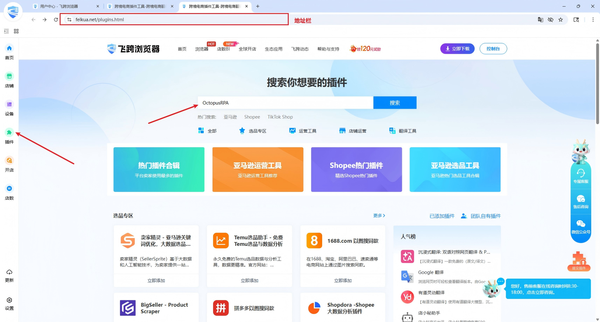
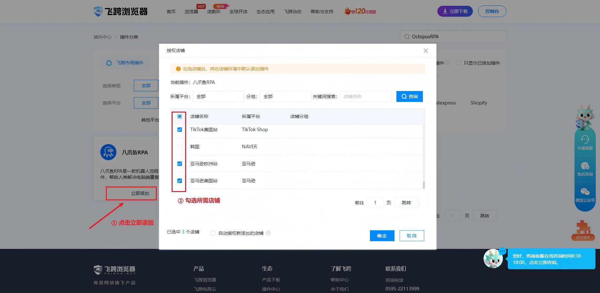
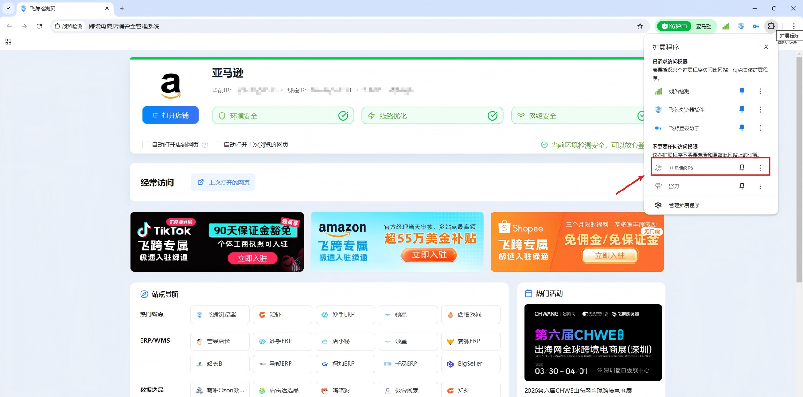
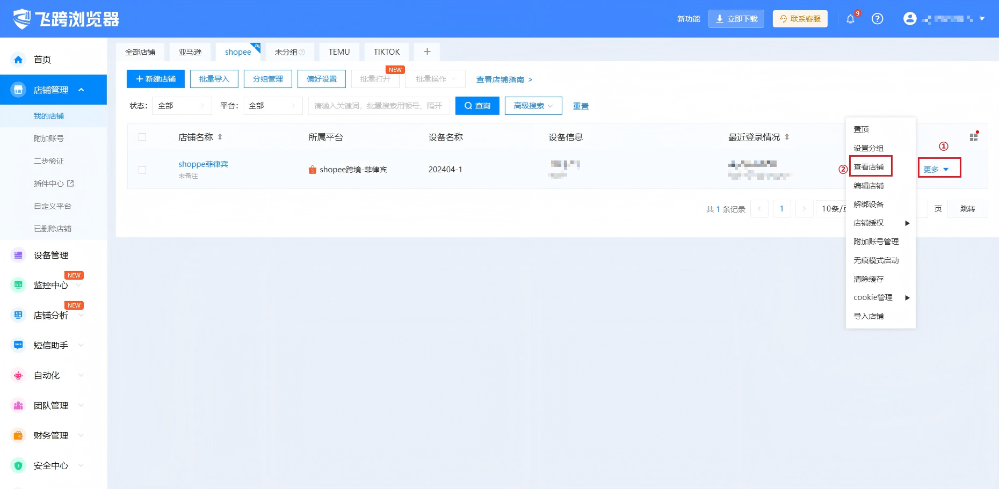
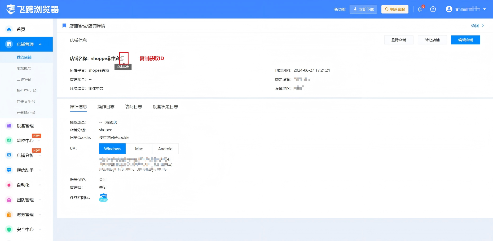
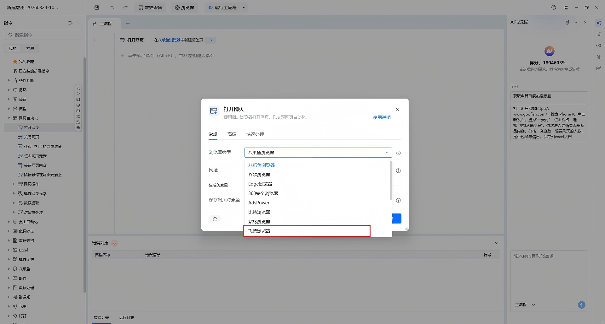
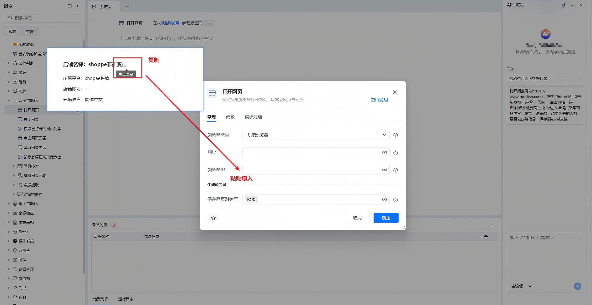

**飞跨浏览器安装插件说明**

说明：飞跨浏览器是一款专业的跨境电商浏览器，支持创建多个独立的浏览器环境以实现多店铺安全登录。若需在本地调用飞跨浏览器执行自动化任务，必须确保每个环境均已正确安装并启用八爪鱼 RPA 插件。

## 一、准备工作

在开始之前，请确保您已经下载并登录了飞跨浏览器客户端，并准备好需要配置的环境。[立即下载](https://www.feikua.net/download.html)

## 二、安装方式：从飞跨浏览器插件市场安装

1、在飞跨客户端左侧栏点击【插件】按钮，在插件中心搜索【八爪鱼】，或者在控制台地址栏输入[https://www.feikua.net/plugins/category/keyword_OctopusRPA.html](https://www.feikua.net/plugins/category/keyword_OctopusRPA.html)。

2、点击【立即添加】，在【授权店铺】弹窗勾选需要的店铺，点击确定即可。

3、打开店铺，在店铺环境里面即可看到八爪鱼插件。

## 三、八爪鱼RPA指令说明

### 3.1获取飞跨浏览器ID

1、在我的店铺页面选择要操作的店铺，点击【更多】→【查看店铺】，

2、在店铺详情页，店铺名称后面有个复制按钮，点击复制，获取ID。

### 3.2运行RPA

安装好插件后指令选择飞跨浏览器后，将之前在飞跨店铺获取的ID填入【浏览器ID】后即可运行。

## 四、注意事项

1、飞跨浏览器控制台要始终处于打开状态。
