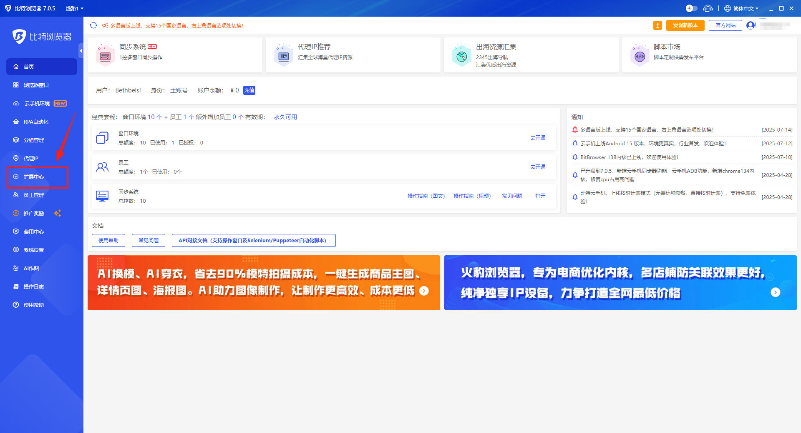
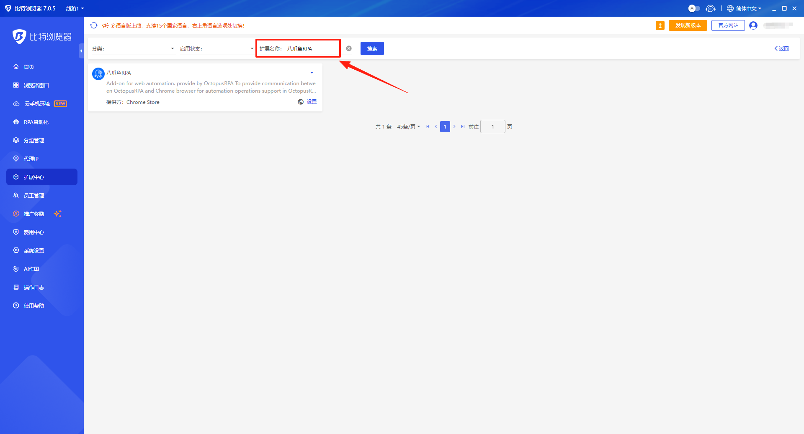
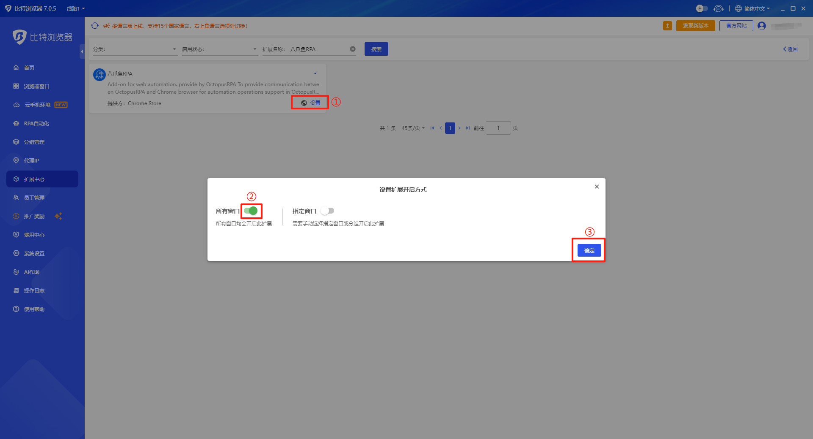
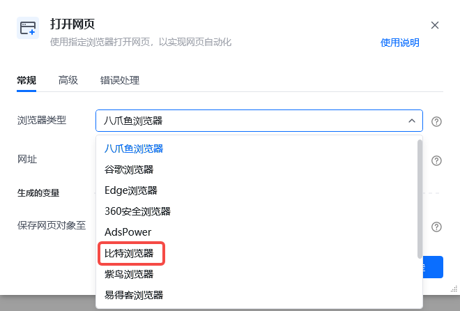
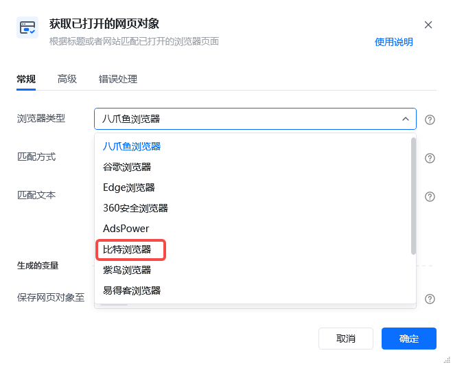
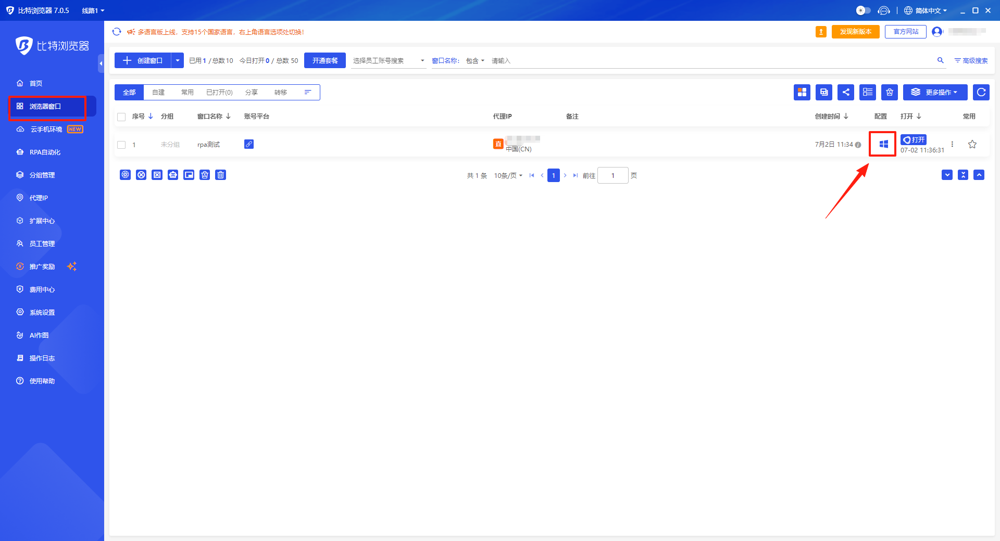
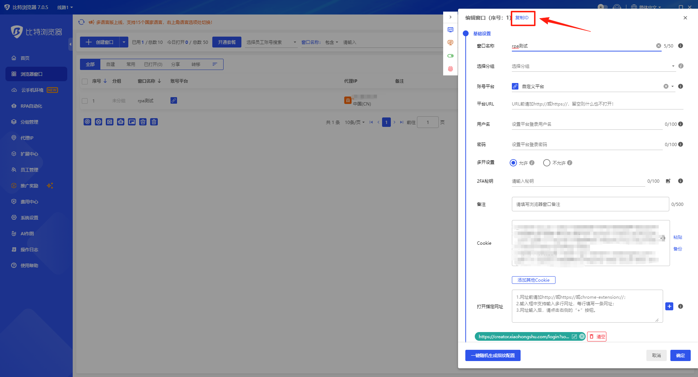

比特浏览器安装插件说明

说明：比特浏览器是一款指纹浏览器，可以设置多个不同环境的浏览器，从而实现多账号登录，调用本地电脑的比特浏览器需要先安装插件。且每个环境都需要单独安装一次八爪鱼RPA插件，并保证此插件处于开启状态。如未安装，请按照以下提示进行安装。

## 从比特生态中心安装

<strong>1、</strong>在比特浏览器首页点击“扩展中心”

<strong>2、</strong>在扩展名称中输入“八爪鱼RPA”

<strong>3、</strong>点击设置--->设置开启方式--->选择“所有窗口”

## 八爪鱼RPA指令说明

<strong>1、</strong>安装好插件后指令选择比特浏览器进行使用--->【打开网页】/【获取已打开的网页对象】选择“比特浏览器”

<strong>2、</strong>输入指定浏览器ID，浏览器ID的获取方式：
①点击”修改窗口配置“

②点击”复制ID“

## 特别注意

1. 若安装插件后运行应用，报”插件未开启“的错误。可检查浏览器插件版本，并尝试重装，可能是插件版本过旧导致的报错。
