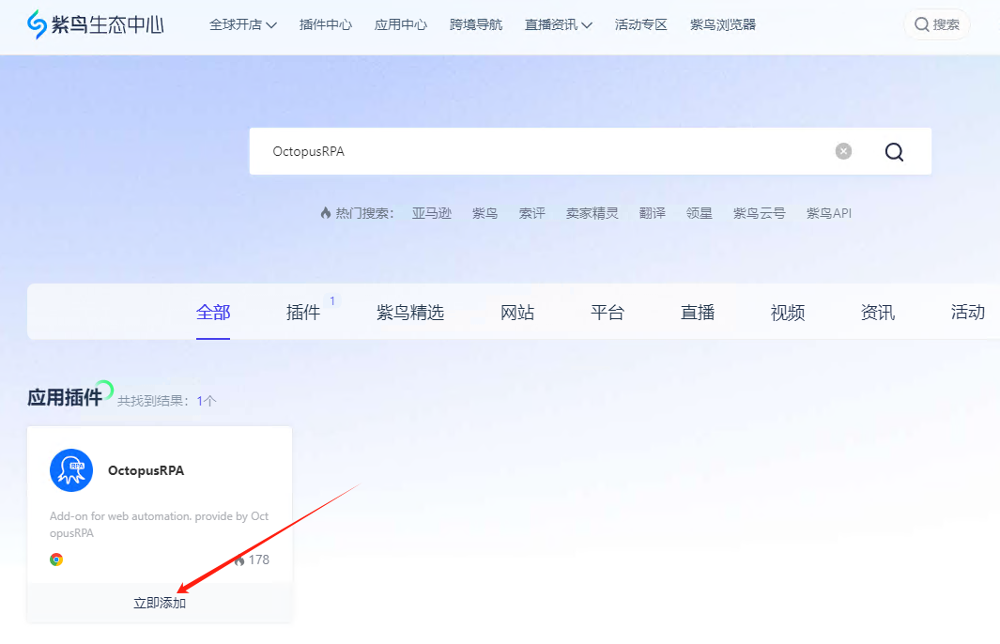
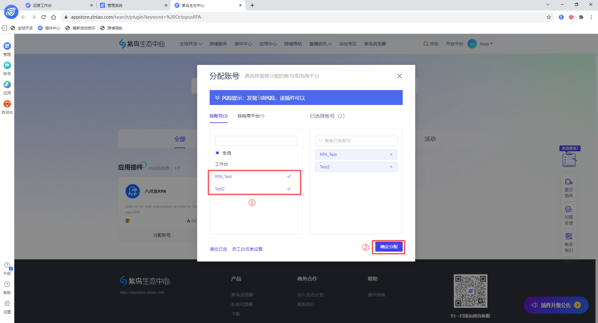
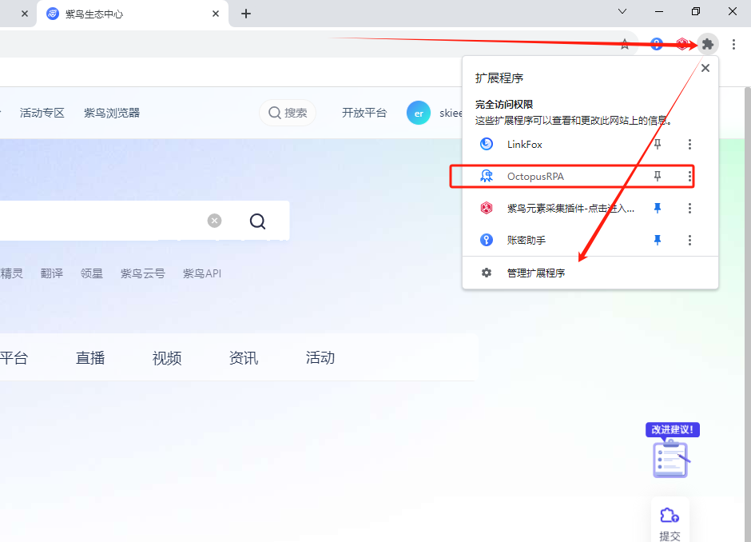
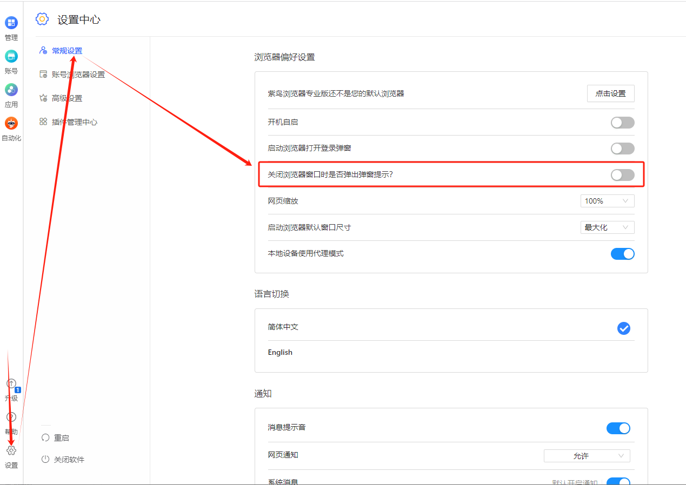
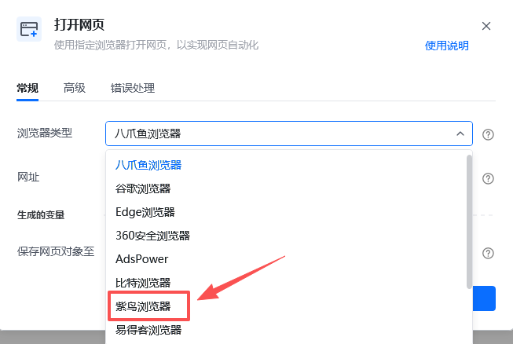

说明：紫鸟浏览器是一款指纹浏览器，可以设置多个不同环境的浏览器，从而实现多账号登录。调用本地电脑的紫鸟指纹浏览器需要先安装插件，且每个环境都需要单独安装一次八爪鱼 RPA 插件，并保证此插件处于开启状态。如未安装，请按照以下提示进行安装。

## 安装方式：从紫鸟生态中心安装

### 安装步骤

<strong>1、</strong>在紫鸟浏览器中输入 [https://appstore.ziniao.com/search/plugin?keyword=%20OctopusRPA](https://appstore.ziniao.com/search/plugin?keyword=%20OctopusRPA)，并按下回车键

<strong>2、</strong>点击【立即添加】，在新弹窗中勾选【我已阅读并同意】后再点击【同意授权】

<strong>3、</strong>在【分配账号】弹窗选择需要分配到哪些账号或电商平台上。添加及分配成功后，会有弹窗信息。<strong> 注：</strong>如果要操作某个账号，如我需要操作账号“RPA_Test”和“Test2”，请不要勾选“工作台”

<strong>4、</strong>如下图点击插件图标后，再点击管理扩展程序，可进入扩展程序管理界面，确认插件版本。

<strong>注：</strong>检查八爪鱼 RPA 插件版本号，若版本号低于0.0.40，请重新安装最新本插件

### 更改紫鸟浏览器常规设置

路径：设置--->常规设置--->关闭设置项“关闭浏览器窗口时是否弹出弹窗提示？”

## 八爪鱼RPA指令说明

安装好插件后指令选择紫鸟浏览器后即可运行。

## 特别注意

1. 目前八爪鱼 RPA 无法直接打开特定的紫鸟浏览器账号，需要使用桌面自动化指令打开特定的紫鸟浏览器账号。
可以参考共享流程：[https://rpa.bazhuayu.com/shareableLink/67612c801140412f72a76a9e](https://rpa.bazhuayu.com/shareableLink/67612c801140412f72a76a9e)

2. 如果要操作某个浏览器账号，请先将主浏览器中的OctopusRPA插件卸载（即分配账号时不勾选“工作台”）。然后通过桌面自动化指令将指定账号的浏览器打开，打开后在该浏览器中，再打开我们要操作的网页，进行后续的网页自动化操作。

3. 目前暂不支持同时打开多个紫鸟浏览器，需操作完成其中一个并且关闭后，才能操作下一个紫鸟浏览器。

4. 暂不支持紫鸟v6及以上版本，如需操作紫鸟浏览器，请选择v5版本。

5. 若安装插件后运行应用，报”插件未开启“的错误。可检查浏览器插件版本，并尝试重装，可能是插件版本过旧导致的报错。
