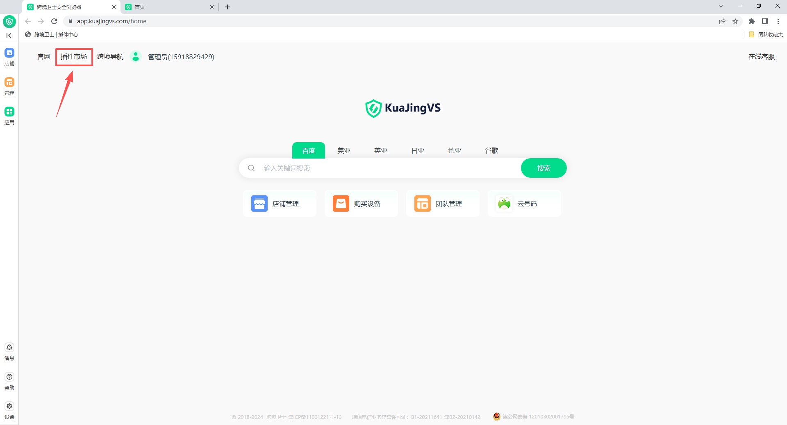
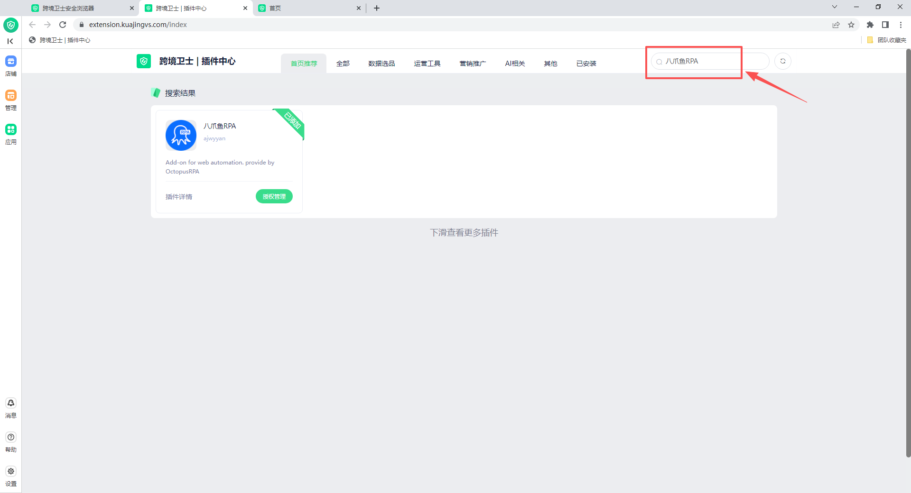
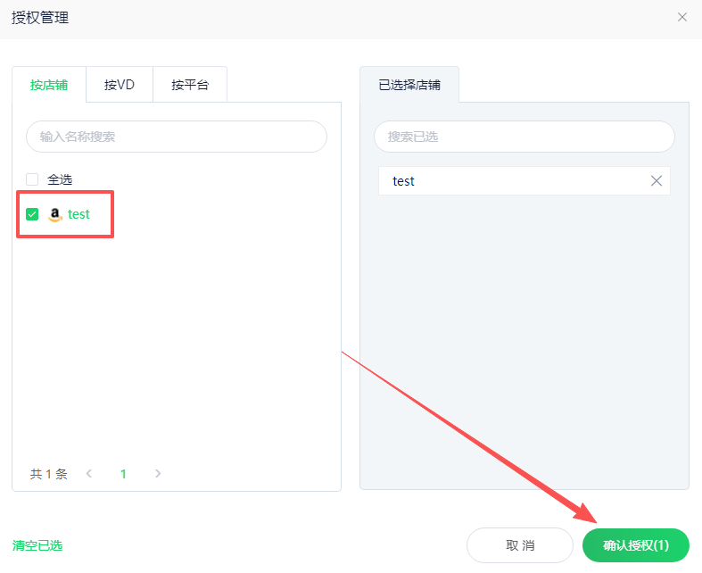
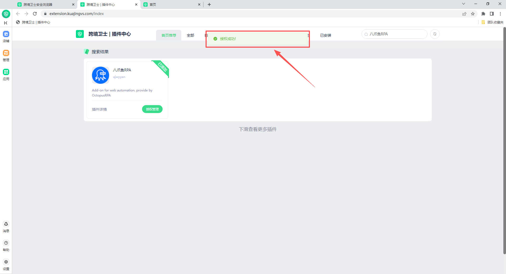
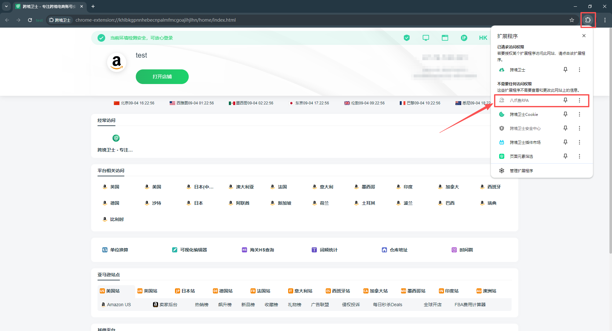
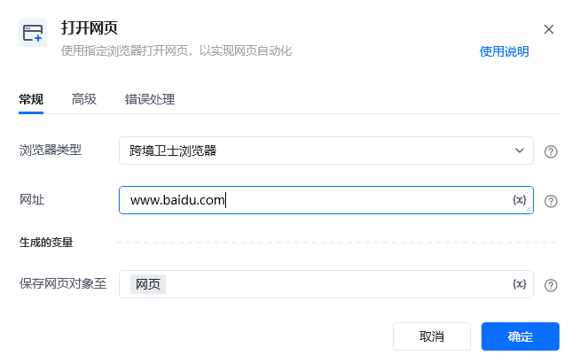

跨境卫士浏览器安装插件说明

说明：跨境卫士浏览器是一款指纹浏览器，可以设置多个不同环境的浏览器，从而实现多账号登录。调用本地电脑的跨境卫士浏览器需要先安装插件，且每个环境都需要单独安装一次八爪鱼 RPA 插件，并保证此插件处于开启状态。如未安装，请按照以下提示进行安装。

## 从跨境卫士插件市场安装

<strong>1、</strong>从跨境卫士浏览器首页进入“插件市场”

<strong>2、</strong>在搜索框中输入“八爪鱼RPA”，会出现指定插件

<strong>3、</strong>点击【授权管理】，在弹窗中选择需要分配到哪些账号或电商平台上。添加及分配成功后，会有授权成功弹窗。

<strong>4、</strong>如下图点击插件图标后，再点击管理扩展程序，可进入扩展程序管理界面，确认插件版本。

## 八爪鱼RPA指令说明

安装好插件后指令选择跨境卫士浏览器后即可运行。

## 特别注意：

1、目前八爪鱼RPA无法打开特定的跨境卫士浏览器账号，需要使用桌面自动化打开特定的跨境卫士浏览器。可以参考共享流程：[https://rpa.bazhuayu.com/shareableLink/67612c801140412f72a76a9e](https://rpa.bazhuayu.com/shareableLink/67612c801140412f72a76a9e)

2、如果有多个其他浏览器，目前还不支持同时打开，得操作一个关闭一个，然后再打开下一个。
