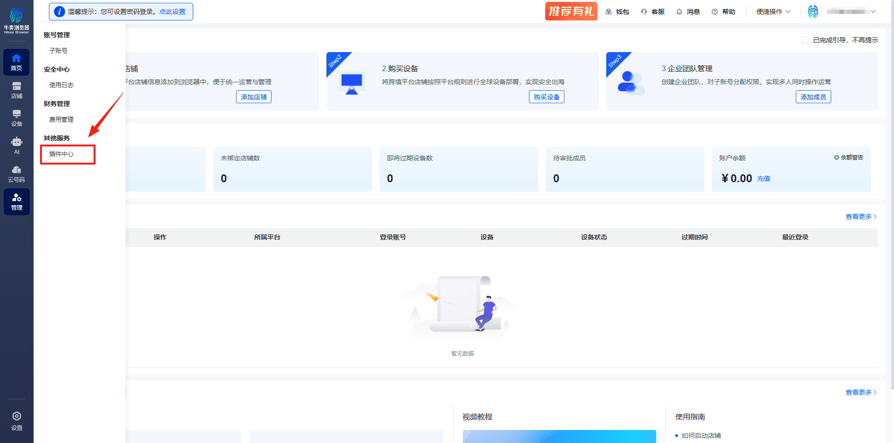
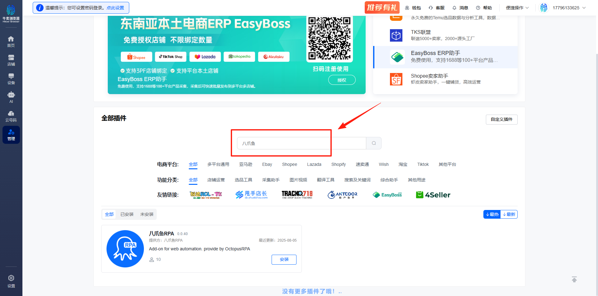
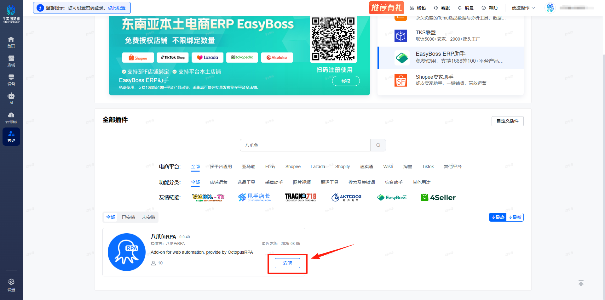
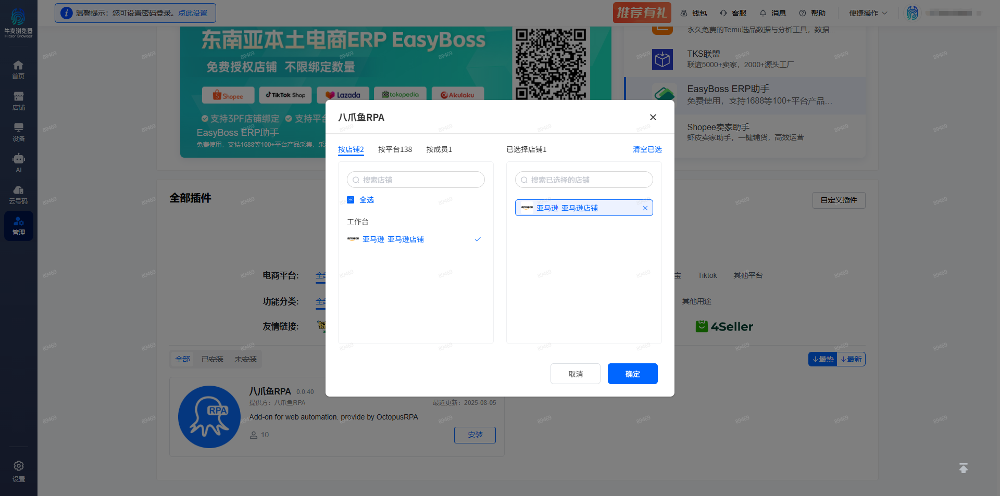
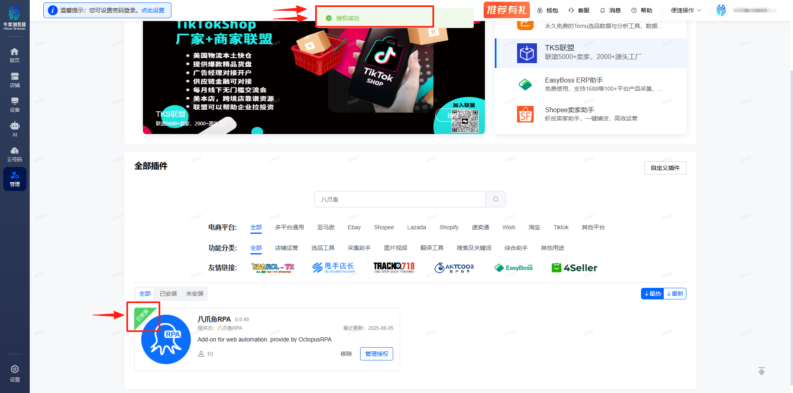
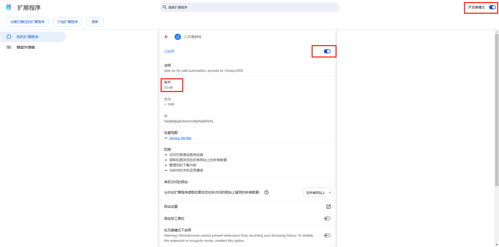
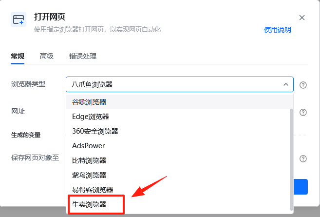
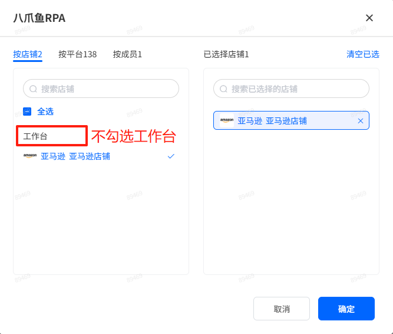

牛卖浏览器安装插件说明

说明：牛卖浏览器是一款指纹浏览器，可以设置多个不同环境的浏览器，从而实现多账号登录。调用本地电脑的牛卖指纹浏览器需要先安装插件，且每个环境都需要单独安装一次八爪鱼 RPA 插件，并保证此插件处于开启状态。如未安装，请按照以下提示进行安装。

## 从牛卖生态中心安装

1、进入”插件中心“

2、在搜索框中输入”八爪鱼“

3、安装”八爪鱼RPA“插件，选择需要安装插件的店铺。添加及分配成功后，会有弹窗信息”授权成功“。

4、如下图点击”插件图标“后，再点击”管理扩展程序“，可进入扩展程序管理界面，确认插件版本。

## 八爪鱼RPA指令说明

安装好插件后，在【打开网页】或【获取已打开网页对象】指令中选择【牛卖浏览器】后即可运行。

## 特别注意

1、目前八爪鱼RPA无法打开特定的牛卖浏览器账号，需要使用桌面自动化打开特定的牛卖浏览器。可在账号管理页面，通过输入账号的备注名，去查找要打开的账号浏览器，然后在该浏览器中进行自动化操作。

2、如果要<strong>操作某个店铺的浏览器，请不要在主浏览器中安装八爪鱼RPA插件。</strong>如已安装，请先将主浏览器中的八爪鱼RPA插件卸载。然后通过桌面自动化指令将指定账号的浏览器打开。接着在该账号浏览器中再打开我们要操作的网页，以及进行后续的操作。

3、如果有多个其他浏览器，目前还不支持同时打开，得操作一个关闭一个，然后再打开下一个。
