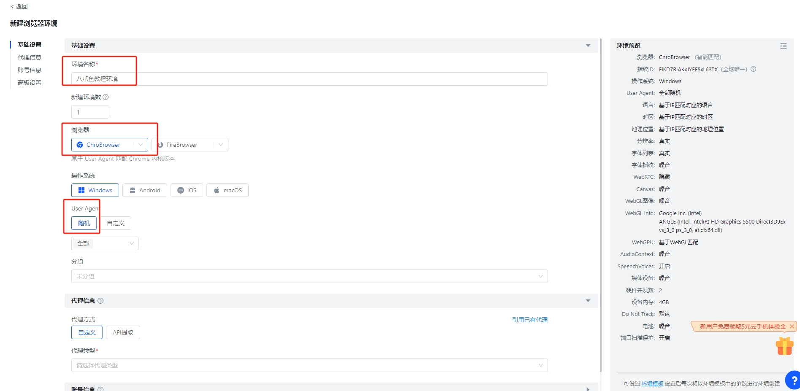
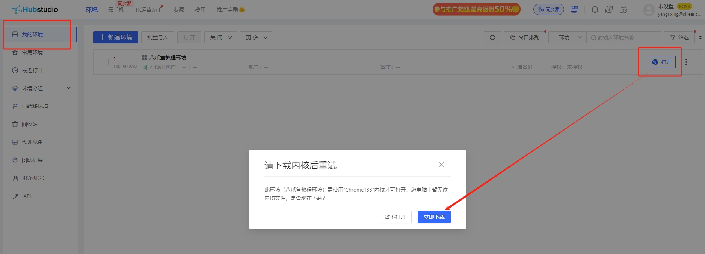
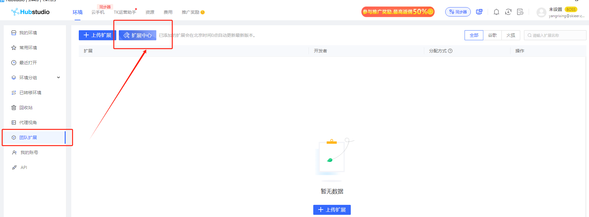
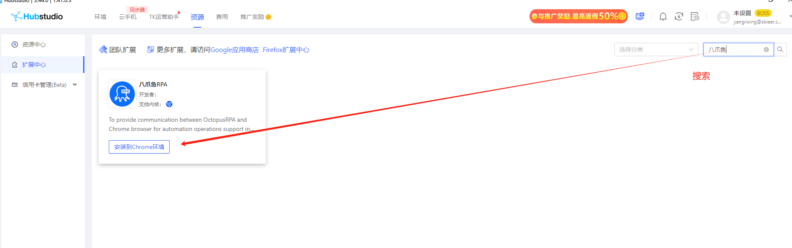
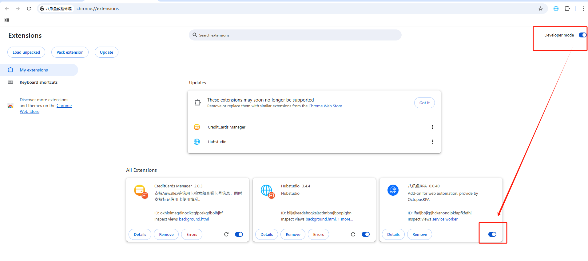
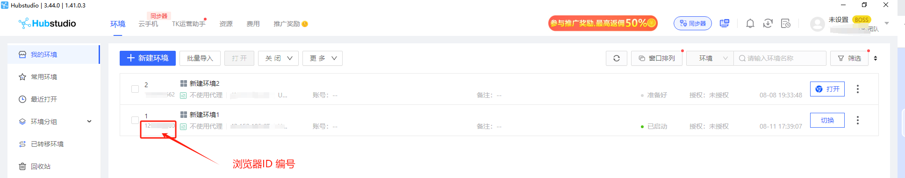

说明：Hubstudio浏览器是一款指纹浏览器，可以设置多个不同环境的浏览器，从而实现多账号登录。调用本地电脑的Hubstudio指纹浏览器需要先安装插件，且每个环境都需要单独安装一次八爪鱼RPA插件，并保证此插件处于开启状态。如未安装，请按照以下提示进行安装。

## 自动安装方式

Hubstudio浏览器下载：https://www.hubstudio.vip/index.html

**1、** 在Hubstudio浏览器应用中在先新建/启动一个浏览器环境。（注意，目前只支持的浏览器ChroBrower，操作系统是Windows）

<strong>2、</strong>首次使用需下载内核：我的环境->打开浏览器->立即下载

<strong>3、</strong>团队扩展->扩展中心->搜索->安装到Chrome环境

**4、** 插件安装完成后，打开 Hubstudio浏览器输入  chrome://extensions  进入到扩展程序页面并确保【开发者模式】、【八爪鱼RPA插件】都处于打开的状态；

注意：开启开发者模式后可能需要退出浏览器重启后才能生效！

<strong>5、</strong>浏览器ID编号

## Hubstudio浏览器注意事项

1、开了电脑的代理IP有可能会导致Hubstudio操作不了，建议使用Hubstudio浏览器里的代理IP。

## 特殊情况说明：

如遇到插件被浏览器阻止安装或报警告导致不能安装，请参考该教程解决问题。[https://rpa.bazhuayu.com/helpcenter/features/personal-center/auto-plugin/bm0HMyD8](https://rpa.bazhuayu.com/helpcenter/features/personal-center/auto-plugin/bm0HMyD8)
