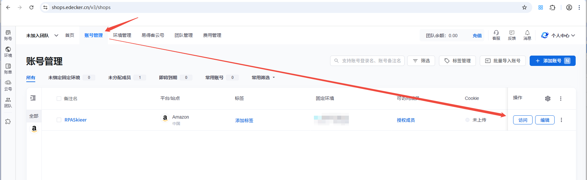
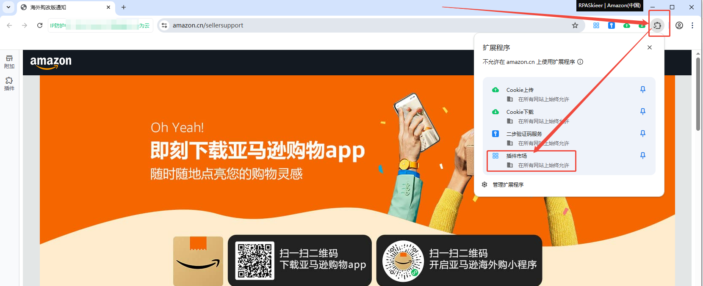
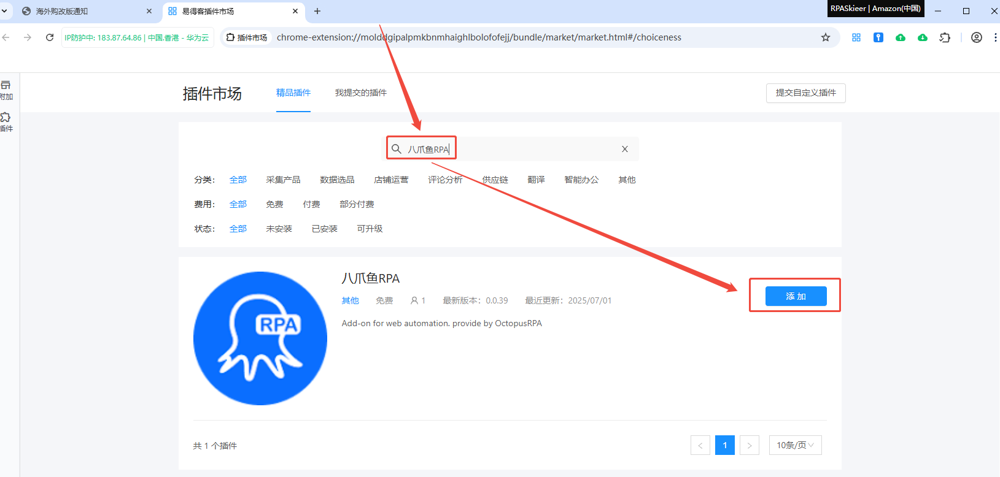
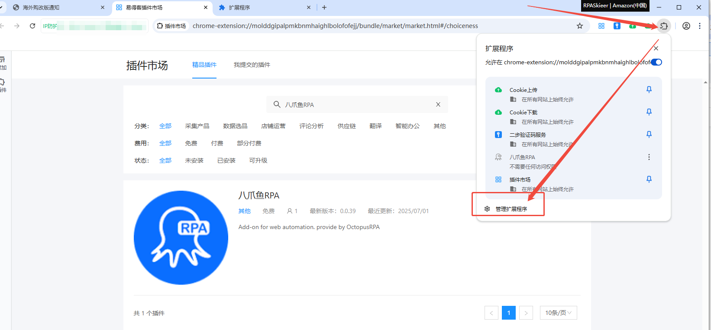
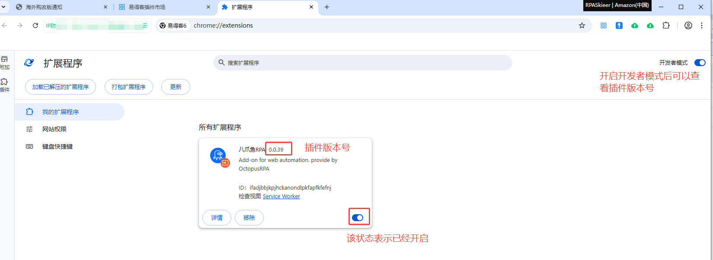
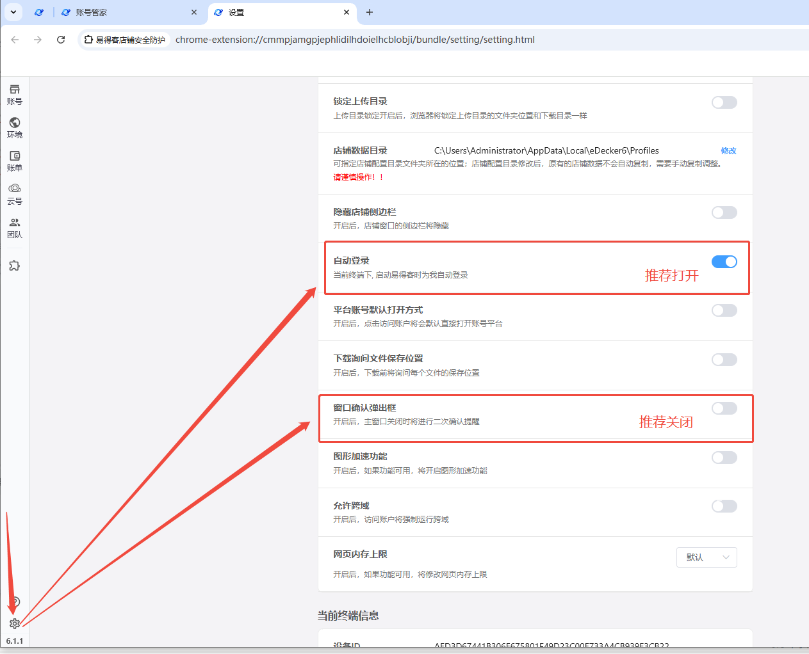
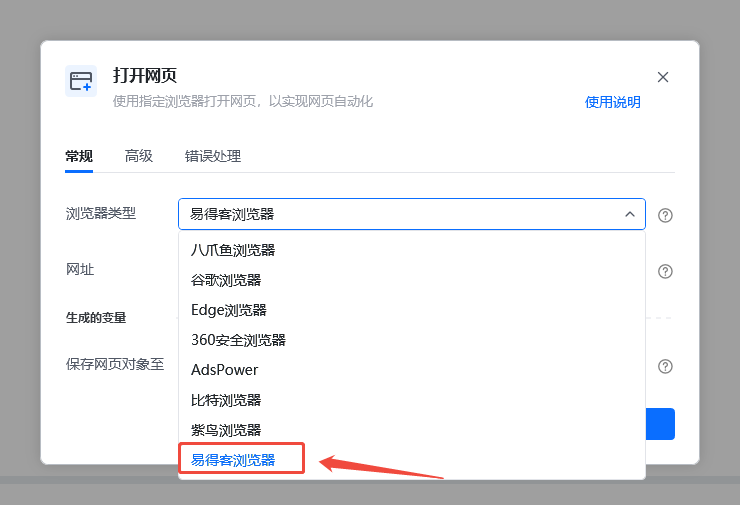

说明：易得客器是一款指纹浏览器，可以设置多个不同环境的浏览器，从而实现多账号登录。调用本地电脑的易得客指纹浏览器需要先安装插件，且每个环境都需要单独安装一次八爪鱼RPA插件，并保证此插件处于开启状态。如未安装，请按照以下提示进行安装。

## 从易得客生态中心安装

**1**、首先在账号管理中，访问您需要安装RPA插件的账号环境。

<strong>2、</strong>在新打开的浏览器中，点击右上角的【扩展程序】图标，然后再点击【插件市场】**

3、**进入到插件市场后，在搜索框输入 八爪鱼RPA 后回车进行搜索，然后点击【添加】。

<strong>4、</strong>如添加成功后，再点击【扩展程序】后点击【管理扩展程序】进入扩展程序管理界面，检查插件是否正常开启。

<strong>5、</strong>确认插件正常开启后，就可以通过八爪鱼RPA调用浏览器了。**

## 易得客浏览器设置项

推荐将【自动登录】打开，将【窗口确认弹出框】关闭。不这样设置，采用默认设置。RPA也可以正常运行，但操作流程会更复杂一点。

## 八爪鱼RPA指令说明

安装好插件后，在【打开网页】或【获取已打开网页对象】指令中选择【易得客浏览器】后即可运行。

## 特别注意：

1、目前八爪鱼RPA无法打开特定的易得客浏览器账号，需要使用桌面自动化打开特定的易得客浏览器。可在账号管理页面，通过输入账号的备注名，去查找要打开的账号浏览器，然后在该浏览器中进行自动化操作。具体步骤可以参考共享流程：[https://rpa.bazhuayu.com/shareableLink/6866335b3368fcbef19af8f1?ref=JdtyQq](https://rpa.bazhuayu.com/shareableLink/6866335b3368fcbef19af8f1?ref=JdtyQq)

2、如果要<strong>操作某个账号的浏览器，请不要在主浏览器中安装八爪鱼RPA插件。</strong>如已安装，请先将主浏览器中的八爪鱼RPA插件卸载。然后通过桌面自动化指令将指定账号的浏览器打开。接着在该账号浏览器中再打开我们要操作的网页，以及进行后续的操作。

3、如果有多个其他浏览器，目前还不支持同时打开，得操作一个关闭一个，然后再打开下一个。
