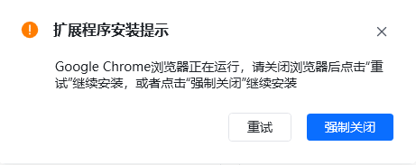
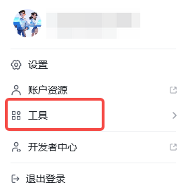
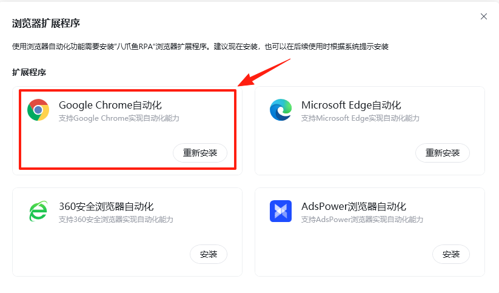
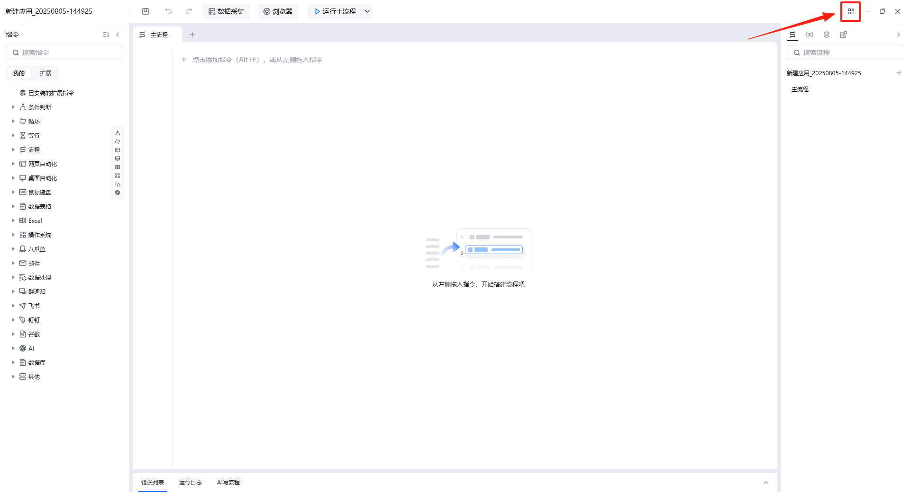
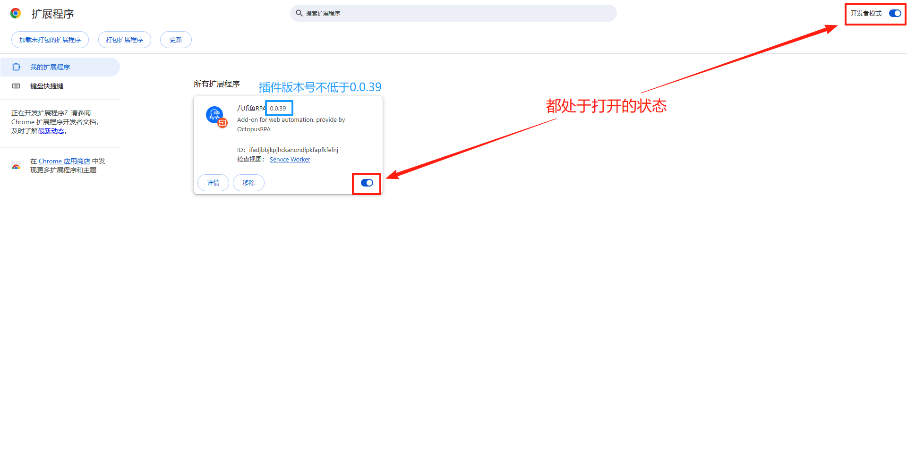
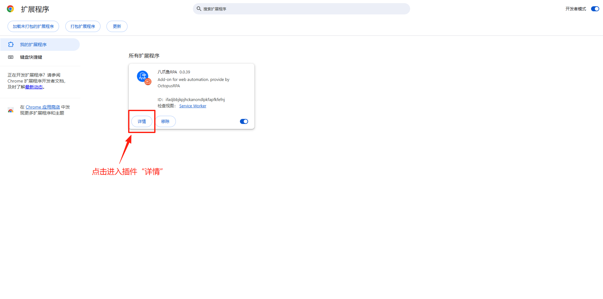
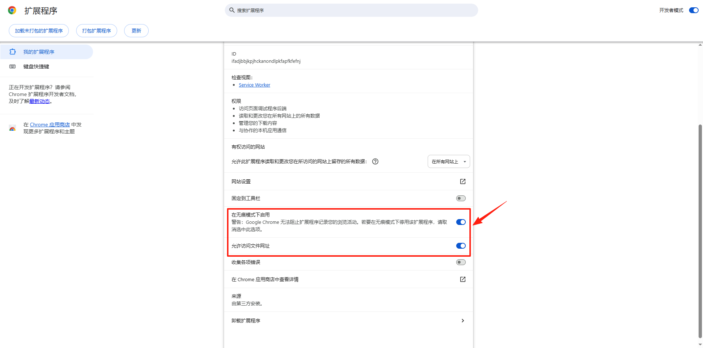
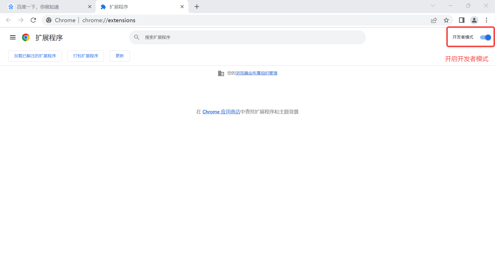
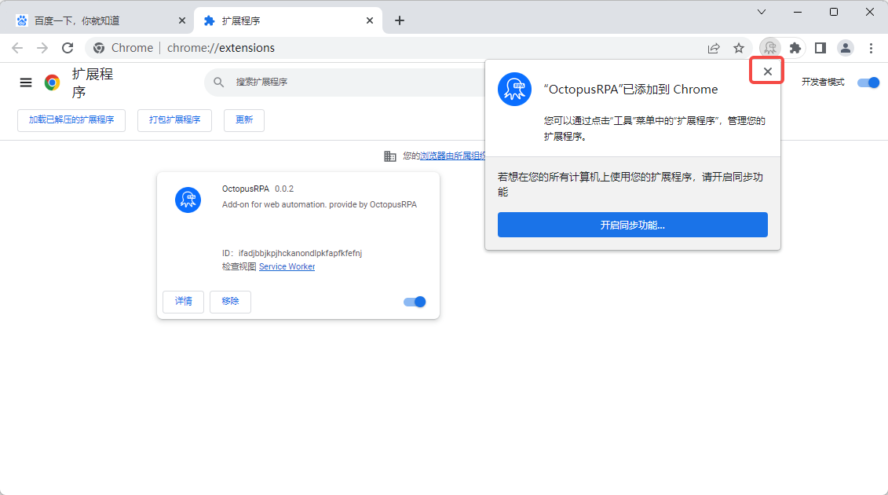

说明：调用本地电脑的Chrome浏览器需要先安装插件，并且保证此插件处于开启状态。如未安装，请按照以下提示进行安装。

## 方式一：自动安装

### 安装步骤

**1、** 如果当前正在使用Chrome浏览器，需关闭 Chrome 浏览器。否则后续安装时会出现如下提示

**2、** 打开八爪鱼 RPA ，在主界面或应用编辑界面都可安装插件，选择其中一种

<table><colgroup><col /><col /><col /></colgroup>
<tbody>
<tr>
<td> </td>
<td>软件主界面</td>
<td>应用编辑界面</td>
</tr>
<tr>
<td>步骤</td>
<td>

①点击头像

②点击工具

③点击“浏览器扩展程序”，选择Google Chrome自动化

</td>
<td>

①在应用编辑界面，点击图标

②点击“浏览器扩展程序”，选择Google Chrome自动化

</td>
</tr>
</tbody>
</table>

**3、** 插件安装完成后，打开 Chrome 浏览器输入  chrome://extensions  进入到扩展程序页面，并确保【开发者模式】和【八爪鱼 RPA 插件】都处于打开的状态<strong> 注：</strong>开启开发者模式后，可能需要先退出浏览器再重启浏览器才能生效

### 无痕模式

如果需要让八爪鱼 RPA 访问隐身（无痕）模式的网页或 HTML 文件的网页，需要在插件设置中的详情中打开对应的选项。

--->点击进入插件“详情”页面

--->打开“在无痕模式下启用”和“允许访问文件网址”按钮

## 方式二：手动安装

**1、[点击此处](https://update.bazhuayu.com/rpa/OctopusRPA.crx)** 下载   OctopusRPA . crx  文件，** 2、** 打开 Chrome 浏览器输入  chrome://extensions  进入到扩展程序页面，开启开发者模式<strong> 注：</strong>开启开发者模式后，可能需要先退出浏览器再重启浏览器才能生效

--->拖动插件到扩展程序页面来安装

**3、** 弹出安装提示页面，点击 【添加扩展程序】 按钮即可完成安装

**4、** 不需要开启后续弹窗中的同步功能，直接关闭即可

**5、** 如手动安装失败，请退出浏览器后，再尝试一次上方的"方式一自动安装"

## 特殊情况说明

如遇到插件被浏览器阻止安装或报警告导致不能安装的情况，请参考下方教程解决[https://rpa.bazhuayu.com/helpcenter/features/personal-center/auto-plugin/q2Ivzn](https://rpa.bazhuayu.com/helpcenter/features/personal-center/auto-plugin/q2Ivzn)
