说明：AdsPower浏览器是一款指纹浏览器，可以设置多个不同环境的浏览器，从而实现多账号登录。若想使用八爪鱼 RPA 调用本地电脑的 AdsPower 浏览器需要先安装插件，且每个环境都需要单独安装一次八爪鱼 RPA 插件，并保证此插件处于开启状态。如未安装，请按照以下提示进行安装。

## 方式一：自动安装

### 安装步骤

**1、** 打开 AdsPower 软件，并先启动一个 AdsPower 浏览器环境

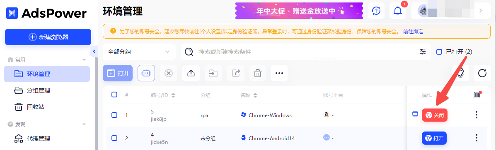

注：浏览器基础设置内，目前只支持SunBrower浏览器，Windows操作系统

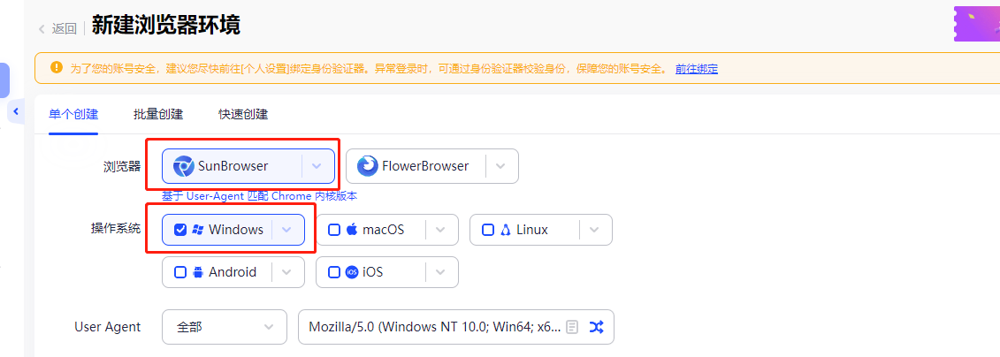

<strong>2、</strong>打开八爪鱼 RPA ，在主界面或应用编辑界面都可安装插件，选择其中一种

<table><colgroup><col /><col /><col /></colgroup>
<tbody>
<tr>
<td> </td>
<td>软件主界面</td>
<td>应用编辑界面</td>
</tr>
<tr>
<td>步骤</td>
<td>

①点击头像

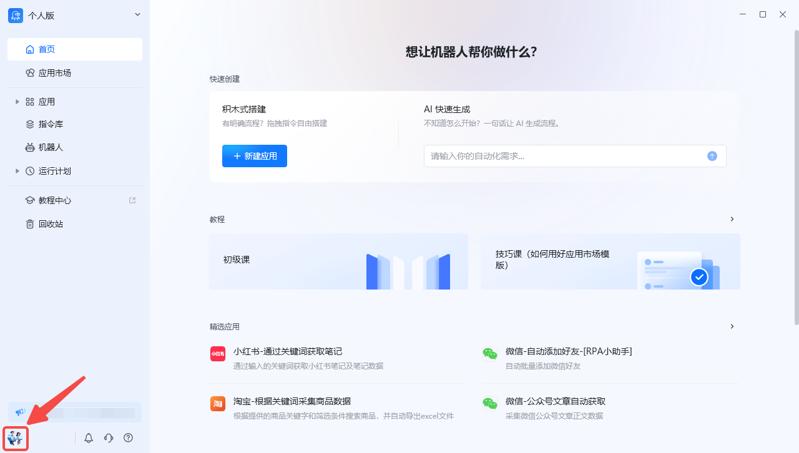

②点击工具

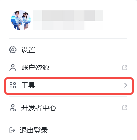

③点击“浏览器扩展程序”，选择AdsPower浏览器自动化

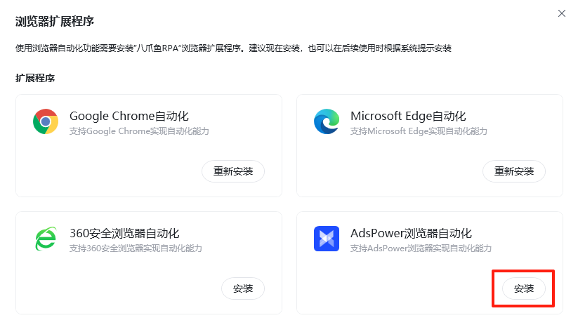

</td>
<td>

①在应用编辑界面，点击图标

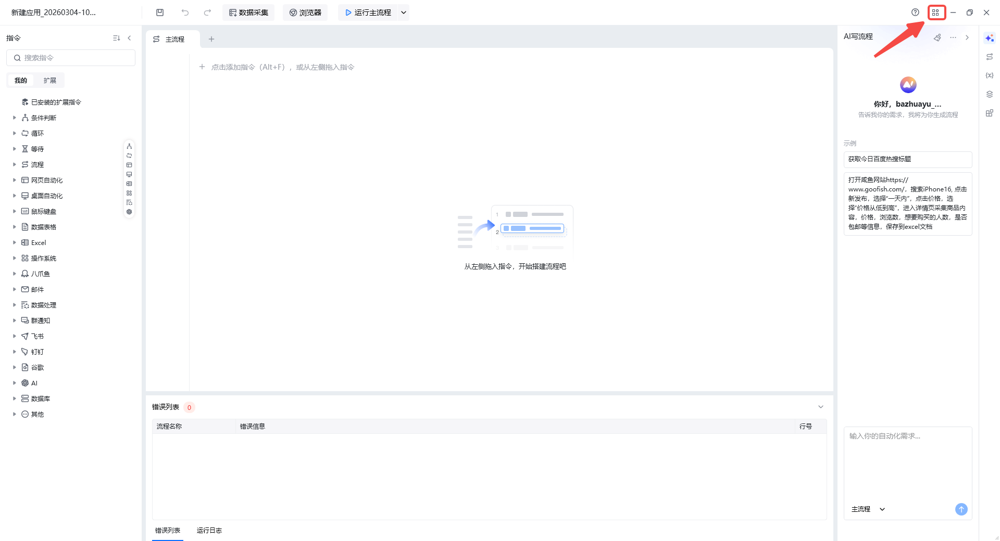

②点击“浏览器扩展程序”，选择AdsPower浏览器自动化

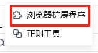

</td>
</tr>
</tbody>
</table>

**3、** 插件安装完成后，打开 AdsPower浏览器输入  chrome://extensions  进入到扩展程序页面，并确保【开发者模式】、【八爪鱼 RPA 插件】都处于打开的状态<strong> 注：</strong>开启开发者模式后，可能需要先退出浏览器再重启浏览器才能生效

## 方式二：手动安装

**1、[点击此处](https://update.bazhuayu.com/rpa/OctopusRPA.crx)** 下载   OctopusRPA . crx  文件，** 2、** 启动一个 AdsPower 浏览器环境，在浏览器中输入  chrome://extensions  进入到扩展程序页面，开启开发者模式<strong> 注：</strong>开启开发者模式后，可能需要先退出浏览器再重启浏览器才能生效

--->拖动插件到扩展程序页面来安装

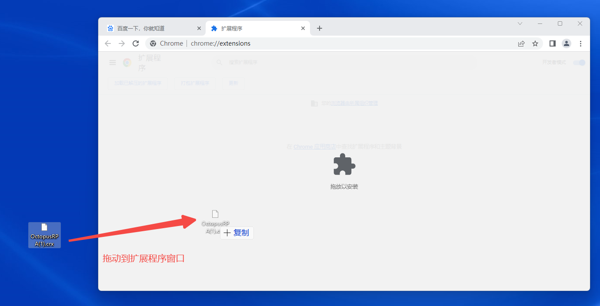

**3、** 弹出安装提示页面，点击 【添加扩展程序】 按钮即可完成安装

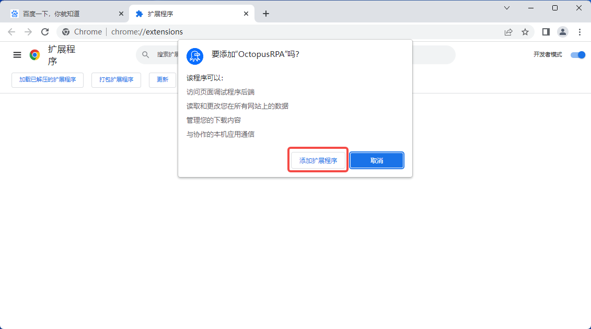

**4、** 不需要开启后续弹窗中的同步功能，直接关闭即可；

**5、** 如手动安装失败，请退出浏览器后，再尝试一次上方的"方式一自动安装"

## 注意事项

<strong>1、</strong>需要在 AdsPower 客户端的个人设置中，打开**使用UI自动化工具**，才能正常运行八爪鱼RPA。

--->点击头像，选择”个人设置“

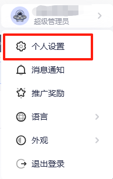

--->点击标签页”本地设置“，窗口位置选中”以屏幕最大化“的方式打开，打开”**使用UI自动化工具**“

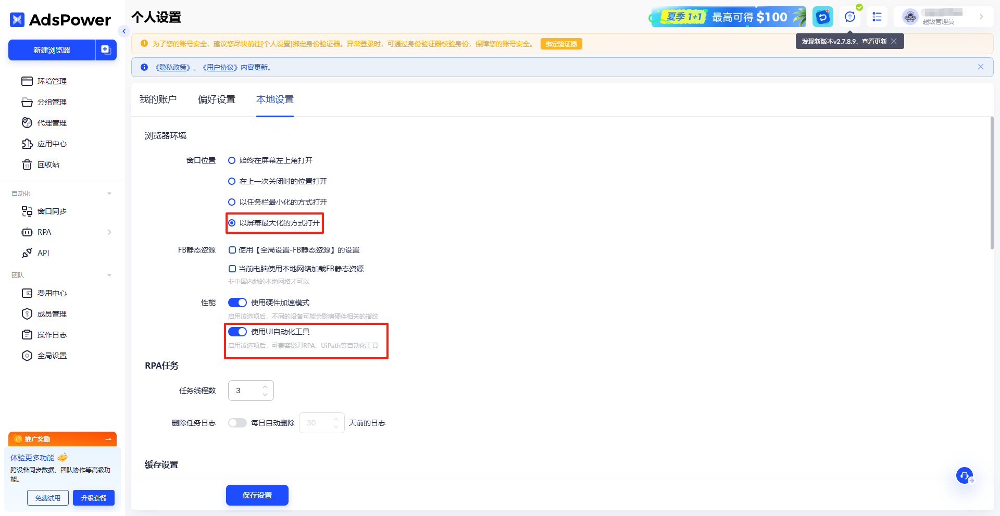

<strong>2、</strong>电脑内开启了其他的代理IP有可能会导致AdsPower操作失败，建议使用 AdsPower 浏览器里的代理IP

## 特殊情况说明

如遇到插件被浏览器阻止安装或报警告导致不能安装，请参考该教程解决问题。[https://rpa.bazhuayu.com/helpcenter/features/personal-center/auto-plugin/uTSGTC](https://rpa.bazhuayu.com/helpcenter/features/personal-center/auto-plugin/uTSGTC)
