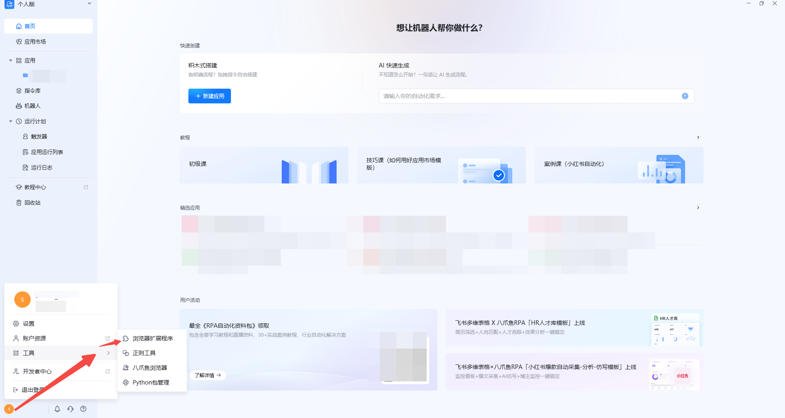
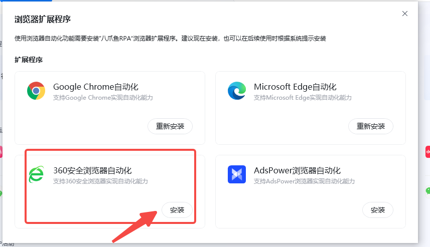
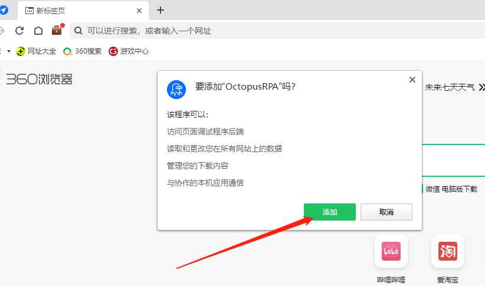
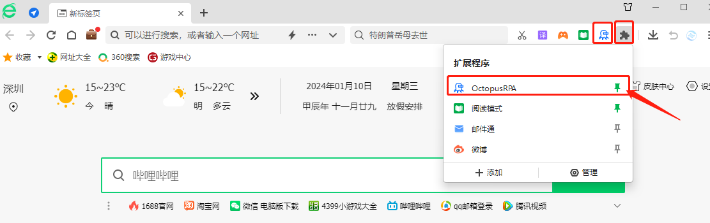
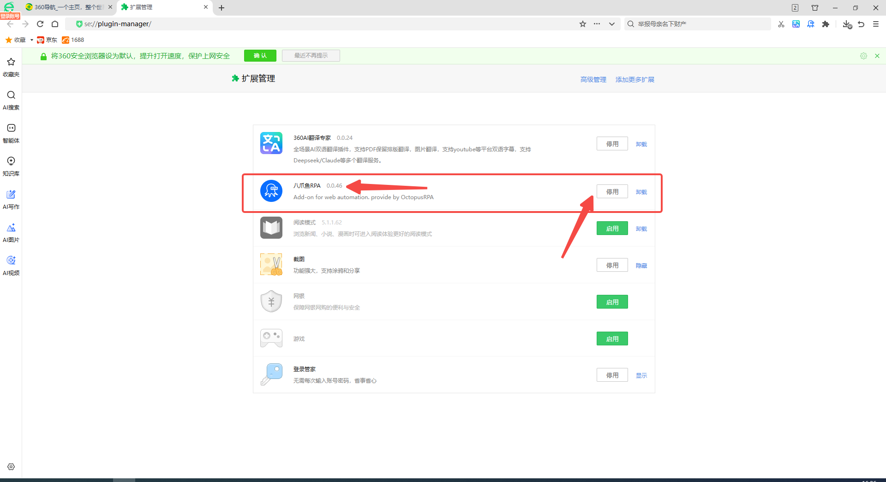

360浏览器安装插件说明

说明：调用本地电脑的360浏览器需要先安装插件，并且保证此插件处于开启状态。如未安装，请按照以下提示进行安装：

## 自动安装方式

**1、** 退出 360 浏览器；** 2、** 在RPA软件中点击左下角的头像图标，选择【工具】，再点击【自动化插件】，选择360浏览器自动化，点击安装插件，等待安装。（如下图）；

**3、** 在360浏览器中弹窗提醒【要添加“OctopusRPA”吗？】  点击【添加】。

插件安装完成后，可在此查看是否安装成功。

点击【管理】可以查看当前所有的插件。（或通过网址直接进入：se://plugin-manager/）

