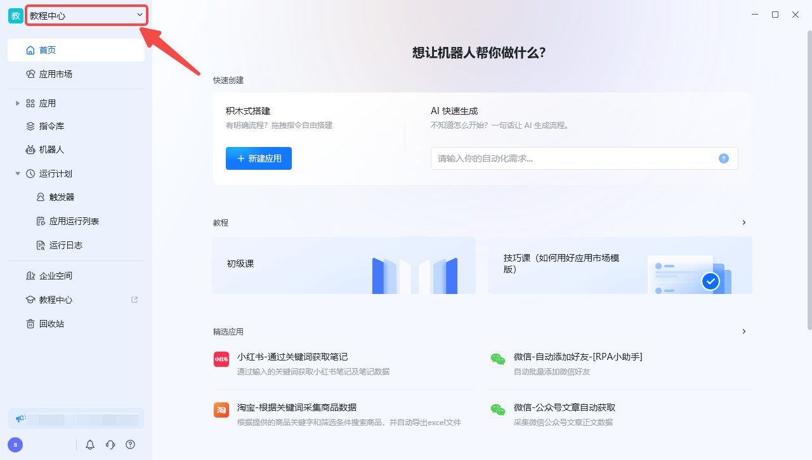
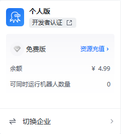
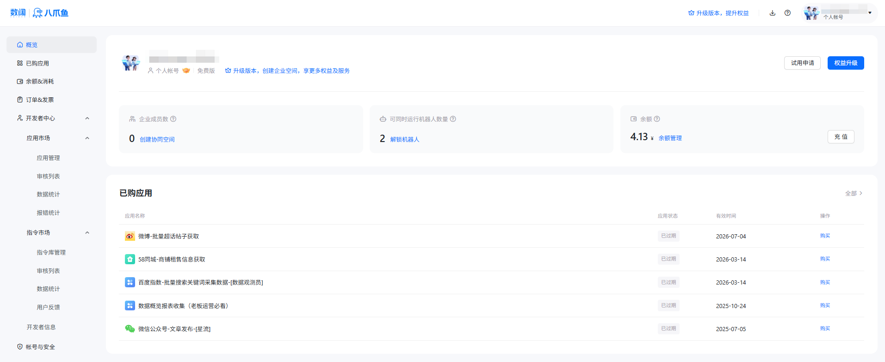

## 功能概述

开发者中心面向通过「开发者认证」的用户，提供已发布应用的管理、数据查看与开发者相关配置。认证为开发者后，可将自建应用发布到应用市场，供他人获取使用。

## 入口

在八爪鱼RPA 客户端左下角点击 **头像** → **账户资源** → **开发者中心** 即可进入（需先完成开发者认证）。

## 主要功能

| 功能 | 说明 |
| --- | --- |
| 开发者认证 | 申请成为八爪鱼RPA 开发者，获得发布应用到市场的权限 |
| 已发布应用 | 查看与管理已上架的应用，包括版本、运行数据等 |
| 应用数据 | 查看应用的获取量、运行次数等统计信息 |

<Info>
  如想要获取开发者证书，可前往学院进行考核，学院链接：[https://rpa.bazhuayu.com/college](https://rpa.bazhuayu.com/college)。
</Info>

## 版本切换与开发者认证

点击当前版本标志（左上角）即可切换版本。

如果当前账号未申请「开发者身份」，可点击「开发者认证」跳转至认证界面（是否认证不影响软件的使用）。

个人版和企业版中均可查看当前账户余额和可同时运行[机器人](/features/enterprise/bot)数量，企业版中还可查看当前企业空间最大容纳成员数和使用情况。

## 账户资源

包含已购应用、余额&消耗、订单&发票、开发者中心（获得开发者认证才有）、账号与安全。

## 使用流程

1. 在客户端左上角点击当前版本标志，选择「开发者认证」提交申请。
2. 认证通过后，进入「开发者中心」。
3. 将调试完成的应用发布到应用市场。
4. 在开发者中心查看应用数据，持续优化迭代。

<Info>
  是否进行开发者认证不影响客户端的正常使用；只有需要发布应用到市场时才需完成认证。
</Info>

<Info>
  使用过程中遇到问题？前往 [八爪鱼RPA 开发者社区问答板块](https://rpa.bazhuayu.com/community/questions) 提问，获取官方与社区帮助。
</Info>
