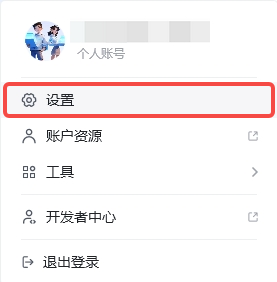
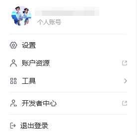
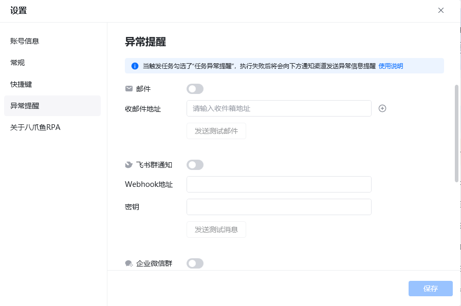
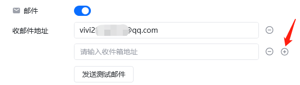
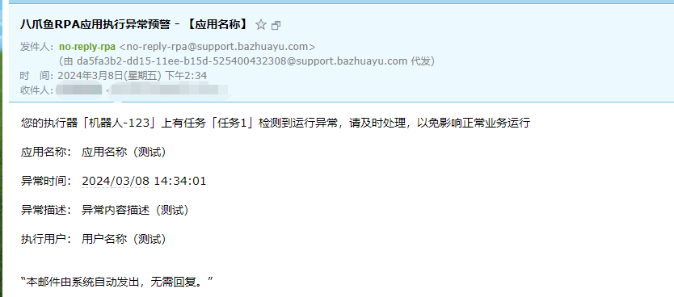
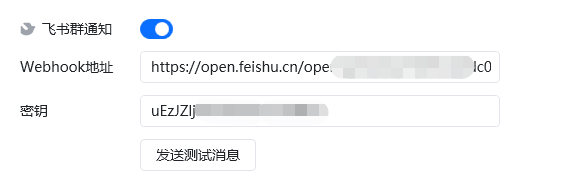
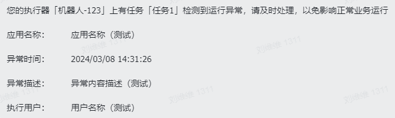
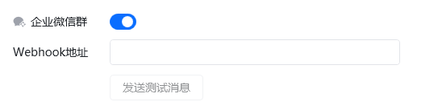
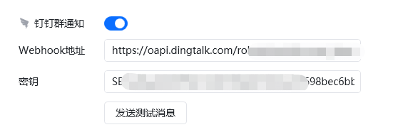
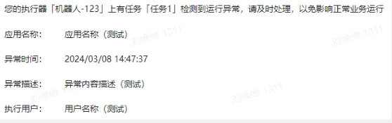

## 功能概述

设置模块用于管理当前账号的基本信息、客户端常规行为、快捷键与异常提醒通知渠道，帮助用户根据个人习惯配置八爪鱼RPA 客户端。

## 入口

在八爪鱼RPA 客户端左下角点击 **头像** → **设置** 即可进入。

## 主要功能

| 设置项 | 说明 |
| --- | --- |
| 账号信息 | 修改用户名、绑定手机号、邮箱、微信号及密码 |
| 常规 | 开机自启、屏幕设置（防止休眠导致触发器启动失败）、关闭主界面行为 |
| 快捷键 | 查看与自定义常用快捷键，需避免与其他软件热键冲突 |
| 异常提醒 | 任务异常时通过邮件、飞书群、企业微信群、钉钉群发送提醒 |
| 日志管理 | 每天凌晨 2:00 定期删除超期日志，可设置 3 / 7 / 14 / 30 天前 |
| 关于八爪鱼RPA | 查看版本号、系统环境要求、安装目录等基本信息；可开启抢先体验版 |

## 个人中心界面

点击头像标志（左下角）即可打开个人中心菜单。

可查看**设置**、**账户资源、工具**及**退出登录**。如果您是开发者，还可进入**开发者中心**查看自己发布应用的相关信息。

## 设置项说明

### 账号信息

可修改账号用户名、绑定的手机号、邮箱、绑定的微信号，以及修改密码。建议用户均设置一个密码，以防遇到接收不到手机验证码的时候，能正常登录。

### 常规

包含是否开机自启、屏幕设置（可防止因屏幕休眠而导致触发器启动失败）、关闭主界面。

### 快捷键

默认快捷键设置，可自行调整。注：需避免与别的热键冲突。

### 异常提醒

<strong>描述：</strong>当触发任务勾选了“任务异常提醒”，执行失败后将会按您配置的通知渠道发送异常信息提醒。触发任务，需在触发器中设置。通知渠道支持邮件、飞书群通知、企业微信群、钉钉群通知。

#### 邮件

添加接收异常信息的邮件地址，如需多个邮箱点击 + 号，添加多个输入框，每个输入框填写一个邮箱。

如果未收到邮件，注意检查下是否被邮箱拦截或在垃圾箱中。

异常提醒的消息样式：

#### 飞书群通知

填写飞书群的 Webhook 地址，飞书机器人的网络地址。飞书机器人设置可查看教程：[微信、飞书、钉钉群通知模块的使用](https://rpa.bazhuayu.com/helpcenter/docs/XZBe1j) 此处用的信息和【飞书群通知】指令中使用到的是一模一样的。

在飞书机器人安全设置中勾选签名校验后会有一个密钥，此处填写该密钥。不勾选签名校验，此处可为空。

异常提醒的消息样式：

#### 企业微信群

填写企业微信群的 Webhook 地址，企业微信机器人的网络地址。企业微信机器人设置可查看教程：[微信、飞书、钉钉群通知模块的使用](https://rpa.bazhuayu.com/helpcenter/docs/XZBe1j) 此处用的信息和【企业微信群通知】指令中使用到的是一模一样的。

#### 钉钉群通知

填写钉钉微信群的 Webhook 地址，钉钉机器人的网络地址。钉钉机器人设置可查看教程：[微信、飞书、钉钉群通知模块的使用](https://rpa.bazhuayu.com/helpcenter/docs/XZBe1j) 此处用的信息和【钉钉微信群通知】指令中使用到的是一模一样的。

异常提醒的消息样式：

### 日志管理

每天凌晨 2:00 定期删除超期日志，可设置 3 天前、7 天前、14 天前、30 天前。

### 关于八爪鱼RPA

记录版本号、系统环境要求、安装目录等基本信息。（打开「获取抢先体验版」后可获得内测权限）

导出诊断日志中包含业务日志、系统日志及设备基本信息，仅用于协助定位报错问题。如遇到软件异常弹窗，可将诊断日志发送至[开发者社区](https://rpa.bazhuayu.com/community/questions)，供官方人员定位问题。

## 使用流程

1. 点击客户端左下角头像，选择「设置」。
2. 在「账号信息」中维护联系方式与密码安全。
3. 在「常规」中配置开机自启与屏幕保持唤醒。
4. 在「异常提醒」中绑定通知渠道，确保任务失败时能及时收到告警。

<Info>
  使用过程中遇到问题？前往 [八爪鱼RPA 开发者社区问答板块](https://rpa.bazhuayu.com/community/questions) 提问，获取官方与社区帮助。
</Info>
