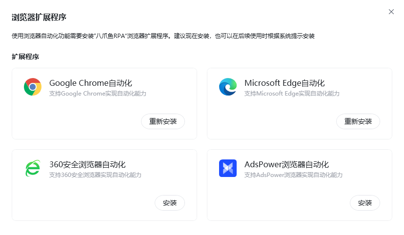
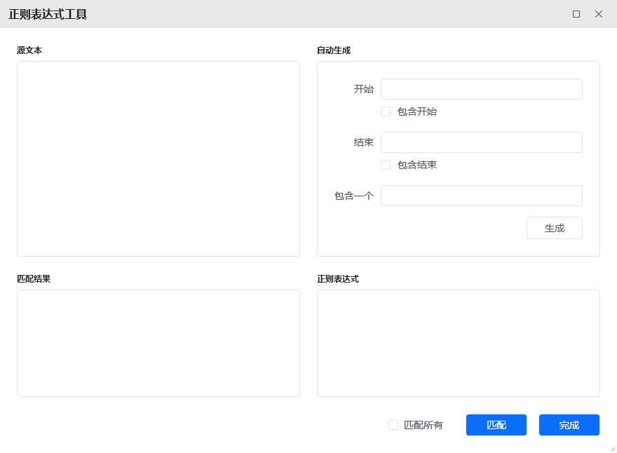
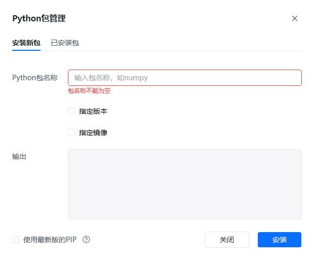

## 功能概述

工具模块汇集了八爪鱼RPA 提供的多种辅助开发工具，包括浏览器扩展程序、正则工具、八爪鱼浏览器与 Python 包管理，帮助用户在不同场景下更高效地完成自动化开发与调试。

## 入口

在八爪鱼RPA 客户端左下角点击 **头像** → **工具** 即可进入。

## 主要工具

| 工具 | 说明 |
| --- | --- |
| 浏览器扩展程序 | 一键安装自动化插件，支持 Chrome、Edge、360 安全浏览器、Ads Power 浏览器 |
| 正则工具 | 测试、调试和应用正则表达式，可根据起止条件自动生成表达式 |
| 八爪鱼浏览器 | 启动八爪鱼内置浏览器，便于捕获元素与静默运行 |
| Python 包管理 | 可视化安装、删除、升级 Python 包，供【执行 Python 代码】指令使用 |

## 工具说明

### 浏览器扩展程序

一键自动安装插件，支持 Google 浏览器、Edge 浏览器、360 安全浏览器、Ads Power 浏览器。

### 正则工具

一种文本模式匹配工具，用于测试、调试和直接应用正则表达式。

### 八爪鱼浏览器

启动八爪鱼浏览器，即内置浏览器，支持静默运行。

### Python 包管理

用于管理 Python 包，可视化安装、删除、升级 Python 包。

## 使用流程

1. 进入「工具」模块，查看当前可用的辅助工具。
2. 如需使用 Chrome/Edge 自动化，先安装「浏览器扩展程序」。
3. 如需处理文本匹配，打开「正则工具」测试表达式。
4. 如需管理 Python 依赖，使用「Python 包管理」进行安装或升级。

<Info>
  使用过程中遇到问题？前往 [八爪鱼RPA 开发者社区问答板块](https://rpa.bazhuayu.com/community/questions) 提问，获取官方与社区帮助。
</Info>
