> 使用八爪鱼 RPA 去模拟人工操作网页，例如元素的点击、搜索框的文字输入、网页的滚动以及表格化数据的抓取，达到替代人工自动化操作的效果

## 1、应用说明

抓取深交所网站上市公司”永顺泰“的上市公告

## 2、应用实现逻辑

打开"深交所"网站 （网站链接：https://www.szse.cn/index/index.html）

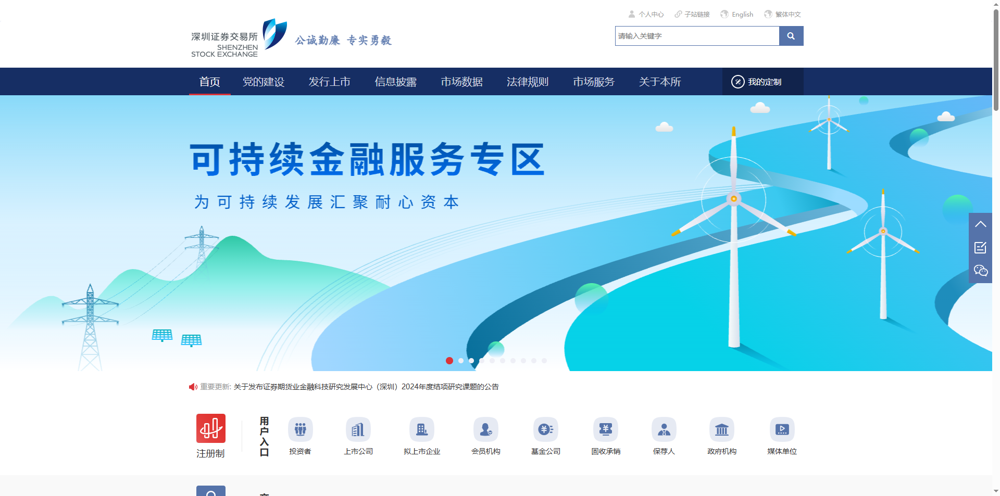

鼠标悬停，信息披露

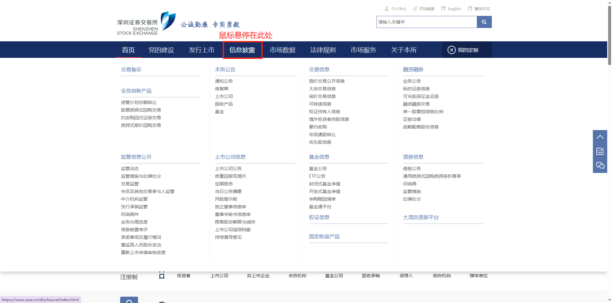

点击”上市公司“

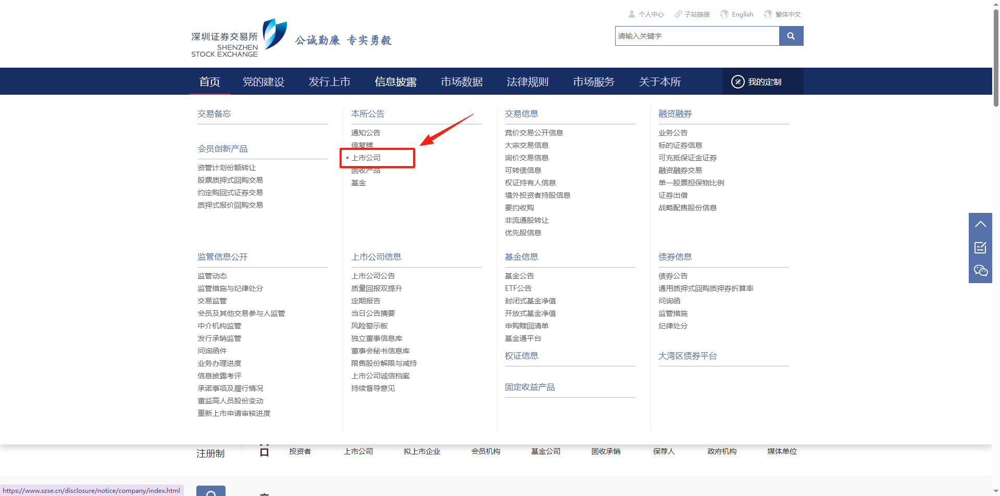

填写输入框

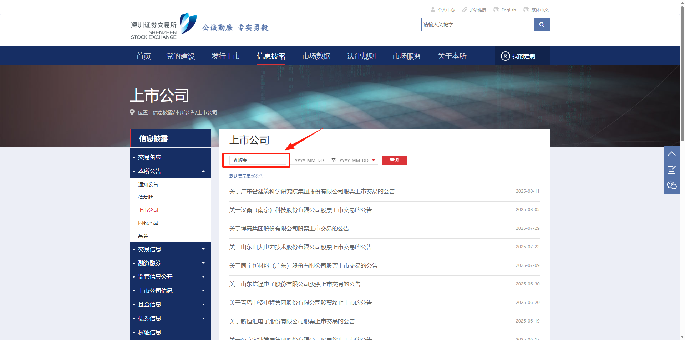

点击"查询"

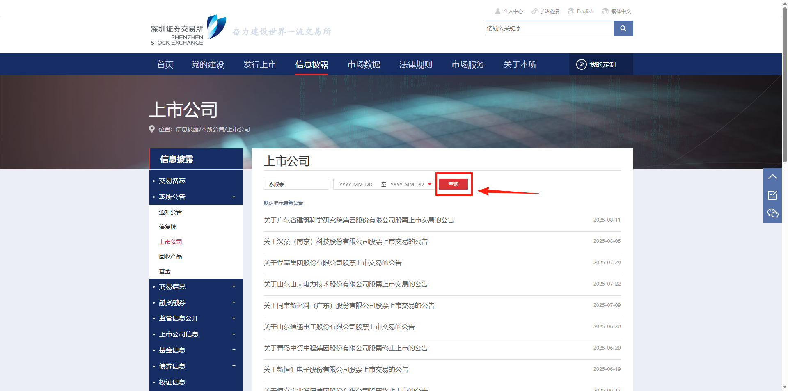

点击”公告“

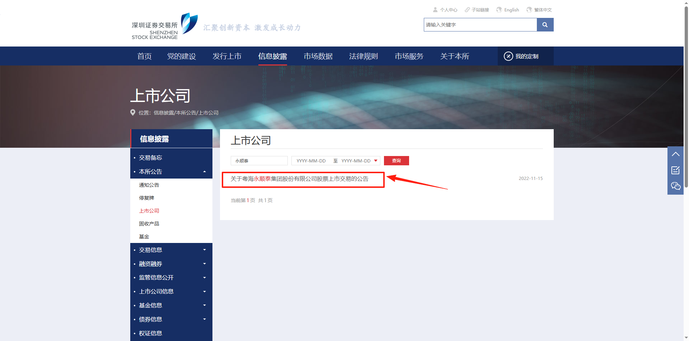

获取公告内容

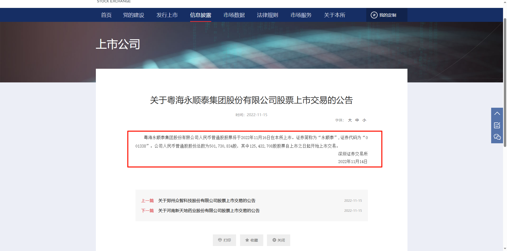

## 3、应用实现

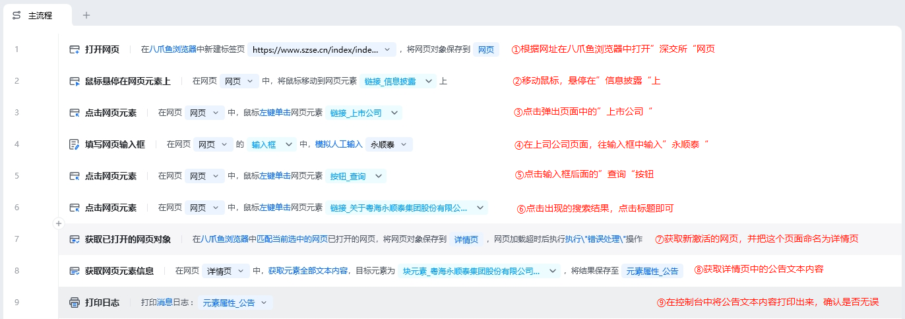

### 流程指令解析

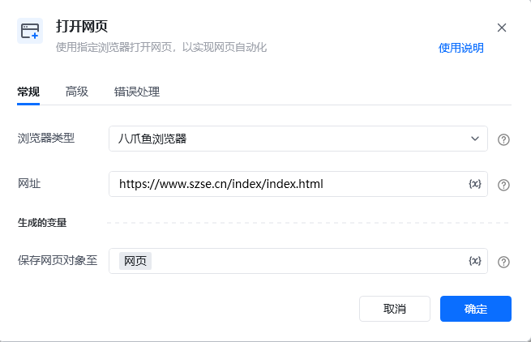

按照习惯选择常用的浏览器类型，可选八爪鱼浏览器、谷歌浏览器、Edge浏览器等，网址则填写”深交所“的网址(https://www.szse.cn/index/index.html)，最后将此网页对象命名为网页。

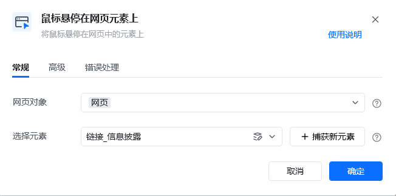

把鼠标悬停在”信息披露“按钮上，等待悬浮页面出现

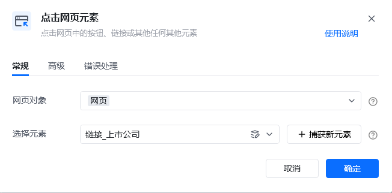

点击悬浮页面中的”上市公司“，跳转到新页面

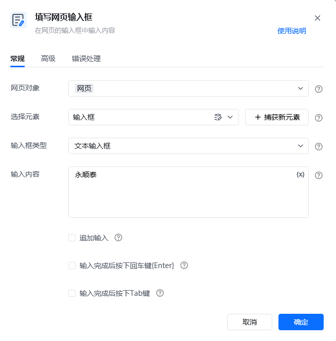

在新页面输入框元素中输入”永顺泰“

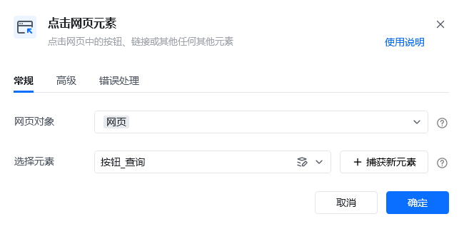

点击输入框后方的”查询“按钮，等待查询结果加载

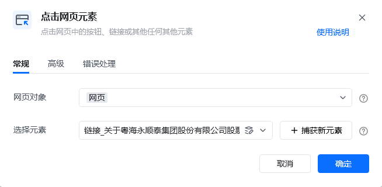

点击查询结果列表页中第一行的标题链接

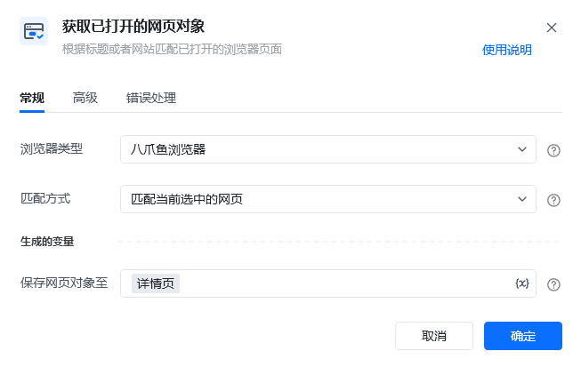

未避免元素查找失败，打开新页面后，先获取当前页面对象，并命名为”详情页“

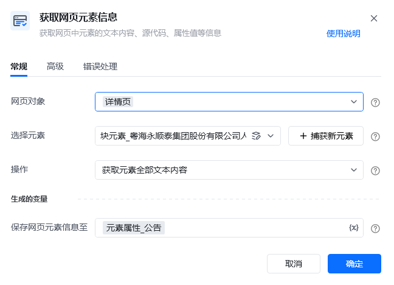

首先捕获包含”公告正文内容“的元素，操作选择”获取元素全部文本内容“

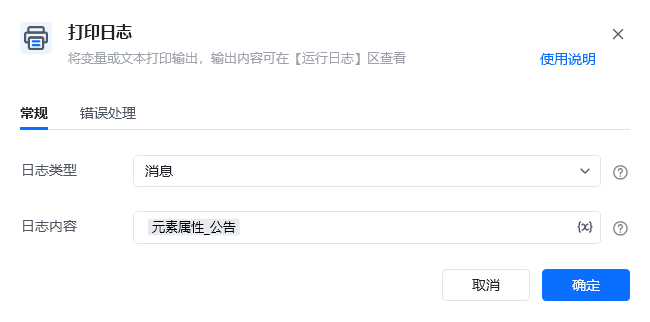

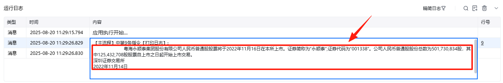

将获取到的正文结果打印在控制台
