> 一个完整的 RPA 应用是由各种不同的指令按照一定的逻辑拼凑而成的

## 1. 基本介绍

每一个指令都代表着不同的功能，也代表着我们人工模拟操作的步骤。比如【点击网页元素对象】指令，就代表着我们人工使用鼠标去点击网页一次。从网页获取数据，我们一般需要对这个数据做二次加工，所以就会用到数据处理相关的指令去操作数据。由此可见，多个指令按照顺序才能合成完整的自动化应用。

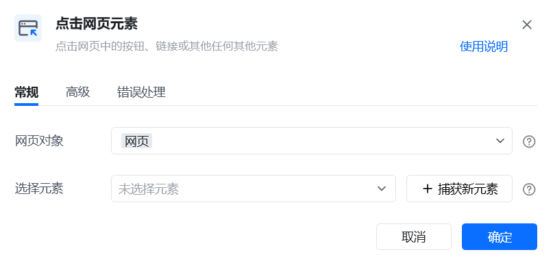

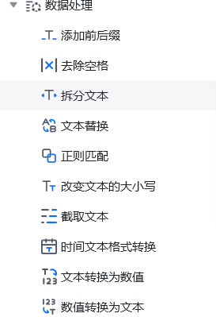

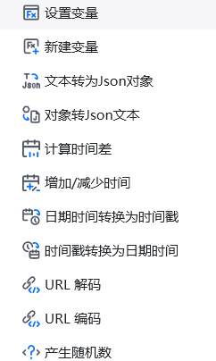

## 2. 常用指令组（部分）

- 2.1 条件判断组指令

主要是针对逻辑的判断，数据的对比，判断需要两个值来进行比较，例如判断日期是否一样判断数据是否正确等来决定判断分支的流程走向。

- 2.2 循环组指令

主要是针对一些重复性操作的处理，例如循环点击网页数据、循环读取写入等Excel 的操作。

- 2.3 等待组指令

主要是满足流程稳定性的要求，通过等待延时来等待流程运行、等待网页加载、等待网页内容等指令。

- 2.4 流程组指令

主要是调用子流程，保证各个流程之间的连通。

- 2.5 网页自动化组指令

主要是针对网页，用来实现对浏览器的自动化操作，例如网页点击、输入框操作、下载文件等。网页操作第一步需要用到打开网页指令，打开之后才能进行网页的操作。

- 2.6 数据表格组指令

主要是针对 Excel 表格的处理，例如数据读取、数据写入、筛选数据的逻辑处理等。操作数据表前需要先导入本地 Excel 或者自己构建Excel表才能进行数据表的操作。

- 2.7 系统组指令

主要是针对电脑系统的一些操作，例如文件名称获取、列表获取、读取文件、写入文件、删除文件、复制文件、移动文件等操作。也可以调用系统方法，比如系统时间等。

- 2.8 邮件组指令

主要是针对邮件的操作，例如发送邮件、发送附件等。对于邮箱的操作，首先需要登录邮箱，之后才能进行邮箱的发送、移动、删除、回复等操作。

- 2.9 数据处理组指令

主要针对变量进行去空格、添加前后缀、类型转换、变量赋值、字符串截取等操作。

- 2.10 其他组指令

主要是消息日志的输出功能

## 3. 指令举例

3.1 【打开网页】指令

接下来我们通过网页自动化中的【打开网页】指令来了解。如果不知道指令属于哪一个组之间，可以在指令的搜索框中（或直接在编辑区点击添加指令）输入“打开网页”。然后再将该指令拖拽到工作区，在参数“网址”中输入需要打开的网站的URL，在“生成的变量”处给该网页对象命名。

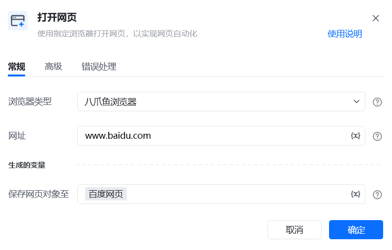

设置完成后，我们可以运行看一下效果，运行之后电脑会自动打开百度的网站。如果因为网速或者其他原因导致浏览器或者元素加载不出来，加载失败，超过我们设置的加载超时时间，就会执行加载超时后执行的操作，加载超时后的操作有“执行错误处理”和停止加载两种。而错误处理又分为“终止流程”、“重试此指令”和“忽略异常并继续执行”。

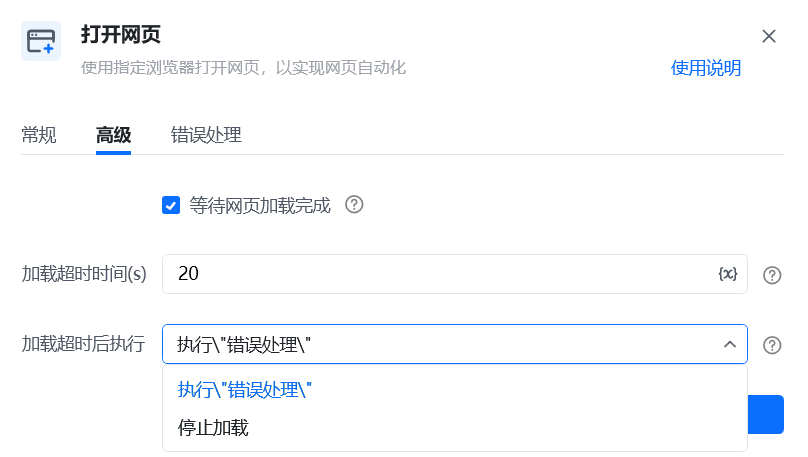

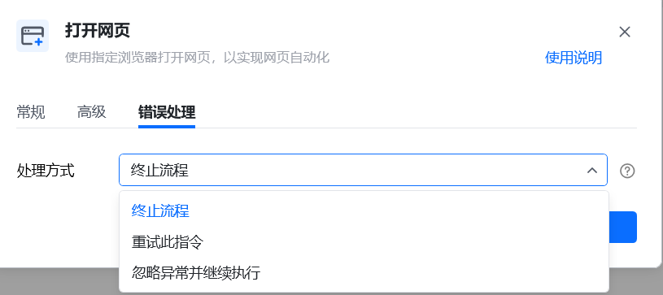

终止流程，可以直接停止流程运行。重试此指令可以设置重试次数和重试间隔时间。忽略异常并继续执行，需要设置异常情况下指令的输出值。

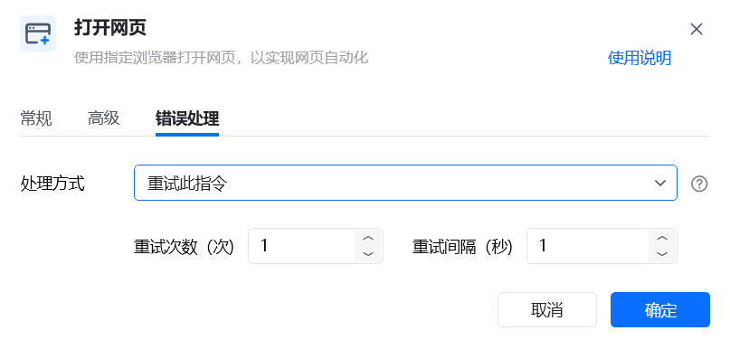

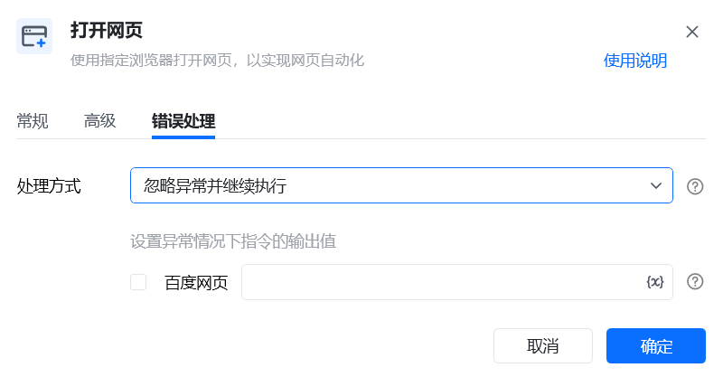

比如我们获取一个网页上不存在的元素来测试一下。在流程编辑区添加【点击网页元素】指令，在“选择元素”处点击“捕获新元素”，在任意一个非百度的网页上选中一个元素，按下ctrl+鼠标左键。

设置完成后，运行应用。现在逻辑是进入“百度网站”，点击我们刚才在非百度网站中捕获的元素，必然是会失败的。接下来我们进入“错误处理”页面，将处理方式设置为终止流程。

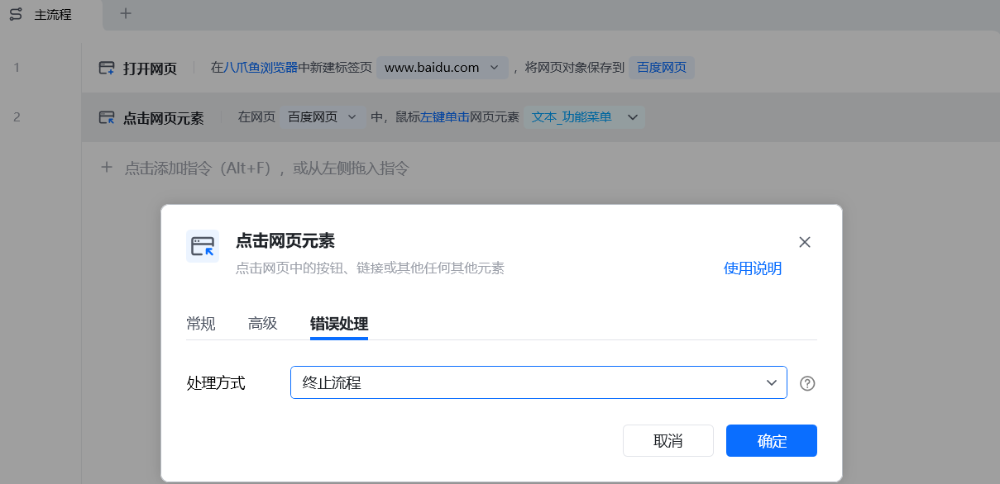

接下来点击”运行主流程“，这时候八爪鱼RPA会自动打开百度网站，然后去查找”非百度网页上捕获的元素“。20 秒之后就会超过预设超时时间，结果是结束流程并返回错误的信息。

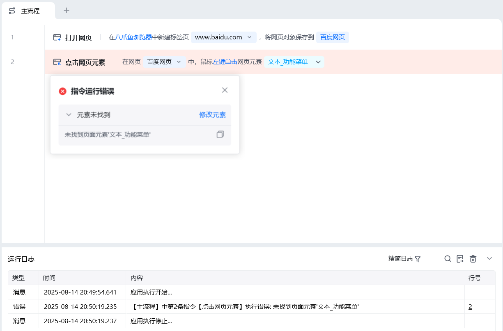

接下来我们再次更改设置，将错误处理更改为”忽略异常并继续执行“。同时我们在【点击网页元素】指令的下方再增加一个【显示消息通知】指令，在”消息窗口内容“中输入”运行结束“。该设置下即使点击网页元素失败，也会进入到下一个步骤。

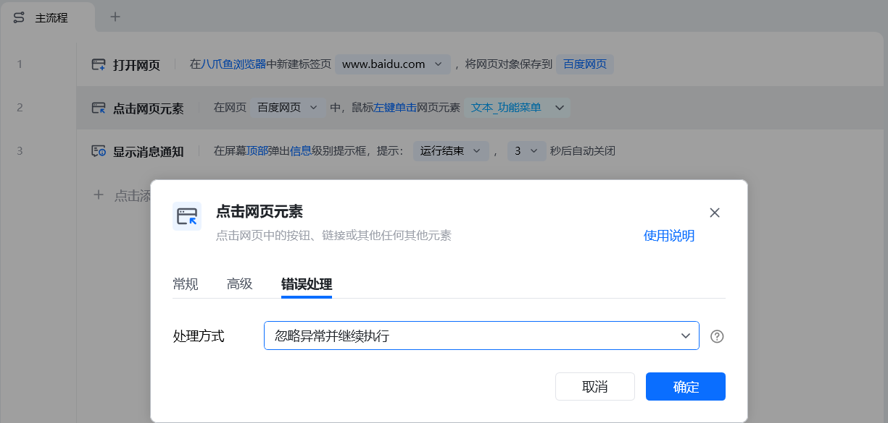

接下来点击”运行主流程“，电脑会打开百度网站，然后去然后去查找”非百度网页上捕获的元素“。 20 秒之后就会超过预设超时时间，结果是弹出消息框，运行结束。

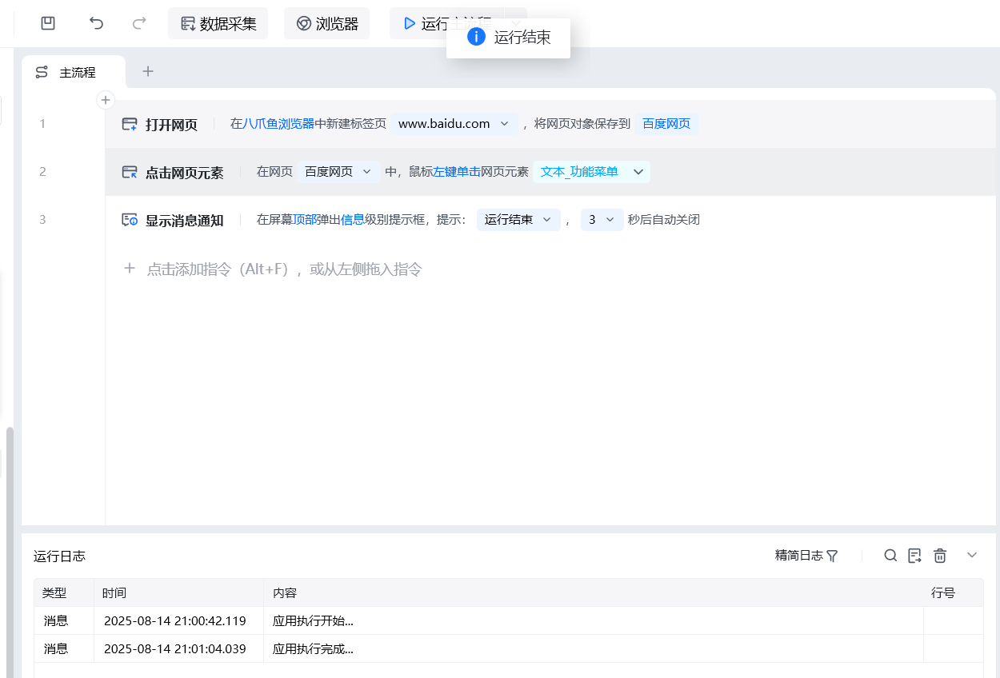

最后一种情况”重试此指令“同理，会按照我们预设的方式去重复尝试点击。

3.2 【关闭网页】指令

网页自动化中的【关闭网页】指令，可用于关闭指定的网页，或者关闭所有指令浏览器上所有打开的网页。

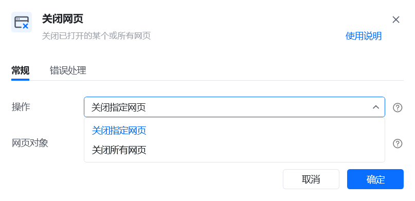
