> 八爪鱼 RPA 软件分为主页、应用管理界面、个人中心界面、应用开发界面

## 1. 首页

登录后会进入主页，主页包含左侧导航栏、右侧上方AI写流程、右侧中部教程和精选应用、右侧下方用户活动通知

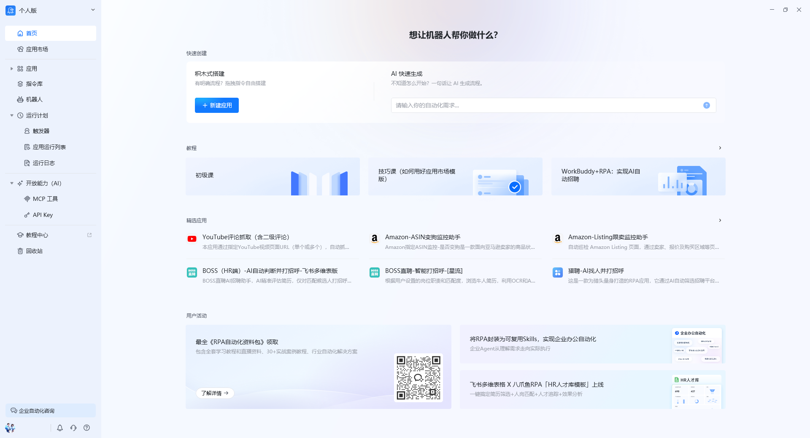

## 2. 应用管理界面

在【应用】列表中可以查看与管理所有的应用，具有相同特质的应用可以移动至同一个分组中，如亚马逊相关应用。

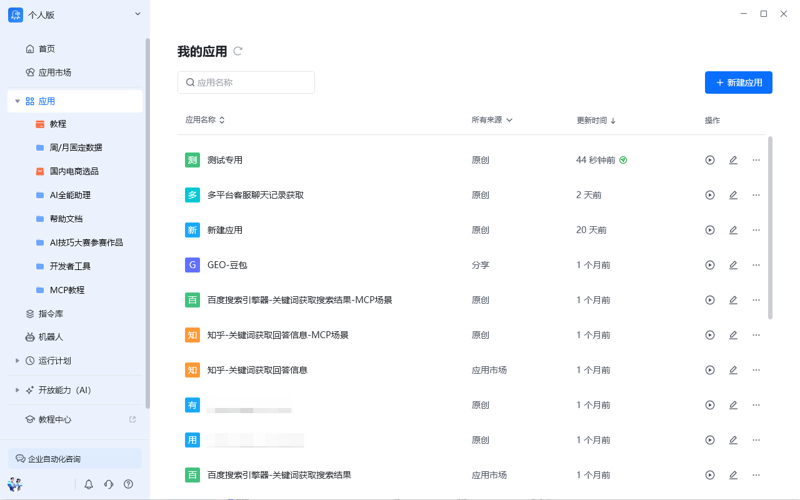

### 2.1 新建或编辑应用

点击“新建应用”按钮，即可新建一个应用流程并进入流程搭建界面；

点击已有应用的编辑按钮，或双击应用，即可进入该应用的开发界面

### 2.2 运行现有应用

点击当前应用的运行按钮，即可启动当前应用。如果开发者设定了输入参数，需要填写完必填参数后应用才会进入运行状态

### 2.3 分享应用

点击当前应用的分享按钮，即可分享当前应用

①普通用户：可通过链接分享/账号分享的方式将应用分享给他人（无法分享给企业账号），仅分享，无分享时长/运行、编辑权限等控制权限

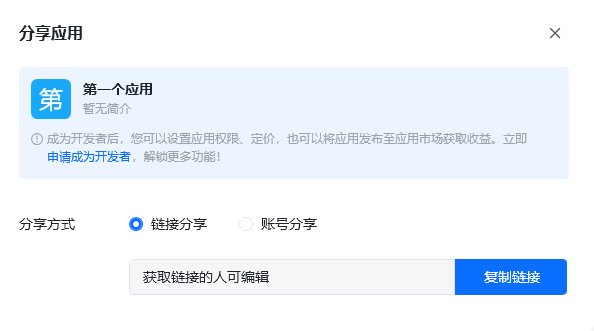

②开发者：应用发版后，可通过链接分享/账号分享的方式将应用分享给他人（可分享给企业账号）

- 权限设置
  - 可使用：接收者可运行此应用，并收到应用版本更新提醒
  - 可编辑：接收者可以运行和编辑此应用，并收到应用版本更新提醒
  - 分享副本：接收者将获得流程的独立副本，可编辑或分享给其他人

- 设置可用时长 永久/x月/x日（若“权限设置”选择分享副本，则无此设置）

- 分享方式
  - 链接分享：获取链接的人即可获得当前应用（链接不会失效，即可用时长设置7天不等同于于7天后链接会失效）
  - 账号分享：将当前应用分享到指定个人用户应用列表下或企业空间内（分享给企业用户需要用[协作码](https://bazhuayu-rpa-docs.mintlify.site/features/enterprise/join-by-invite)）

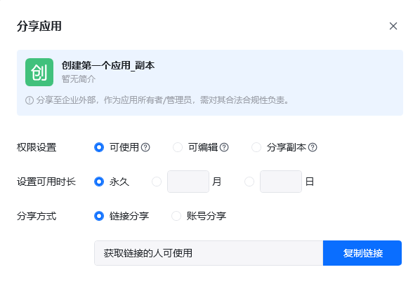

开发者社区：[了解开发者社区](https://rpa.bazhuayu.com/community/questions)

## 3. 版本切换界面&开发者认证

点击当前版本标志（左上角）

如果当前账号未申请“开发者身份”，可点击“开发者认证”跳转至认证界面（是否认证不影响软件的使用）。

个人版和企业版中均可可查看当前账户余额和可同时运行[机器人](https://rpa.bazhuayu.com/helpcenter/docs/TwEcUb)数量，企业版中还可查看当前企业空间最大容纳成员数和使用情况。

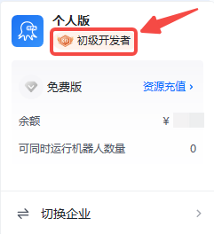 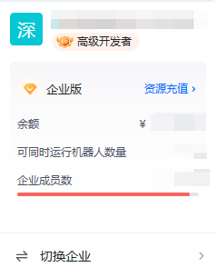

## 4. 个人中心界面

---&gt;点击头像标志（左下角）

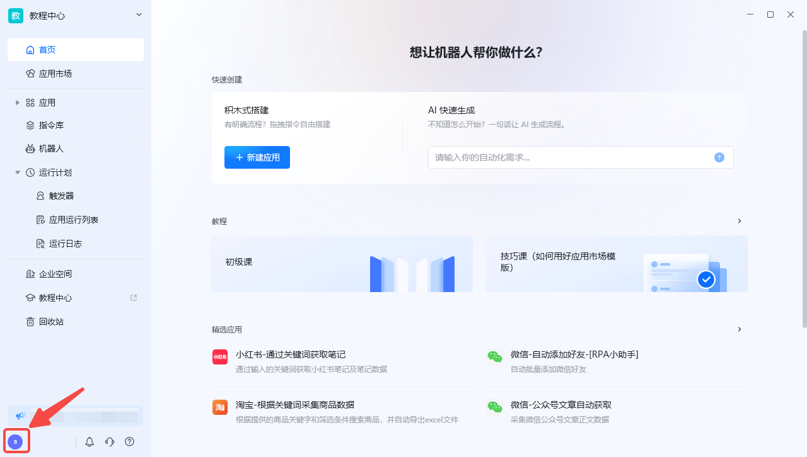

---&gt;可查看**设置**、**账户资源、工具**及**退出登录。**如果您是开发者，还可进入**开发者中心**查看自己发布应用的相关信息。

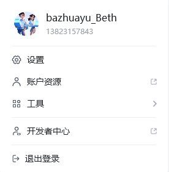

### 4.1 设置

账号信息：可修改账号用户、绑定的手机号、邮箱、绑定的微信号，以及修改密码。

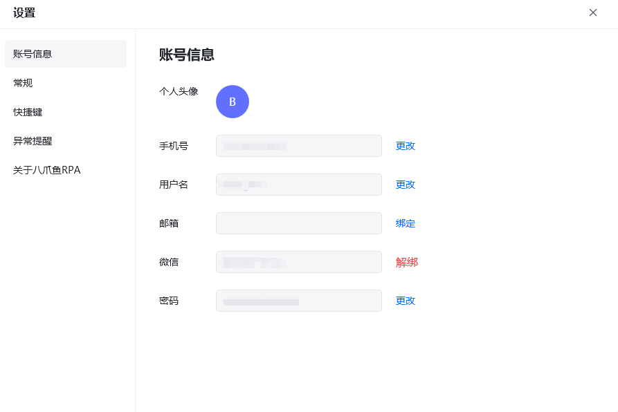

常规：包含是否开机自启、屏幕设置（可防止因屏幕休眠而导致触发器启动失败）、关闭主界面

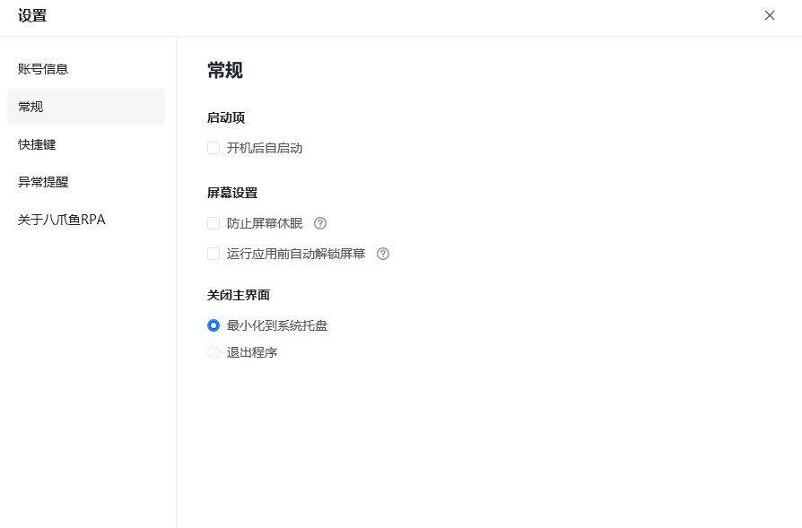

快捷键：默认快捷键设置，可自行调整。注：需避免与别的热键冲突

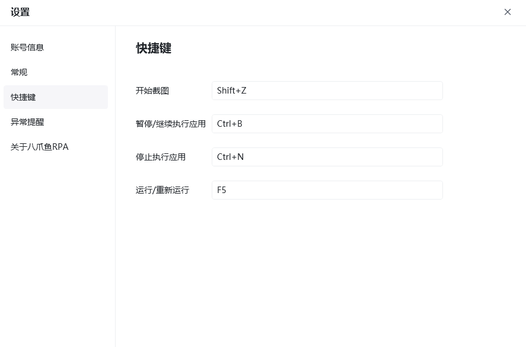

异常提醒：触发任务异常时可向指定通知渠道发送信息提醒，通知渠道包含邮件、飞书群通知、企业微信群、钉钉群

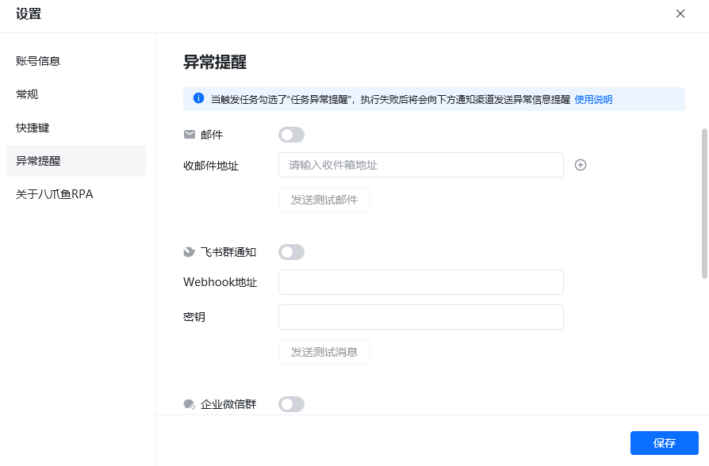

关于八爪鱼RPA：记录版本号、系统环境要求、安装目录等基本信息。（打开”获取抢先体验版“后可获得内测权限）

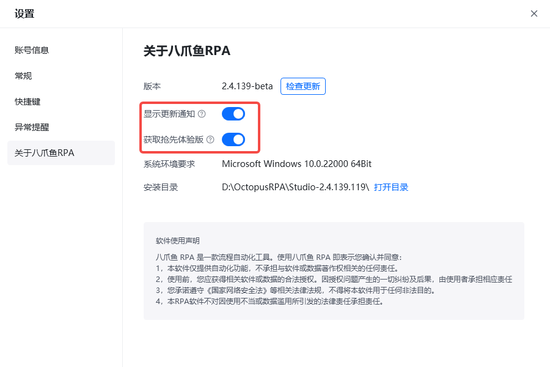

### 4.2 账户资源

包含已购应用、余额&消耗、订单&发票、开发者中心（获得开发者认证才有）、账号与安全

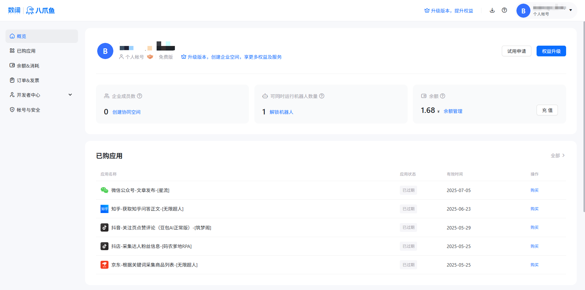

### 4.3 工具

包含浏览器拓展程序、正则工具、八爪鱼浏览器、Python包管理

浏览器拓展程序：一键自动插件，支持Google浏览器、Edge浏览器、360安全浏览器、Ads Power浏览器

正则工具：一种文本模式匹配工具，用于测试、调试和直接应用正则表达式

八爪鱼浏览器：启动八爪鱼浏览器

Python包管理：用于管理Python包，可视化安装、删除、升级Python包

## 5. 应用编辑**(流程设计)**界面

### 顶部导航栏

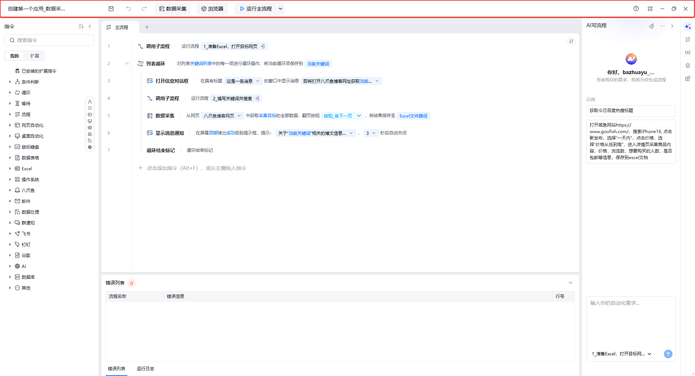

- 应用详情：应用名称、应用简介和使用说明设置

- 保存：保存应用至本地（默认路径）

- 后退/前进：回到上一步/下一步

- 数据采集：快速使用【数据采集】指令

- 浏览器：八爪鱼RPA内置浏览器，支持静默运行，不影响用户其他设备正常操作

- 运行主流程/运行当前流程：运行主流程或某子流程

- 帮助中心：[八爪鱼RPA帮助中心](https://rpa.bazhuayu.com/helpcenter/)跳转按钮

- 工具箱：浏览器拓展插件和正则工具

### 指令栏

快捷跳转：条件判断、循环、网页自动化、桌面自动化、Excel、操作系统、数据处理、AI

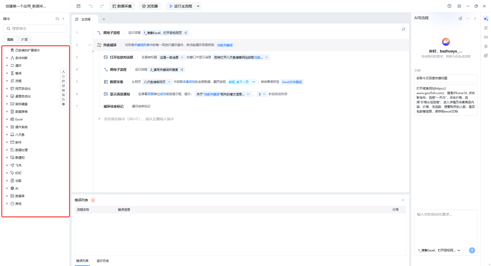

### 流程栏

一条指令的配置：方式①在流程编辑区点击即可新增指令；方式②选中一条指令，从左侧指令区将其拖拽至流程编辑区

一个流程的搭建：多条指令按一定的逻辑排列，构成了一个自动化流程

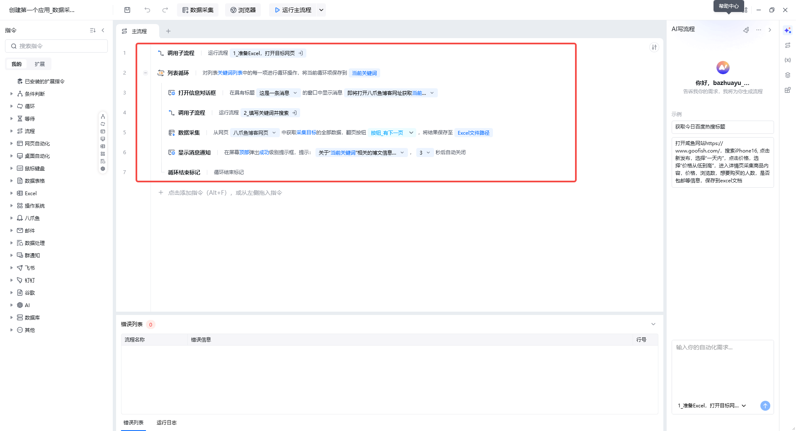

### 底部菜单栏

包含：错误列表、运行日志

错误列表：指令编排中不合规指令的错误信息会显示在此处

运行日志：本次运行的日志，可查看精简日志/全量日志

### 右侧参数栏

包含：[AI写流程](https://rpa.bazhuayu.com/helpcenter/docs/NcWRaj2c)、流程管理区、变量管理区、元素管理区、Python管理区

**AI写流程**

AI写流程是一项革命性的RPA开发功能，允许用户通过自然语言描述来生成完整的RPA自动化流程。无需复杂的拖拽操作和编程知识，只需用简单的中文描述您的业务需求，AI即可智能生成可执行的RPA流程。

**流程管理**

新建子流程：新增【子流程】，子流程可实现相对独立的功能，可被主流程或其他子流程调用

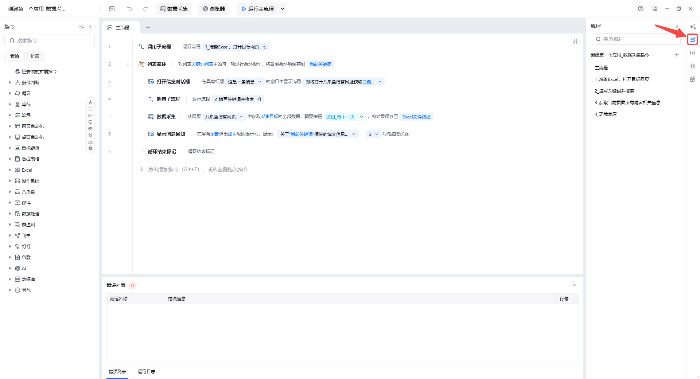

**变量管理**

输入变量：可管理和新建输入变量（名称、类型、默认值、控件类型），详见[新建自定义变量](https://rpa.bazhuayu.com/helpcenter/docs/sFOgkN7v)

普通变量：可管理当前应用中在所有流程中生成的变量

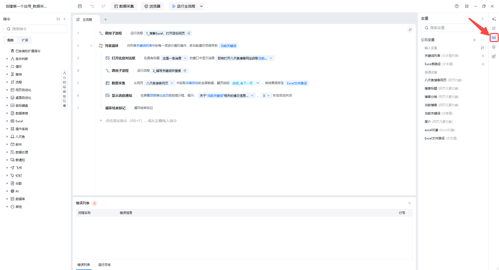

**元素库**

可管理已有元素，也可以捕获新元素加入元素管理

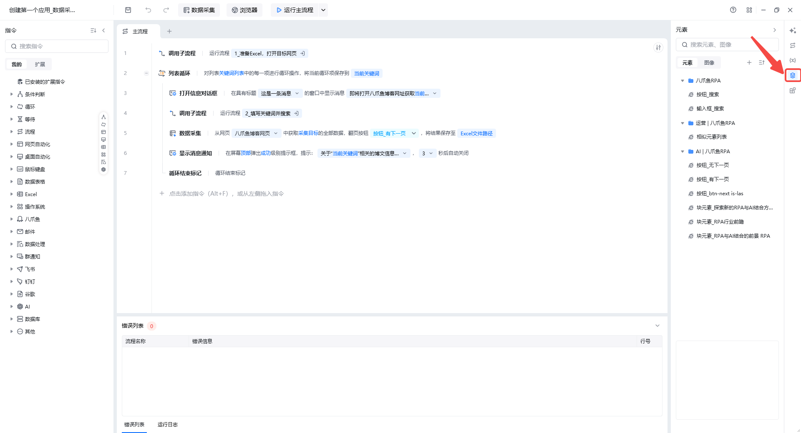

**Python包管理**

若当前应用中有【执行Python代码】指令，可在此处Python包，可视化安装，删除，升级Python包

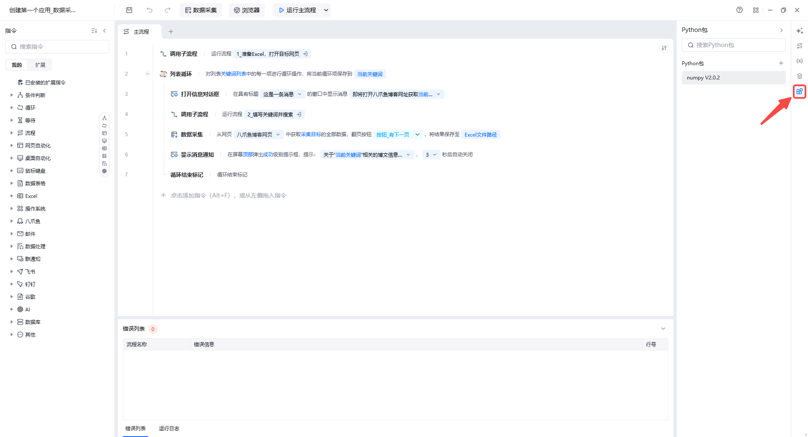

## 6. 触发器

管理触发器，本地触发任务中可设置定时触发器，从而实现根据指定的时间频率，自动的启动RPA应用。同时也支持webhook触发器。详见[触发器](https://rpa.bazhuayu.com/helpcenter/docs/PPnzU9)

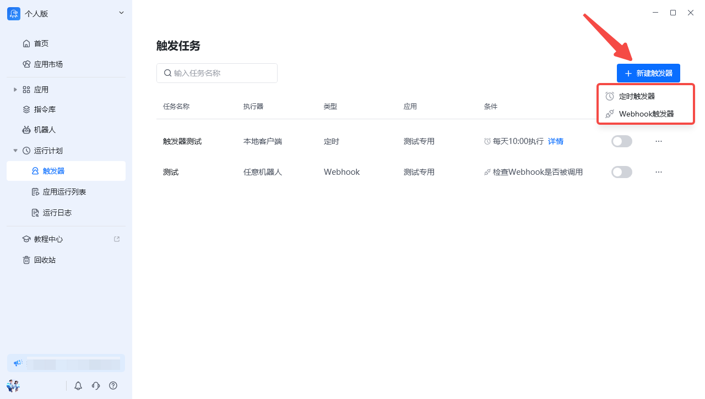

## 7. 运行日志

存放本地客户端和机器人近30天以内的运行日志，用于追踪应用的执行情况。

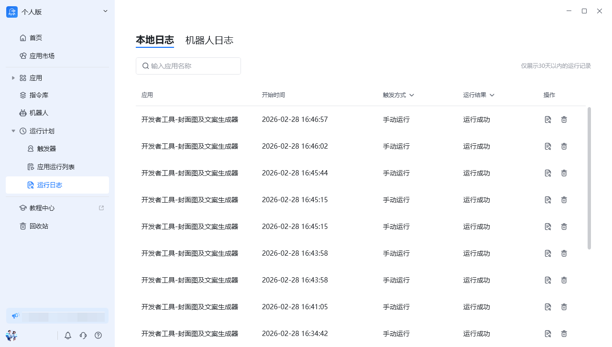

## 8. 机器人

查看及管理账号内所有的机器人，机器人可以解决用户需同时运行多个应用的需求。“我的机器人”后方的数字代表大家拥有的机器人数量，若是0，则代表当前账号下没有机器人。详见[机器人](https://rpa.bazhuayu.com/helpcenter/docs/TwEcUb)

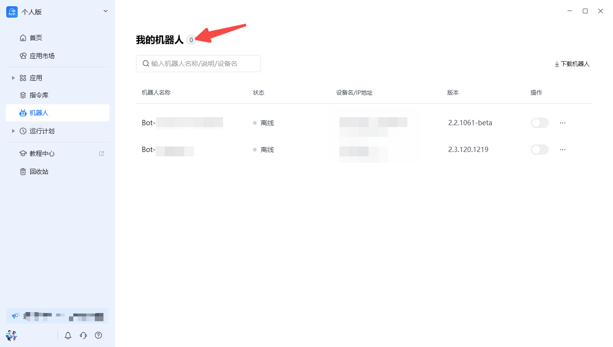

## 9. 应用回收站

查看与恢复删除的应用

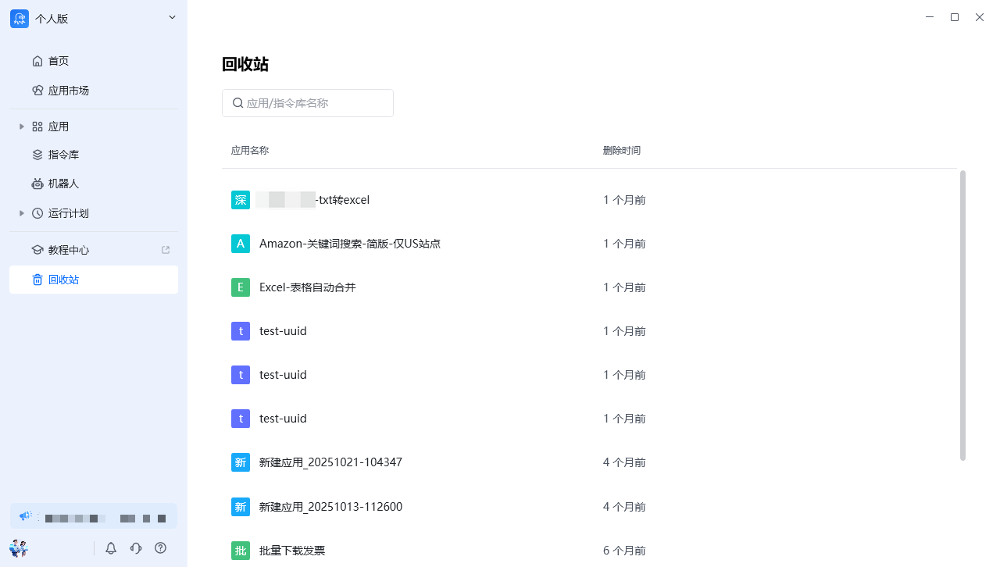
