> 第一个RPA应用要实现的功能：在百度搜索页面中按照指定关键词搜索，并获取第一条搜索结果的文本信息

## 1. 基本概念

**积木式搭建：** 通过简单的拖拽（也可直接在流程编辑区添加指令），即可快速地实现自动化流程的搭建，0基础亦可快速上手

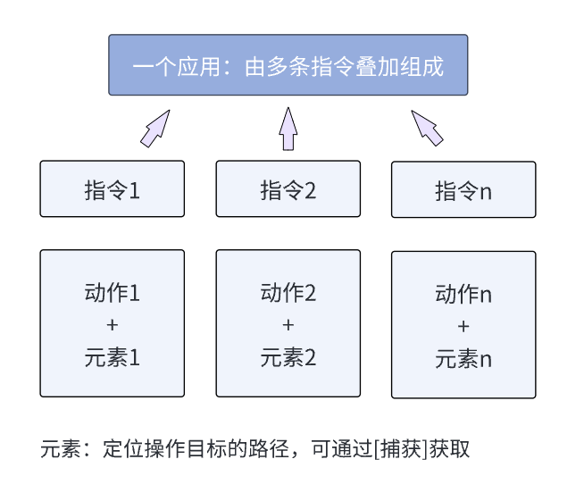

**指令的一般构成：**

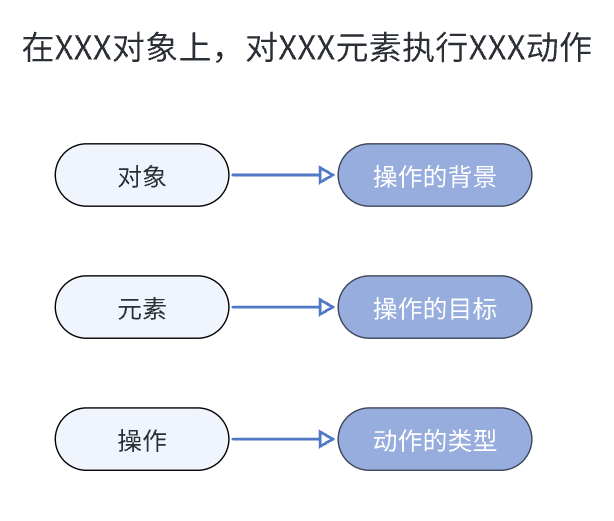

**指令构成四要素：** 操作背景、操作目标、操作动作、操作结果

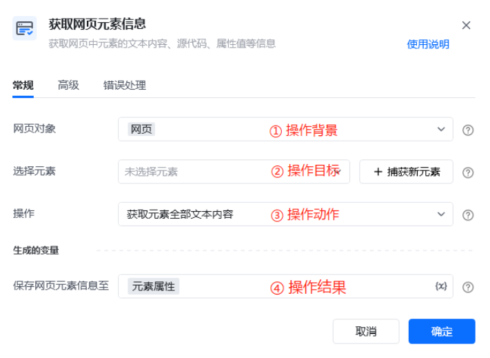

## 2. 应用逻辑详解

### 获取网页对象

可通过【打开网页】或【获取已打开的网页对象】指令创建网页对象

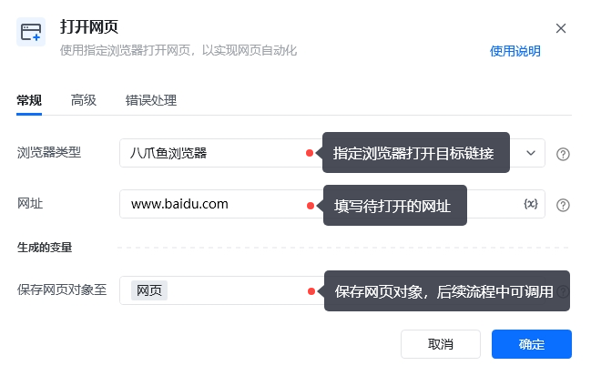

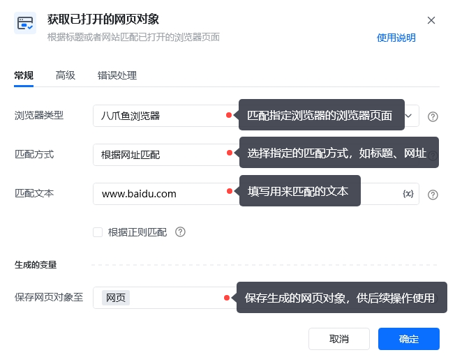

### 捕获网页元素

选择【填写网页输入框】指令

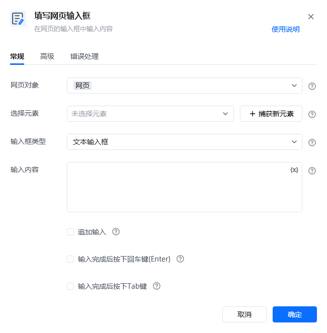

--&gt;点击「捕获新元素」

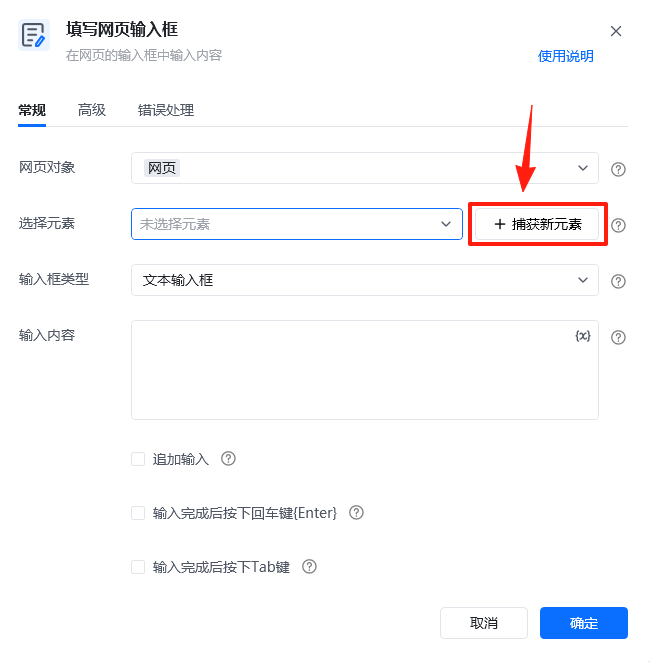

--&gt; 鼠标悬浮到待捕获的目标元素上，等待元素被红框选中，按住Ctrl+鼠标左键单击

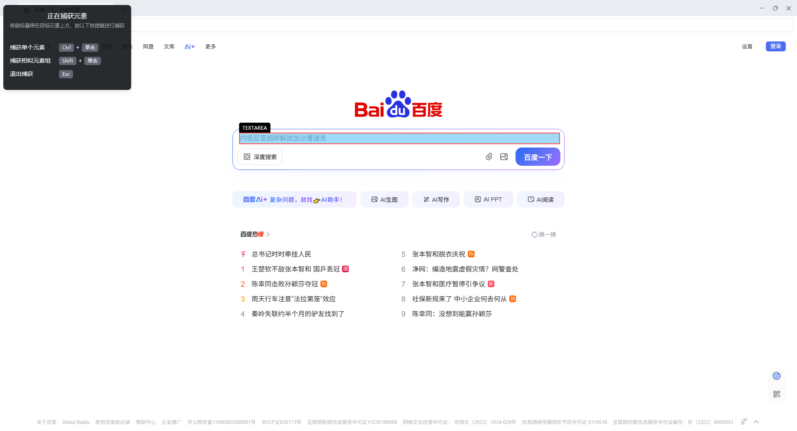

--&gt; 捕获成功

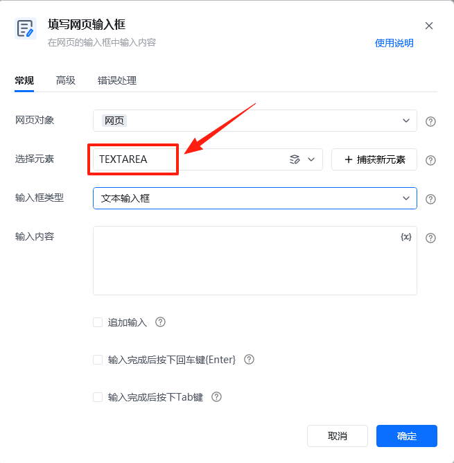

### 新增变量

新建变量就是设置一个未知数，可以给这个未知数命名，并设定它的类型（数值、文本值、布尔值等），最后给该变量赋值（值可变）。详情可参考文档：[新增自定义指令（2.x版本）](https://rpa.bazhuayu.com/helpcenter/docs/sFOgkN7v)

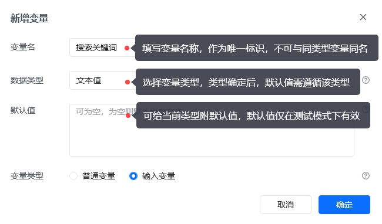

## 3. 流程演示

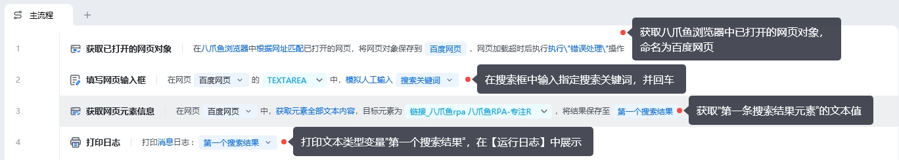
