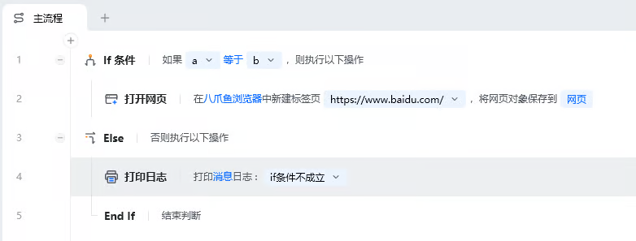
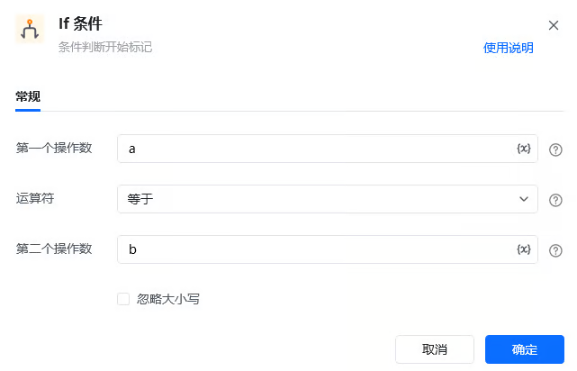

> 在自动化流程里，经常会遇到“如果……就……否则……”的情况：网页有下一页才翻页、价格低于阈值才采集、登录成功才继续操作。条件判断指令能让流程根据不同的条件自动选择不同的执行路径，是构建“智能”流程的基础。

## 1. 什么情况下需要条件判断

当一件事存在多种可能、需要针对每种情况分别处理时，就可以用条件判断来实现“分情况应对”。例如：

- 商品库存充足时走“正常下单”分支，库存不足时走“提醒采购”分支；
- 网页上出现“下一页”按钮才点击翻页，没有则结束采集；
- 表单校验通过后触发审批，校验失败则提示用户重新填写。

学会了条件判断，你的流程就不再是一条“傻瓜式”的直线，而能像人一样“看情况办事”。

## 2. 条件判断的基本概念

八爪鱼RPA把条件判断拆成了三种互相配合的指令：

- **If 条件（如果）**：先判断一个条件是否成立。成立就执行 If 内部的指令。
- **Else If（否则如果）**：必须跟在 If 或另一个 Else If 之后。当前面的条件都不成立时，再判断本指令的条件；一旦成立就执行并结束整个分支判断。
- **Else（否则）**：和 If 配合使用，当 If 以及所有 Else If 都不成立时，执行 Else 里的指令，作为“兜底”分支。

它们组成了一条完整的判断链：`If →（成立则执行）→ 否则 Else If →（成立则执行）→ 否则 Else`。每个 If 条件指令都会自动连带一个“End If（判断结束标记）”，把判断范围清晰圈起来，请勿删除。

## 3. 指令说明

### If 条件指令

<strong>描述：</strong>对两个操作数进行比较，根据比较结果（成立 / 不成立）决定执行哪一个分支。

| 参数 | 说明 |
| --- | --- |
| **第一个操作数** | 需要参与判断的值，可以是变量、文本、数字或表达式 |
| **运算符** | 选择两个操作数之间的关系：等于、不等于、大于、大于等于、小于、小于等于、包含、不包含、为空、不为空、开头为、开头不为、结尾为、结尾不为 |
| **第二个操作数** | 与第一个操作数进行比较的值，类型应与第一个操作数保持一致 |

### Else If 指令

<strong>描述：</strong>多分支条件判断指令，必须跟在 If 或另一个 Else If 之后。前置条件都不成立时，再判断本指令的条件；条件成立时执行并终止后续分支，不成立则继续往后传递。

参数与 If 一致：**第一个操作数** / **运算符** / **第二个操作数**。

### Else 指令

<strong>描述：</strong>和 If 指令配合使用，当 If 及所有 Else If 的条件都不成立时，执行 Else 里面包含的全部指令。

## 4. 使用示例

**该流程执行逻辑：**

将变量 a 赋值为 1，变量 b 赋值为 2

使用【If 条件】判断 a 是否等于 b

若条件成立，则打开网页“百度”；若不成立，则通过【Else】打印消息“if条件不成立”

### 注意事项

- **操作数类型要一致**：数值大小比较时，两个操作数都应是数值类型；如果其中一个是文本“1”，判断可能会出错。判断文本时，建议先使用“文本转换为数值”指令把文本转成数值再比较。
- **分支要配齐结束标记**：If 条件指令会自动连带“End If”标记，该标记不需要输入参数，也不能删除，否则流程结构不完整会报错。

<Info>
  想查看完整的参数说明与更多示例，可前往指令文档：[If 条件](https://bazhuayu-rpa-docs.mintlify.site/commands/condition/ifcommand)、[Else If](https://bazhuayu-rpa-docs.mintlify.site/commands/condition/elseifcommand)、[Else](https://bazhuayu-rpa-docs.mintlify.site/commands/condition/elsecommand)。
</Info>
