## 1. 应用说明
通过本应用可以实现循环采集某个网页的列表数据

## 2. 应用实现逻辑

### 模拟、分析人操作全流程

第一步：打开人民网（示例网址：[http://search.people.cn/s?keyword=%E5%88%9B%E6%96%B0&st=0&_=1706494865873](http://search.people.cn/s?keyword=%E5%88%9B%E6%96%B0&st=0&_=1706494865873)）

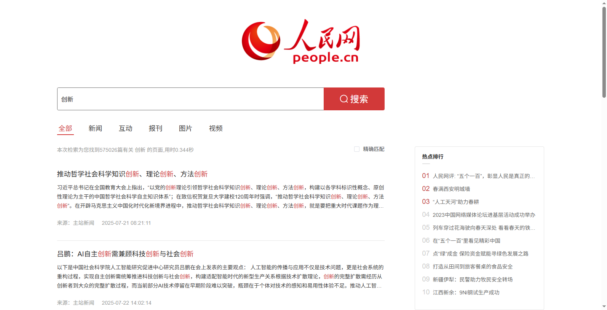

第二步：找到新闻列表第一行，获取当前新闻的标题和来源，在预先准备好的表格中记下标题和来源

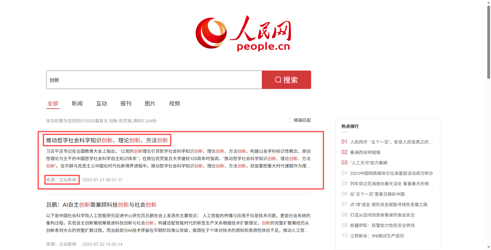

第三步：找到新闻列表第二行，获取当前新闻的标题和来源，在预先准备好的表格中记下标题和来源

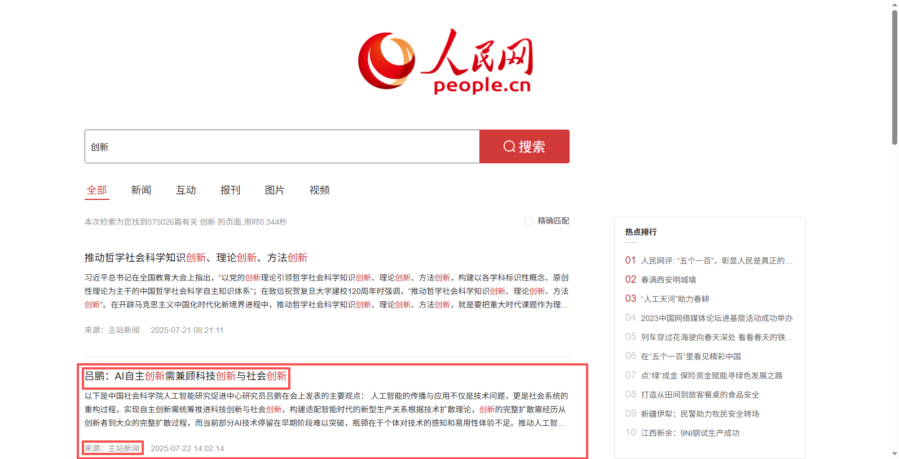

依此类推，直至当前页面所有新闻都循环完毕。

### RPA流程图

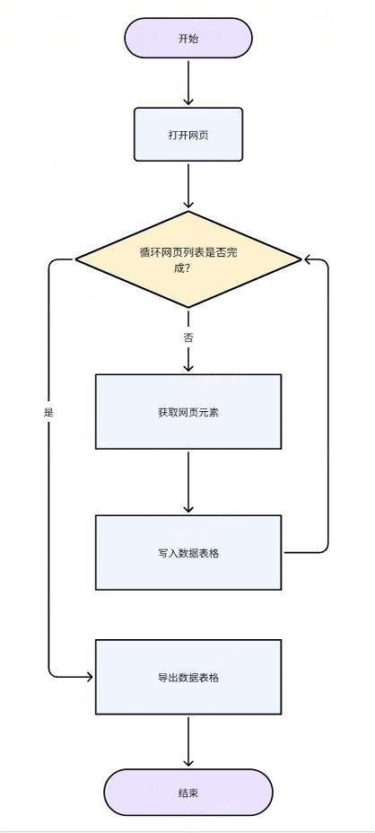

## 3. 应用实现

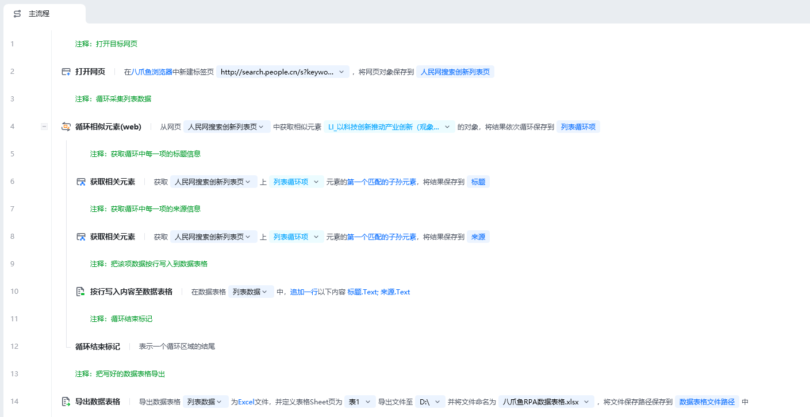

### 前期准备

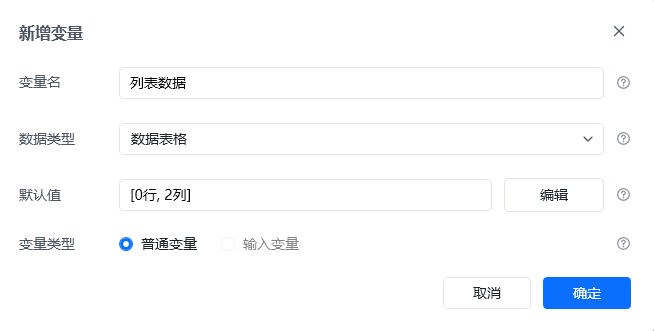

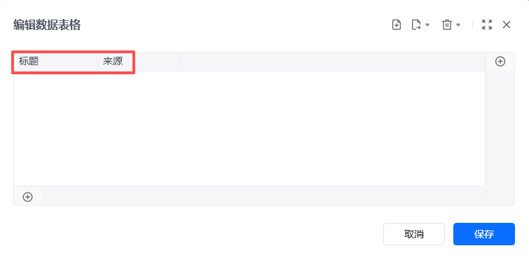

创建数据表格，命名为“列表数据“用于后续存储数据。

### 流程指令解析

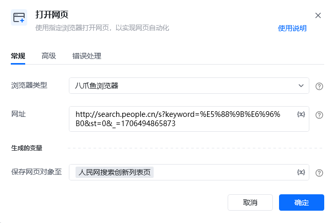

按照习惯选择常用的浏览器类型，可选八爪鱼浏览器、谷歌浏览器、Edge浏览器等，网址则填写人民网的网址[http://search.people.cn/s?keyword=%E5%88%9B%E6%96%B0&st=0&_=1706494865873](http://search.people.cn/s?keyword=%E5%88%9B%E6%96%B0&st=0&_=1706494865873)，最后将此网页对象命名为人民网搜索创新列表页。

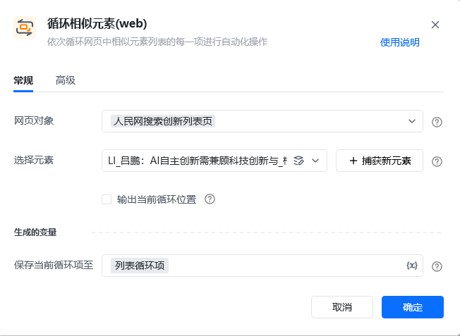

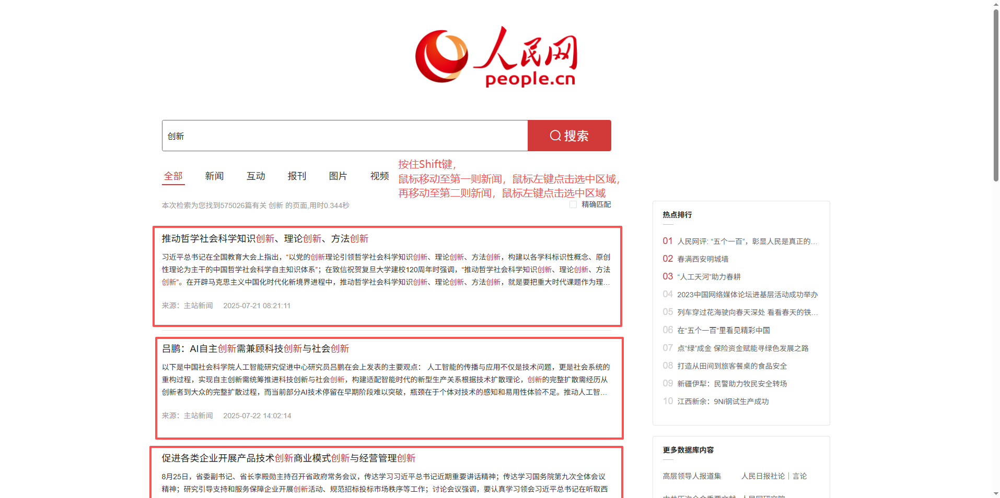

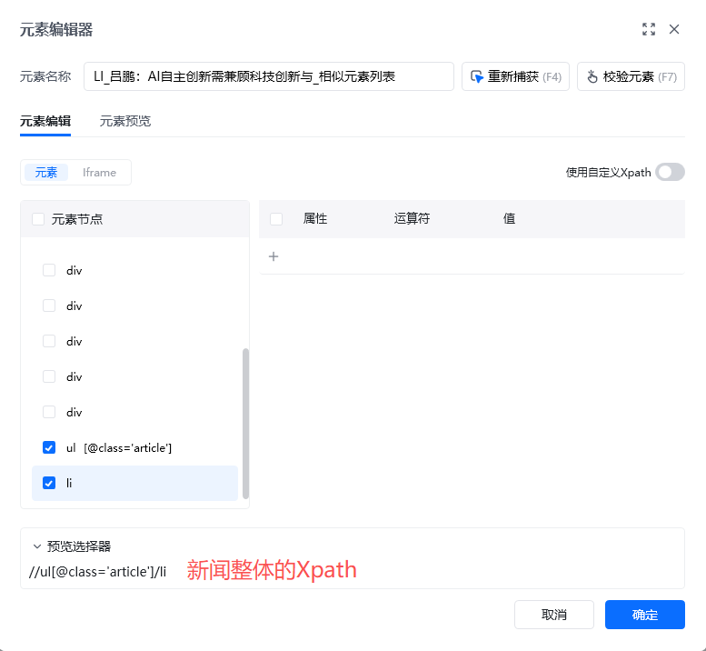

依次循环”人民网搜索创新列表页“中新闻列表的每一则新闻，将当前循环到的新闻项命名为”列表循环项“

捕获列表项，注意这里的列表项元素框一定包含我们所有想要的元素，比如我们想要标题和来源，那么我们捕获的时候就要捕获一个包含这些元素的元素框

**注意：**对相似元素有疑问，可参考相关文档：[相似元素列表](https://bazhuayu-rpa-docs.mintlify.site/guides/elements/similar-related-element)

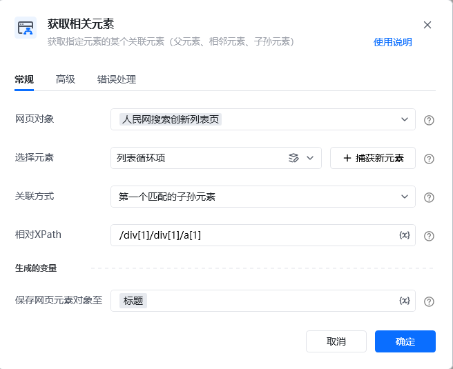

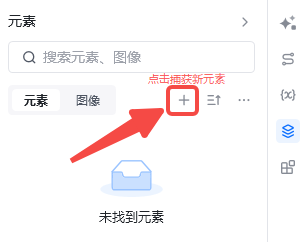

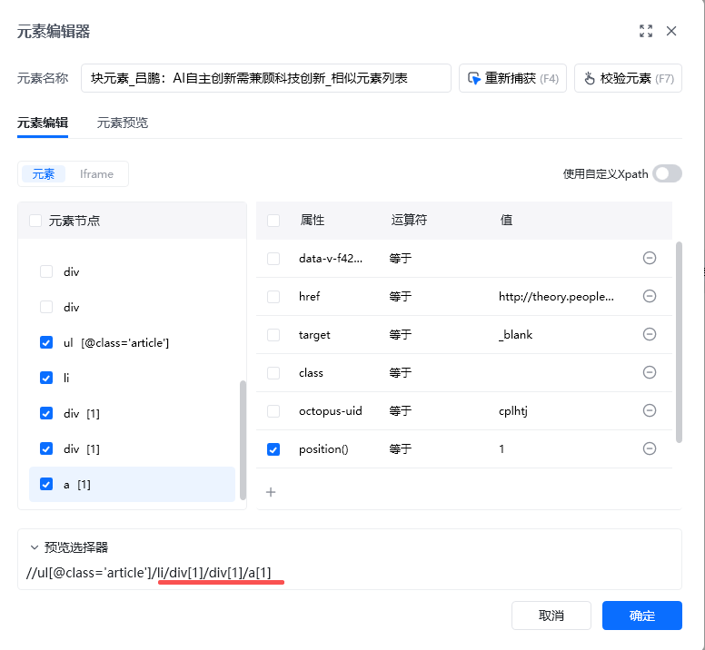

上一条指令仅仅只是获取了整体的列表项，并没有告诉 RPA 我们想要这个列表项里具体哪些数据。这时候就要用到获取相关元素指令，该指令可以获取当前循环列表项不同位置的元素数据。

获取当前新闻的关联元素，本应用中的关联方式都是第一个匹配的子孙元素。以新闻标题为例，新闻来源同理，因此不再赘述。

在元素库内点击”捕获新元素“

按住Shift键，鼠标左键移动至第一则新闻的标题，鼠标左键点击

再移动至第二则新闻的标题，鼠标左键点击

复制Xpath中多出的部分（相较于新闻整体的Xpath），即/div[1]/div[1]/a[1]

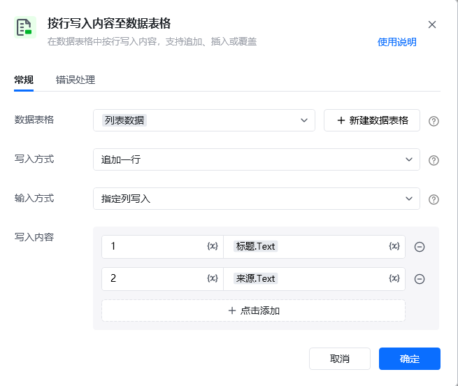

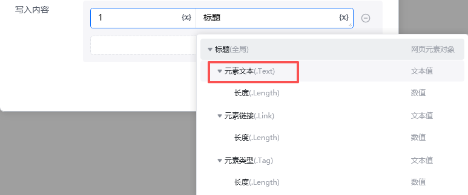

每次循环新闻的时候，都把对应新闻关联元素的文本信息（元素.Text）写入数据表格中

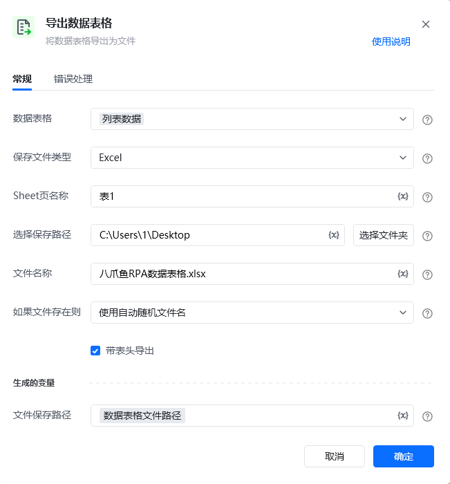

数据表格的主要作用是临时存储数据，若应用重新运行，则之前的数据会被清空。因此我们需要将获取到的新闻信息以Excel或Csv的格式导出至本地。

### 运行效果

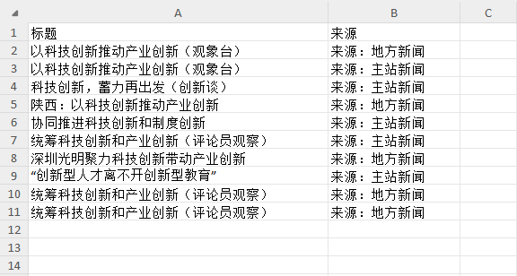

## 4. 更多案例

（采集网页列表数据，列表数据的定义并不仅仅局限于传统意义上的一行行列表。列表的形式多种多样，只要是有序排布，大的元素块内包含很多小的信息即可。）

天猫商城搜索列表页

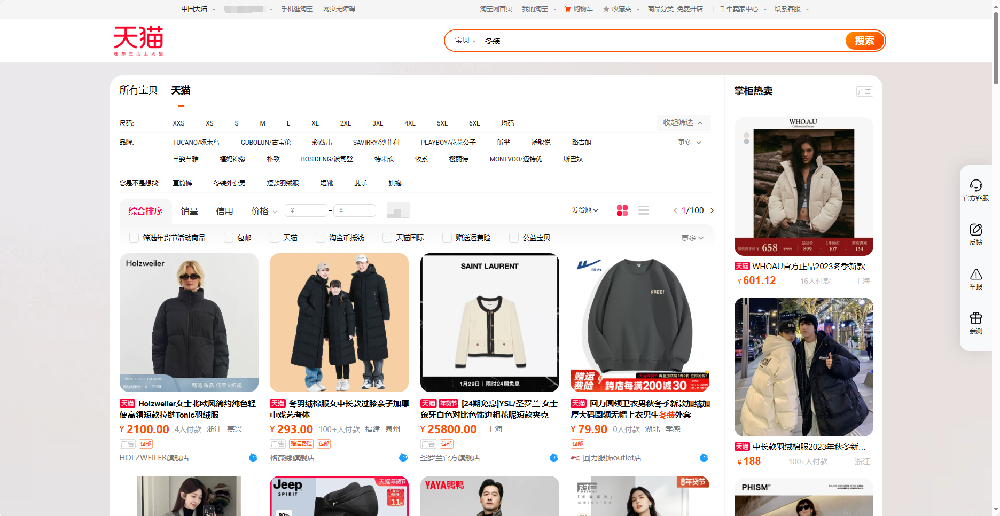

新闻网站列表数据

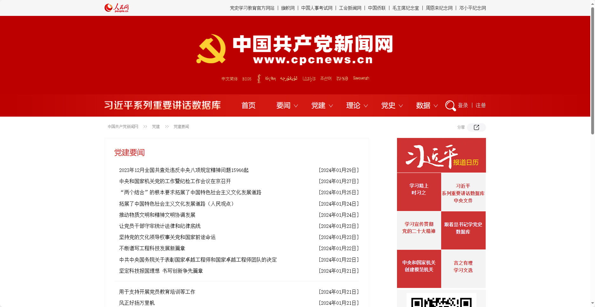

房产信息列表数据

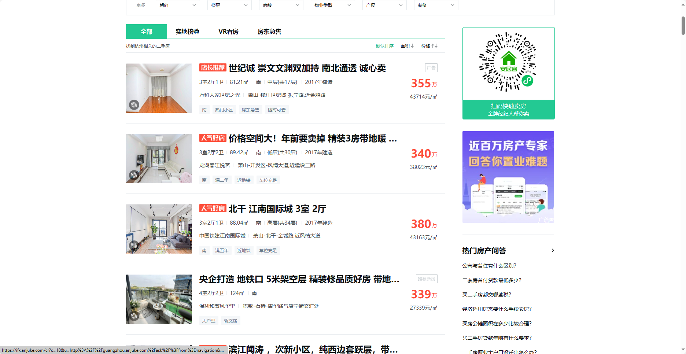
