

## 1. 应用说明
通过本应用可以实现依次打开多个不同网址，批量采集同类型网页的数据。

## 2. 应用实现逻辑

### 模拟、分析人操作全流程

前期：准备一个包含多个“相似网页网址”的文本文件（.txt）

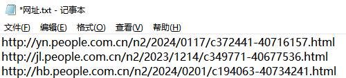

第一步：在八爪鱼浏览器内打开第一个网址链接“http://yn.people.com.cn/n2/2024/0117/c372441-40716157.html”

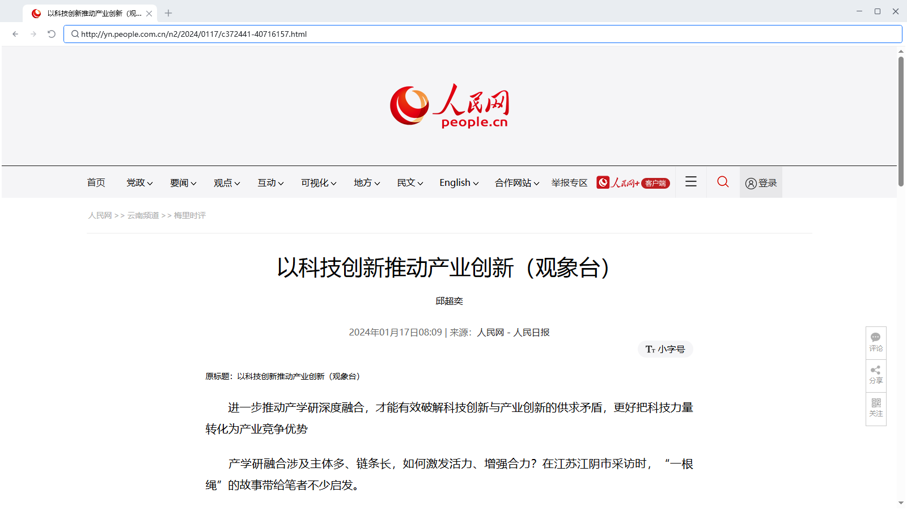

第二步：获取当前页面内我们需要的信息，并存储在表格内

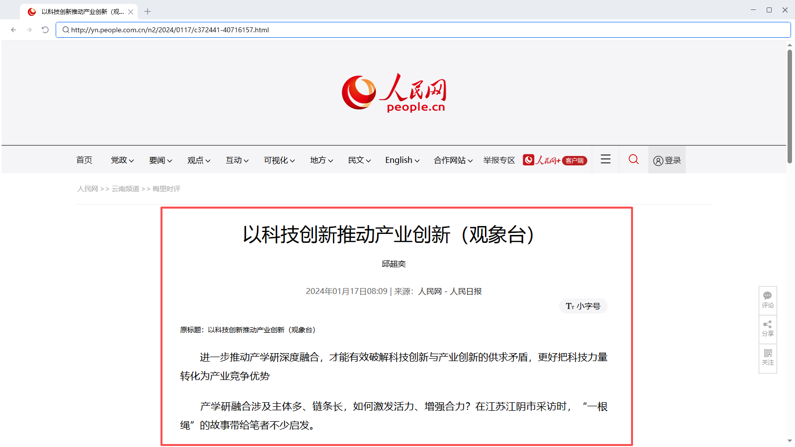

第三步：在八爪鱼浏览器内打开第二哥网址链接“http://jl.people.com.cn/n2/2023/1214/c349771-40677536.html”

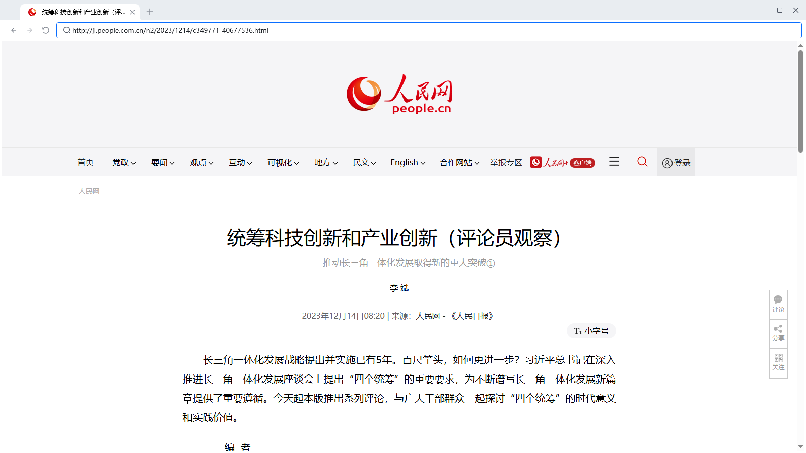

第四步：获取当前页面内我们需要的信息，并存储在表格内

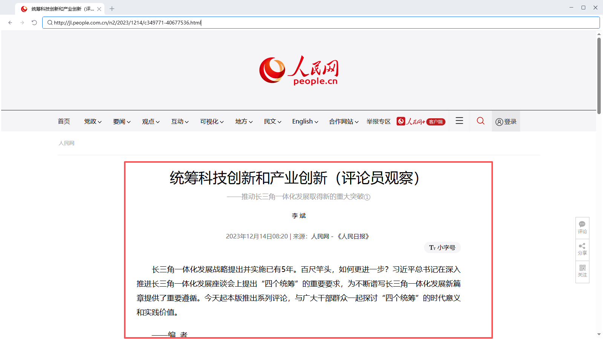

后续操作步骤一致，直至所有网址都搜索完毕。

### RPA 流程图

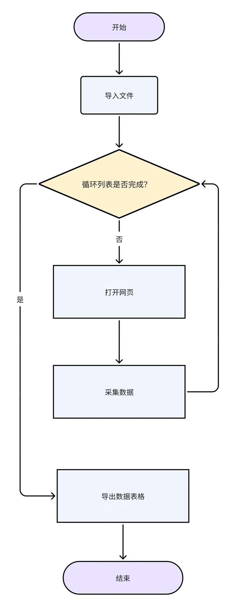

## 3. 应用实现

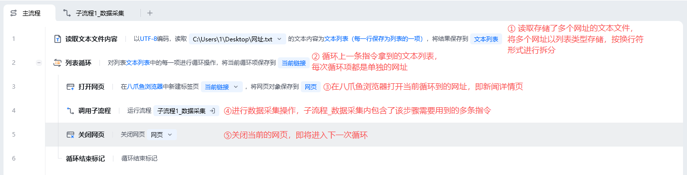

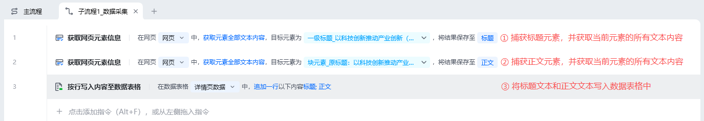

### 前期准备

**截图**

**准备事项**

1. 准备一个包含多个“相似网页网址”的文本文件（.txt），网址如下： http://yn.people.com.cn/n2/2024/0117/c372441-40716157.html http://jl.people.com.cn/n2/2023/1214/c349771-40677536.html http://hb.people.com.cn/n2/2024/0201/c194063-40734241.html

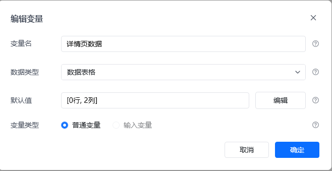

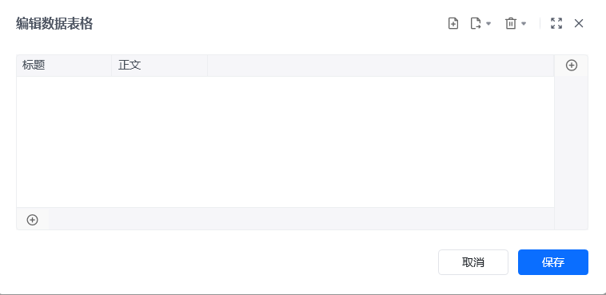

2. 创建数据表格，命名为“详情页数据“用于后续存储数据。

### 主流程指令解析

**指令截图**

**解析**

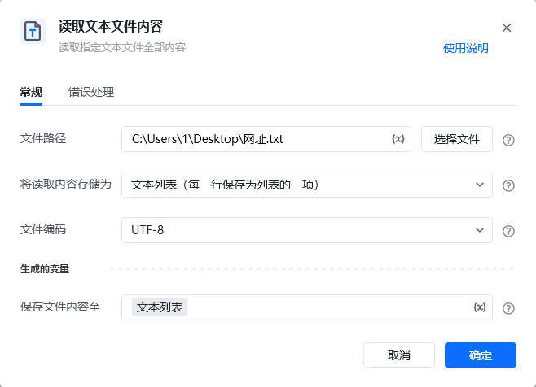

读取存储了多个网址的文本文件，将多个网址以列表类型进行存储，按换行符形式进行拆分

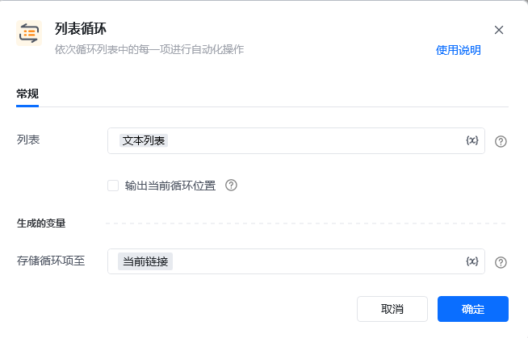

依次循环文本列表中的每一个网址，并且把当前循环到的网址命名为”当前链接“。 假设此时文本列表里面有”www.1.com“和"www.2.com"两个网址，那么会按照顺序先打开www.1.com，再打开www.2.com **注意：**每个循环相关的指令都会自动连带“循环结束标记”指令，该指令不需要输入参数，也不能删除，否则会报错

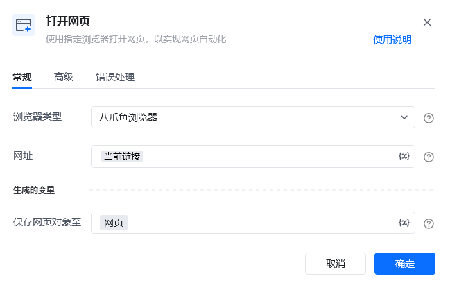

按照习惯选择常用的浏览器类型，可选八爪鱼浏览器、谷歌浏览器、Edge浏览器等，网址则填写当前循环到的链接，最后将此网页对象命名为网页。

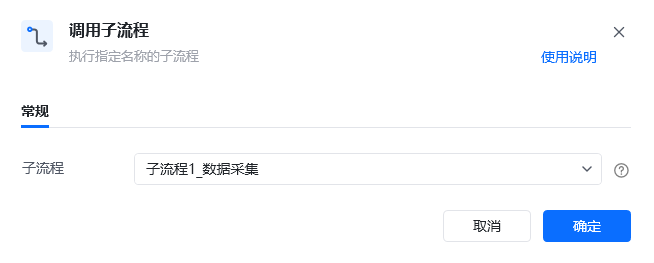

调用封装好的子流程_数据采集，该子流程包含了数据采集需要用到的多个指令

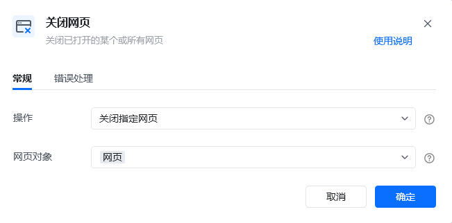

当前循环到的链接中待提取的数据被获取完后，即可关闭当前网页，即环境复原动作

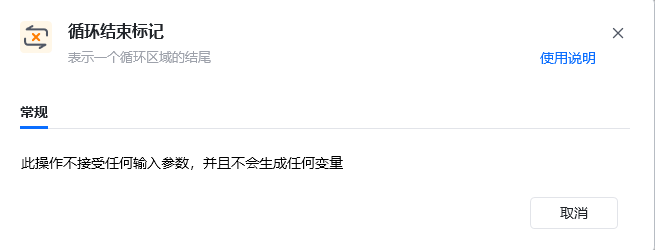

每个循环相关的指令都会自动连带“循环结束标记”指令，该指令不需要输入参数，也不能删除，否则会报错

### 子流程指令解析

**指令截图**

**解析**

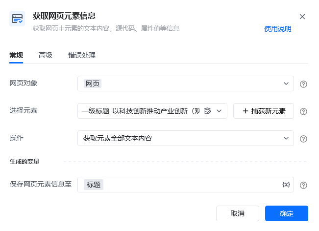

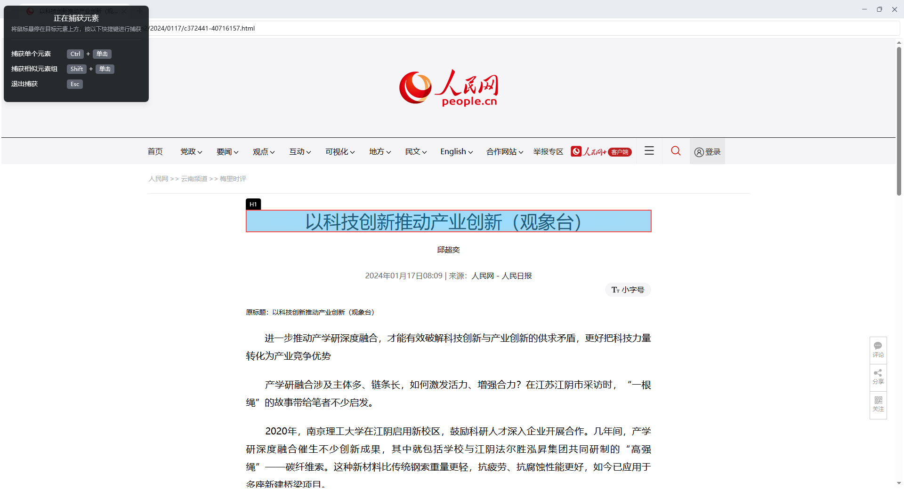

获取当前新闻标题元素对应的文本内容。 捕获元素步骤： 点击“捕获新元素“ 按住ctrl键，鼠标左键选中新闻标题 点击“完成” 指令变量填写： 操作选择”获取元素全部文本内容“

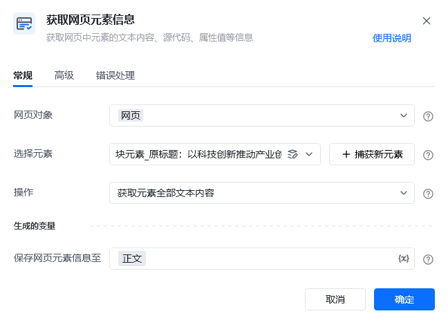

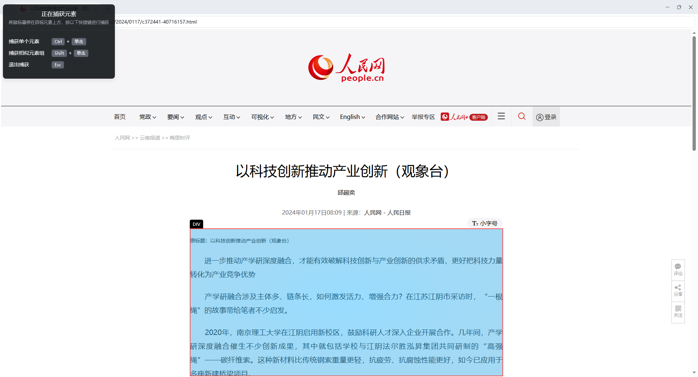

获取当前新闻正文元素对应的文本内容。 捕获元素步骤： 点击“捕获新元素“ 按住ctrl键，鼠标左键选中新闻正文 点击“完成” 指令变量填写： 操作选择”获取元素全部文本内容“

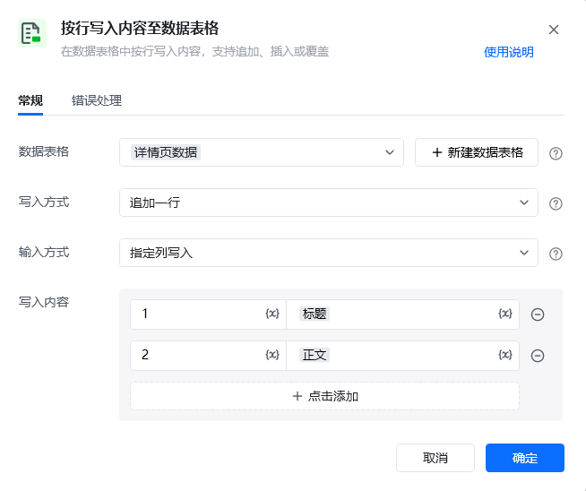

每次循环网页链接的时候，都把对应新闻的标题、正文元素的文本内容写入数据表格中

### 运行效果

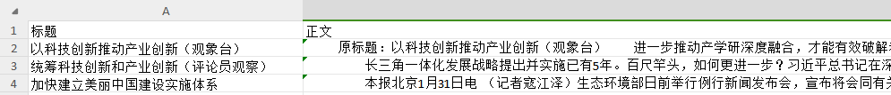

## 4. 更多案例

（已有多网址链接，可通过这些链接采集数据。一般适用于不能直接从列表页进入详情页或详情页有弹窗的网址）

**注：**是同类型网页（网页结构一致）的网址
京东详情页

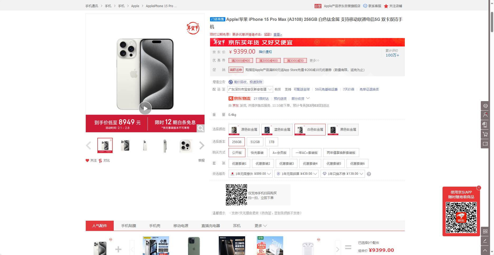

招聘网站详情页

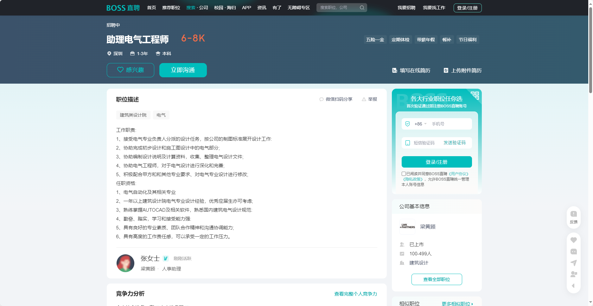
