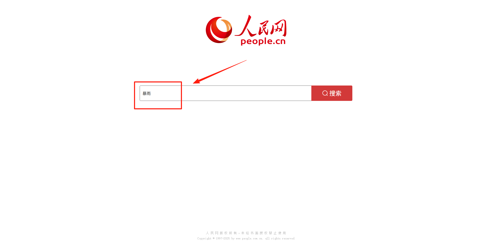
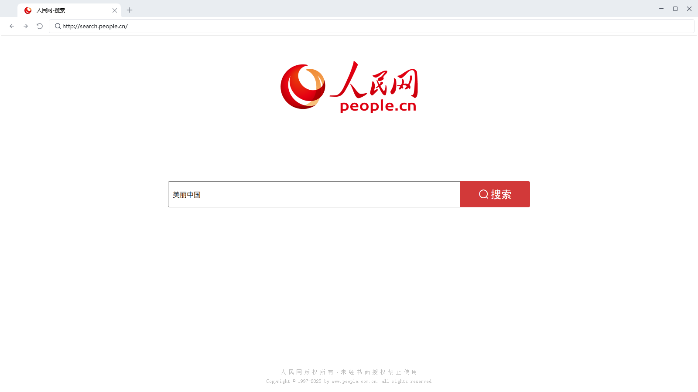
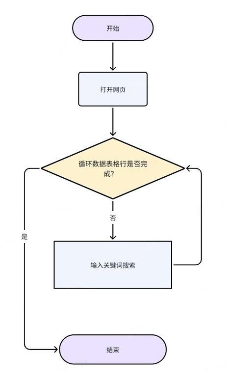
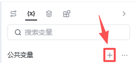
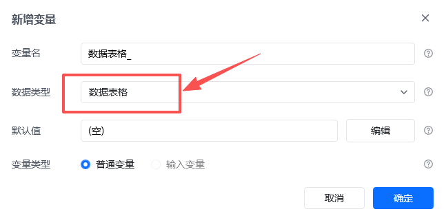
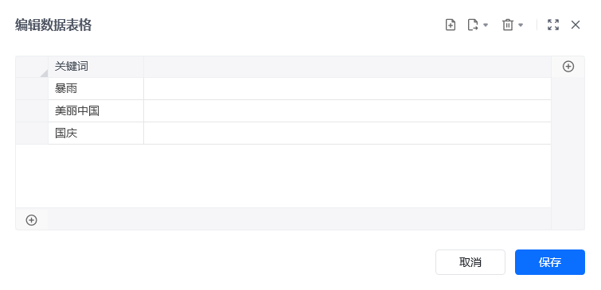
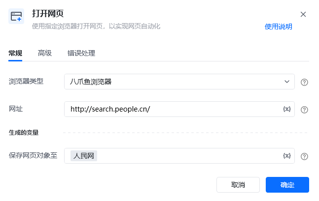
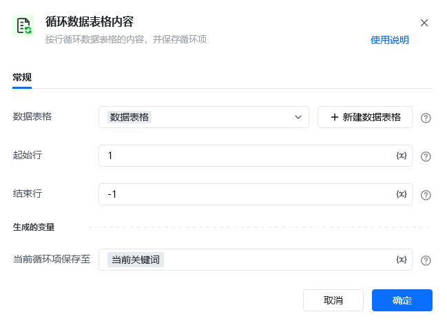
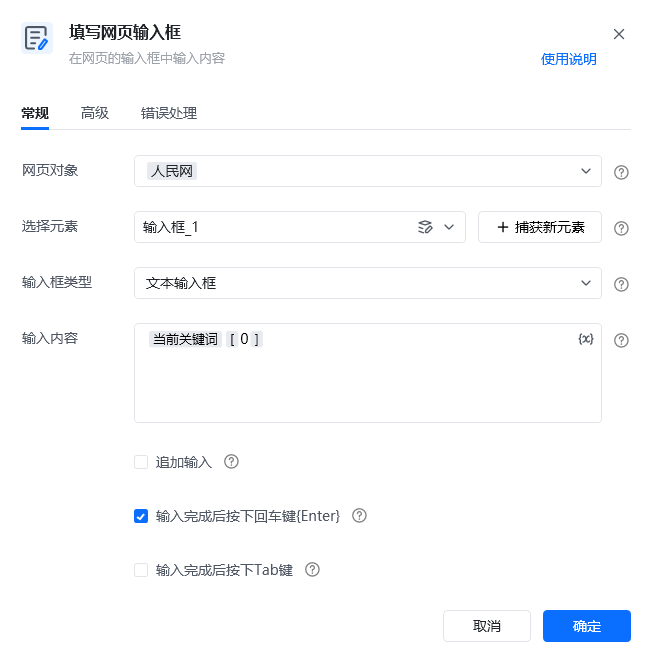
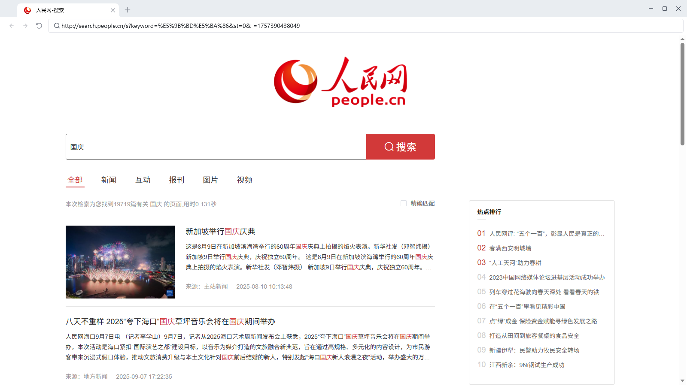

## 1. 应用说明
通过本应用可以实现依次读取数据表格中存放的关键词，在某网页上输入不同的关键词后进行搜索。

## 2. 应用实现逻辑

### 模拟、分析人操作全流程

### RPA流程图

## 3. 应用实现

数据表格可以理解为 RPA 内置的“Excel”，我们把关键词提前输入到数据表格内，RPA 后续会循环输入这些关键词。相较于循环Excel，循环数据表格更为简单，无需打开Excel文件即可实现循环输入

### 前期准备

**截图**

**准备事项**

① 创建数据表格，公共变量区域内，点击+号按钮 ② 变量数据类型选择”数据表格“ ③ 依次添加需要搜索的关键词，如”暴雨、美丽中国、国庆“等

### 流程指令解析

**指令截图**

**解析**

按照习惯选择常用的浏览器类型，可选八爪鱼浏览器、谷歌浏览器、Edge浏览器等，网址则填写”人民网“的网址(http://search.people.cn/)，最后将此网页对象命名为人民网。

依次循环数据表格中的每一个关键词，并且把当前循环到的关键词命名为当前关键词。（和循环Excel一样，每个循环项代表数据表格的一行）

①选择元素，点击【捕获新元素】按钮，捕获打开的人民网网页输入框 ②按住Ctrl+鼠标左键捕获输入框位置 ③在输入框内输入我们要搜索的当前关键词 **注：**数据表格每一行都是一维列表，因此需要输入索引值。即当前关键词[0]。相关文档：[变量填写到输入框为什么会有[""]](https://rpa.bazhuayu.com/helpcenter/docs/z7JQKQk8) ④勾选“输入完成后按下回车键”

### 运行效果

## 4. 更多案例

（本案例模式适用于需要搜索多关键词的网页）

淘宝、京东搜索商品

百度搜索

Boss直聘找工作

