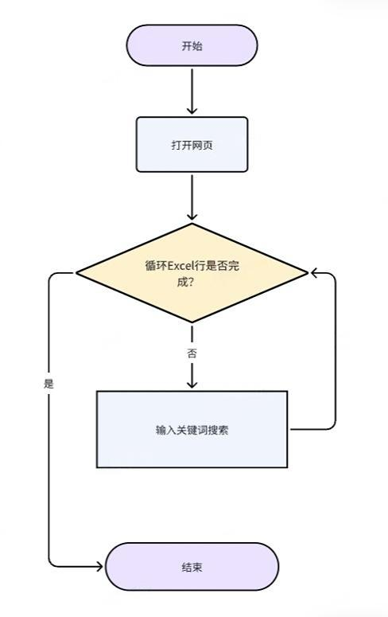
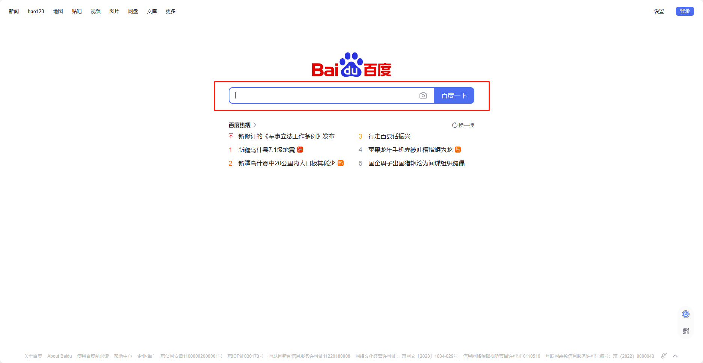

## 1. 应用说明
通过本应用可以实现依次读取Excel文件中存放的关键词，在某网页上输入不同的关键词后进行搜索。

## 2. 应用实现逻辑

### 模拟、分析人操作全流程

### RPA流程图

## 3. 应用实现

打开指定网页，启动Excel文件，读取Excel里所有关键词。每读取一个关键词就填写一次输入框，直到所有关键词都搜索完毕。

### 前期准备

**截图**

**准备事项**

①首先我们需要一个用于存放关键词的 Excel 文件 ③ 在 Excel 文件中第一列中依次添加需要搜索的关键词，如”美丽中国、创新、乡村振兴“等

### 流程指令解析

**指令截图**

**解析**

按照习惯选择常用的浏览器类型，可选八爪鱼浏览器、谷歌浏览器、Edge浏览器等，网址则填写”人民网“的网址(http://search.people.cn/)，最后将此网页对象命名为人民网。

在进入循环体输入关键词前，需要先启动 Excel，让 RPA 获取Excel文件对象里面的数据。 使用【启动Excel】指令，选择Excel表的存储路径，并将当前文件对象命名为“搜索关键词”。

建立Excel循环 依次循环 Excel 中的每一个关键词，循环的 Excel 对象选择刚才创建的“搜索关键词”，并且把当前循环到的关键词命名为当前关键词。 **注：**这里的循环项指的是Excel里的一行（不是一列，也不是一个单元格）。因此每个循环项实际上都是列表

①选择元素，点击【捕获新元素】按钮，捕获打开的人民网网页输入框 ②按住Ctrl+鼠标左键捕获输入框位置 ③在输入框内输入我们要搜索的当前关键词 **注：**Excel每一行都是一维列表，因此需要输入索引值。即当前关键词[0]。相关文档：[变量填写到输入框为什么会有[""]](https://rpa.bazhuayu.com/helpcenter/docs/z7JQKQk8) ④勾选“输入完成后按下回车键”

### 运行效果

## 4. 更多案例

（本案例模式适用于需要搜索多关键词的网页）

淘宝、京东搜索商品

百度搜索

Boss直聘找工作

