## 1. 应用说明
通过本应用可以实现循环采集某个网页的列表数据-瀑布流类型网页

## 2. 应用实现逻辑

### 模拟、分析人操作全流程

- 第一步：打开网易新闻-国内新闻（案例中网址：[https://news.163.com/domestic/](https://news.163.com/domestic/)）

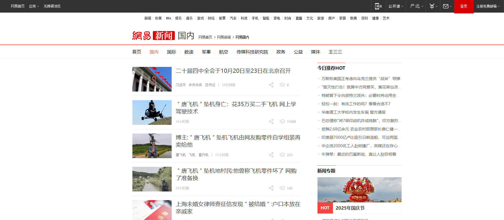

- 第二步：鼠标滚动加载更新的新闻列表数据

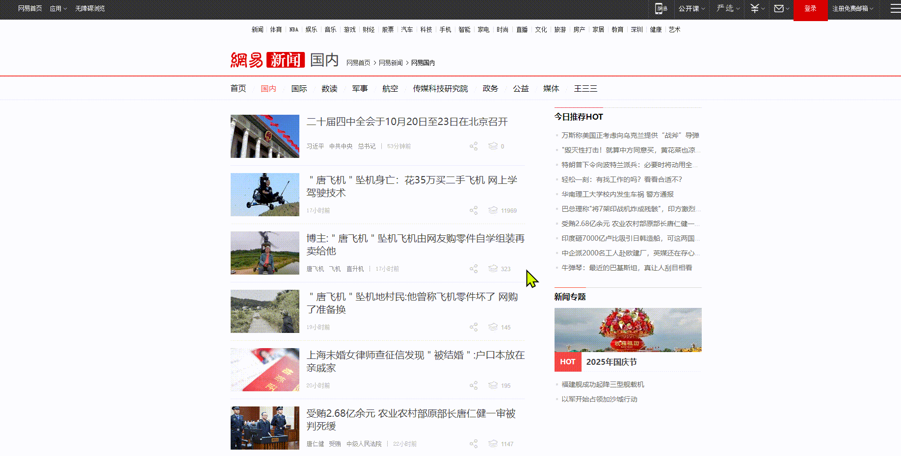

- 第三步：循环采集每个新闻列表的信息，案例中采集新闻标题，与发布时间；并将采集到的数据写入到excel中。

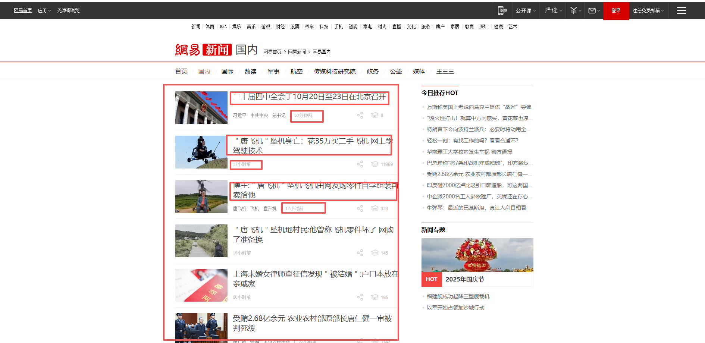

依此类推，直至当前页面所有新闻都循环完毕。

### 流程图

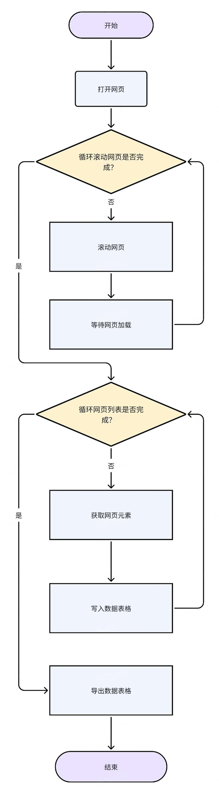

## 3.应用实现

### RPA应用参考

[https://rpa.bazhuayu.com/shareableLink/68da322a8e7ec427e92f04c7?ref=ZHjGqe](https://rpa.bazhuayu.com/shareableLink/68da322a8e7ec427e92f04c7?ref=ZHjGqe)

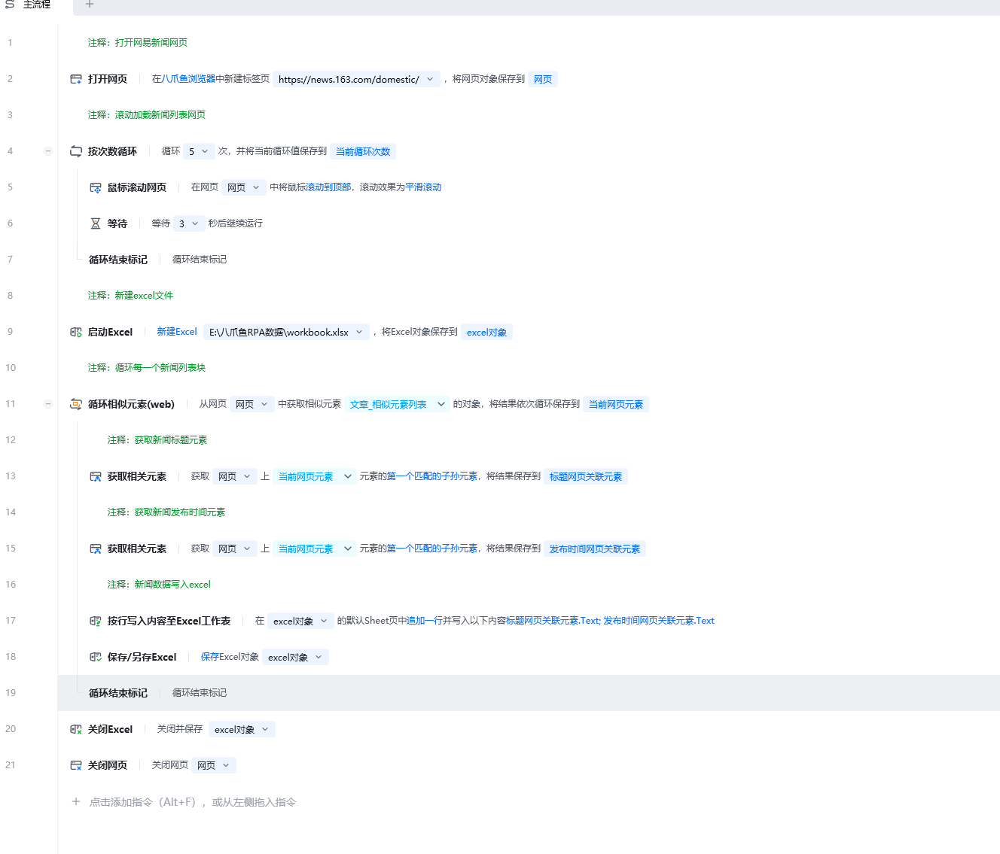

### 流程指令解析

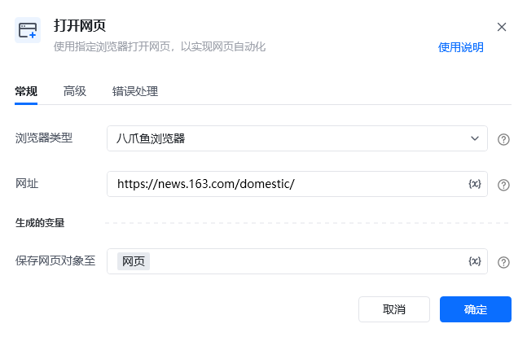

按照习惯选择常用的浏览器类型，可选八爪鱼浏览器、谷歌浏览器、Edge浏览器等，网址则填写网易新闻-国内新闻([https://news.163.com/domestic/](https://news.163.com/domestic/)) 将此网页对象命名为：网页。

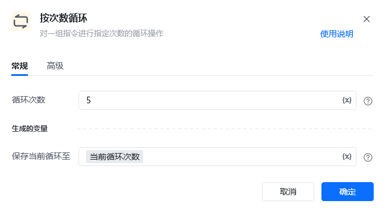

按次数循环 5 次（可根据实际情况调整次数）

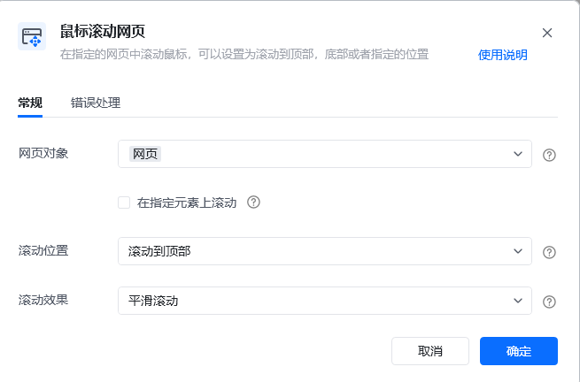

在按次数循环体中，使用鼠标滚动网页页面

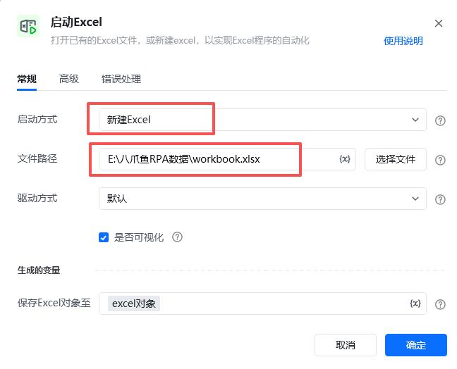

使用【启动Excel】指令创建一个新的excel

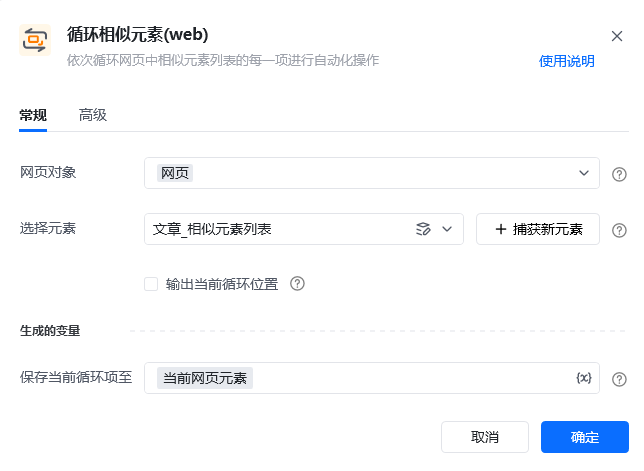

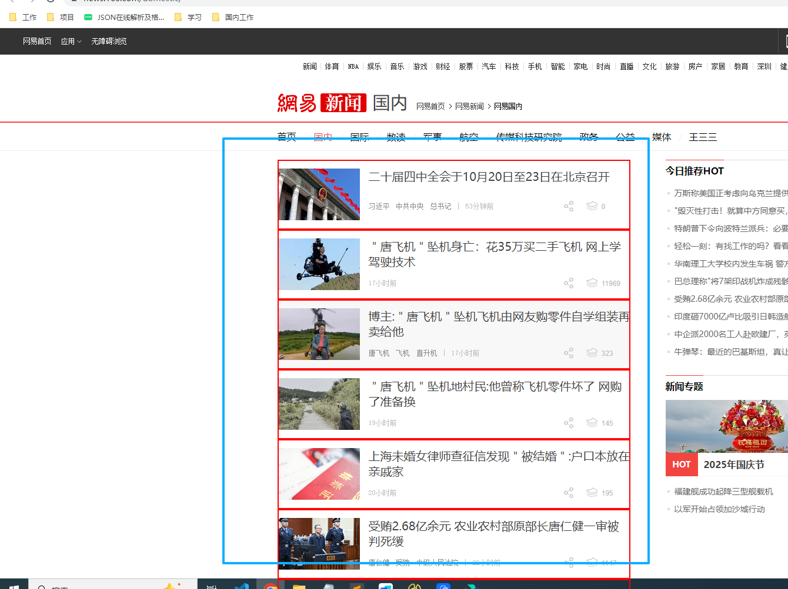

循环相似元素，获取到每个新闻的元素块 xpath参考：//div[@class='ndi_main']/div

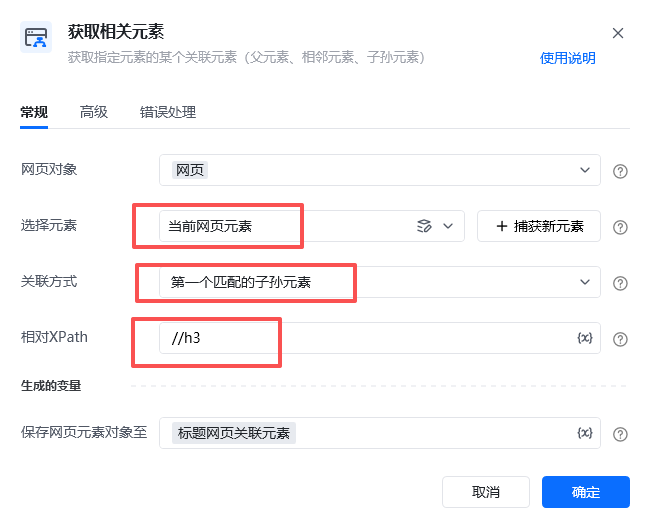

使用【获取相关元素】，选择元素为循环体的「当前网页元素」，关联方式「第一个匹配的子孙元素」。

相对xpath（相对「当前网页元素」的xpath）：//h3

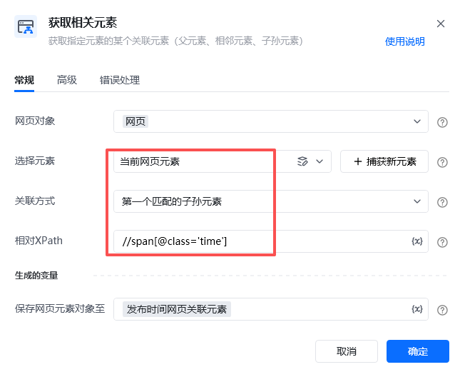

使用【获取相关元素】，选择元素为循环体的「当前网页元素」，关联方式「第一个匹配的子孙元素」。

相对xpath（相对「当前网页元素」的xpath）：//span[@class='time']

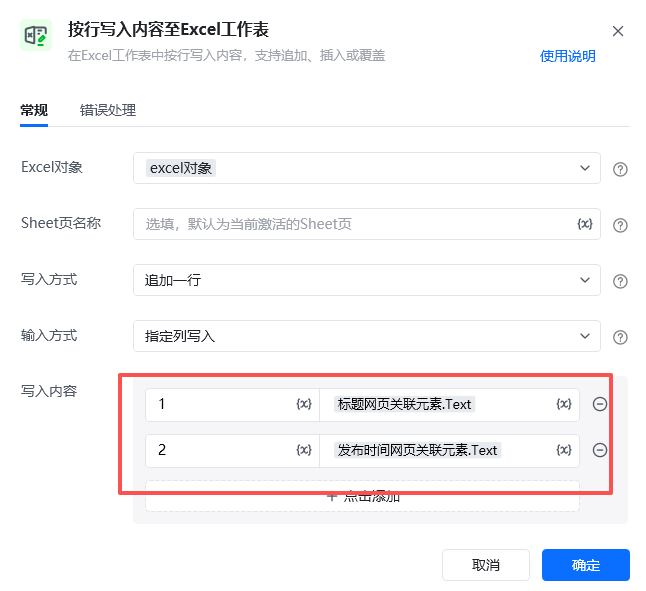

将采集的网页元素内容 写入到excel文件中。

可以通过「素.Text」的方式快捷获取到元素的文本信息。

第一列写入：新闻的标题，「标题网页关联元素.Text」

第二列写入：新闻的发布时间，「发布时间网页关联元素.Text」

### 运行效果

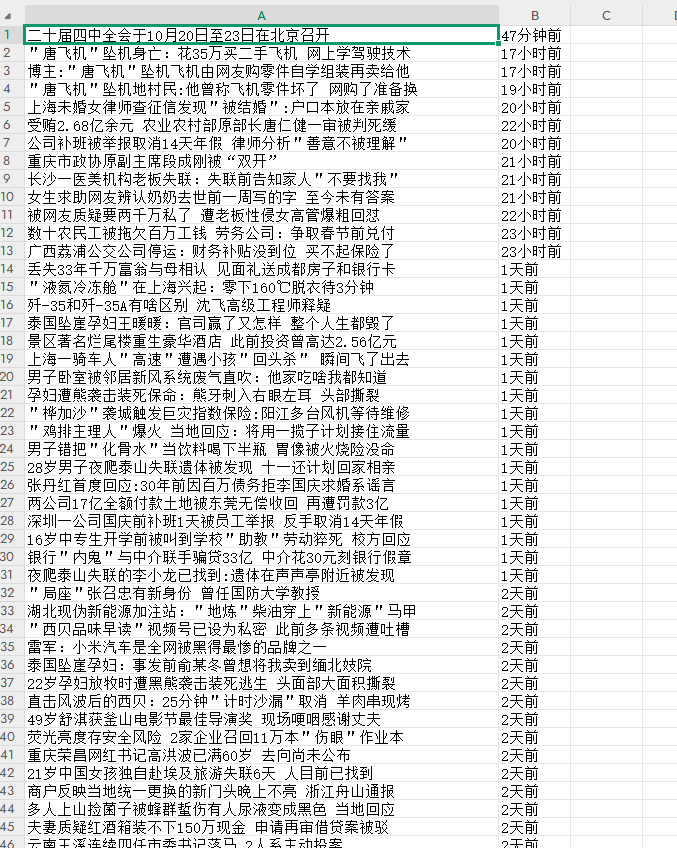

## 4.更多案例

- 微博列表页

