## 1. 应用说明
通过本应用可以实现循环翻页获取某一个网页的列表数据

## 2. 应用实现逻辑

### 模拟、分析人操作全流程

第一步：打开人民网关键词搜索”创新“的展示页面（示例网址：http://search.people.cn/s?keyword=%E5%88%9B%E6%96%B0&st=0&_=1706494865873）

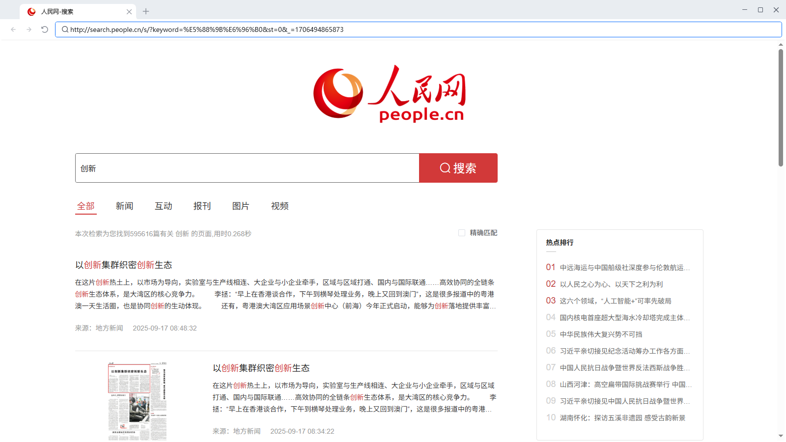

第二步：循环获取第1页每个新闻的标题和来源，并将该内容填写到表格内，直到当前页面中所有的新闻都已经循环完毕

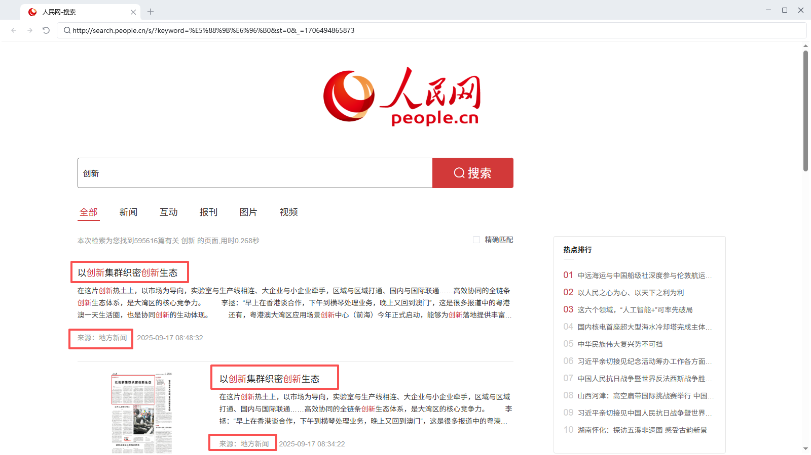

第三步：点击翻页按钮，进入第二页

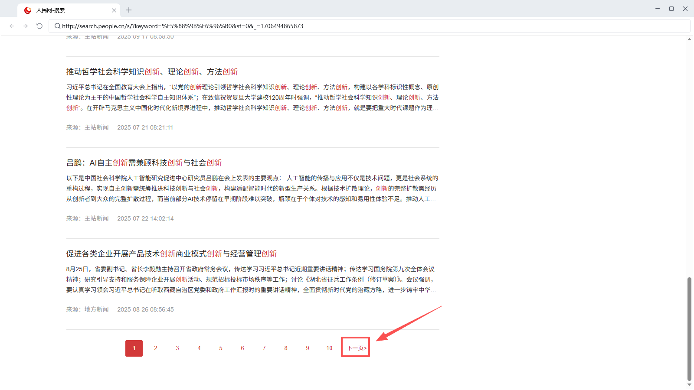

第四步：循环获取第2页每个新闻的标题和来源，并将该内容填写到表格内，直到当前页面中所有的新闻都已经循环完毕

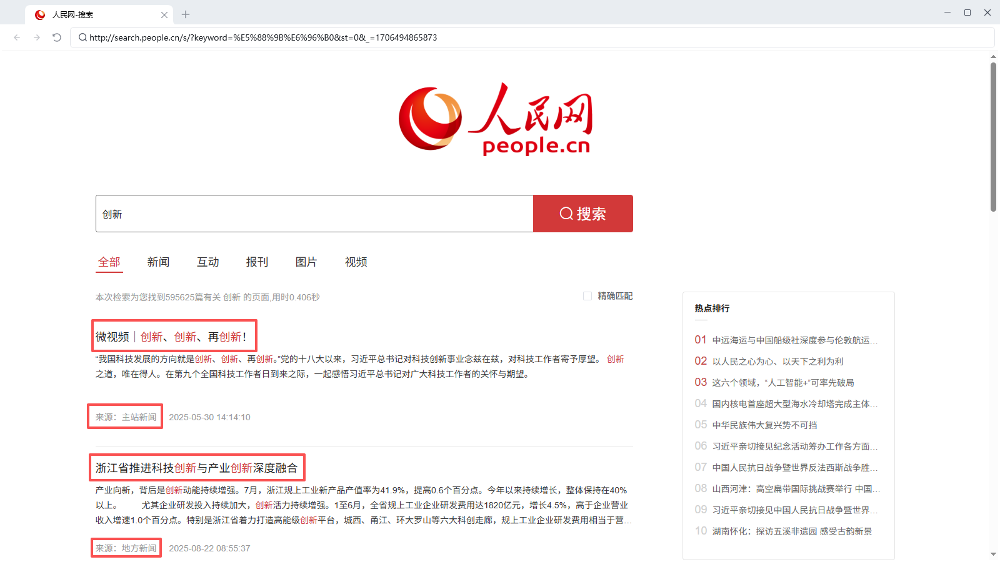

后续以此类推，直到循环结束

### RPA流程图

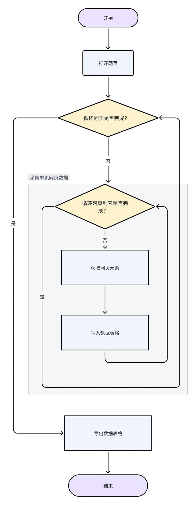

## 3. 应用实现

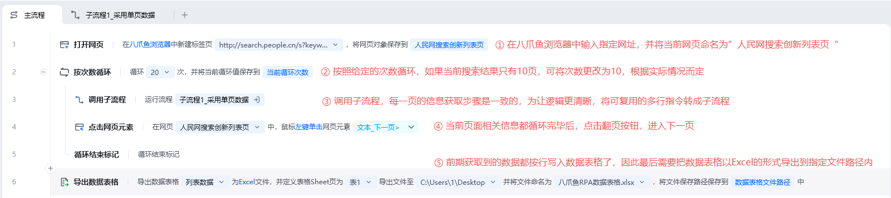

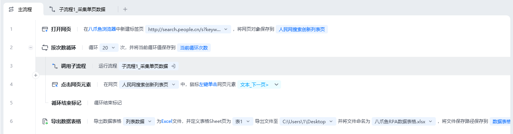

### 前期准备

在[循环采集单网页列表数据](https://skieer.feishu.cn/docx/XWLjdvpByoAqisx96iGcjDRnnZf) 中我们详细讲解了采集一页数据的方法，翻页的过程中，每一页执行采集的流程都是重复性的，为了方便我们管理查看，将采集单页数据封装在一个流程内

**截图**

**准备事项**

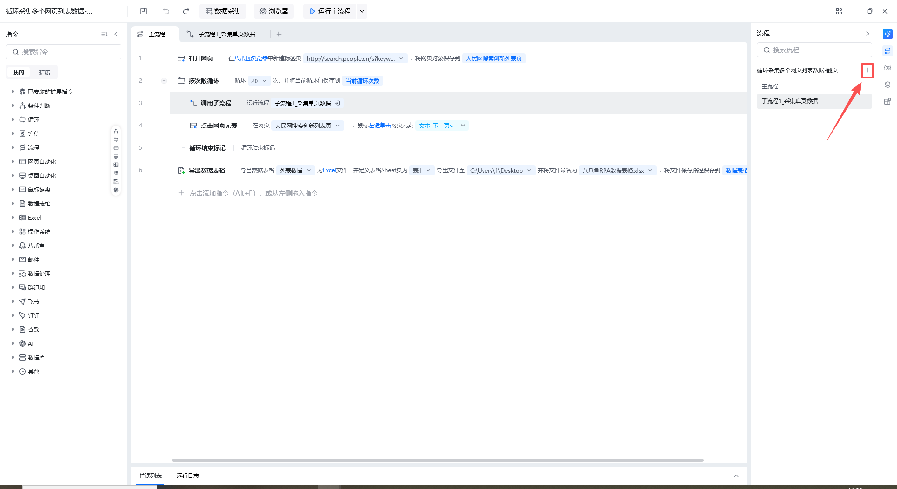

①点击流程，+号按钮，建立子流程 ②命名为”子流程1_采集单页流程“

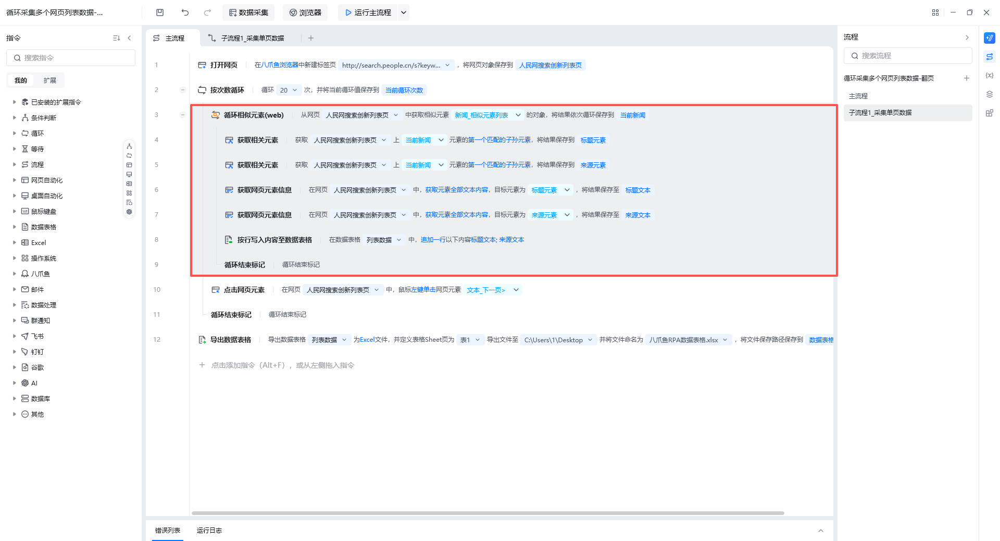

将采集的指令，按住ctrl多选，右击剪切到子流程”子流程1_采集单页流程“内

### 主流程指令解析

**指令截图**

**解析**

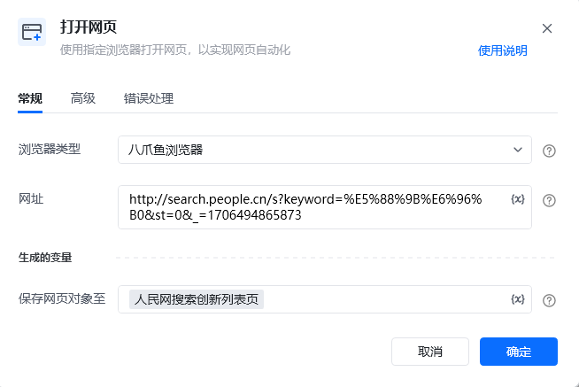

按照习惯选择常用的浏览器类型，可选八爪鱼浏览器、谷歌浏览器、Edge浏览器等，网址则填写”人民网“的网址([http://search.people.cn/s?keyword=%E5%88%9B%E6%96%B0&st=0&_=1706494865873](http://search.people.cn/s?keyword=%E5%88%9B%E6%96%B0&st=0&_=1706494865873))，最后将此网页对象命名为人民网。

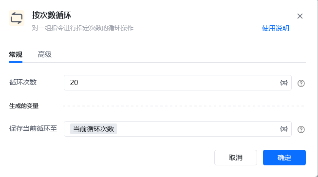

对循环体内部的指令组进行20次循环，该指令的数值可根据实际情况进行修改

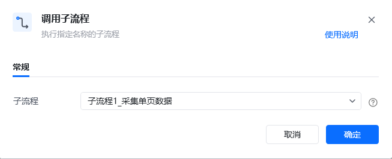

执行”子流程1-采集单页数据“

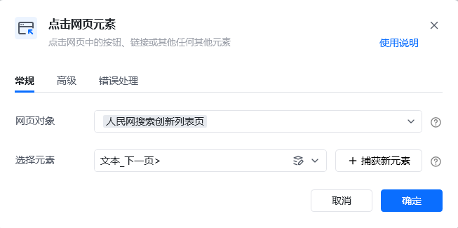

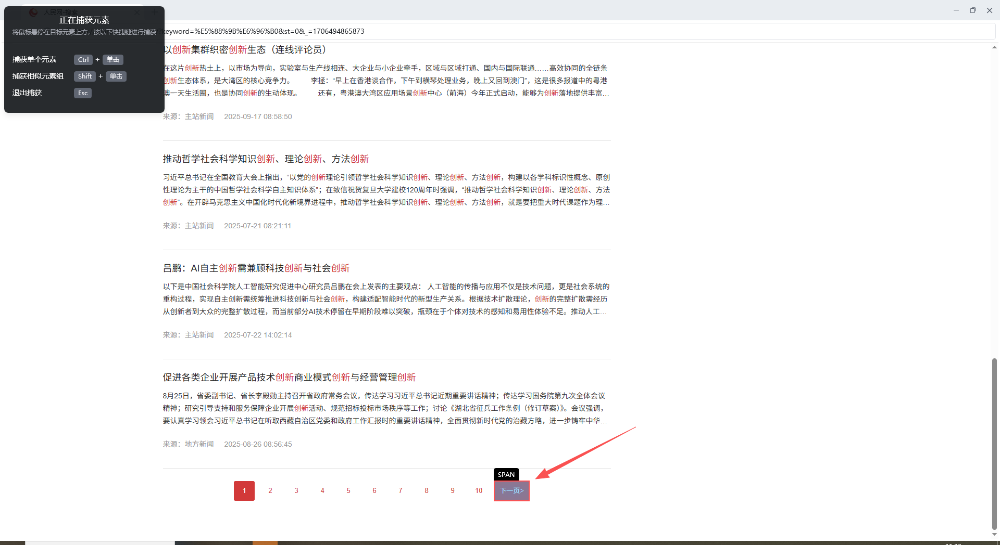

当前页面信息获取完毕后，点击”下一页“按钮，进入下一页 注：点击”捕获新元素“ ctrl+鼠标左键选中”下一页元素“

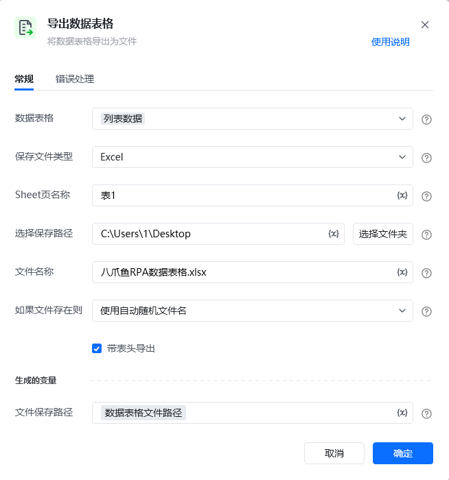

数据表格中的内容是临时存储的，下次运行后内容就会被清空。因此需要将写入数据表格的信息以Excel的形式导出并存放在指定路径中

### 子流程指令解析

[循环采集单网页列表数据-指令解析](https://rpa.bazhuayu.com/helpcenter/docs/4xgOp7#6177baa5a27fbab8a6e5ac2168c5a702)

### 运行效果

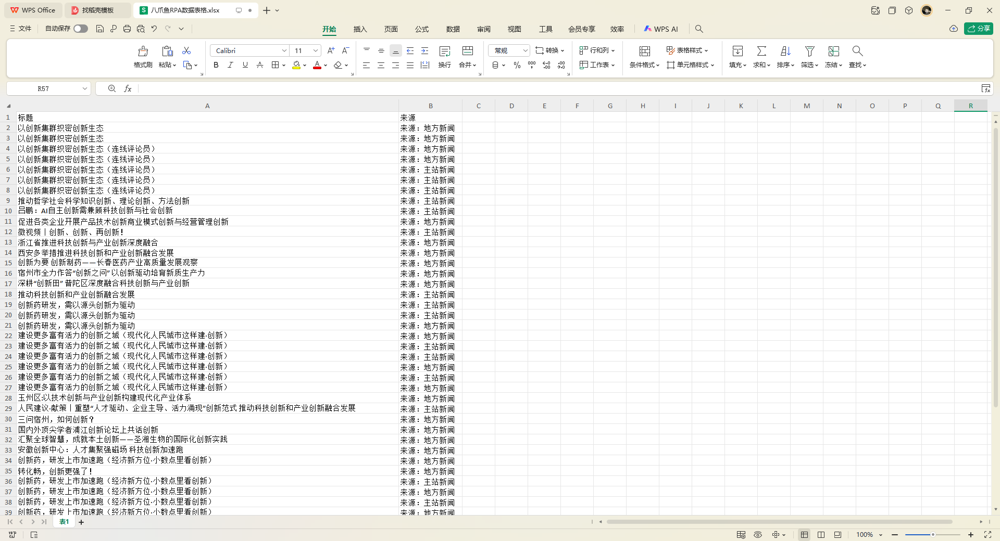

## 4. 更多案例

（采集网页多页列表数据，需要点击翻页）

天猫商城搜索列表页，需要点击翻页

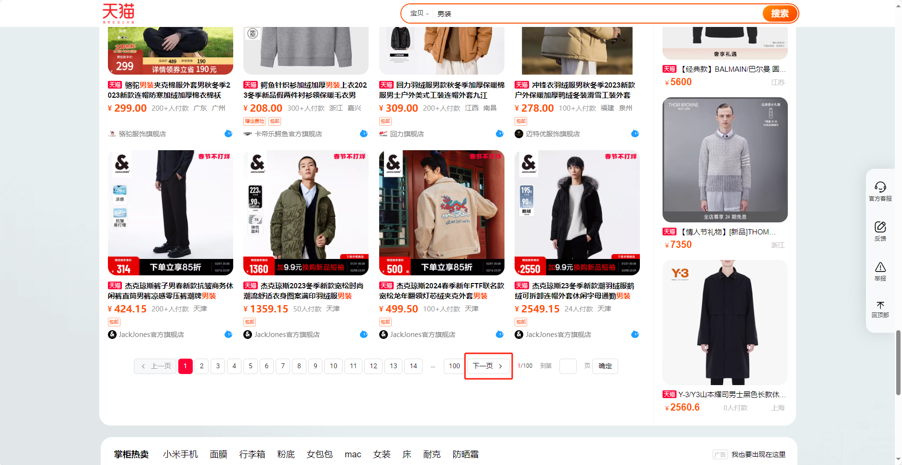

新闻网站列表数据点击加载更多

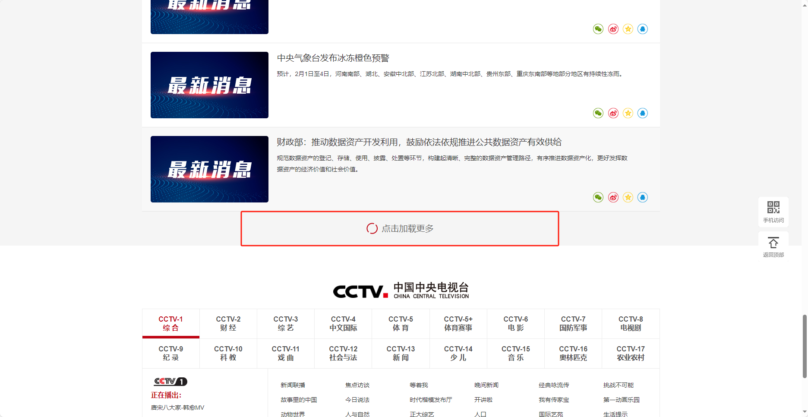

房产信息列表数据，需要点击翻页

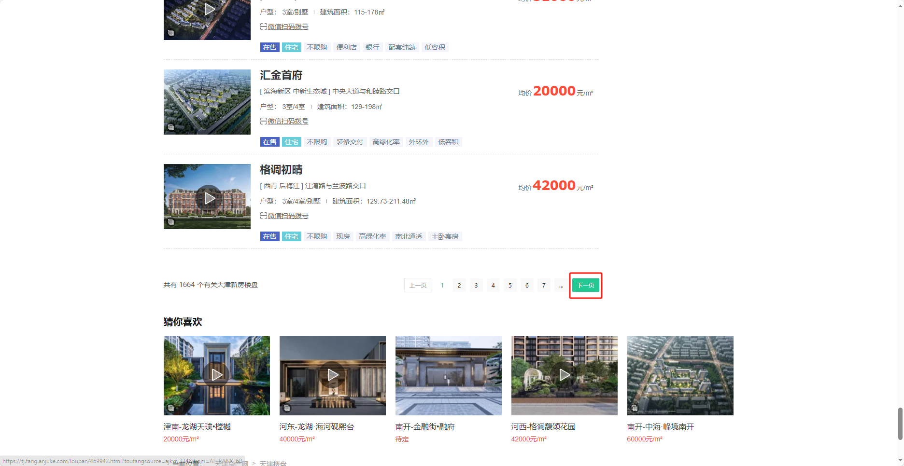
