

## 1. 什么是变量？

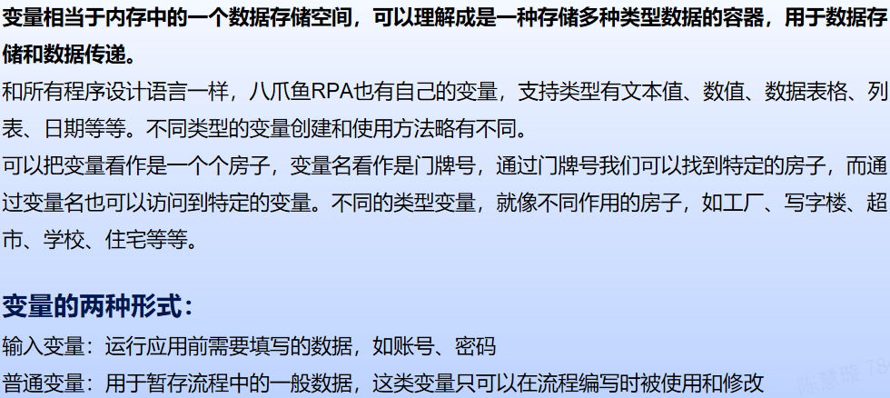

## 2. 变量的创建方式

### 2.1 方式一：运用指令创建变量

使用【新建变量】指令，可以设置变量名称、变量的数据类型以及变量值

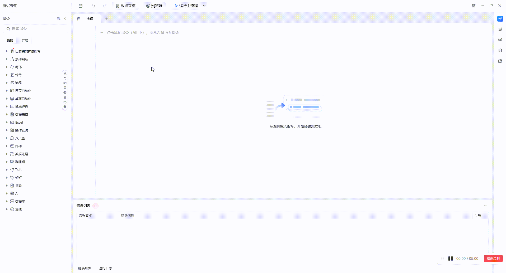

### 2.2 方式二：编辑器右侧点击“新增自定义变量”

在编辑器右侧的变量管理区，点击“新增自定义变量”，可以设置变量名称、变量的数据类型以及变量值。

同时也能设置变量类型，如果不同用户在自己电脑上需要填写不同的变量值，可将该变量类型设置为“输入变量”。

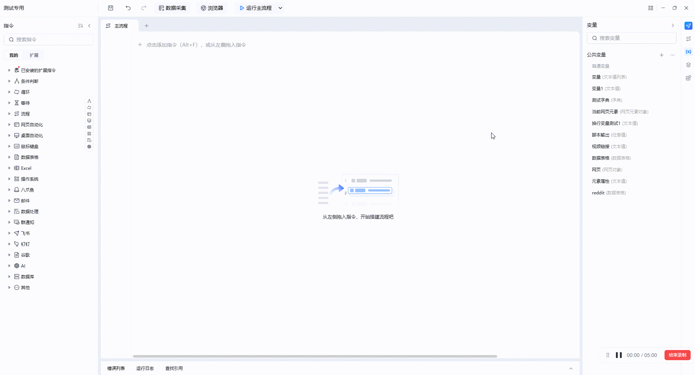

### 2.3 方式三：在流程指令中自动创建变量

将【打开网页】指令添加到指令编写区域中，在网址处输入www.baidu.com，生成的变量处，我们可将他命名为“webpage”，这样我们就在流程指令中创建了一个新的变量

## 3. 变量的数据类型

### 3.1 文本值

新建 一个“文本值”类型的变量，命名为文本变量，给该变量赋值“你好八爪鱼RPA”

操作完成后添加【显示消息通知】指令，运行主流程，变量内容会出现在屏幕顶部

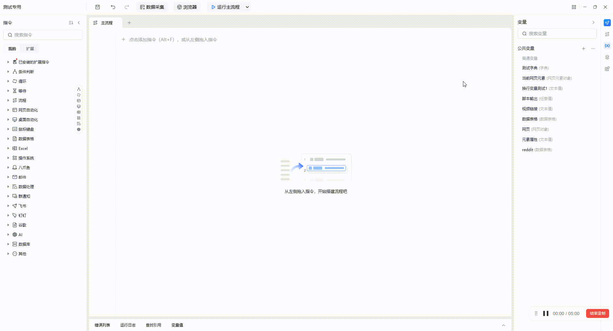

### 3.2 数值

新建 一个“数值”类型的变量，命名为数值变量，给该变量赋值“100”

操作完成后添加【显示消息通知】指令，运行主流程，屏幕顶部会出现101（因为数值变量是100，100+1得出101）

数值变量我们可以做“加减乘除”的操作

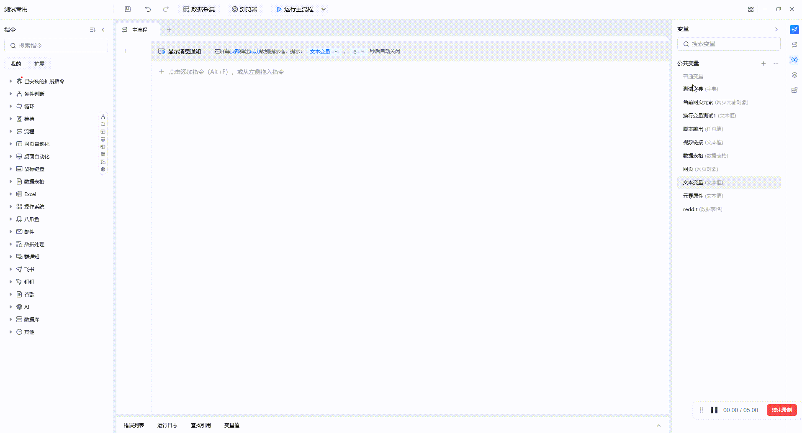

### 3.3 布尔值

布尔类型是一个逻辑值，只有true和false两种，一般用来做判断

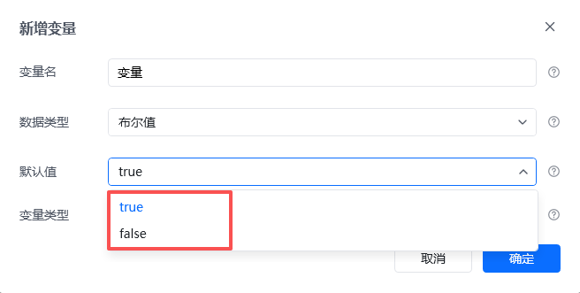

### 3.4 日期变量

通过【获取当前日期时间】指令先拿到当前的时间，nowTime的数据类型是“日期时间”

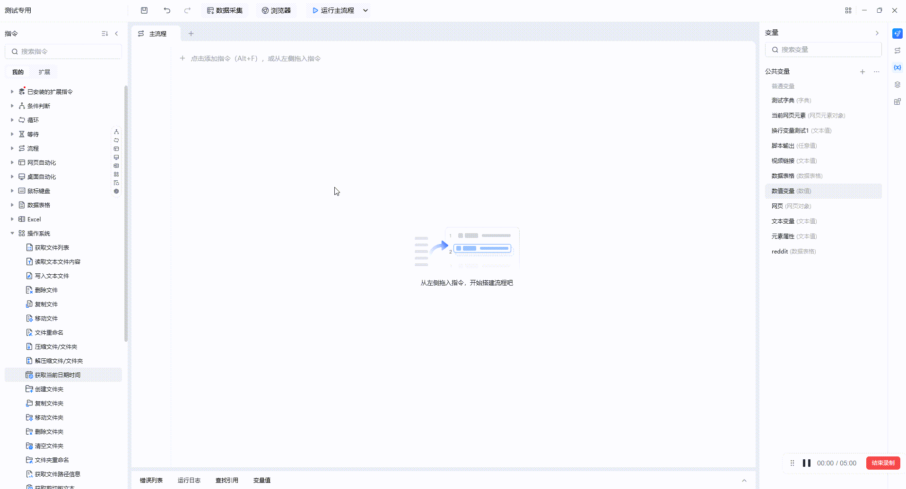

### 3.5 数据表格

数据表格相当于RPA中内置的表格，数据不会永久保留，具体可查看[数据表格的使用](https://rpa.bazhuayu.com/helpcenter/docs/4GiS1V)

### 3.6 列表、字典

支持可视化编辑，支持批量导入

## 4. 内置函数

### 4.1 获取文本长度

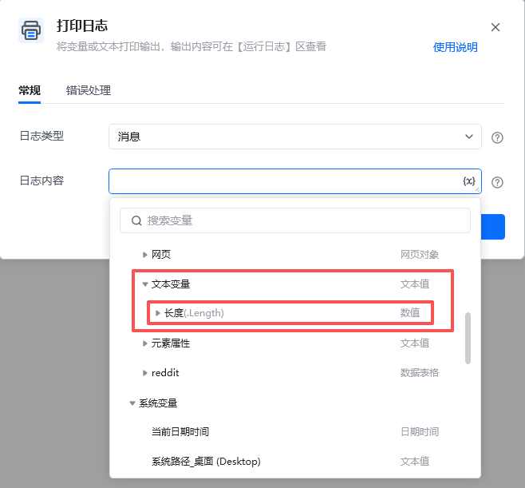

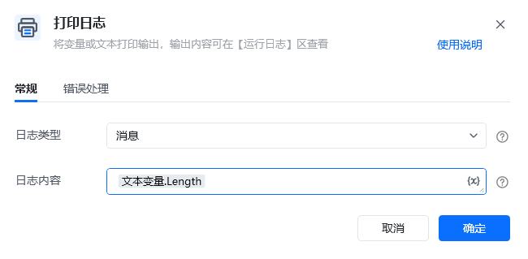

### 4.2 数值类型变量转字符串

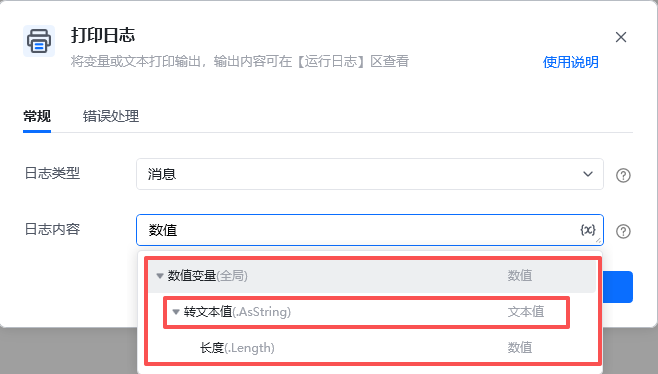

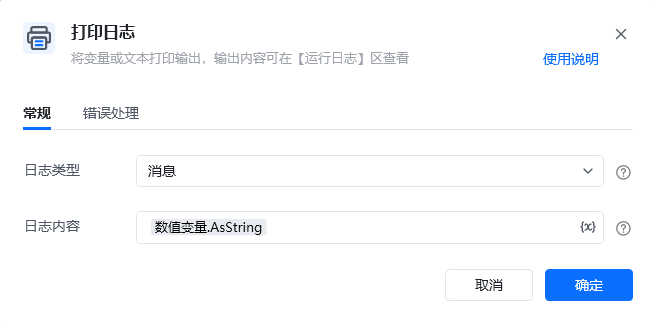

### 4.3 日期类型变量获取单独的年、月、日

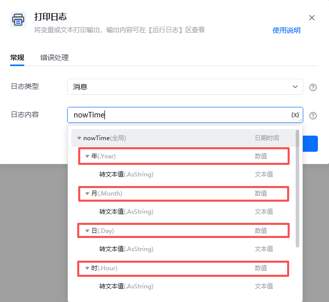

## 5.其余帮助文档

[变量分类概览](https://bazhuayu-rpa-docs.mintlify.site/guides/variables)
