<Warning>
  使用前请务必阅读：使用八爪鱼 RPA 即表示您确认并同意以下条款——本软件仅提供自动化功能，不承担与软件或数据著作权相关的任何责任。使用前，您应获得相关软件或数据的合法授权。因授权问题产生的一切纠纷及后果，由使用者承担相应责任。您承诺遵守国家网络安全法等相关法律法规，不得将本软件用于任何非法目的。
</Warning>

## 使用须知

### 系统要求

| 项目 | 要求 |
| --- | --- |
| 操作系统 | Windows 7 / 8 / 10 / 11（仅 64 位） |
| 依赖组件 | Microsoft Edge WebView2 |
| 网络 | 正常网络连接，可访问下载服务 |
| 权限 | 建议具备管理员权限，以便安装依赖组件 |

安装程序会自动检测依赖组件是否已安装。如果未安装，会自动下载安装。如自动安装失败，请参考下方安装常见问题手动处理。

### 隐私声明

- 电话、手机号、邮箱、微信号、QQ 号等各种联系方式均属于个人隐私信息，是受法律保护的敏感数据。为保障您和大家的信息安全，建议不要采集相关数据。
- 在八爪鱼 RPA 内，登录信息仅存储在本地，不会上传至服务器或第三方。

## 下载安装 RPA 客户端

安装前建议先关闭所有杀毒软件，避免安装过程被安全软件拦截。

<Steps>
  <Step title="下载安装包">
    访问[八爪鱼 RPA 下载中心](https://rpa.bazhuayu.com/download)，下载八爪鱼 RPA 安装文件（.exe 格式），获取最新版本程序。

    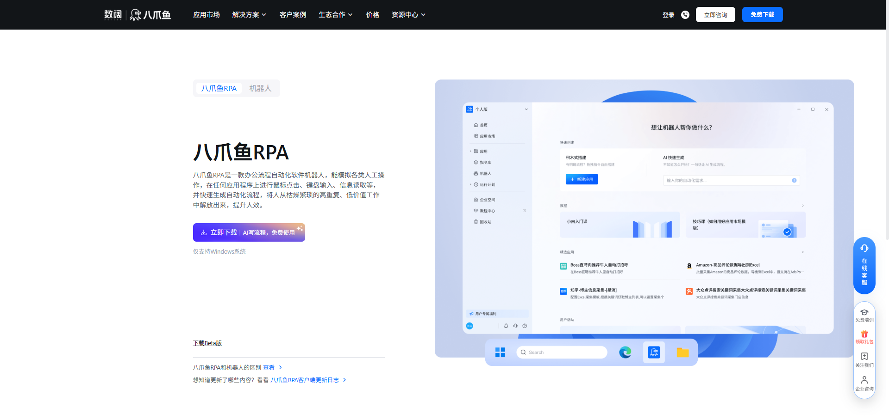
  </Step>
  <Step title="运行安装程序">
    双击 .exe 文件开始安装。安装程序会自动检测并安装缺失的依赖组件（.NET Framework 4.8、Edge WebView2）。
  </Step>
  <Step title="完成安装">
    安装完成后，在开始菜单或桌面上找到 八爪鱼 RPA 快捷方式。

    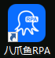
  </Step>
  <Step title="登录启动">
    启动八爪鱼 RPA，使用您的账号登录。首次启动后即可进入主界面，开始搭建您的第一个自动化流程。
  </Step>
</Steps>

安装完成后，桌面应出现八爪鱼 RPA 图标，双击即可启动。

## 安装常见问题

<AccordionGroup>
  <Accordion title="0x80070490 - 找不到元素">
    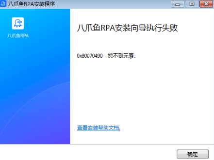

    原因：.NET Framework 4.8 未安装或安装不完整。

    解决办法：手动下载 .NET Framework 4.8 离线安装包。

    Win7 系统额外步骤：

    1. 确保系统是 Win7 SP1。如果不是，请先安装 Win7 SP1（x64）补丁
    2. 双击安装 Microsoft 根证书

    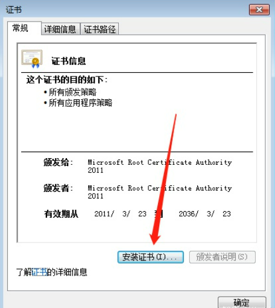

    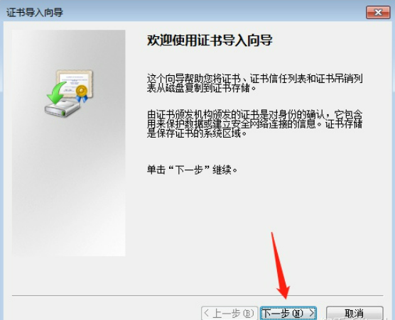

    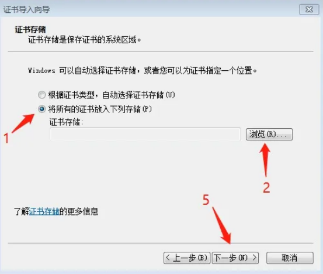

    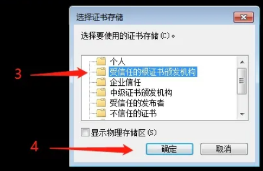

    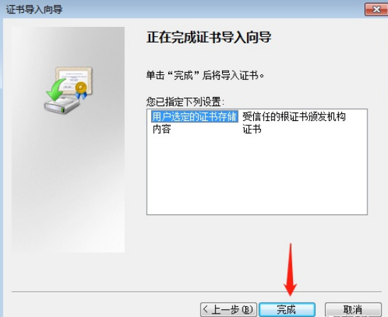
    3. 安装 KB2813430 补丁（解决时间戳签名或证书无法验证问题）
    4. 重启电脑后安装 .NET Framework 4.8

    下载链接：[Microsoft .NET Framework 4.8 安装包](https://update.bazhuayu.com/rpa_client/ndp48-x86-x64-allos-enu.exe)
  </Accordion>

  <Accordion title="0x80070643 - 安装时发生严重错误">
    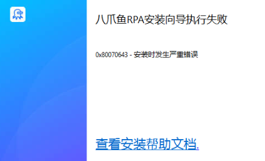

    可能原因：杀毒软件阻止安装，或 Edge WebView2 组件在线安装失败。

    解决办法：检查后台运行的杀毒软件，关闭后重试。如 WebView2 安装失败，请手动下载安装包。

    下载链接：[Microsoft Edge WebView2 安装包](https://update.bazhuayu.com/rpa_client/MicrosoftEdgeWebView2RuntimeInstallerX64.exe)
  </Accordion>

  <Accordion title="提示：您已安装更新版本的客户端">
    打开控制面板 → 程序和功能，检查当前已安装的八爪鱼 RPA 版本：

    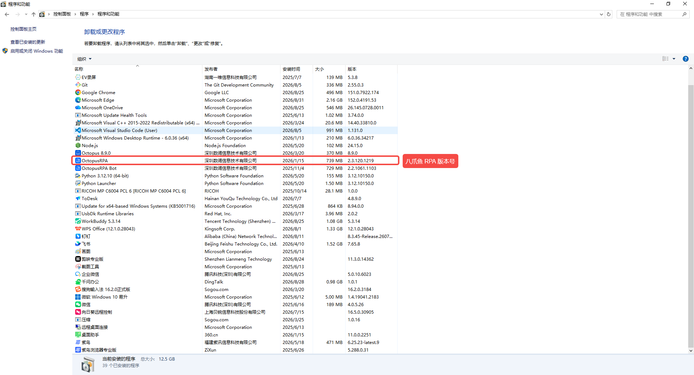

    如果想安装更低版本，请先卸载当前版本，再重新安装。如果想安装当前版本，忽略该提示即可。
  </Accordion>
</AccordionGroup>

## 可选：安装 RPA 机器人

<Note>
  前期不需要安装机器人。个人用户使用 RPA 客户端即可满足日常开发与执行需求。
</Note>

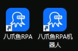

八爪鱼 RPA 客户端集成了设计器、执行器和控制器（三器合一）。RPA 机器人是独立的纯执行器，仅在以下场景考虑安装：

- 需要在多台设备上同时运行多个自动化流程
- 企业版用户需要扩展运行器数量、实现分布式执行

机器人属于付费功能，详情请参见 [八爪鱼 RPA 定价](https://rpa.bazhuayu.com/plan)。如需安装，访问[八爪鱼 RPA 下载中心](https://rpa.bazhuayu.com/plan)，选择"机器人"下载对应安装包。安装后登录有机器人使用权限的账号，即可在客户端的机器人模块中管理和调度运行。

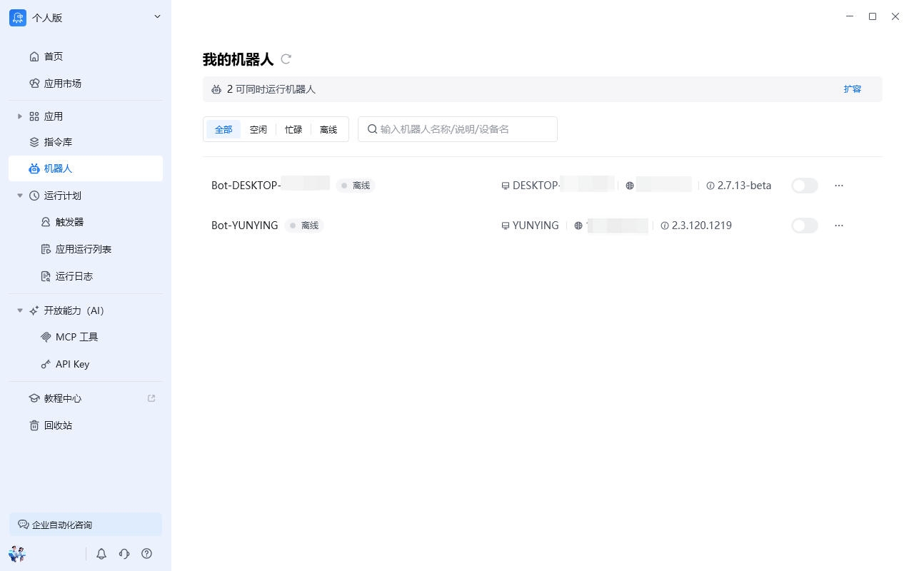

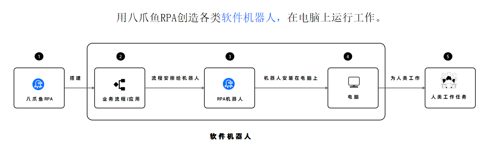

## 下一步

- 跟随 [第一个自动化流程](/getting-started/first-workflow) 完成实操入门
- 了解 [流程编排](/guides/workflow) 的核心概念
