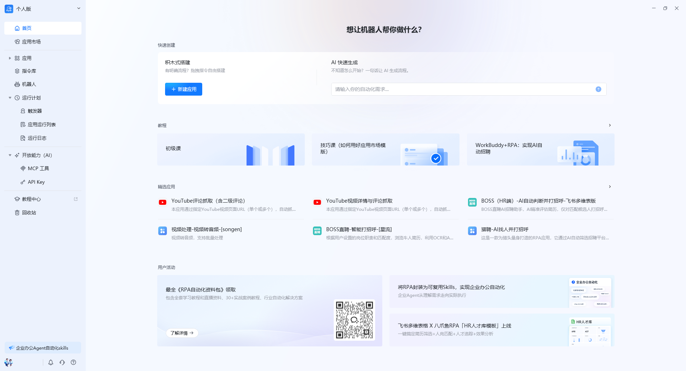
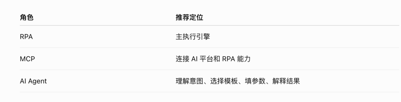
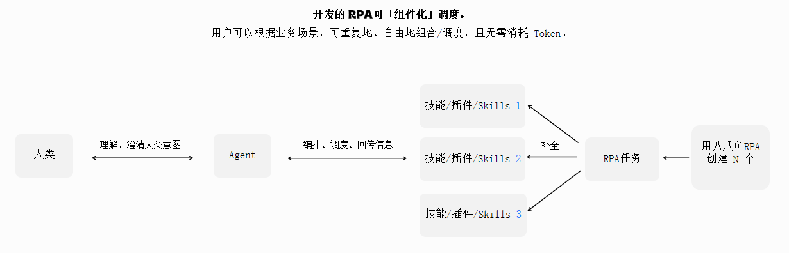
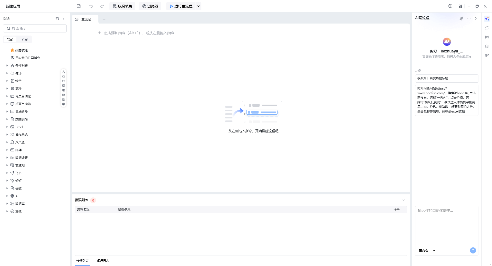
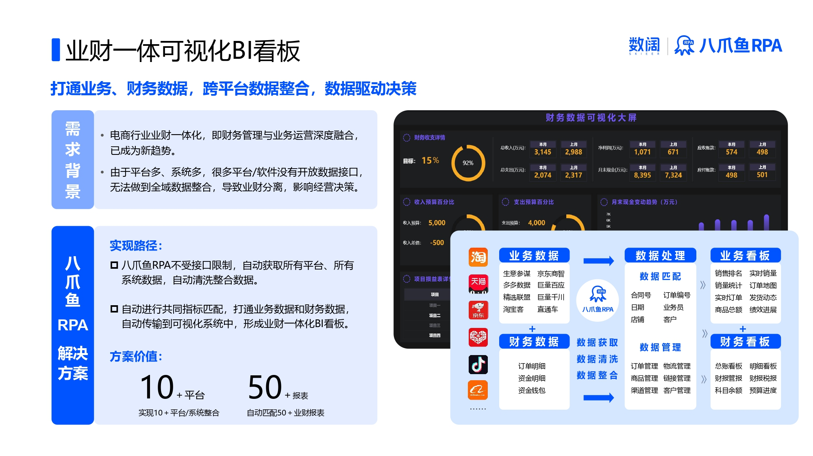
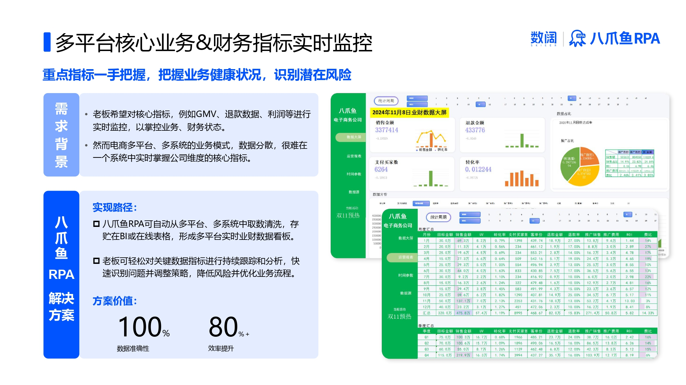
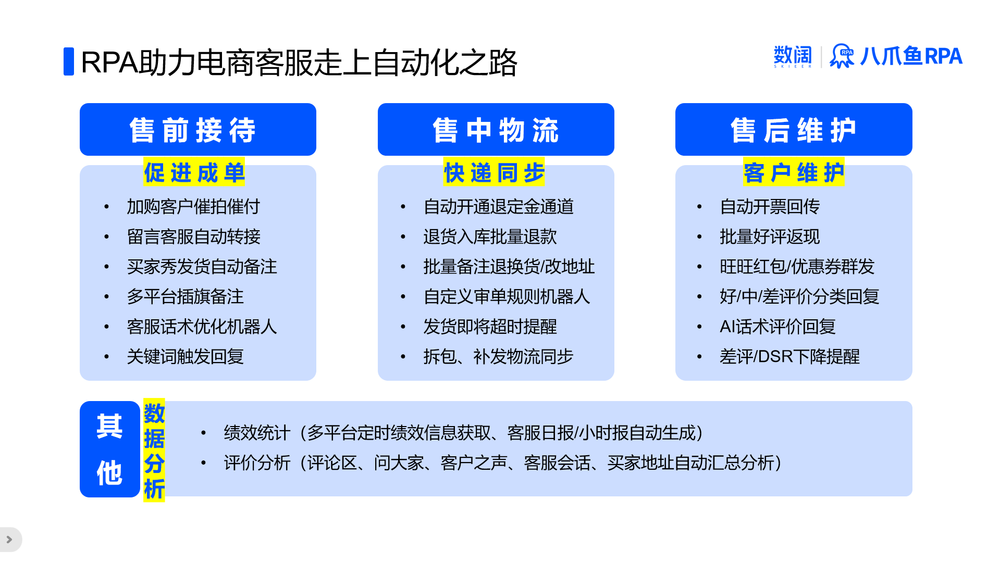
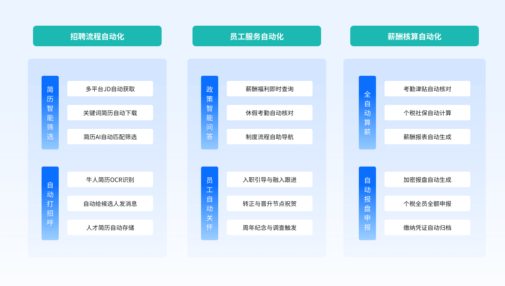
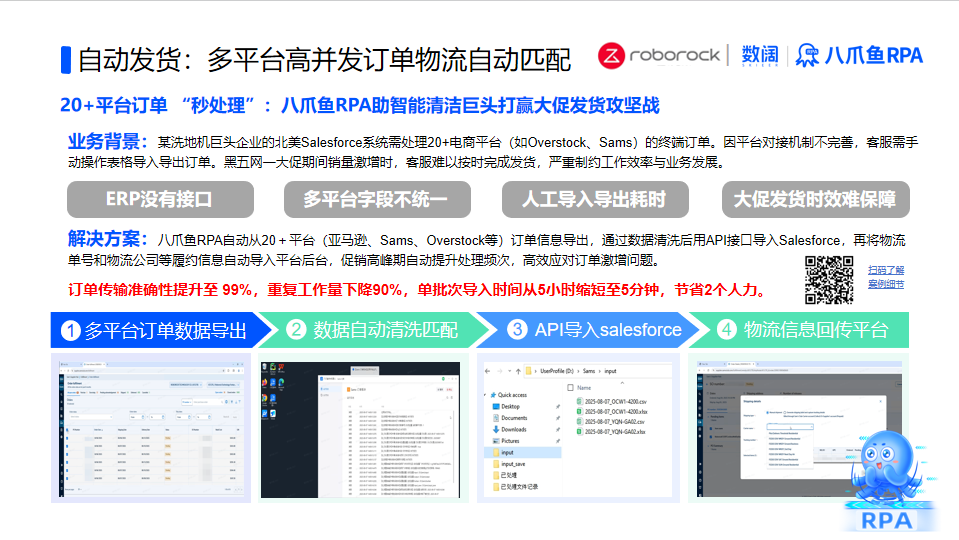
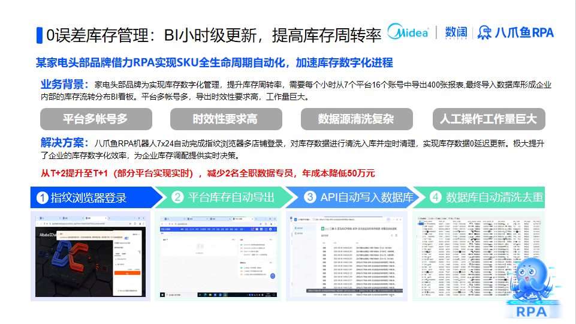

**八爪鱼RPA** 是一款办公流程自动化软件机器人，能模拟各类人工操作——鼠标点击、键盘输入、信息读取、数据搬运——将人从枯燥繁琐的高重复、低价值工作中解放出来，提升人效。

## 什么是 RPA？

RPA（*Robotic Process Automation*，机器人流程自动化）是一种通过软件机器人模仿人类操作的技术，专注于重复性、基于规则的任务。RPA 无需修改现有系统，即可在多个应用程序间自动执行操作，我们可以把它形象地理解为 **"数字员工"**。

<Info>
  一句话理解：RPA 就是教电脑学会你在电脑上的操作——打字、点击、复制粘贴——然后让它代替你完成这些枯燥的工作，全天候运行，不知疲倦，零出错。
</Info>

## AI + RPA

把 AI Agent 与 RPA 结合起来，自动化就从“按固定脚本执行”进化到“听得懂人话、会自己拆任务、能调用工具执行”。

- **AI Agent（智能体）**：负责理解你的意图、澄清需求、思考拆解步骤、选择最合适的工具，并解释执行结果。
- **MCP（模型上下文协议）**：相当于 Agent 与外部工具之间的“通用接口”。通过 MCP，Agent 可以像调用函数一样调用 RPA 能力。
- **RPA（八爪鱼 RPA）**：作为**主执行引擎**，负责把 Agent 的指令真正落地——点击、输入、读取数据、跨系统搬运、定时运行。

在八爪鱼 RPA 中，你可以把常用的自动化流程开发成模板，这些模板再通过 MCP 协议变成 Agent 可调用的“技能/插件/Skills”。Agent 接到任务后，判断该调用哪个 RPA 技能、补全参数，RPA 则稳定可靠地完成具体操作，并把结果回传给 Agent。

**一句话理解**：Agent 是“大脑”，负责想；RPA 是“手脚”，负责做；MCP 是“神经”，负责传话。人类只需要说目标，剩下的交给它们协作完成。

## RPA 的工作原理

RPA 应用通过模仿人工操作，按预定规则自动执行任务。整个工作流程可以归纳为以下五个环节：

<Steps>
  <Step title="确认流程">
    业务人员分析业务流程，识别适合自动化的任务和步骤。关键是明确输入数据、操作逻辑和预期输出。
  </Step>
  <Step title="开发机器人">
    使用 RPA 软件按流程图搭建机器人，设置规则、参数和操作步骤。八爪鱼 RPA 支持拖拽式搭建，零代码完成开发。
  </Step>
  <Step title="模拟人工操作">
    RPA 模拟用户在计算机系统中的操作——键盘和鼠标活动，自动与网页、系统进行交互，如同真人在操作。
  </Step>
  <Step title="数据处理">
    RPA 可处理和清洗多种数据格式，执行数据提取、转换、校验，确保数据的准确性和一致性。
  </Step>
  <Step title="异常处理">
    执行过程中自动识别异常，按预设的错误处理流程响应——重试、跳过、或通知人工介入。
  </Step>
</Steps>

## RPA 的应用领域

RPA 技术在各个行业都有广泛的应用，涉及财务、金融、人事、社媒、保险、制造、医疗等多个领域。以下按行业梳理典型场景与价值：

| 行业 | 典型场景与价值 |
| --- | --- |
| 财务和会计 | 自动处理发票、报销单、执行财务核算；自动化税务申报、核对账单、监测异常交易，提升财务合规性，减少人为错误 |
| 金融 | 实现自动化的信贷审批流程 |
| 医疗领域 | 实现自动化患者信息管理 |
| 供应链管理 | 自动执行订单处理、库存管理，实现物流自动化，监控供应链风险 |
| 业务流程外包 | 接手标准化流程，提升效率，降低人力成本 |
| 零售行业 | 优化订单处理流程，支撑多平台商品与库存同步 |
| 银行、电信、制造 | 自动化员工信息更新与客户咨询的自动回复 |
| 人力资源管理 | AI + RPA 优化招聘流程、自动化管理员工福利等 |

RPA 技术正不断拓展应用边界，为各行业带来变革。下面以几个典型领域为例，展示 RPA 的实际应用方式。

### 财务与会计处理

在财务领域，RPA 可用于处理发票、报销单和账务核对等任务。机器人能够自动提取、验证和录入数据，大幅减少手动处理时间，同时降低因人为错误导致的财务差错。

例如，RPA 可以自动读取发票信息并与账务系统匹配，生成准确的财务报表；还可以获取各电商平台的业务数据与财务数据，自动传输到可视化系统，形成业财一体看板。

### 客户服务

在客户服务领域，RPA 可用于处理大量客户查询与数据录入工作，在提高响应速度的同时，降低人工输入可能发生的错误。

例如，机器人可以自动回答常见问题，处理客户提供的信息并将其更新到数据库中，实现多平台客服工单的整合与自动分配。

### 人力资源流程

在人力资源管理中，RPA 可应用于招聘流程、员工福利管理等环节，让人力资源团队将更多时间投入员工互动、战略规划与人才发展等更具价值的工作。

例如，机器人可以自动筛选简历、安排面试，以及处理员工福利申请与记录。

> 试用相关模板，可前往 [应用市场—人事板块](https://rpa.bazhuayu.com/appstore/categories/%E4%BA%BA%E4%BA%8B)。

### 供应链与订单处理

在供应链管理中，RPA 可以自动执行订单处理、库存管理等任务，在不同系统之间协调信息，确保订单及时处理、库存准确管理。通过 RPA，企业能够降低订单处理时间、减少库存误差，从而提高整个供应链的运行效率。

### 物流和仓储管理

RPA 在物流领域的应用包括订单处理、货物追踪和库存管理，能够提升供应链整体效率。通过实时监控与快速响应，企业可以更灵活地满足客户需求。

### 采购流程管理

通过 RPA 实现采购流程自动化，包括供应商信息管理、采购订单生成和发票处理，企业可以优化供应链、降低采购成本，同时确保高效的物资供应。

## AI 写流程

八爪鱼RPA 内置 AI 助手，只需用自然语言描述业务需求，即可智能生成可执行的自动化流程，大幅降低 RPA 上手门槛。

<iframe src="//player.bilibili.com/player.html?isOutside=true&aid=116442083100387&bvid=BV1WodSBXEKZ&cid=37690936552&p=1" scrolling="no" border="0" frameborder="no" framespacing="0" allowfullscreen="true"></iframe>

## RPA 的核心特性

<CardGroup cols="2">
  <Card title="模仿人的操作">
    通过指令记录人在电脑上的操作，生成流程步骤；软件再按人的思维执行每一步，实现自动化。
  </Card>
  <Card title="跨平台跨应用">
    大部分系统平台或应用程序，RPA 皆可自动操作、提取和处理数据，实现不同应用间的连续性操作与数据流转。
  </Card>
  <Card title="零代码开发">
    面向自然语言的开发方式，无需编程基础——通过指令块的点击拖拽即可搭建应用，小白也能上手。
  </Card>
  <Card title="图形化界面">
    提供可视化的编辑界面，通过指令块拖拽搭建流程，可视化选取网页/窗口元素，所见即所得。
  </Card>
  <Card title="执行过程可视化">
    在前端窗口显示整个操作过程，每个流程步骤生成实时日志。内置浏览器支持静默操作。
  </Card>
  <Card title="与 AI 深度结合">
    内置主流大语言模型、自动识别验证码、OCR 识别。支持 AI 写流程——用自然语言描述需求，AI 即可智能生成完整的可执行流程。
  </Card>
</CardGroup>

## RPA 的业务优势

<CardGroup cols="2">
  <Card title="降本增效，敏捷速赢">
    RPA 作为不知疲倦的数字员工，短时间内完成大量任务，无需沟通成本、工资福利或休息时间，有效降低人力成本。
  </Card>
  <Card title="提升合规性，减少风险">
    严格按照预设指令执行，减少人为错误，提高数据处理准确性，避免人为操作引发的潜在风险。
  </Card>
  <Card title="规范业务流程">
    日常业务数字化、信息化更稳定，不易受人员变动影响。驱动复杂问题简单化、简单问题流程化、流程问题自动化。
  </Card>
  <Card title="解放劳动力">
    使员工从繁琐重复任务中解脱，更多精力投入创新性、分析性、决策性工作，为企业带来更多创新与增值。
  </Card>
</CardGroup>

## 产品构成：RPA 客户端与 RPA 机器人

八爪鱼 RPA 提供两款软件，协同完成流程开发与自动化执行。

| 对比维度 | RPA 客户端 | RPA 机器人 |
| --- | --- | --- |
| 角色 | 设计器 + 执行器 + 控制器 | 纯执行器 |
| 功能 | 流程编辑、调试、执行、日志、机器人管理、企业空间 | 仅执行流程应用 |
| 并发 | 支持管理多个机器人 | 单次运行一个流程 |
| 适用 | 日常开发与调试 | 多设备分布式执行 |
| 扩展 | 三器合一，全能型软件 | 多台设备安装，同时运行多个流程 |

> 首次使用请先安装 RPA 客户端（详见 [安装与部署](/getting-started/install)），它集成了流程开发、执行与管理所有功能。后续可以在不同设备上安装 RPA 机器人，实现多流程并行执行。

**适用对象**：需要把重复性操作自动化的业务或运营人员 · 希望减少手工操作的团队 · 需要跨系统数据串联的使用者 · 推动数字化转型的企业

## 下一步

- 阅读 [安装与部署](/getting-started/install) 完成 RPA 客户端部署
- 跟随 [第一个自动化流程](/getting-started/first-workflow) 完成实操
- 前往 [八爪鱼RPA 官网](https://rpa.bazhuayu.com/) 了解更多解决方案
