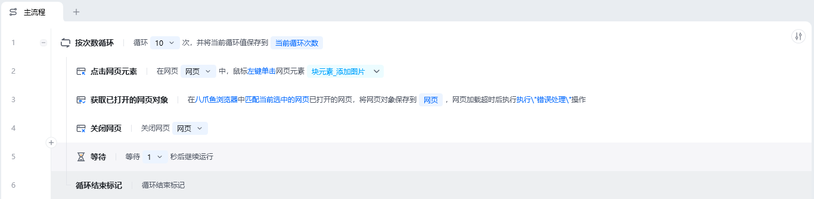
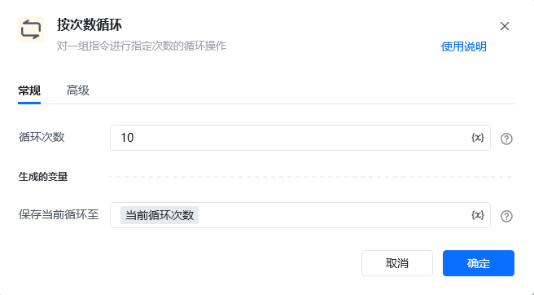

> 面对大量重复、有规律的点击与采集操作，如果一步步手动堆指令会非常繁琐且难以维护。循环指令让流程“自动重复”同一段操作，是批量处理任务的核心能力。

## 1. 什么是循环

针对许多具有规律性的重复操作，在流程中就需要重复执行某些指令。理解循环，先记住三个基本概念：

- **循环体**：一组被重复执行的语句，也就是“每次都要做的事情”。
- **循环的终止条件**：决定当前能否继续重复，不能则终止。
- **循环语句**：循环体 + 循环的终止条件。

用生活化的比喻：循环体就像“给一个人发一封邮件”，终止条件就像“名单里还有没有人没发”，两者合起来就是“把名单里所有人各发一封邮件”这个循环。

## 2. 八爪鱼RPA中常见的循环类型

八爪鱼RPA提供了多种循环指令，初学者最常用的是以下三种：

### 列表循环（Loop through list）

<strong>描述：</strong>依次取出列表中的每一个元素，把“当前循环到的元素”作为一个变量，在循环体内重复使用。适用于“对一批关键词 / 一批网址分别做相同操作”的场景。

**使用示例**：准备一个包含多个关键词的列表（如 ["AI", "运营"]），循环时按顺序取出每一项，把当前项命名为“当前关键词”，在循环体内用“当前关键词”去搜索。列表循环会自动把每一项都跑一遍。

### 次数循环（Loop by count）

<strong>描述：</strong>把循环体内的指令按指定次数重复执行。适用于“明确知道要重复多少次”的场景，例如翻固定的页数、生成固定数量的文件。

### 条件循环（Loop while）

<strong>描述：</strong>当某个条件成立时持续循环，条件不成立时停止。适用于“不知道具体次数，直到满足某条件才停”的场景，例如一直翻页直到网页上不再出现“下一页”按钮。

## 3. 循环中的重要约定

- **循环结束标记**：每个循环指令都会自动连带“循环结束标记”指令，用来标记循环体的结束位置。该指令不需要输入参数，也不能删除，否则会报错。所有“需要重复执行”的指令，都要放在循环开始指令和循环结束标记之间。
- **循环的控制**：在循环体内，还可以使用【继续下一次循环】和【退出循环】来精确控制走向：
  - **继续下一次循环**：跳过当前这项剩下的步骤，直接进入下一个循环项。例如“标题不包含某关键词就不采集，直接看下一条”。
  - **退出循环**：满足某个条件后，提前结束整个循环。例如“翻到最后一页就停止翻页”。

<Info>
  想查看各循环指令的完整参数与文档，可前往：[列表循环](https://bazhuayu-rpa-docs.mintlify.site/commands/loop/foreachcommand)、[次数循环](https://bazhuayu-rpa-docs.mintlify.site/commands/loop/loopbycountcommand)、[条件循环](https://bazhuayu-rpa-docs.mintlify.site/commands/loop/whilecommand)、[循环结束标记](https://bazhuayu-rpa-docs.mintlify.site/commands/loop/endloopcommand)、[继续下一次循环](https://bazhuayu-rpa-docs.mintlify.site/commands/loop/continuecommand)、[退出循环](https://bazhuayu-rpa-docs.mintlify.site/commands/loop/breakcommand)。
</Info>
