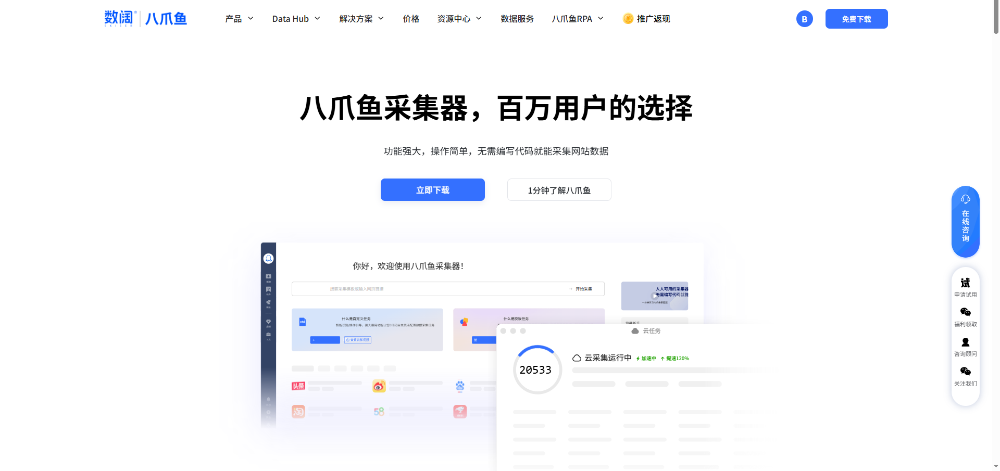
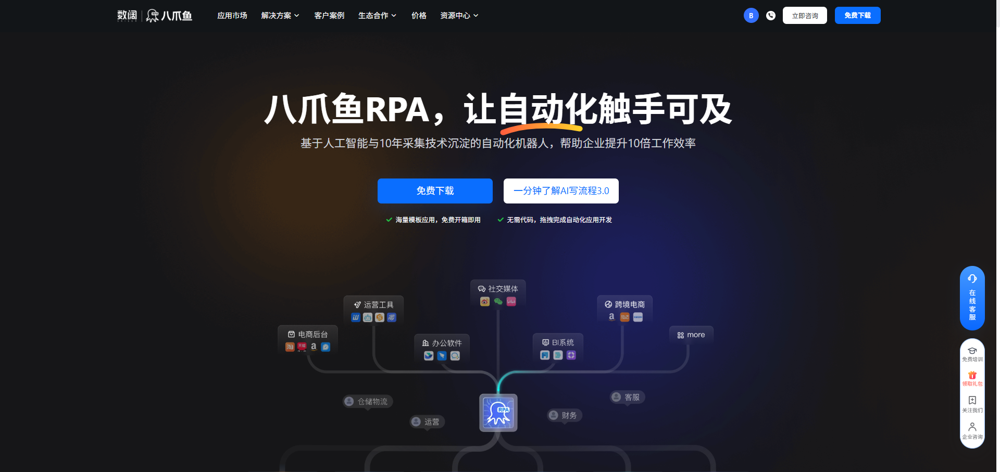

八爪鱼RPA和八爪鱼采集器是同一公司开发的两个产品，但它们的功能和应用场景不同。

## 八爪鱼采集器

八爪鱼采集器是一款网页数据智能采集软件，主要用于采集互联网上的数据。它拥有强大的网页采集功能，用户可以通过设置采集规则，自动抓取网页上的信息，并可以对采集到的数据进行处理和存储。它可以应用于数据挖掘、市场调研、竞争情报等领域。

官网：[https://www.bazhuayu.com/](https://www.bazhuayu.com/)

## 八爪鱼RPA

八爪鱼RPA是一款基于机器人流程自动化（RPA）技术的软件，主要用于自动化执行重复性、繁琐的业务流程。八爪鱼RPA可以模拟人类的操作步骤，通过图形界面来录制和编辑自动化任务，并可以自动执行这些任务。它能够实现自动处理电子表格数据、网站数据采集、自动填写表单、模拟鼠标键盘操作等，提高工作效率，降低操作成本。

官网：[https://rpa.bazhuayu.com/](https://rpa.bazhuayu.com/)

## 一句话区分

- **八爪鱼采集器**：专注**网页数据采集**，帮你把网页上的信息抓下来。
- **八爪鱼RPA**：专注**业务流程自动化**，帮你把电脑上的重复操作自动跑起来。

可以看出，八爪鱼RPA主要用于自动化业务流程，而八爪鱼采集器主要用于数据采集。它们在功能和应用场景上有所不同，但都可以为用户提供效率和便利。
