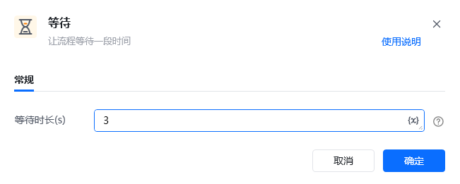

> 流程执行速度往往比网页加载速度快得多。如果不加等待，常常会出现“网页还没出来，下一步就点击了”的问题。等待指令让流程“停一停”，等网页或元素就绪后再继续，是让流程稳定不报错的关键。

## 1. 为什么需要等待指令

- **网页加载需要时间**：打开网页、点击按钮后，页面内容可能是异步加载的，瞬间未必就绪。
- **元素可能动态出现**：部分内容由 JavaScript 动态生成，只有等它出现才能准确提取。
- **节奏更像真人**：在连续快速操作中适当加入等待，可以降低被网站识别为机器、从而被拦截的概率。

## 2. 指令说明

### 固定时长等待

<strong>描述：</strong>让流程暂停指定的时长，再执行往下的流程指令。适用于“大概等几秒就够”的简单场景，例如等待页面初步渲染完成。

**参数**：等待时长（单位按指令设置填写，常见为毫秒或秒）。

### 等待网页内容

<strong>描述：</strong>等待指定元素或文本在网页中出现 / 消失后，再执行后续流程。若在超时时间内出现，立即往下执行；若未出现，则每隔一小段时间（约 0.2 秒）重新判断一次，直到达到设置的超时时间。

| 参数 | 说明 |
| --- | --- |
| **网页对象** | 选择一个之前通过【打开网页】或【获取已打开的网页对象】指令创建的网页对象 |
| **等待网页是否** | 选择等待目标：包含元素、不包含元素、包含文本、不包含文本 |
| **选择元素 / 文本** | 从元素库中选择已捕获的元素，或直接输入要等待出现的文本 |
| **超时时间(s)** | 最长等待秒数；达到后元素 / 文本仍未出现，将停止等待并继续往下执行 |

<strong>注意：</strong>超时时间默认勾选，不建议取消。若不设置超时，流程可能一直等待、卡住不动；若目标会较长时间才出现，可把超时时间设大一些。

## 3. 使用示例

**该流程执行逻辑：**

【打开网页】打开 www.baidu.com 网页

【等待网页内容】等待“个人中心”元素出现（设置合理超时时间）

元素出现后，【点击网页元素】点击“个人中心”

### 使用场景小结

- **网页加载较慢时**：等待页面完全加载后再操作，避免点到不存在的元素。
- **元素动态加载时**：等待目标元素出现再提取，确保数据不漏采。
- **连续快速操作时**：适当加入等待，使操作节奏更像真人，降低被网站拦截的概率。

<Info>
  想查看各等待指令的完整参数与文档，可前往：[固定时长等待](https://bazhuayu-rpa-docs.mintlify.site/commands/wait/waitcommand)、[等待网页内容](https://bazhuayu-rpa-docs.mintlify.site/commands/wait/waitpagecontentcommand)、[等待网页加载](https://bazhuayu-rpa-docs.mintlify.site/commands/wait/waitpageloadedcommand)。
</Info>
