> **描述：**不知道如何搭建流程？一句话让AI生成流程

| v1.0 | 八爪鱼RPA客户端v2.0至v2.1 | 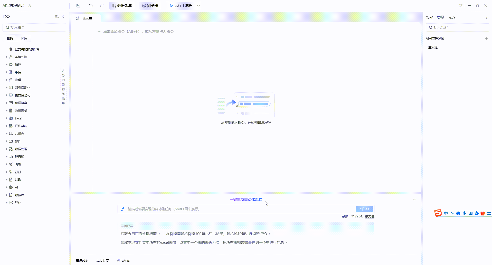 | 流程中涉及元素，只会生成元素名称，需要手动捕获相关元素 |
| --- | --- | --- | --- |
| v2.0 | 八爪鱼RPA客户端v2.2至v2.4 | 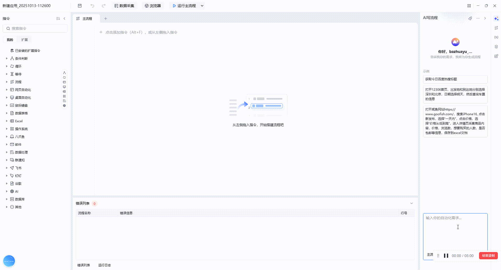 | 只需用简单的中文描述您的业务需求，AI即可智能生成可执行的RPA流程。但只能根据固定步骤执行，无法根据页面实际情况智能调整步骤。 |
| v3.0 | 八爪鱼RPA客户端v2.5及以上 | 见下文 | 在2.0的基础上新增智能探索和用户交互，真正实现走一步看一步，流程准确性大幅提升。 |

## 一、认识AI写流程

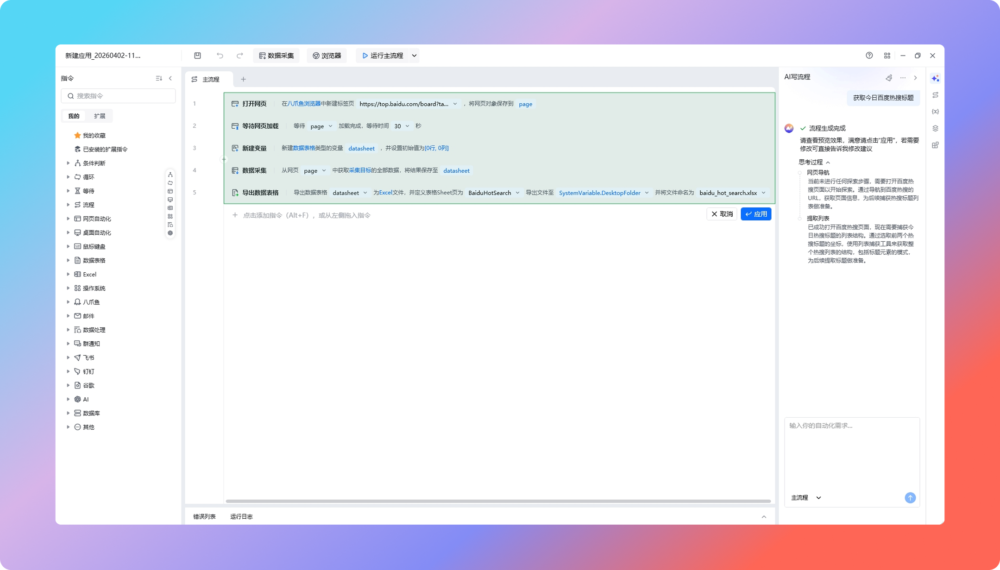

AI 写流程 是八爪鱼 RPA 编辑界面侧边栏的智能开发助手，用于通过自然语言对话生成与修改自动化流程。

它具有以下核心功能：

| 核心功能 | 功能说明 |
| --- | --- |
| 对话生成流程 | 用自然语言描述业务需求，AI智能解析并生成完整可执行的RPA流程节点，并根据页面实际情况动态调整（如检测登录状态等） |
| 对话修改流程 | 通过对话指令对已有流程进行调整、优化或功能扩展 |
| 智能探索网页 | AI自动识别网页元素结构，智能生成精准的选择器与操作步骤 |
| 智能修复 | 自动检测流程异常，定位错误节点并提供修复建议或一键修复 |
| 手动编辑 | 支持在AI生成基础上进行精细化人工调整，兼顾效率与灵活性 |

与其他流程搭建方式的对比：

| 搭建方式 | 图示 | 操作方式 | 技术门槛 | 适用场景 | 开发效率 |
| --- | --- | --- | --- | --- | --- |
| AI写流程 | 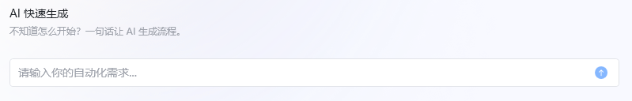 | 自然语言对话描述 | 无门槛，零代码 | 快速原型、标准化业务、复杂逻辑生成 | ⭐⭐⭐⭐⭐  极快 |
| 可视化拖拽 |  | 图形化组件拖拽连线 | 低门槛，需理解RPA逻辑 | 简单流程、可视化调整 | ⭐⭐⭐ 中等 |
| 代码编写 | 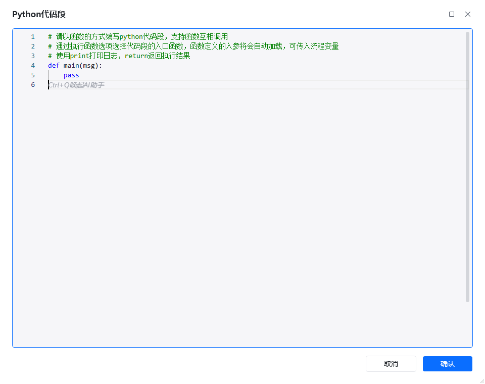 | 编写Python/JavaScript脚本 | 高门槛，需编程能力 | 高度定制化、特殊场景 |  |

## 二、界面介绍

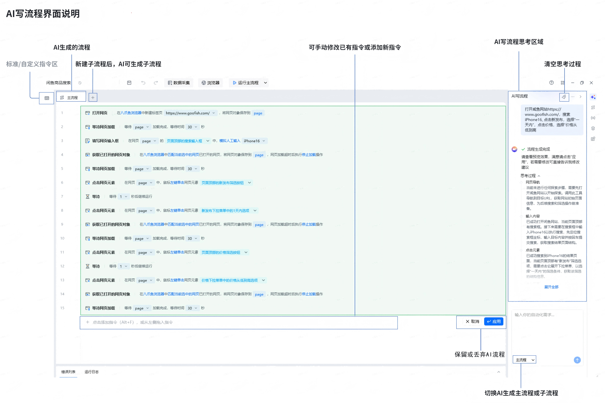

## 三、使用教程

### 1. 创建AI写流程

共有两种方式可使用AI写流程功能

| 方式 | 图示 | 注意事项 |
| --- | --- | --- |
| 首页创建 | 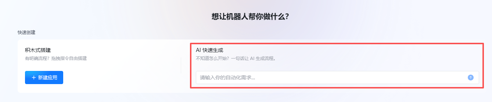 | - |
| 流程编辑区新建 | 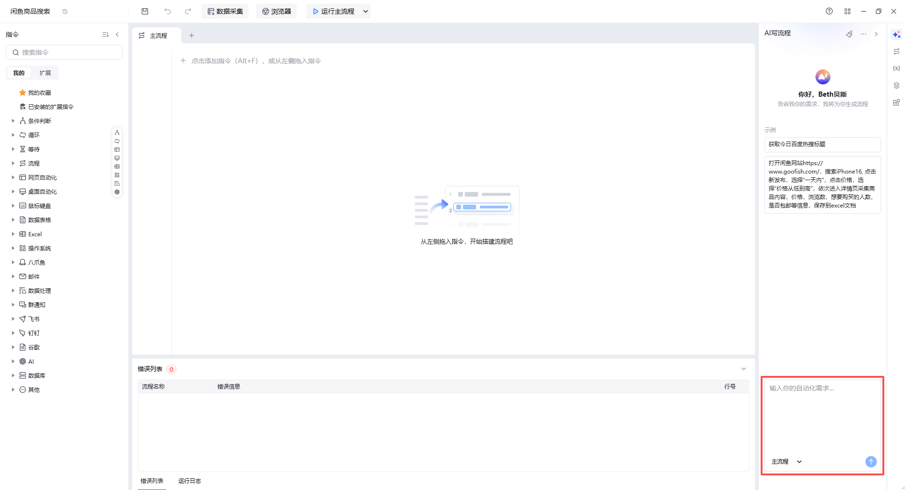 | AI写流程既可以生成主流程，也可生成子流程 |

### 2. AI生成流程

#### 2.1 提示词模版

客户端内部内置了两个提示词模版，用户可仿照该提示词模版修改话术，从而适应自己的业务需求。

输入需求后，点击发送，AI写流程即刻开始工作。

（后续我们将提供更多开箱即用的提示词模版）

#### 2.2 AI思考过程

AI引擎根据业务需求智能思考，包括遇到异常情况跟用户直接交互，如出现登录弹窗等会提醒用户先手动登录，登录完成后再继续向下思考，思考完成后会生成流程。

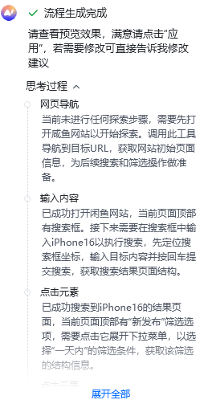

### 3. 调试流程

#### 3.1 调试

流程生成完毕后，可点击顶部导航栏的“运行”按钮进行调试，确认实际结果是否符合预期

| 点击“运行”按钮 | 运行过程 |
| --- | --- |
| 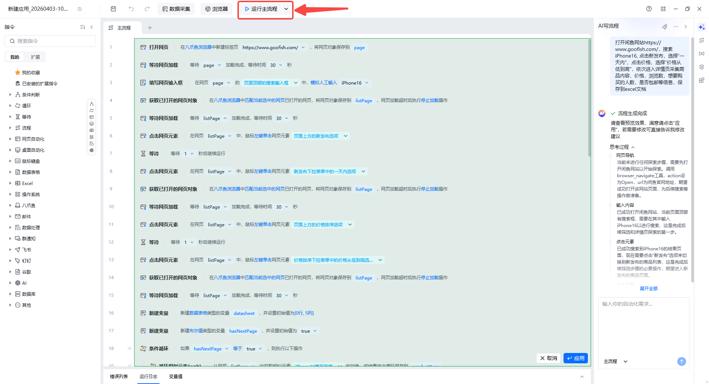 | 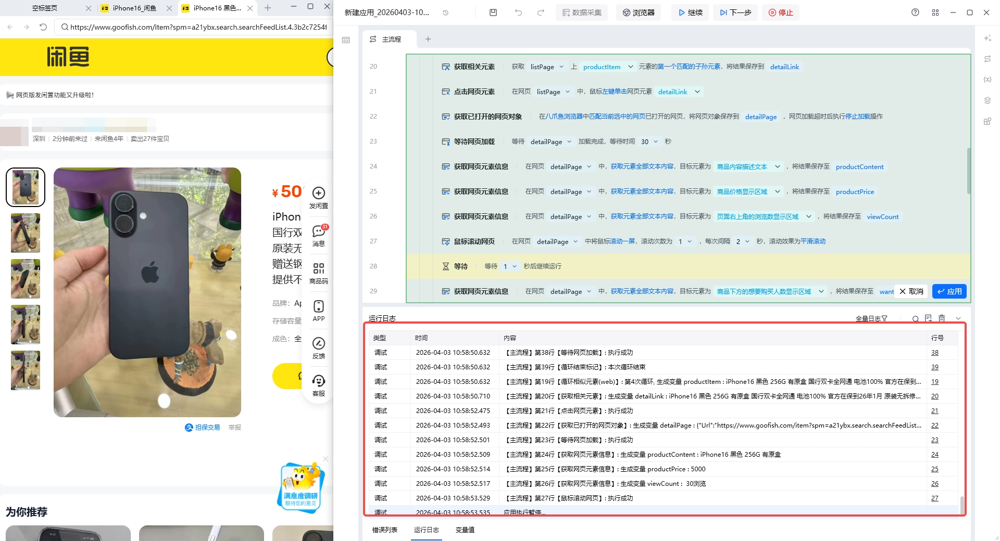 |

注：①指令内部参数在调试的过程中可自行修改，如搜索关键词等

#### 3.2 查看日志

可切换“全量日志”查看完整日志

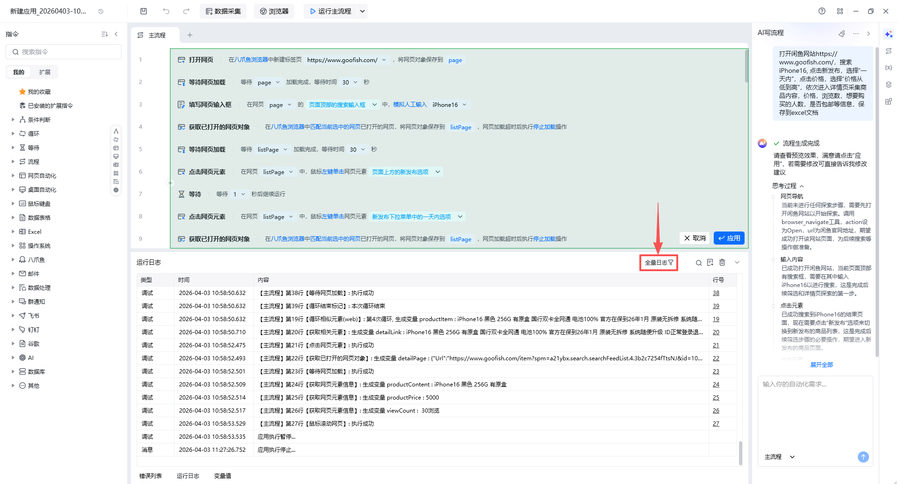

注：暂停快捷键是Ctrl+B，停止运行的快捷键是Ctrl+N

#### 3.3 报错提示

- 生成成功，但指令报错

解决办法：点击查看错误信息，根据错误信息手动调试或直接在对话框让AI继续修改

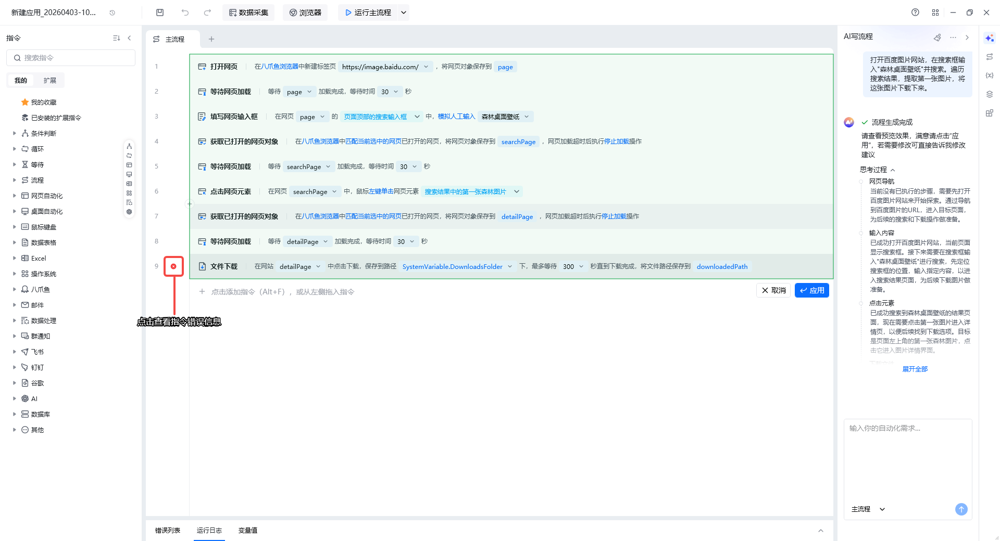

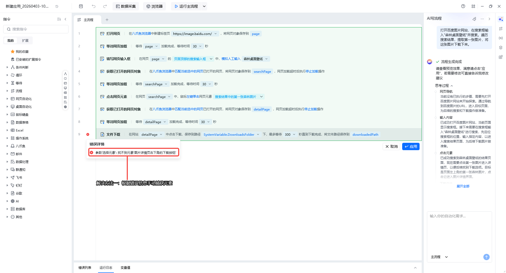

- 生成成功，但运行不符合预期

解决办法：直接在对话框中继续描述需求

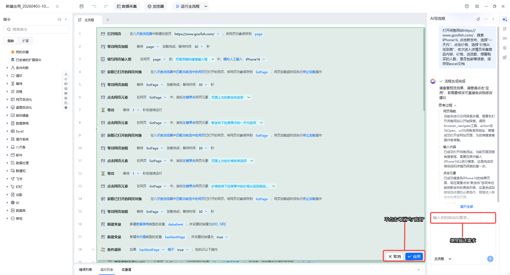

注：不要点击“取消”或“应用”，否则视为本次AI写流程结束，下次描述需求会开启全新的对话

### 4. 修改流程

双击指令修改指令详情，或添加新指令，对流程进行精准修改

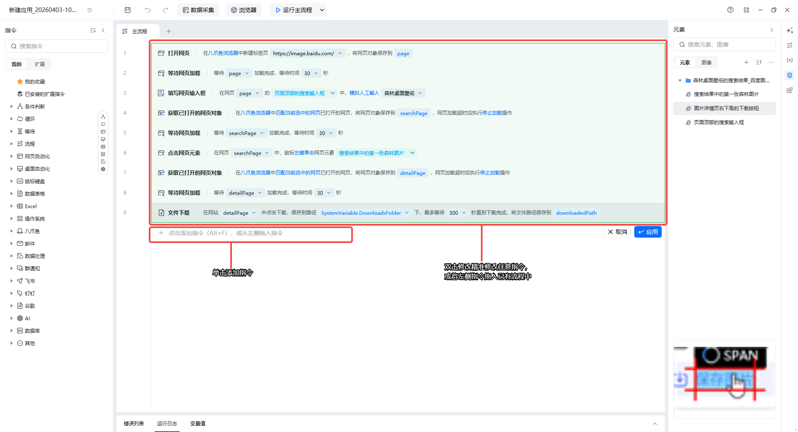

### 5. 维护流程

> 即如何使用“AI写流程”功能生成的RPA流程

#### 5.1 调用子流程

如果您是在子流程中用的“AI写流程”，即生成的是完整流程中的具体功能模块。如完整流程是在某后台下载账单，子流程1可以是登录功能模块。利用“AI写流程”生成后，可以在主流程中调用该子流程。

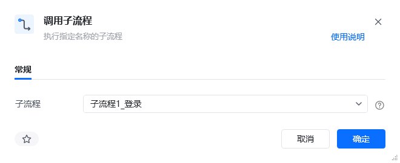

#### 5.2 点击“应用”后重复运行

确认应用流程无误后，可点击“应用”，该流程会被保留下来，与自行搭建的应用相同，后续运行的时候不会再次消耗tokens

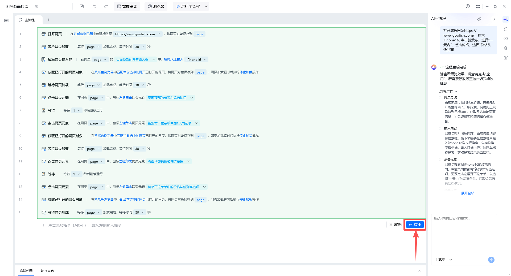

## 四、常见Q&A

Q1：八爪鱼RPA的AI写流程3.0会赠送免费额度吗？如何领取？

A1：会赠送10元AI写流程专属余额，后续可以进入我们专属的“AI写流程专属群”内填写表单领取（社群二维码如下）

Q2：AI写流程专属余额在哪里查看？专属余额消耗完之后应该怎么进行充值？

A2：点击AI写流程功能区域旁边的更多标志，即可看到AI专属余额。专属余额消耗完毕后，会消耗通用余额，可直接充值通用余额。

| AI专属余额 | 通用余额 |
| --- | --- |
| 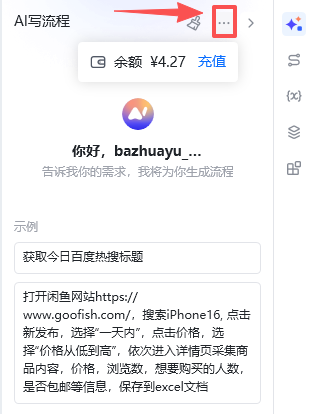 | 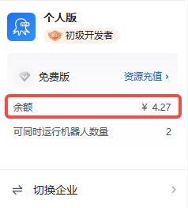 |

Q3：“AI写流程”生成的流程，我点击“应用”后，还能否让AI进行二次调试？

A3：不能，点击“应用”后代表本次调试结束，对于AI来说，下一次的需求已经是全新的需求了。

Q4：“AI写流程”是不是只支持八爪鱼浏览器？

A4：不是，也支持Chrome等浏览器。如果要指定浏览器，需要在提示词中强调用xxx浏览器打开xxx网页，否则AI会默认选用八爪鱼浏览器。

<Info>
  使用过程中遇到问题？前往 [八爪鱼RPA 开发者社区问答板块](https://rpa.bazhuayu.com/community/questions) 提问，获取官方与社区帮助。
</Info>
