## 一、功能说明

### 1. 概述

对网页或者软件上的元素进行捕获，与元素操作相关的指令均有该功能（如点击网页元素、获取网页元素信息），元素库内也包含该功能

| 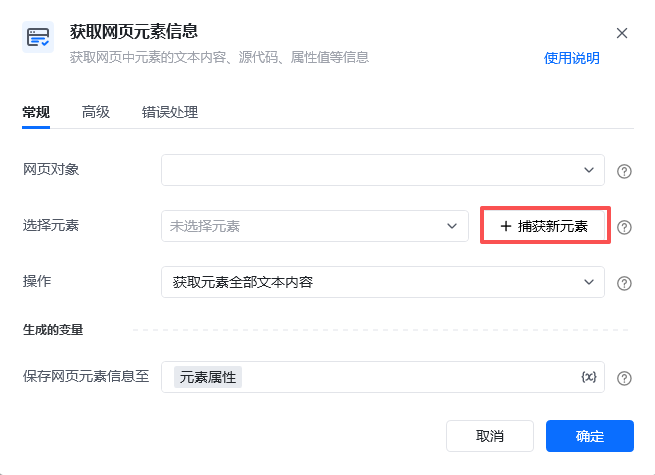 |  |
| --- | --- |

### 2. 正在捕获元素

点击”捕获新元素“后，会出现下方正在捕获元素的窗口。该窗口会自动不遮挡，即鼠标在屏幕左上角时，窗口会自动移至右上角

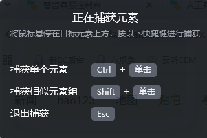

（1）捕获单个元素：只要按住Ctrl键+鼠标左键，可以获取单独一个元素

（2）捕获相似元素：简单说，就是可以同时捕获XPath结构相似的一组元素。捕获时，按住Shift键，依次点击第一个元素、第二个元素，完成获取

**注：**相似元素通常在循环情况下使用，即需要循环获取相似XPath元素的时候

### 3.结构定位和智能定位

|  | **结构定位** | **智能定位** |
| --- | --- | --- |
| 版本号 | 所有版本 | 2.2.1061-beta及以上 |
| 样式 | 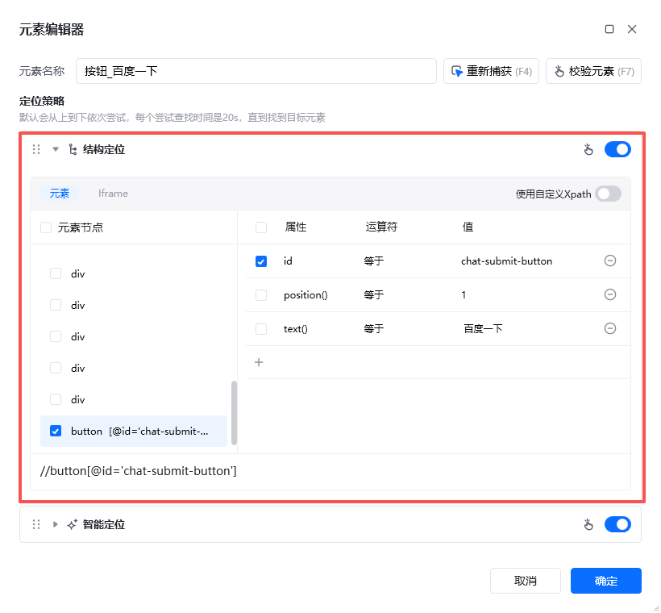 | 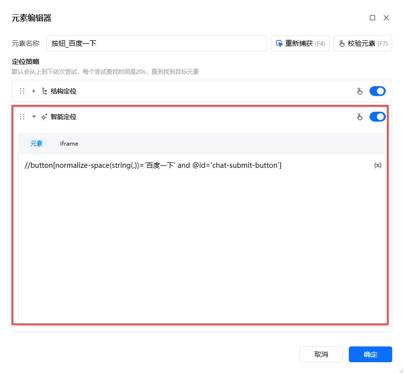 |
| 说明 | 自动生成的Xpath不够稳定，经常需要手动调整 通常会生成绝对路径的XPath表达式，这种表达式对页面结构的依赖性很强，一旦页面的层级结构发生变化，整个表达式就会失效 目前保留该定位方式，依然可以使用、修改、校验或是自定义Xpath | 优化了算法，可以生成比较稳定的Xpath 会优先选固定的属性来定位，如id和class等，能有效提升Xpath的普适性 |

（1）两种定位方式可以自由开关，调整顺序。两种定位方式都打开时，流程运行时，会从上到下先用第一个定位策略查找，找不到再用第二个查找。（两种方式至少需要打开一种，否则会出现错误提示）

| 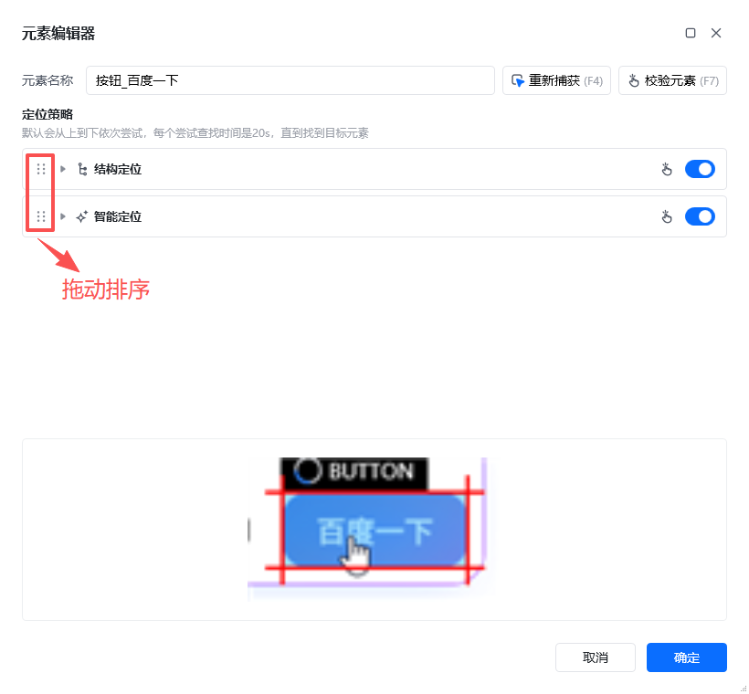 | 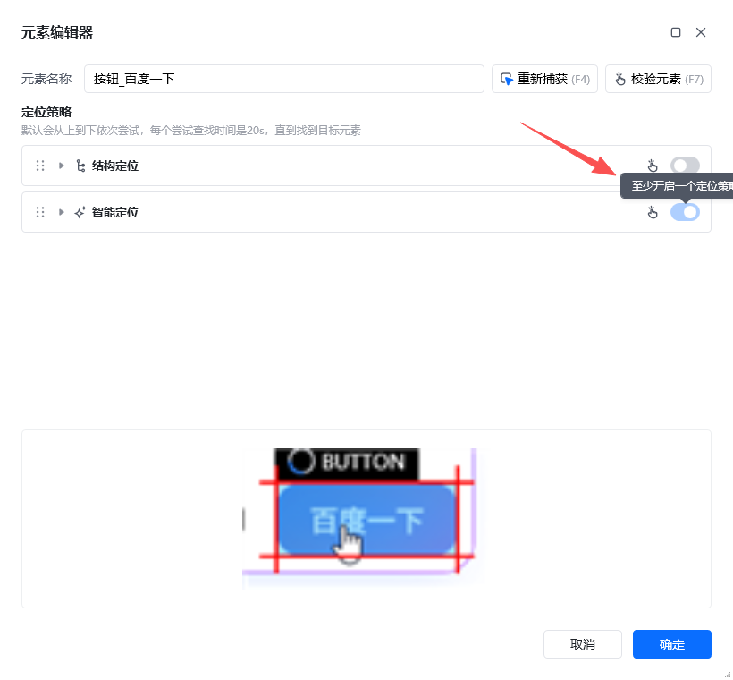 |
| --- | --- |

（2）点击右上角的校验元素，会同时校验打开的定位策略的有效性；点击每个策略的后方校验按钮，则只校验当前的定位策略

| 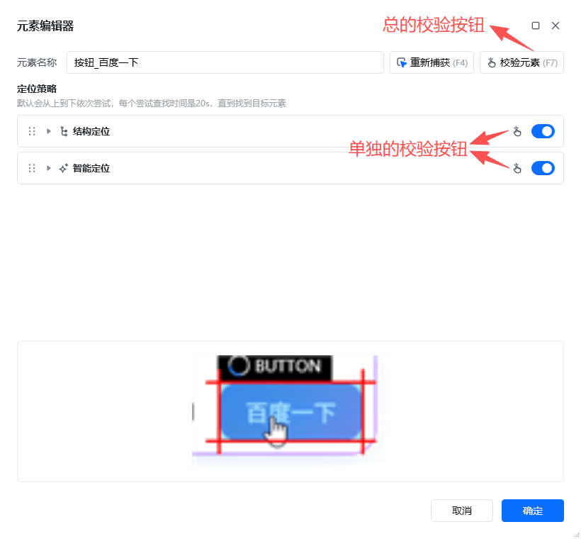 | 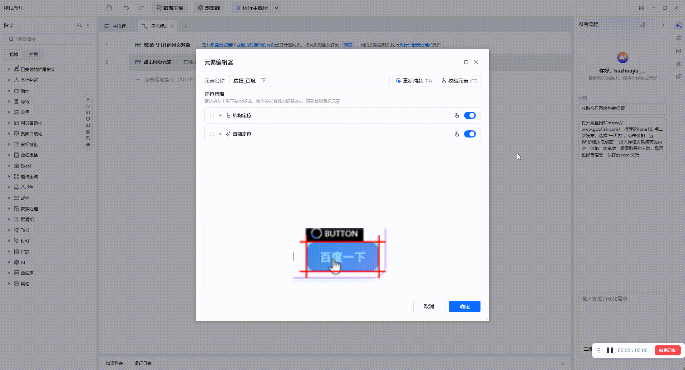 |
| --- | --- |

## 二、使用示例

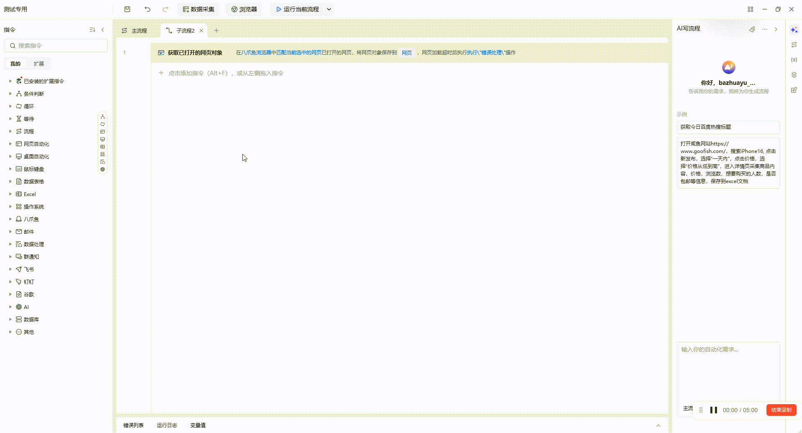

**此流程指令逻辑：**

打开八爪鱼浏览器 --> 使用【循环相似元素(web)】指令逐一获取“百度热搜“的列表的每个元素，捕获元素时候用到Shift+鼠标左键

**效果展示：**

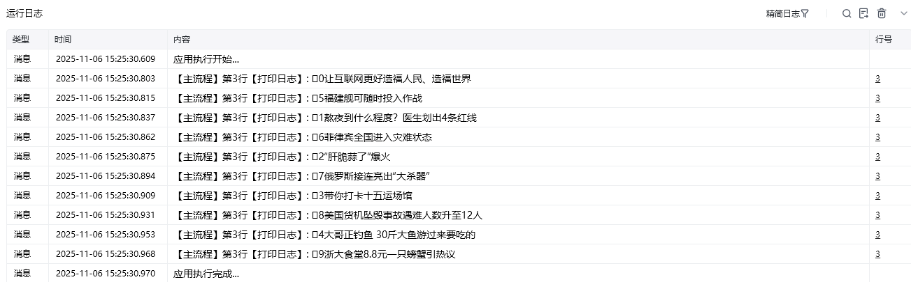

## 三、如何查看当前客户端版本信息

点击头像---设置---关于八爪鱼RPA

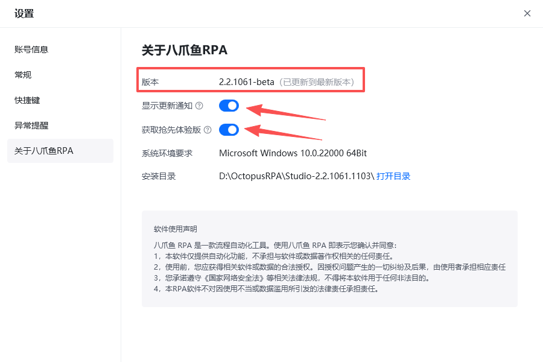

**注：**如需获取最新版本，请打开“显示更新通知”和“获取抢先体验版”。若您的版本号是1.x，请前往[官网下载中心](https://rpa.bazhuayu.com/download)下载2.x版本

<Info>
  使用过程中遇到问题？前往 [八爪鱼RPA 开发者社区问答板块](https://rpa.bazhuayu.com/community/questions) 提问，获取官方与社区帮助。
</Info>
