## 编辑元素的两个入口

### v1.0版本

1. 鼠标移动到这个 V 图案上面，会出现一个下拉框，点击“编辑元素”，则会出现编辑元素的窗口

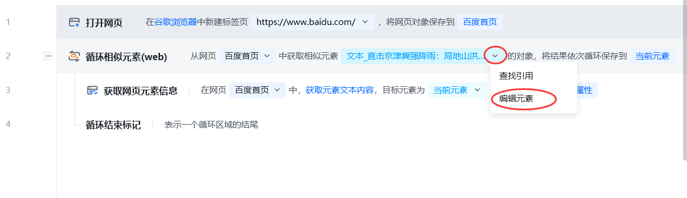

2.右侧【元素】一栏中，双击要编辑的元素，则会出现编辑元素的窗口

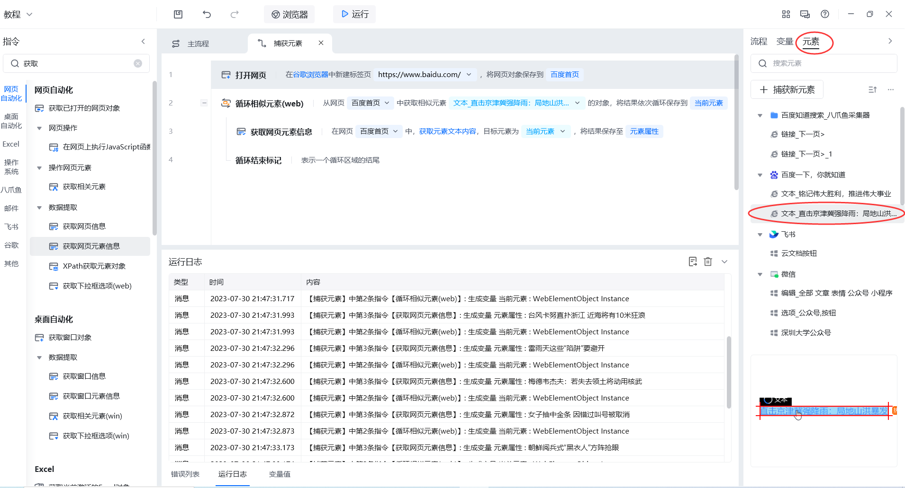

### v2.0版本

1. 鼠标移动到这个 V 图案上面，会出现一个下拉框，点击“编辑元素”，则会出现编辑元素的窗口

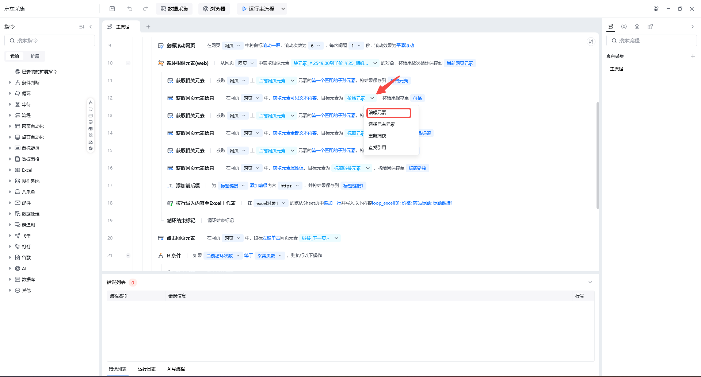

2.右侧【元素】一栏中，“双击”要编辑的元素或是“右键选中”要编辑的元素，则会出现编辑元素的窗口

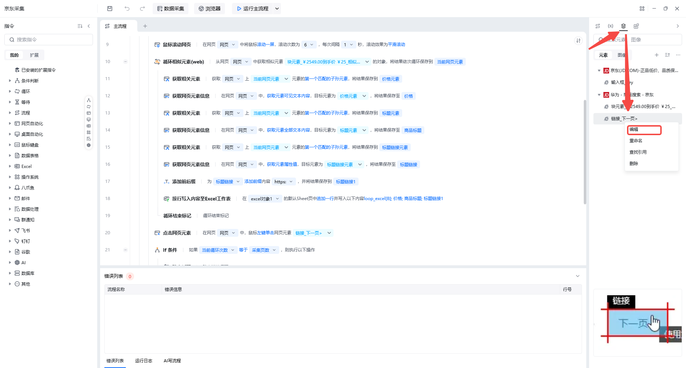

 

## 编辑元素

### 编辑元素操作步骤（含校验元素）

#### v1.0和v2.0通用功能

当在元素选择框内勾选不满足需求时，可以点击【使用自定义xpath】；然后自己手写或从浏览器中复制黏贴xpath。

- 在网页的目标元素上右键选择“检查”，进入开发者模式，根据下图指示，再右键复制元素的XPath，选择“使用自定义Xpath”，再填入XPath
- 如果复制XPath还是定位不精准，可以自己填，至于XPath怎么写，可以查询相关的文档学习

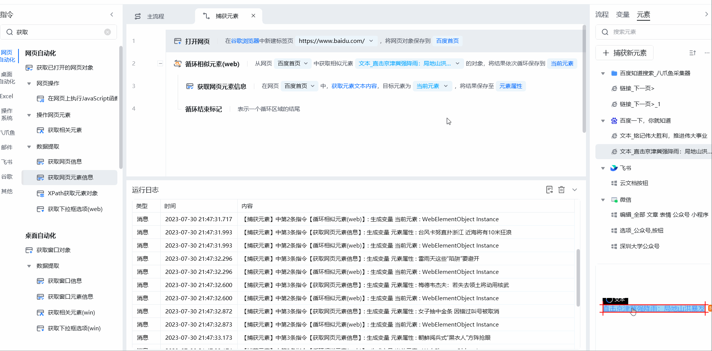

- 也可以通过勾选复选框，层层筛选目标元素的XPath。
点击**校验元素**，可以校验当前网页或窗口中匹配到的元素。注意如果同时打开多个相同界面，可能会校验到多个。

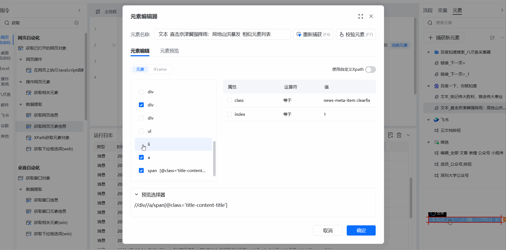

#### v2.0元素编辑器中可使用变量

1.在“勾选”页面添加变量

找到目标标签--->找到指定属性--->在属性值中使用变量，点击(x)即可添加变量

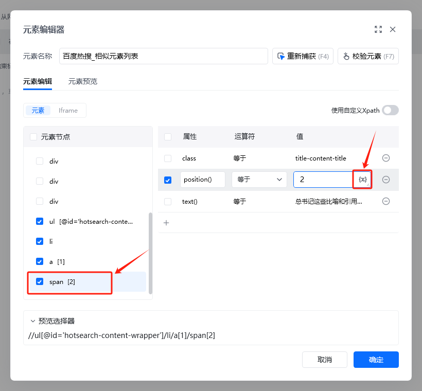

2.在“使用自定义Xpath”页面添加变量

在指定位置添加变量，同样也是点击(x)选择目标变量

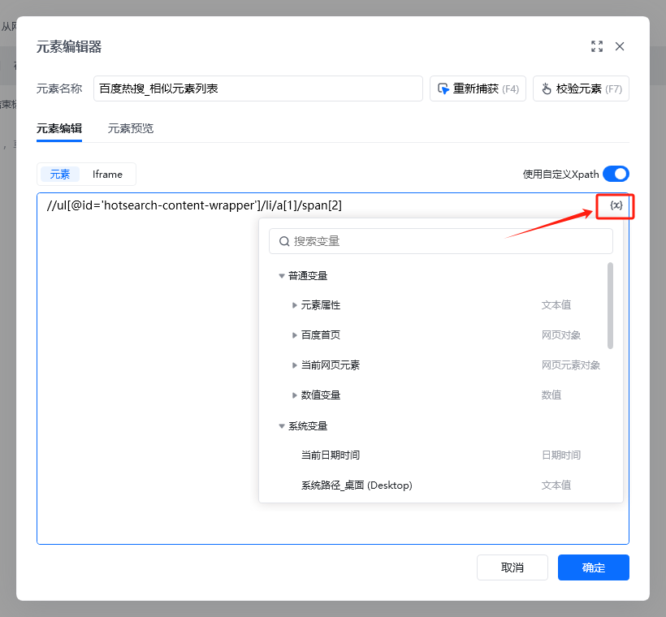

### 重新捕获元素

当前元素找不到时，可以重新捕获元素。

对于元素之前能找到，现在找不到了，可以将**之前的元素路径**（xpath）复制出来，黏贴到文档中。然后重新捕获下这个元素，再将**重新捕获的元素路径**复制出来，和之前的元素路径进行对比，**看看有什么变化**。最后可以去修改这个变化的地方，以免后面还出现这类情况。

比如下图这情况，新老数据的ListViewItem后数值不一样。
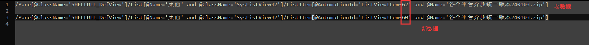

就把这部分都去掉，以便适配新老两种不同的情况。

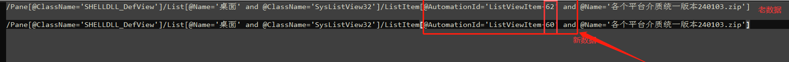

### 编辑元素时勾选属性值的一般原则

1.去掉序号、跳过中间层级适配性会更强

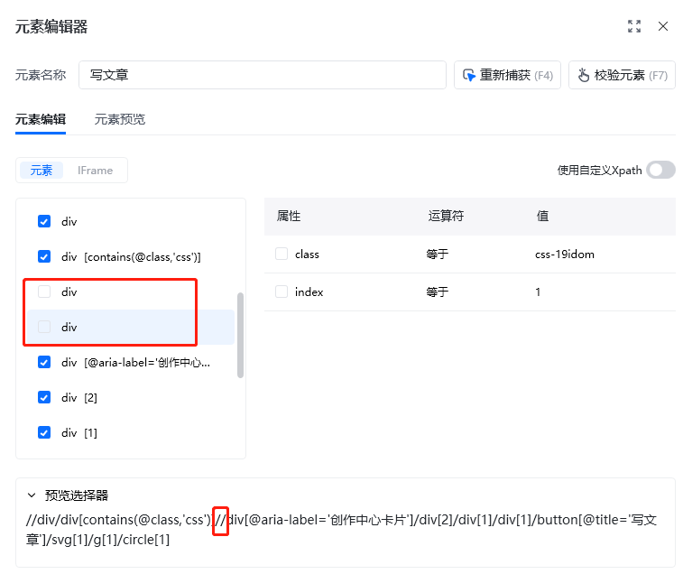

2.选择属性值优于选序号

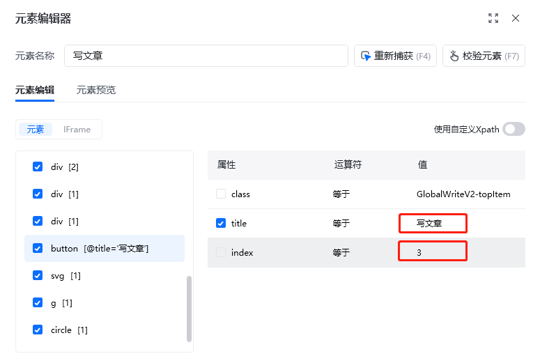

3.选择比较规律、简单的属性值

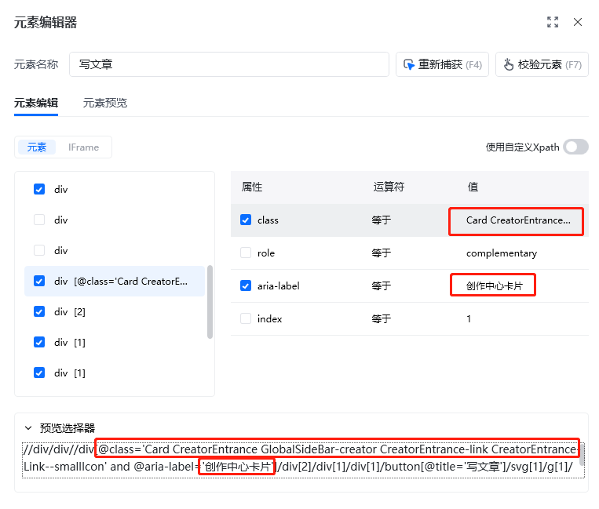

4.使用包含，去掉不规则的属性值

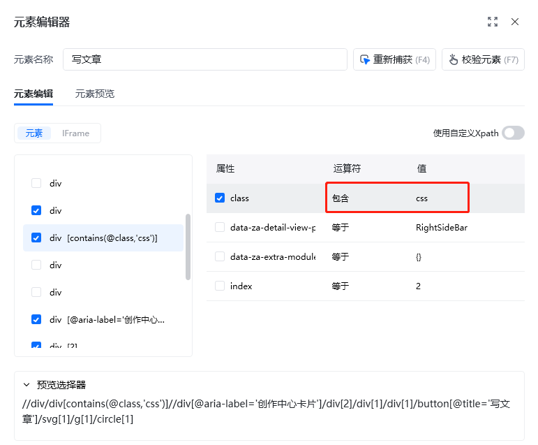

### 选择运算符

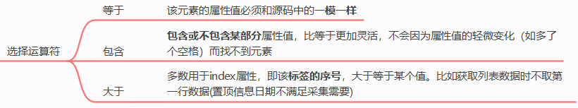

<Info>
  使用过程中遇到问题？前往 [八爪鱼RPA 开发者社区问答板块](https://rpa.bazhuayu.com/community/questions) 提问，获取官方与社区帮助。
</Info>
