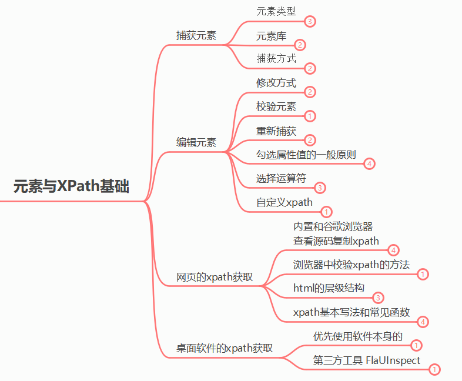
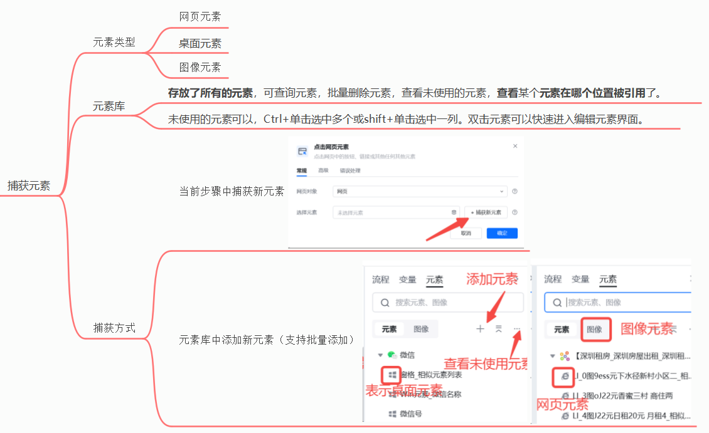
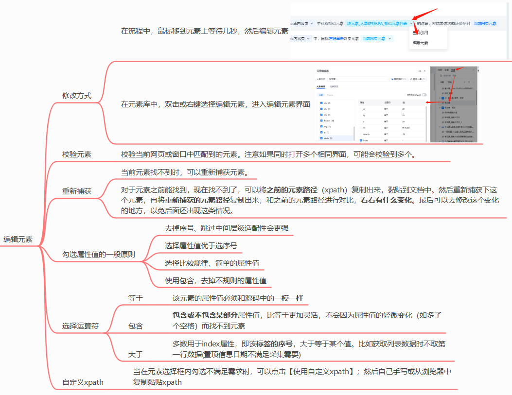

> 元素是网页或桌面应用上可被 RPA 识别和操作的最小单位，例如一段文字、一张图片、一个输入框或一个按钮。理解元素的概念和定位方式，是搭建稳定流程的前提。

## 什么是元素？

以网页为例，我们看到的每一个信息都可称为元素，网页元素包括：文字、图片、音频、动画、视频等等，可以是某一个字、某个词、或某句话。在八爪鱼RPA中，我们一般通过XPath来准确定位找到所需要的元素。

## 目的

在网页/桌面的众多元素中，让RPA知道你想要操作哪一个

## 功能

通过捕获元素选取网页或桌面中的单个或一组元素，利用校验元素检测当前元素在网页或桌面中匹配的具体位置，再通过编辑元素对其进行更精细化的调整。八爪鱼 RPA 支持网页 XPath、桌面 XPath 和图像三种方式来获取元素。

## 总览

## 简述

元素的捕获方式见：[捕获元素](https://bazhuayu-rpa-docs.mintlify.site/guides/elements/capture-element)

元素的编辑见：[编辑元素](https://bazhuayu-rpa-docs.mintlify.site/guides/elements/edit-element)

## XPath

XPath是整个软件的难点但又是准确获取元素的核心点；相关内容比较多且需系统性的学习，本文就不做阐述，请参考这下方的系列教程进行学习。

XPath图文教程：[XPath图文教程](https://bazhuayu-rpa-docs.mintlify.site/guides/elements/xpath)

XPath视频教程：

<iframe src="https://player.bilibili.com/player.html?isOutside=true&amp;aid=115664979231862&amp;bvid=BV1Fs25BxEGV&amp;cid=34514470453&amp;p=1" scrolling="no" border="0" frameborder="no" framespacing="0" allowfullscreen="true"></iframe>

<Info>
  使用过程中遇到问题？前往 [八爪鱼RPA 开发者社区问答板块](https://rpa.bazhuayu.com/community/questions) 提问，获取官方与社区帮助。
</Info>
