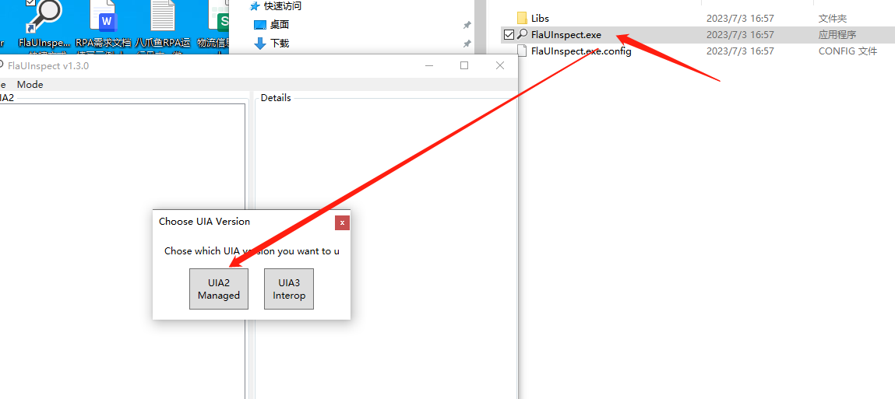
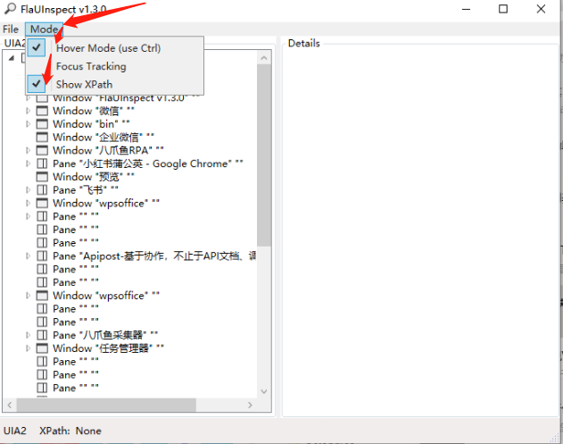
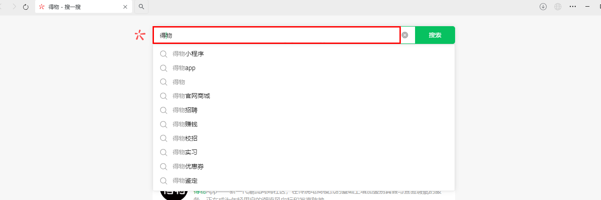
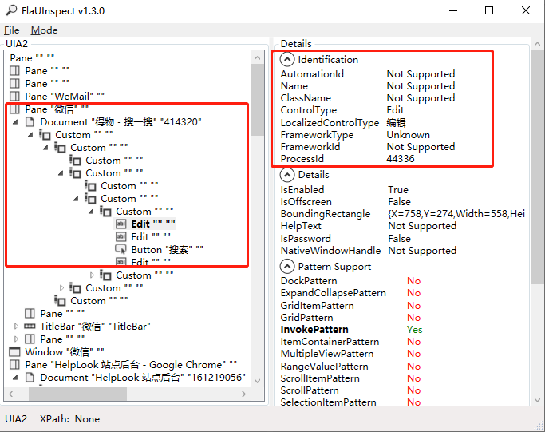

### 工具包：

[查看桌面元素小工具.rar](https://resource-wangsu.helplook.net/docker_production/ja1cid/article/RjQZqz/attachments/bin.rar)

### 使用步骤：

1.下载上面压缩文件后解压到本地。

2.打开解压文件夹，点击FlaUInspect.exe文件，选择UIA2

3.点击Mode 勾选Hover Mode 和Show XPath

4.按住键盘中的Ctrl 然后将鼠标移到或点击要查看的桌面元素，红框部分就是当前识别出来的元素。

5.在FlaUInspecth中就可以看到选中的元素情况。主要会使用红框中信息。

<Info>
  使用过程中遇到问题？前往 [八爪鱼RPA 开发者社区问答板块](https://rpa.bazhuayu.com/community/questions) 提问，获取官方与社区帮助。
</Info>
