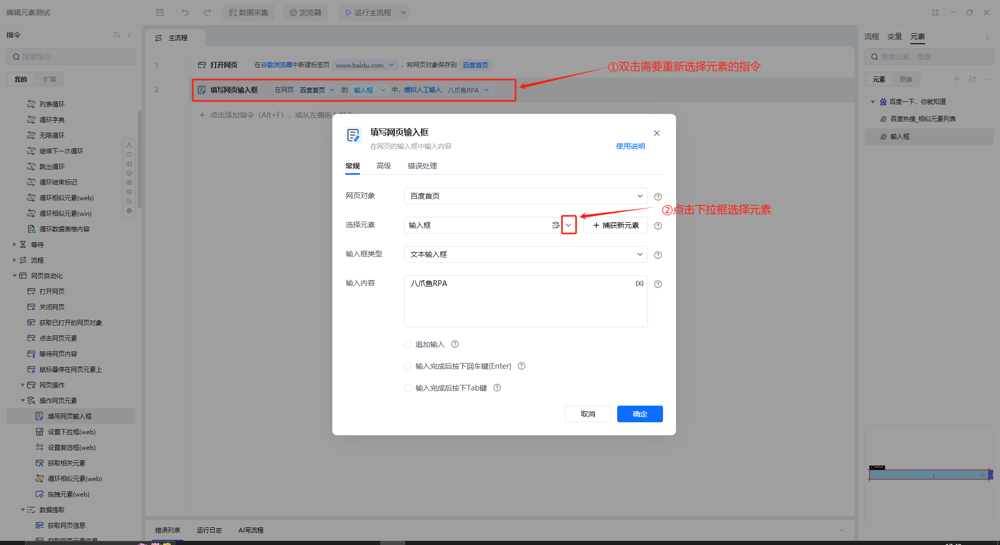
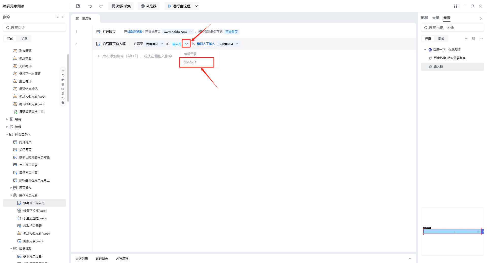
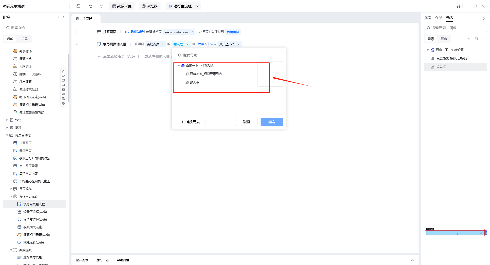

## 功能说明

**描述：**一切涉及元素的指令（如填写网页输入框、点击网页元素等），都有可能需要重新选择元素，比如误触选错元素等情况。

## 重新选择元素的两种方式

### v1.0版本

双击进入指令详情页--->在选择元素里面点击“下拉框”--->选择新的目标元素

### v2.0版本

鼠标移动到指令的

图案上面--->点击下拉框图案--->点击“重新选择”

不需要进入指令详情页即可重新选择元素

<Info>
  使用过程中遇到问题？前往 [八爪鱼RPA 开发者社区问答板块](https://rpa.bazhuayu.com/community/questions) 提问，获取官方与社区帮助。
</Info>
