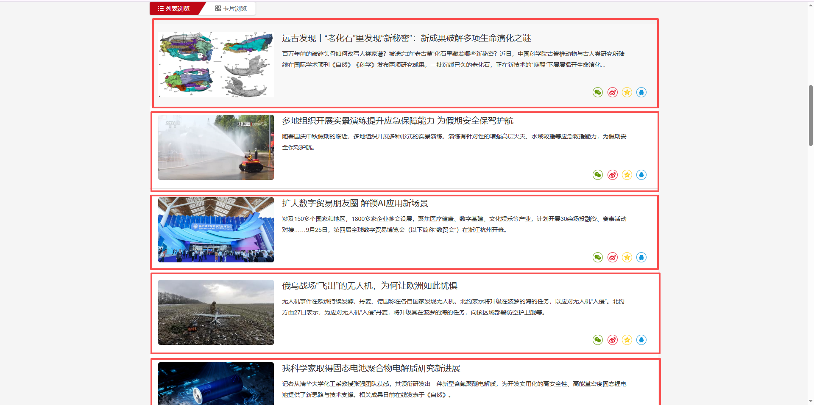
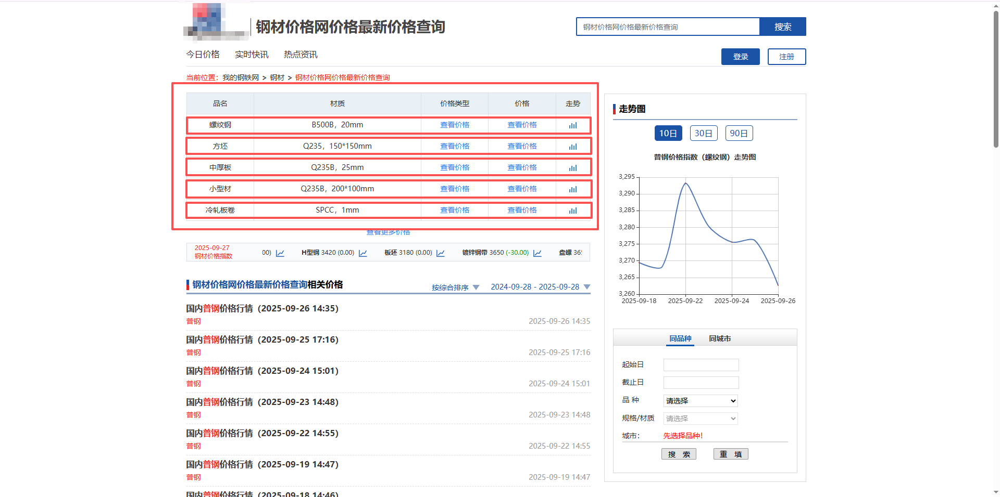
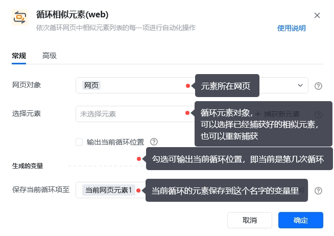
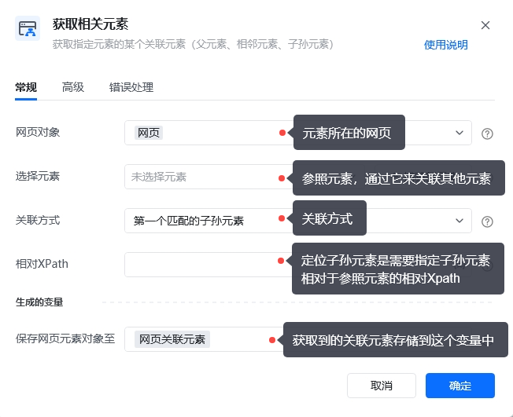
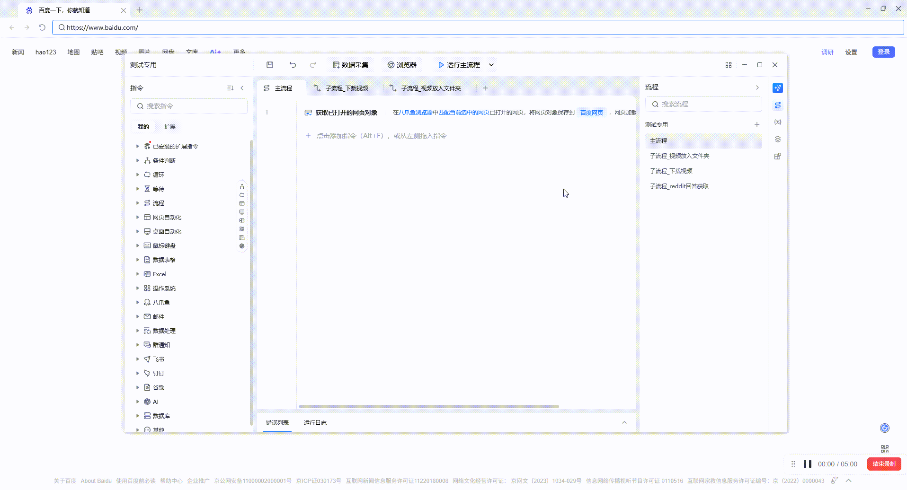
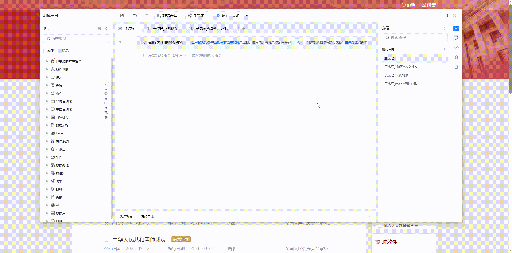
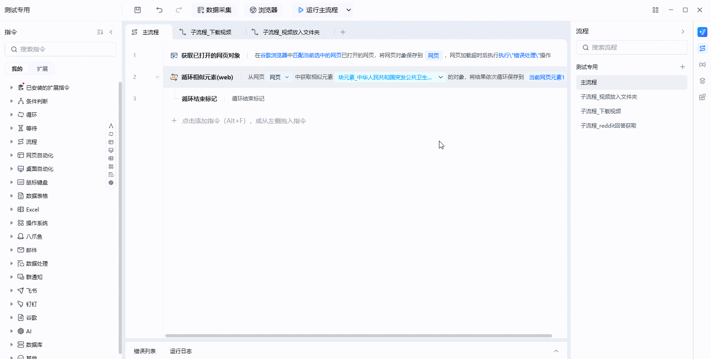
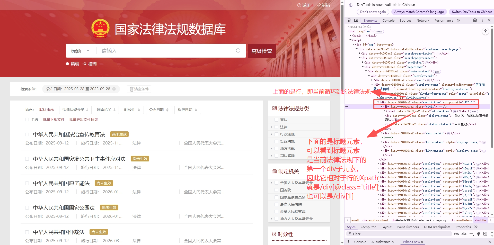
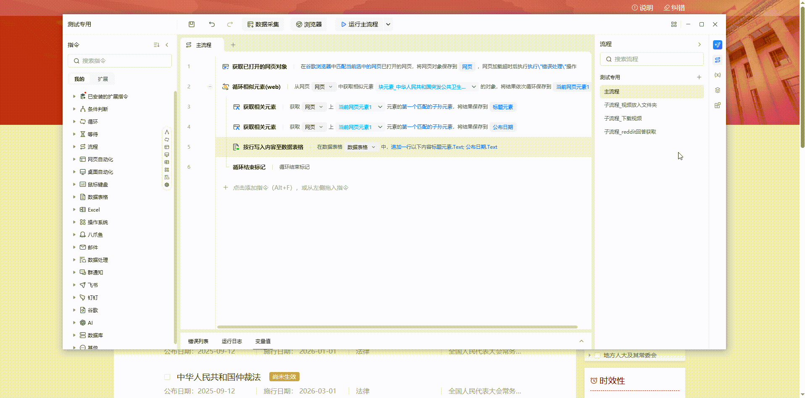

## 1. 什么是相似元素？

相似元素是网页中一组具有相似结构的元素列表，如表格、商品列表或新闻列表等，通常被一个共同的父元素统一包含，使它们在结构上具有相似性。

在大多数情况下，我们需要对相似元素中的每个元素依次单独处理，且每个元素的处理逻辑通常相同。当列表中的元素块结构较为复杂时，可以结合”**关联元素指令**“进一步解析其中的嵌套层级。

| **场景** | **附图** |
| --- | --- |
| 商品列表 |  |
| 新闻列表 |  |
| 表格 |  |

### 1.1 循环相似元素指令配置说明

## 2. 什么是关联元素？

关联元素会有一个参照元素，他跟这个参照元素有一的关系（例如：它是参照元素的父元素、相邻元素，子孙元素）。

因此关联元素是基于参照元素，通过父子、兄弟、祖孙等结构关系，按规则定位目标元素的方法。

### 2.1 关联元素指令配置说明

### 2.2 如何创建相似元素？

可在【循环相似元素列表**】**指令中捕获相似元素

首先打开对应的网页，添加【循环相似元素(web)】指令，点击“捕获新元素”

再按住Shift键，依次点击相似元素列表中的第1和第2个元素

### 2.3 如何使用关联元素？

以[国家法律法规数据库](https://flk.npc.gov.cn/search)为例，每一行法律法规都是相似元素

接着上面的相似元素，配合**关联元素**实现对列表数据的采集。【循环相似元素**】**会输出一个当前行的变量，代表正在处理哪一行。我们需要采集每一行里的标题，标题就是当前法律法规的子元素，这个时候就要用到【获取相关元素**】**。

这里是通过Xpath来定位法律法规的标题，这个Xpath是标题元素相对于整行法律法规的Xpath路径，可以借助浏览器的DevTools（浏览器页面右键->点击‘检查’）确定这个Xpath，具体方法如下：

### 2.4 运行效果

我们把相关数据写到数据表格中，看一下效果

大家学习过程中有疑问可以扫码加入爪鱼 RPA 的用户交流群中

<Info>
  使用过程中遇到问题？前往 [八爪鱼RPA 开发者社区问答板块](https://rpa.bazhuayu.com/community/questions) 提问，获取官方与社区帮助。
</Info>
