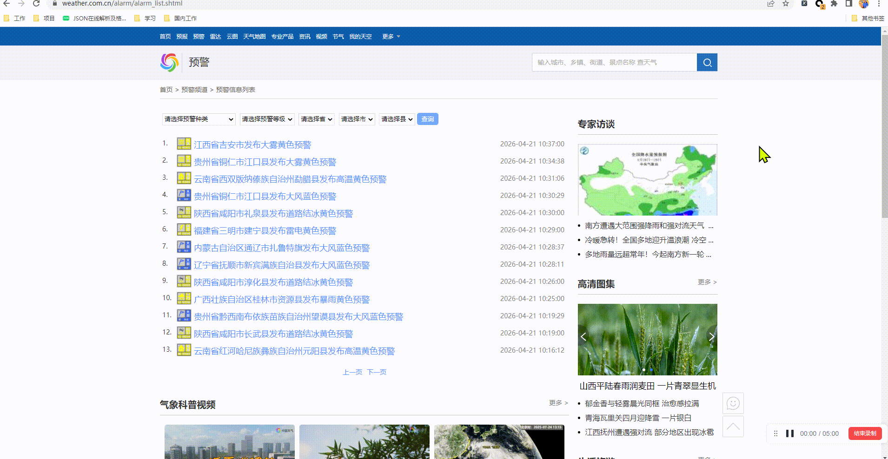
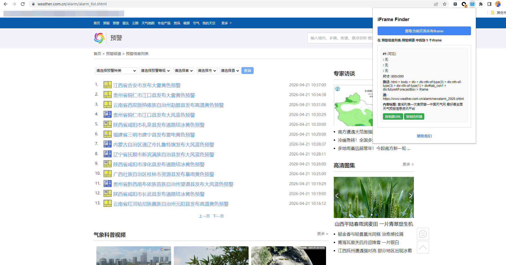
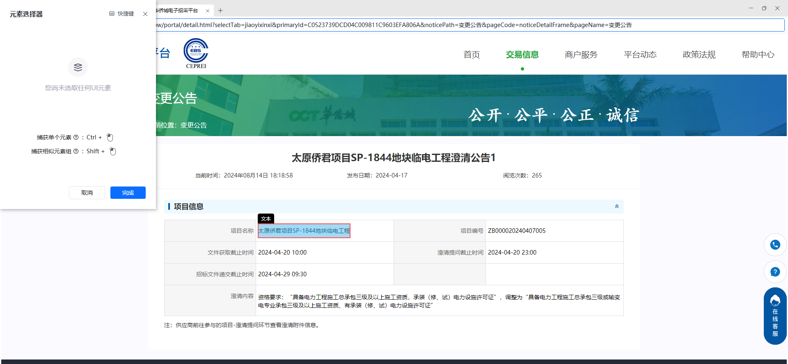
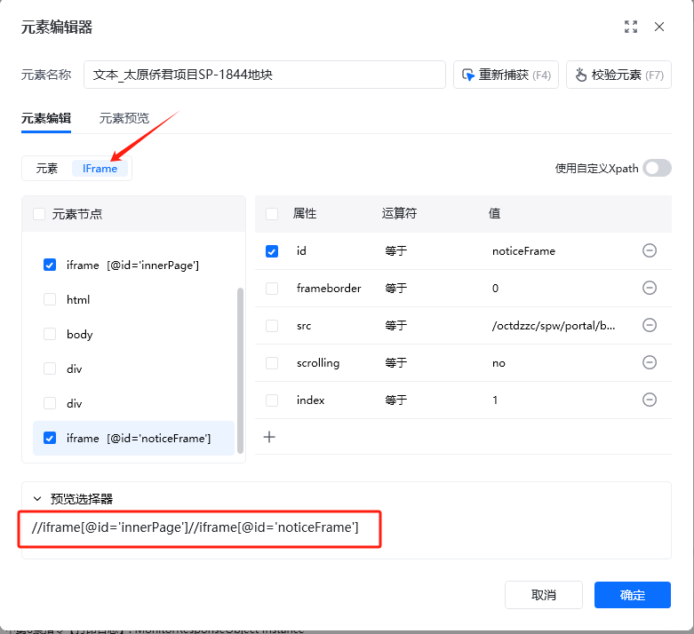
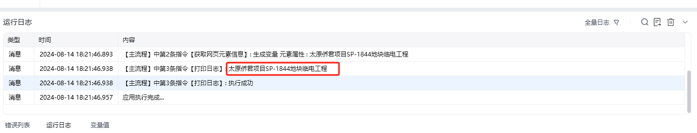

有的网页包iframe框架，在八爪鱼中也需进行相应设置，本教程将详细讲解。

## 1、什么是iframe框架

### 如何判断网页包含几层 iframe 框架？

[iFrame Finder 插件下载安装（官方）](https://chromewebstore.google.com/detail/iframe-finder-%E6%8F%90%E5%8F%96%E7%BD%91%E9%A1%B5%E4%B8%AD%E7%9A%84%E6%89%80%E6%9C%89ifr/aofpolfijmmfgnhnkcfooikchooipojb?hl=zh-CN)

 
## 2、网页具有一层iframe框架的采集方法

八爪鱼支持自动识别一层iframe框架，因此按照正常流程配置流程即可。

示例网址：[http://www.weather.com.cn/alarm/alarm_list.shtml](http://www.weather.com.cn/alarm/alarm_list.shtml)

示例网址具有一层iframe框架：【iframe】，即搜索结果列表是一个独立的网页，嵌套在整个大网页中。

这个iframe框架里的数据，正是我们需要采集的。

按照正常流程，配置列表数据采集的规则，配置好后点开【循环列表】设置页面，发现八爪鱼自动识别了iframe框架，无需手动修改什么。

 
## 3、使用八爪鱼RPA直接获取包含iframe框架的网页数据

在八爪鱼里直接对数据进行提取采集

示例网址:[https://scm.chinaoct.com/octdzzc/spw/portal/detail.html?selectTab=jiaoyixinxi&amp;primaryId=C0523739DCD04C009811C9603EFA806A&amp;noticePath=变更公告&amp;pageCode=noticeDetailFrame&amp;pageName=变更公告](https://scm.chinaoct.com/octdzzc/spw/portal/detail.html?selectTab=jiaoyixinxi&primaryId=C0523739DCD04C009811C9603EFA806A&noticePath=变更公告&pageCode=noticeDetailFrame&pageName=变更公告)

- 获取网页元素信息

捕获到网页元素信息后，查看元素编辑器可以看到，自动获取到了iframe框架的xpath

运行应用，即可正常提取到包含多层iframe框架的数据

<Info>
  使用过程中遇到问题？前往 [八爪鱼RPA 开发者社区问答板块](https://rpa.bazhuayu.com/community/questions) 提问，获取官方与社区帮助。
</Info>
