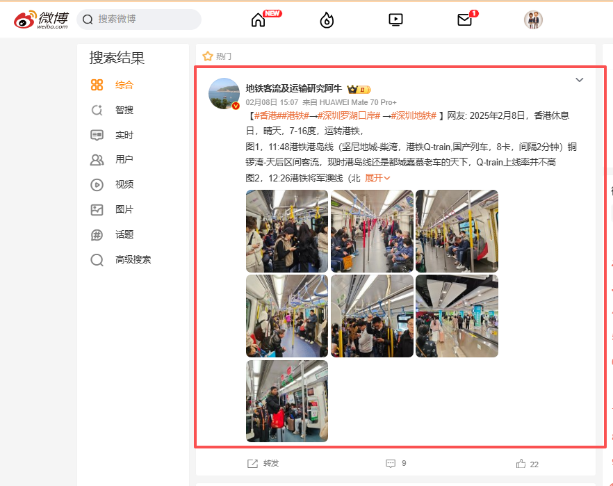
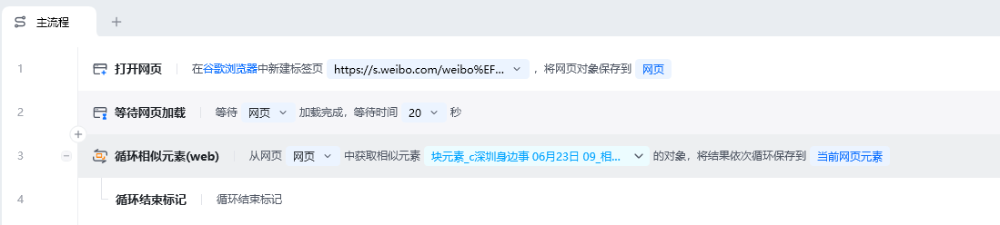
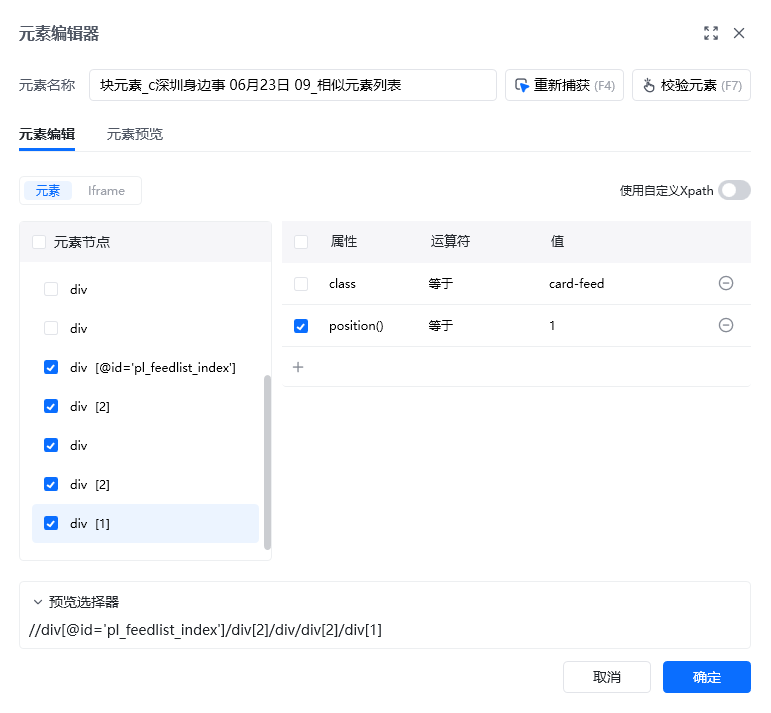
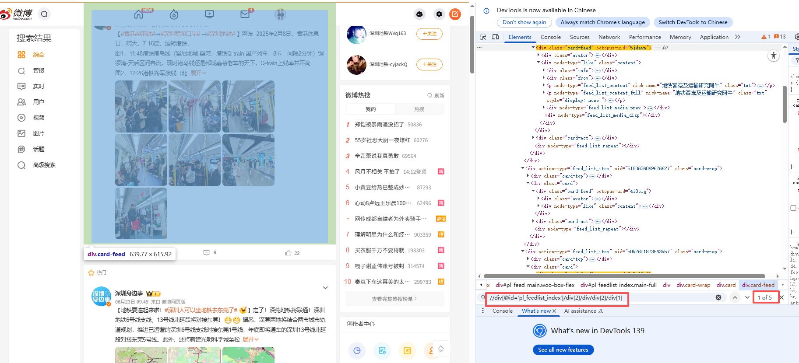
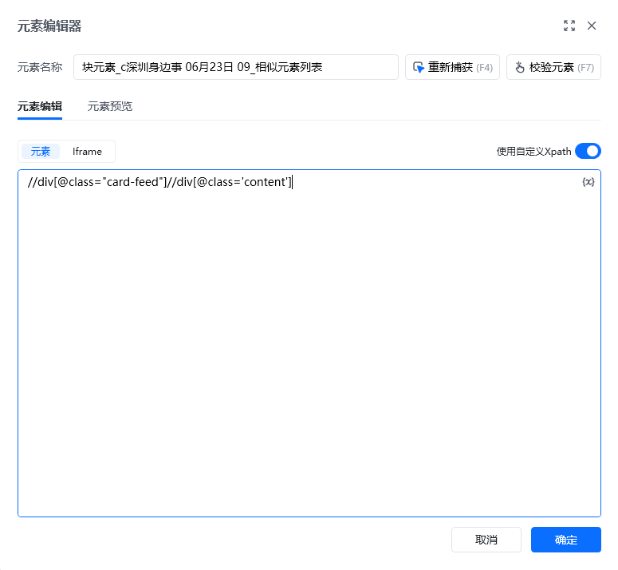
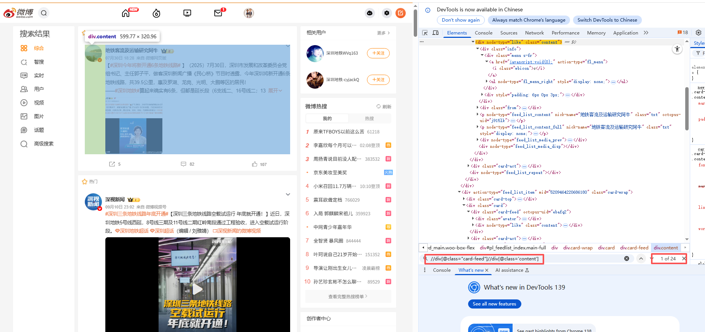
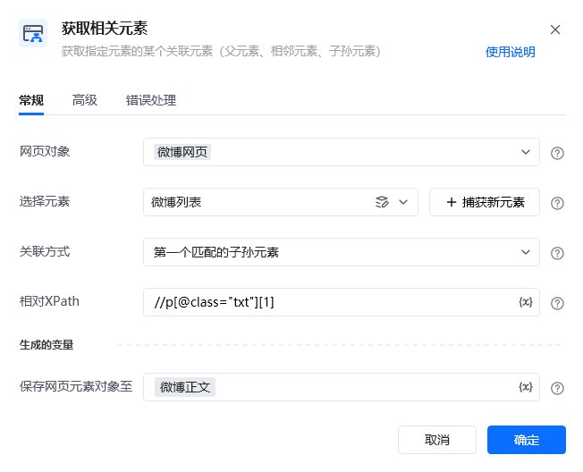
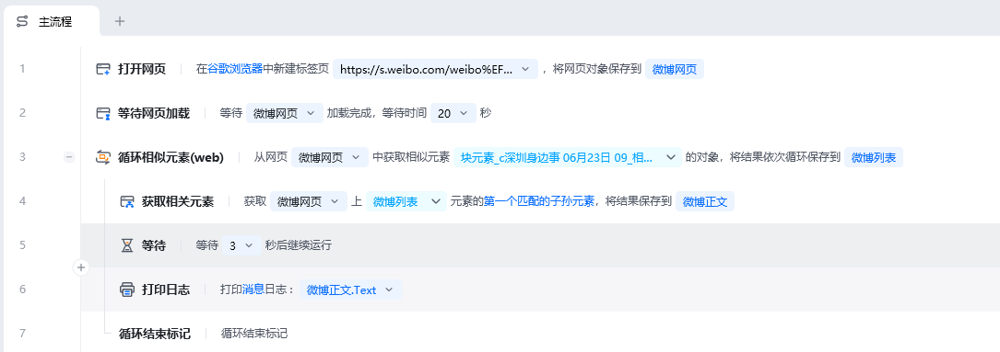

> <strong>描述：本文介绍修改XPath的实例</strong>

网页自动化中，我们通过鼠标捕获相似元素组，创建【循环相似元素（web）】去定位多个列表的数据。

一般情况下，通过以上方法创建的循环列表不会出错，能够精准定位到全部数据。但有时候也会遇到一些问题：比如列表中有的部分不是我们想要的，需要进行丢弃。

<strong>这时候，可以手动修改XPath去定位列表丢弃不需要的部分。</strong>

以下通过实例进行说明。

实例网址：[https://s.weibo.com/weibo？q=%E6%B7%B1%E5%9C%B3%E5%9C%B0%E9%93%81](https://s.weibo.com/weibo?q=%E6%B7%B1%E5%9C%B3%E5%9C%B0%E9%93%81)

应用实现：采集微博网页上的列表正文。

---

###

## 一、用XPath过滤多余的项

### Step1：按照常规操作创建流程

我们按照常规用【打开网页】指令打开微博页面，并通过【循环相似元素（web)】指令捕获微博列表元素组，并将结果保存到元素：微博列表

---

###

### Step2：修改获得的列表组元素组的xpath

在元素库中，双击微博列表元素，查看该元素的xpath，任意浏览器F12，Ctrl+F，都可以调试XPath，发现不会定位到全部的热门文章

---

###

---

###

### Step3：修改列表元素的XPath

所以需要修改能定位到全部微博博文列表Xpath，通过观察可以知道，可以通过限制父元素来更精确的定位到所需的博文列表，在元素编辑器界面，切换成使用自定义Xpath,修改xpath为：

//div[@class="card-feed"]//div[@class='content']

---

### Step4：循环获取每个博文的正文文本

使用【获取相关元素】指令获得列表的正文，关联方式选择匹配第一个子孙元素，并输入正文文本的相对xpath: //p[@class="txt"][1]

---

### 使用示例

此时就实现了精确循环列表每一个博文的正文内容。

---

### 使用小Tips

<strong>总结：当发现循环列表定位过多，需要过滤多余的项，就需要在元素编辑器里修改该元素的定位Xpath。</strong>

<Info>
  使用过程中遇到问题？前往 [八爪鱼RPA 开发者社区问答板块](https://rpa.bazhuayu.com/community/questions) 提问，获取官方与社区帮助。
</Info>
