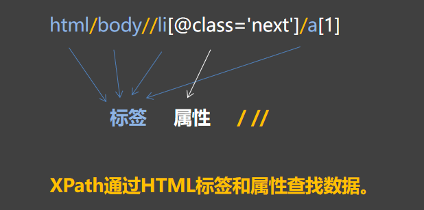
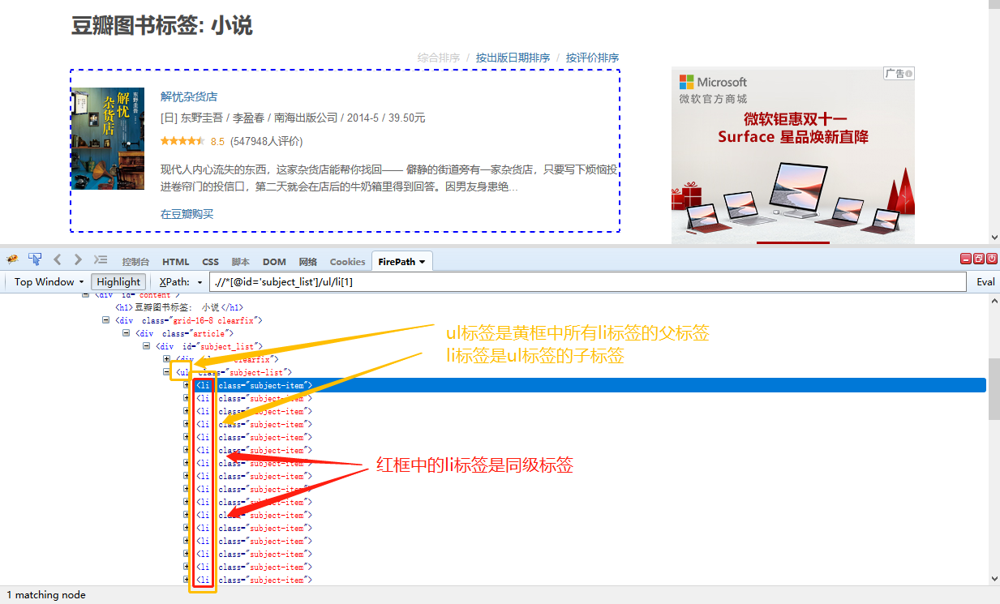
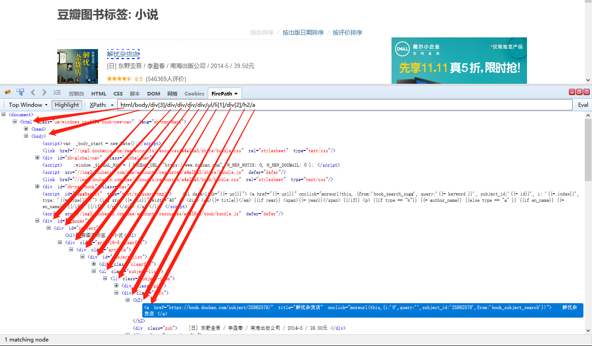
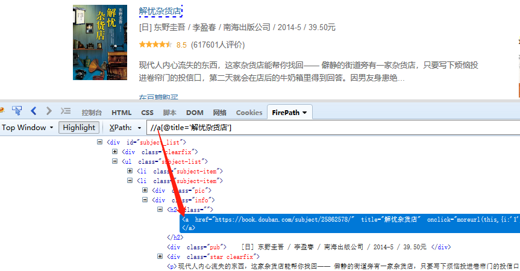
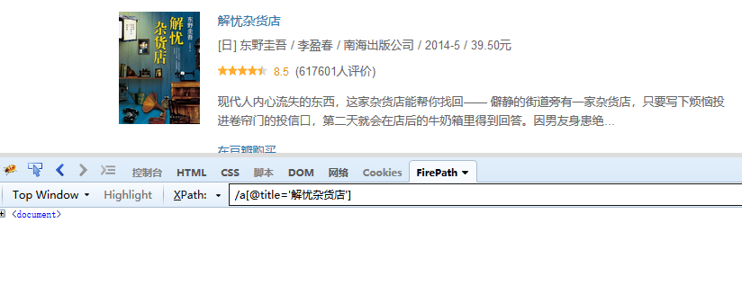
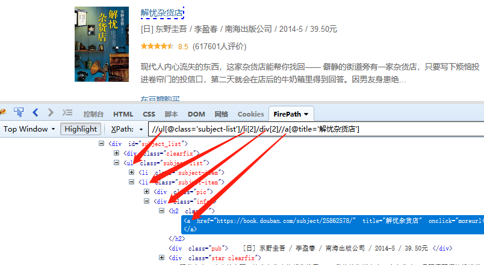
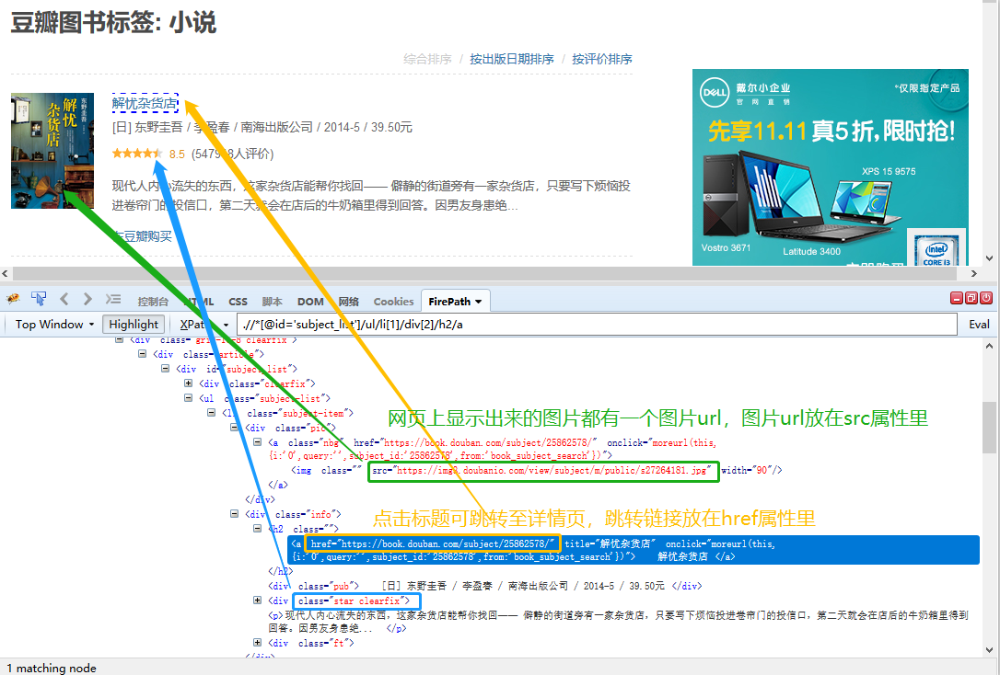
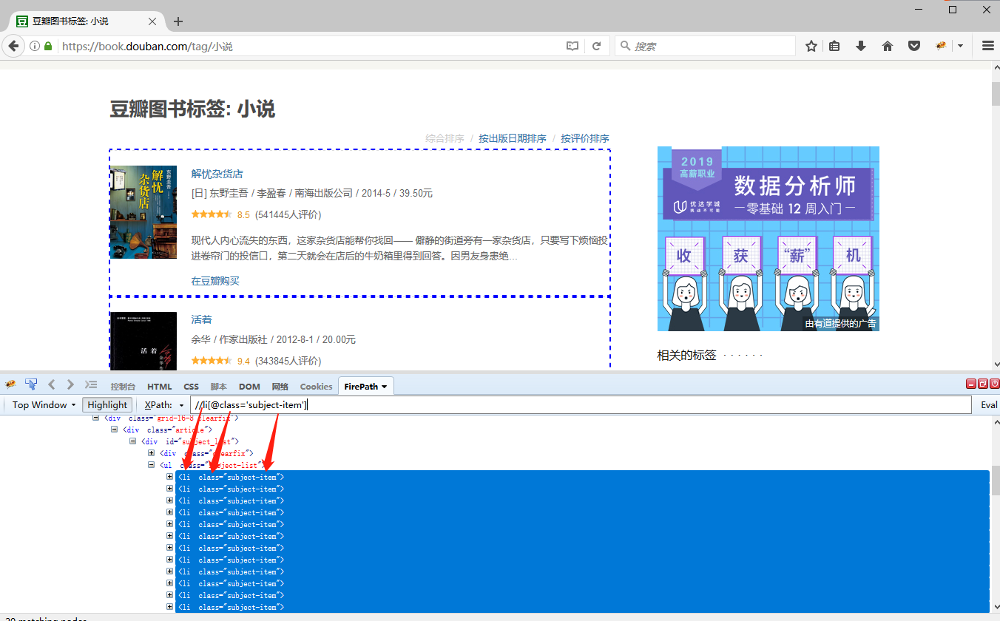

### 认识xpath的结构？

先自己自动生成几个XPath，看一下XPath结构有什么规律。几个示例XPath：

.//*[@id='subject_list']/ul/li[1]

.//*[@id='subject_list']/ul/li[1]/div[2]/p

html/body//li[@class='next']/a[1]

我们发现，XPath都具有相似的结构，都由3部分组成。

是的，XPath通过HTML标签和属性查找数据：

标签：html body ul li div p a ......

连接标签的符号：/ //

属性和属性值：[@id='subject_list'] [@class='next']

弄清楚HTML标签、属性及其组合规律，是学会写一条正确XPath的关键。

下面介绍HTML文档中最常见的标签、属性。

### 1、标签

<strong>① 常见标签</strong>

&lt;a&gt;  &lt;/a&gt;                   定义超链接，用于从一张页面链接到另一张页面

&lt;p&gt;  &lt;/p&gt;                   段落标记标签

&lt;div&gt;  &lt;/div&gt;              可定义文档中的区域或节、可以把文档分割为不同的部分，是一个块级元素

&lt;li&gt;  &lt;/li&gt;                    创建列表内容项

&lt;img&gt;  &lt;/img&gt;            向网页中嵌入一幅图像，从网页中链接图像

&lt;table&gt;  &lt;/table&gt;         创建一个表格

&lt;tr&gt;  &lt;/tr&gt;                   表格中的每一行

&lt;td&gt;  &lt;/td&gt;                  表格中的标准单元格

<strong>② 标签之间的层级</strong>

HTML文档是树状结构，标签具有层级，标签之间具有父、子、兄弟的关系。

父（Parent）：每个标签都有一个父标签。如下图，ul标签是黄框中所有li标签的父标签。

子（Children）：一个标签可有零个、一个或多个子标签。如下图，li标签是ul标签的子标签。

兄弟（Sibling）：同级标签，拥有相同的父标签。如下图，红框中的li标签是兄弟（同级）标签。

<strong>③ 连接标签</strong>

在XPath中，HTML标签用 <strong>单斜杠 / 或</strong><strong>双斜杠 // 连接，两者有何不同？</strong>

示例网址：[，我想要定位到第一本书《解忧杂货店》的标题。](https://book.douban.com/tag/%E5%B0%8F%E8%AF%B4)

<strong>/：用绝对路径定位</strong>

从根标签开始，一层一层往下定位，直到标题所在的位置，不可跨层级。

实例写法为：html/body/div[3]/div/div/div/div/ul/li[1]/div[2]/h2/a 。

可以看到，此种定位方法很死板，一旦中间的层级发生改变，整条定位XPath就失效了。比如，另一个相似网页，在ul前多了一个div，那以上XPath  html/body/div[3]/div/div/div/div/ul/li[1]/div[2]/h2/a  就会失效，找不到【标题】这个目标数据。

<strong>//：用相对路径定位（推荐）</strong>

直接找到标题所在层级的标签和属性定位，可以跨层级。

实例写法为：//a[@title='解忧杂货店']

这种定位方法就比较灵活，因为它是直接用目标标签的属性定位的，属性一般不发生改变。还是上面那个例子，另一个相似网页，在a标签前多了一个div标签，//a[@title='解忧杂货店']  这条XPath依旧有效，多了一个div标签并不对其造成影响。只要源码中存在 title 为 解忧杂货店 的 a 标签，就能直接定位到。

注意：因为这里是跨层级定位到a标签，所以需要用 //。如果将 // 换成 / ，XPath 写作 /a[@title='解忧杂货店']，则定位不到标题。

/ 和 // 是可以组合使用的，本质上是需要把握好标签之间的层级关系，请根据网页情况灵活使用。

### 2、属性

① 常见属性

class 规定元素的类名，大多数时候用于指定样式表中的类

id 唯一标识一个元素的属性，在html里面必须是唯一的

href 指定超链接目标的url

src 图像文件的url（直接复制到浏览器中，可打开图片）

关于属性，我们不用明白每一个属性的属性值到底是什么意思，只需根据定位需求，找到标签的属性/属性值的相同/不同之处，以实现精准定位。

② 属性和标签的关系

属性是用来修饰标签的。XPath中，属性和属性值有固定写法：属性放在标签后面的[ ]里，属性前加@，属性值放在引号内。

例：//li[@class='subject-item']。

这条XPath的意思是，定位HTML文档中 所有 class 属性值为 subject-item 的 li 标签

<Info>
  使用过程中遇到问题？前往 [八爪鱼RPA 开发者社区问答板块](https://rpa.bazhuayu.com/community/questions) 提问，获取官方与社区帮助。
</Info>
