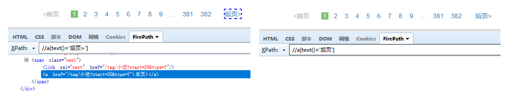
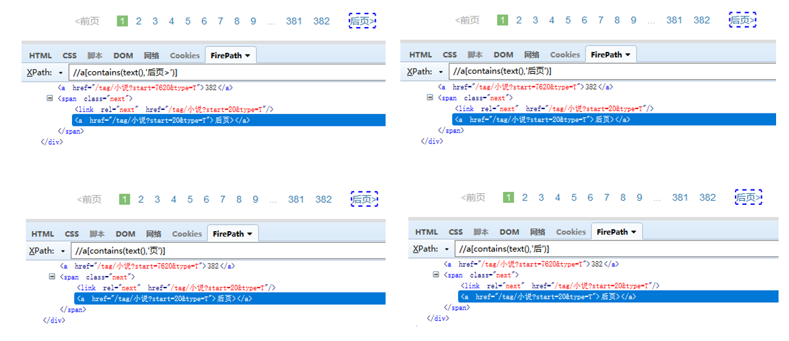
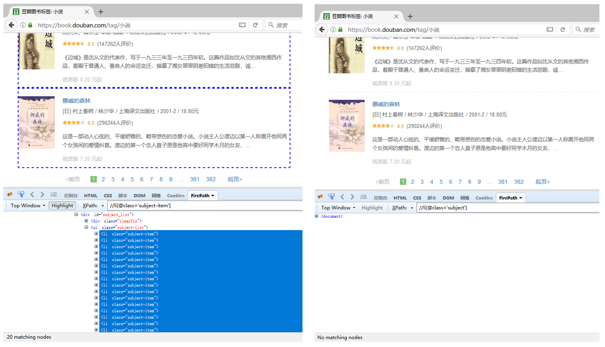
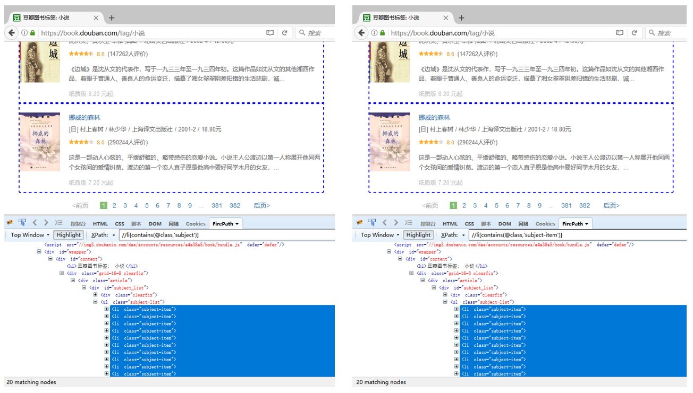
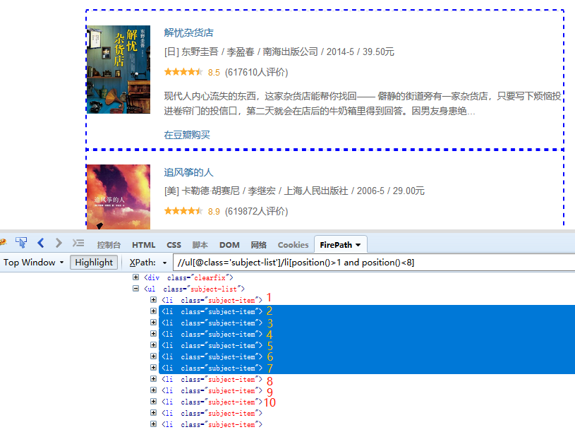
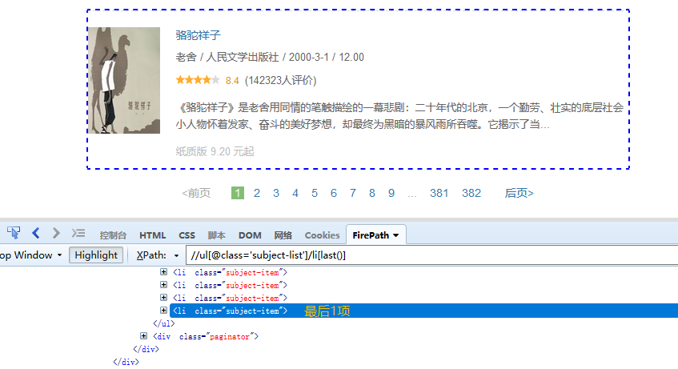
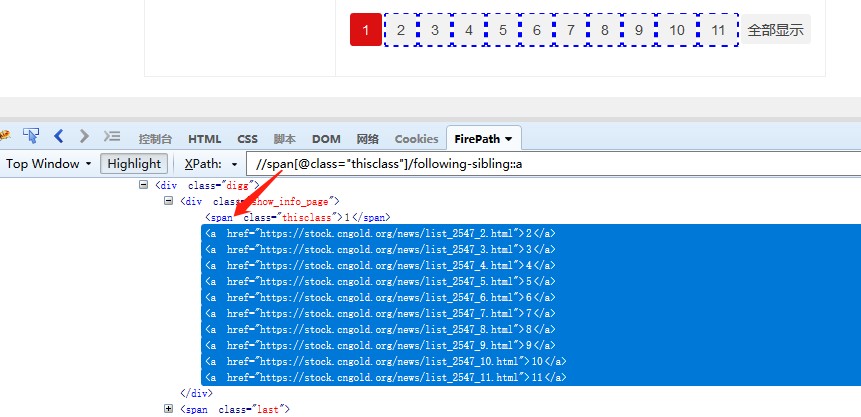
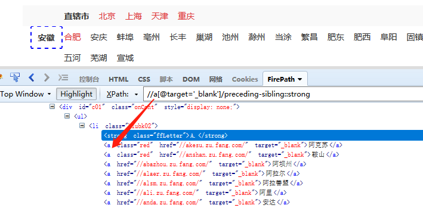

## 为什么要学？

在面对复杂的网页元素对象捕获时，仅靠标签与属性，往往复杂页面里极易"抓错人"。XPath函数让条件判断、文本筛选、位置计算一步到位，精准定位到所需的网页元素；

### 温馨提示

在开始学习XPath函数之前，有两点需要特别强调：

- XPath函数有其固定写法，请遵循其固定写法；
- XPath中的所有符号() [] '等'均为英文符号，不可用中文符号。

---

 

## 开始学习

本教程中使用的网址均为：[https://book.douban.com/tag/%E5%B0%8F%E8%AF%B4](https://book.douban.com/tag/%E5%B0%8F%E8%AF%B4)

下面是一些常见使用的XPath函数，在网页元素的捕获中应用广泛，可以解决大部分网页元素定位的场景，供大家学习参考。

### 1、 text()     用文本定位位置

#### 常用方法

- text()='xxx'                     精确定位，引号中的内容需与HTML文档中的文本完全一样；
- contains(text(),'xxx')       模糊定位，HTML文档中的文本，包含引号中的内容即可，可以理解为存在包含的关系；

#### 使用示例

如果需要定位到案例网页中的【后页&gt;】按钮。

用 **text()='xxx'** 定位，则XPath为：**//a[text()='后页&gt;']**，引号中的文本一定要为 **'后页&gt;'**，如果换成 **'后页'** （少了一个&gt;），则定位不到【后页&gt;】按钮。

用 **contains(text(),'xxx')** 定位，则XPath为：**//a[contains(text(),'后页&gt;')]**；**//a[contains(text(),'后页')]**；**//a[contains(text(),'页')]**；**//a[contains(text(),'后')]** 均可（包含文本中相连的一段字符即可，不用全部复制）。

### 2、contains()    用于判断文本的一部分是否包含XXX，或者属性值是否包含XXX

#### 常用方法

- contains(text(),'xxx')          判断文本的一部分是否包含XXX，上面已经详细说明
- contains(@class,'xxx')        判断属性值是否包含XXX

#### 使用示例

如果需要定位到此网页中的所有图书列表。

直接用属性定位，则XPath为：**//li[@class='subject-item']**，引号中的属性值一定要为 **'subject-item'**，跟HTML文档中的属性值完全一致。

如果用 **contains(@class,'xxx')** 定位，则XPath为：**//li[contains(@class,'subject-item')]**；**//li[contains(@class,'subject')]** 均可（包含属性中相连的一段即可，不用全部复制）。

### 3、position()     用于定位节点的位置和限制节点的范围

#### 常用方法

- position()=1                                        同级标签的第1个
- position()&gt;1 and position()&lt;10          同级标签的第2-9个

#### 使用示例

常用于控制循环列表的项。如图，**//ul[@class='subject-list']/li[position()&gt;1 and position()&lt;10]**，定位的是第2-9个li标签。

### 4、last() 最后几个

#### 常用方法

- last()                   表示最后的1个标签
- last()-1                表示倒数第2个标签
- last()-2                表示倒数第3个标签

#### 使用示例

如图，**//ul[@class='subject-list']/li[last()]**，定位的是最后1个li标签。

### 5、and/or/not  同时满足/满足其中1个即可/无

#### 常用方法

- and    且，同时满足                         a[@class and @href]    既有class属性，又有href属性的a标签
- or      或，满足其中1个即可             a[@class or @href]      有class属性，或者有href属性的a标签
- not    无 （不包含、不是、反选）    a[not(@class)]            不含class属性的a标签

#### 使用示例

- a[@class and @href]    既有class属性，又有href属性的a标签
- a[@class or @href]      有class属性，或者有href属性的a标签
- a[not(@class)]            不含class属性的a标签

### 6、following-sibling::   选取当前节点之后的所有同级节点

#### 常用方法

- following-sibling::标签名，如following-sibling::div、following-sibling::a      表示获取当前节点的同级兄弟节点
  following-sibling::标签名，如following-sibling::div、following-sibling::a      表示获取当前节点的同级兄弟节点

#### 使用示例

如图，**//span[@class="thisclass"]/following-sibling::a**，定位到span节点之后的所有同级a节点

### 7、preceding-sibling::    选取当前节点之前的所有同级节点

#### 常用方法

- preceding-sibling::标签名

#### 使用示例

如图，**//a[@target='_blank']/preceding-sibling::strong**，定位到a节点之前的所有同级strong节点

<Info>
  使用过程中遇到问题？前往 [八爪鱼RPA 开发者社区问答板块](https://rpa.bazhuayu.com/community/questions) 提问，获取官方与社区帮助。
</Info>
