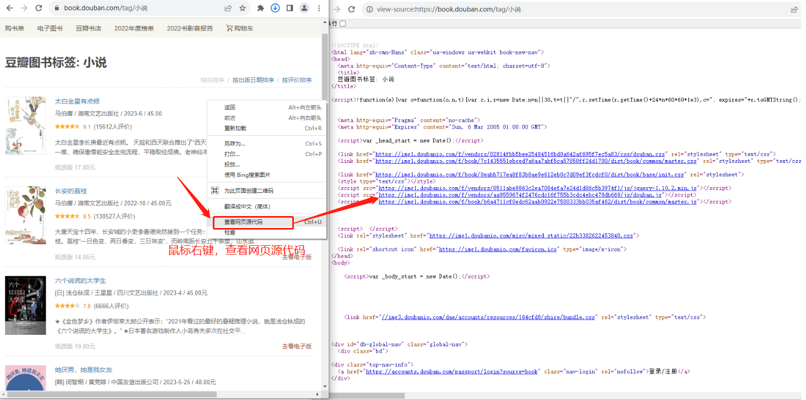
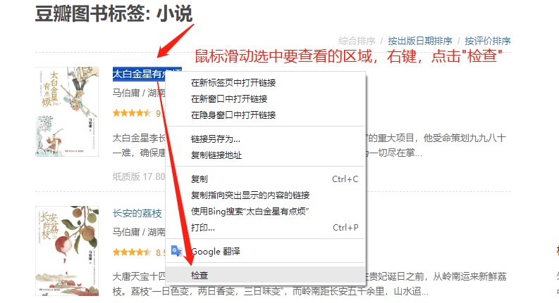
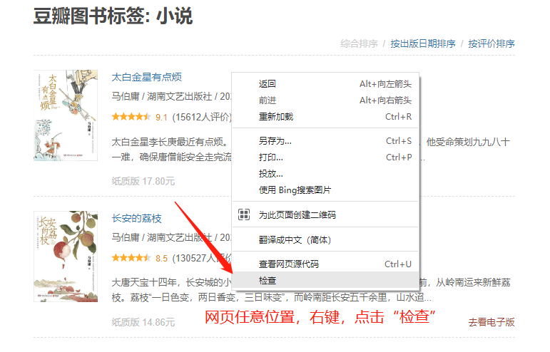
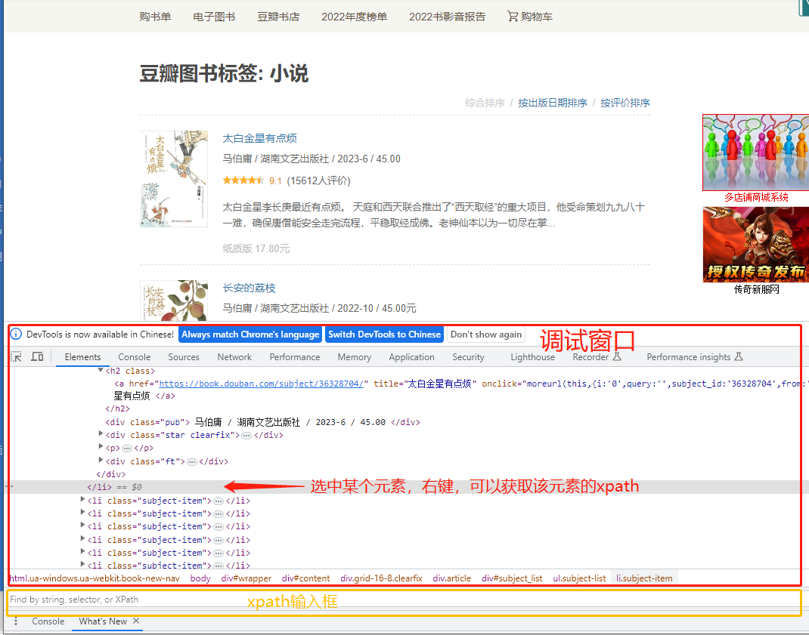
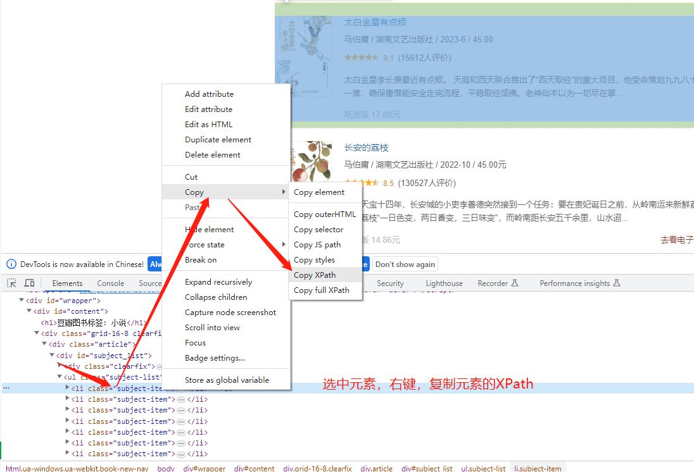
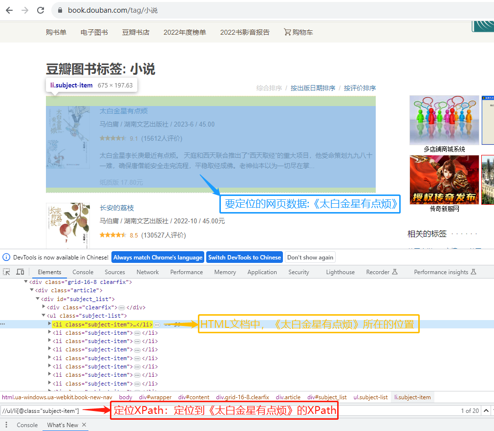
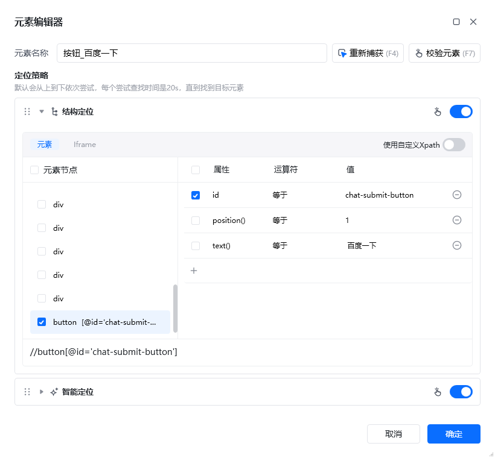
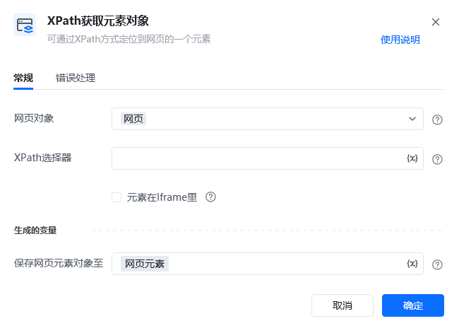
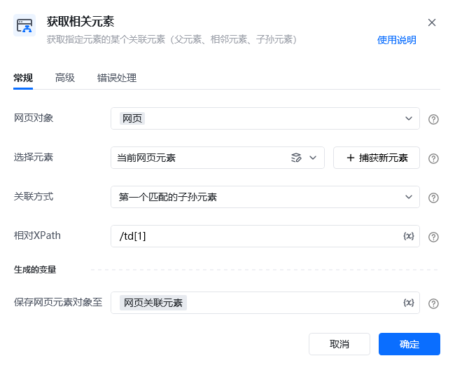

## 1. 什么是XPath？

我们日常浏览的网页由HTML构建，在指定网页上通过鼠标右键【查看网页源代码】可查看网页结构。

XPath是查询语言，能精准定位和提取HTML文档中的元素或数据，助力网页数据分析与自动化测试，为网页内容导航。

### 新手示例：快速获取内置Xpath

在HTML文档中定位和提取数据时，XPath是一种高效的方法。通过使用浏览器的开发者工具或专门的XPath插件，您可以轻松找到页面上的目标元素，并快速生成可复用的Xpath路径表达式，从而实现数据的精准定位。

以在谷歌浏览器中查看元素XPath为例：

**第一步：在网页中，点击鼠标右键选择 "检查"（或者按F12），进入开发者模式。**

**第二步：在调试窗口中，同时按下键盘的 Ctrl + F，调出调试窗口底部的输入框。**

**第三步：选中某个元素，鼠标右键即可复制该元素的Xpath。可将改Xpath填写到输入框中校验当前Xpath是否对应我们最开始选择的元素。**

此时，要定位的网页数据、定位XPath、HTML文档结构三者的关系如下图：

 

## 2. Xpath 在 RPA 中如何应用？

在RPA中，XPath能精准解析复杂网页结构，实现对目标元素的<strong>高效定位与数据提取</strong>，是<strong>自动化任务中不可或缺的强力工具</strong>。

演示步骤：

**方法① 在元素库中，双击任意元素打开元素编辑器。可以查看或修改该元素的Xpath，以便更精确定位到元素。**

<strong>注：</strong>2.2及以上版本新增结构定位（即智能定位），该功能可以生成比较稳定的Xpath，新用户可使用此功能

**方法② 通过【Xpath获取元素对象】指令，输入准确的Xpath，即可精确定位到该Xpath对应的网页元素对象**

**方法③ 在【获取相关元素】指令中，获得当前元素的父元素，子元素或相邻元素，子孙元素可以通过输入相对Xpath去定位。**

<Info>
  使用过程中遇到问题？前往 [八爪鱼RPA 开发者社区问答板块](https://rpa.bazhuayu.com/community/questions) 提问，获取官方与社区帮助。
</Info>
