## 捕获方法

八爪鱼 RPA 提供两种捕获图像的方式，以及一组截图快捷键。

### 方法一：在指令中捕获

1. 打开目标指令（如「点击图像」），点击元素选择框旁的图像按钮。

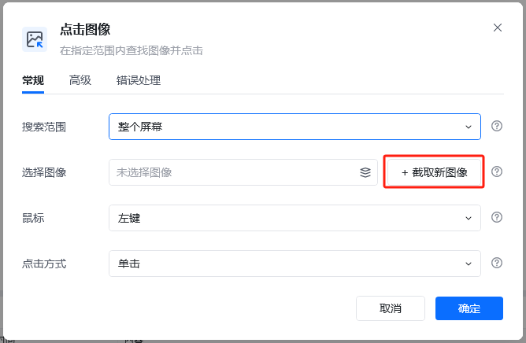

2. 按下 **Shift + Z** 进入截图模式，框选屏幕上要捕获的区域。

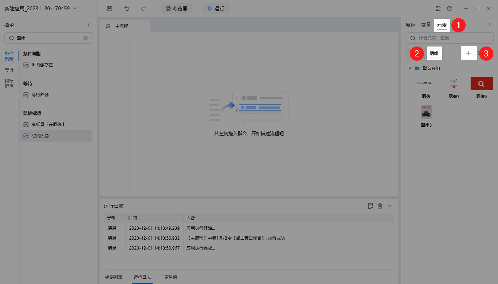

3. 框选完成后点击 **Esc** 退出截图模式。

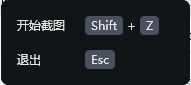

### 方法二：在元素库中捕获

1. 在元素库中点击目标元素 → 点击「图像」标签 → 点击「+」号键进入捕获模式。

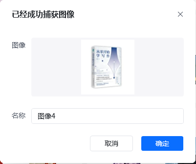

2. 按 **Shift + Z** 框选区域，**Esc** 退出。

### 快捷键总览

| 操作 | 快捷键 |
| --- | --- |
| 进入截图模式 | Shift + Z |
| 退出截图模式 | Esc |

## 捕获后的操作

捕获成功后，可以对图像进行重命名、查看大图，并在指令中使用。

### 重命名图像

在元素库或指令的图像列表中，双击图像名称即可重命名，便于后续维护。

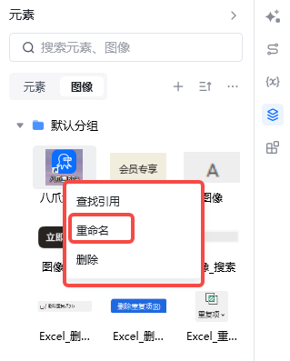

### 预览大图

鼠标悬浮在图像缩略图上即可查看大图，确认捕获内容是否准确。

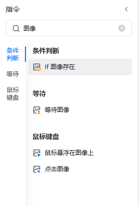

### 在指令中使用

捕获到图像以后就可以在指令中使用了。

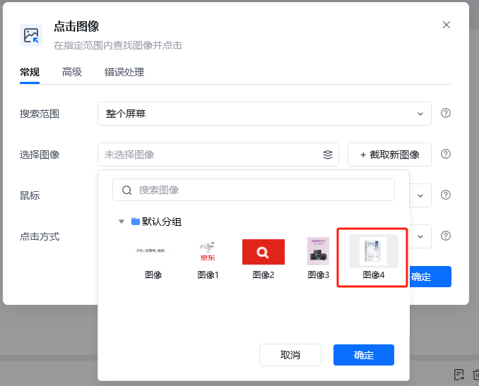

例如，在「点击图像」指令中使用刚刚捕获的图像，并设置点击方式为单击。

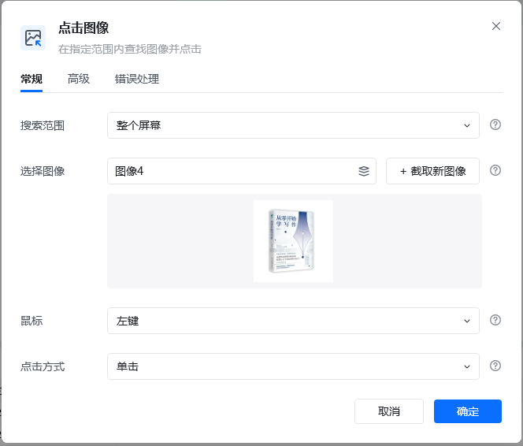

## 使用示例

下面以「在商城页面点击商品图片进入图书详情」为例，展示完整流程。

### 流程搭建

在商城页面执行流程：

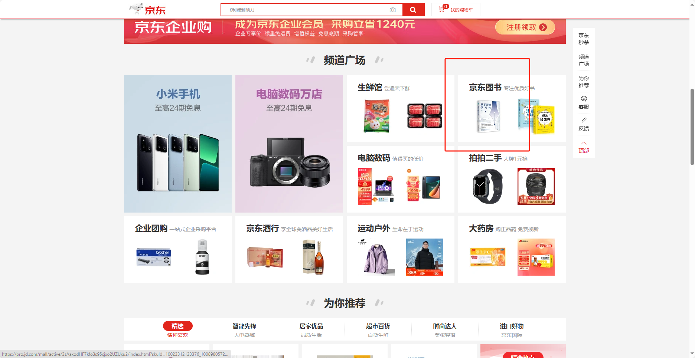

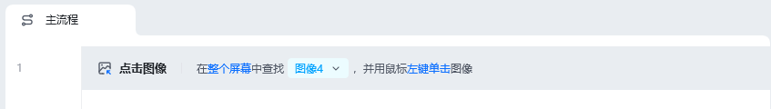

自动跳转到图书页面：

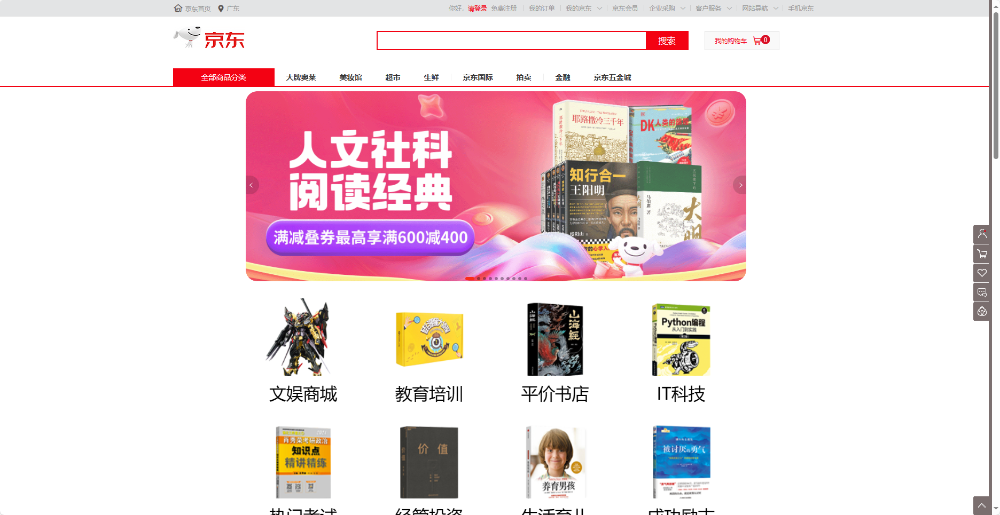

### 流程执行逻辑

**【点击图像】**在屏幕内查找【图像4】，并用鼠标左键单击图像。

<Info>
  使用过程中遇到问题？前往 [八爪鱼RPA 开发者社区问答板块](https://rpa.bazhuayu.com/community/questions) 提问，获取官方与社区帮助。
</Info>