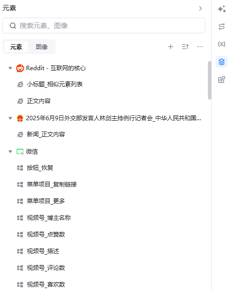
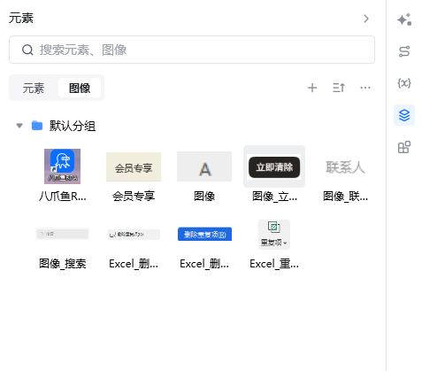

## 什么是元素？

元素是指网页或桌面窗口中**真实存在**的对象，可以是一段文字、一个 div 块、一张图片、一个输入框，也可以是一个桌面窗口（如微信窗口）。在八爪鱼 RPA 中，元素一般通过 XPath 精确锁定。

## 什么是图像？

图像是对屏幕上**肉眼可见区域**的截图。只要在桌面或某个窗口内截到这张图，不管它背后是什么元素、什么网页结构，RPA 都会对这个图片所在的位置进行点击或操作，相当于"看着屏幕干活"。

## 两者的核心区别

| 对比项 | 元素 | 图像 |
| --- | --- | --- |
| 定位方式 | XPath / 控件树 / DOM 路径 | 屏幕像素截图 |
| 依赖 | 依赖页面结构、控件层级、窗口句柄 | 仅依赖视觉呈现 |
| 稳定性 | 页面改动或窗口变化后可能失效 | 视觉未变就仍可用 |
| 适用场景 | 网页自动化、桌面应用、有清晰控件层级 | Canvas、远程桌面、游戏、画板、截图型操作 |
| 抗干扰 | 易被隐藏元素、iframe、动态加载干扰 | 不受源码/层级影响 |

## 什么时候该用图像？

以下场景，常规元素定位往往拿不到或容易失效，建议改用图像方式：

- 目标对象藏在网页源码深处，与其他元素结构相似，捕获时容易混淆；
- 桌面窗口看起来是个按钮，实际上只是文本或图片，点击没有响应；
- Canvas、远程桌面、画板、某些客户端软件内部没有可识别的控件层级；
- 目标网站有反爬措施，常规元素定位会被识别为异常；
- 跨版本/跨设备适配：同一控件在不同客户端的 XPath 不一致，但视觉一致。

## 什么时候用元素？

- 目标对象是网页或桌面应用内**结构清晰**的控件（按钮、输入框、链接、菜单等）；
- 需要在脚本里**读取、校验或修改**元素属性（如文本、XPath、属性值）；
- 流程需要**长时间稳定运行**，视觉微调不会导致流程失败；
- 对执行速度和精度要求高，图像匹配有概率误差。

## 小结

元素走的是"逻辑路径"，图像走的是"视觉路径"。理想的做法是：**优先用元素，元素拿不到或不稳定时退到图像**。两者配合，可以覆盖绝大多数 RPA 自动化场景。

<Info>
  使用过程中遇到问题？前往 [八爪鱼RPA 开发者社区问答板块](https://rpa.bazhuayu.com/community/questions) 提问，获取官方与社区帮助。
</Info>